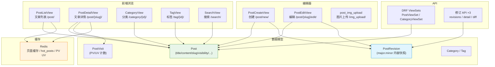
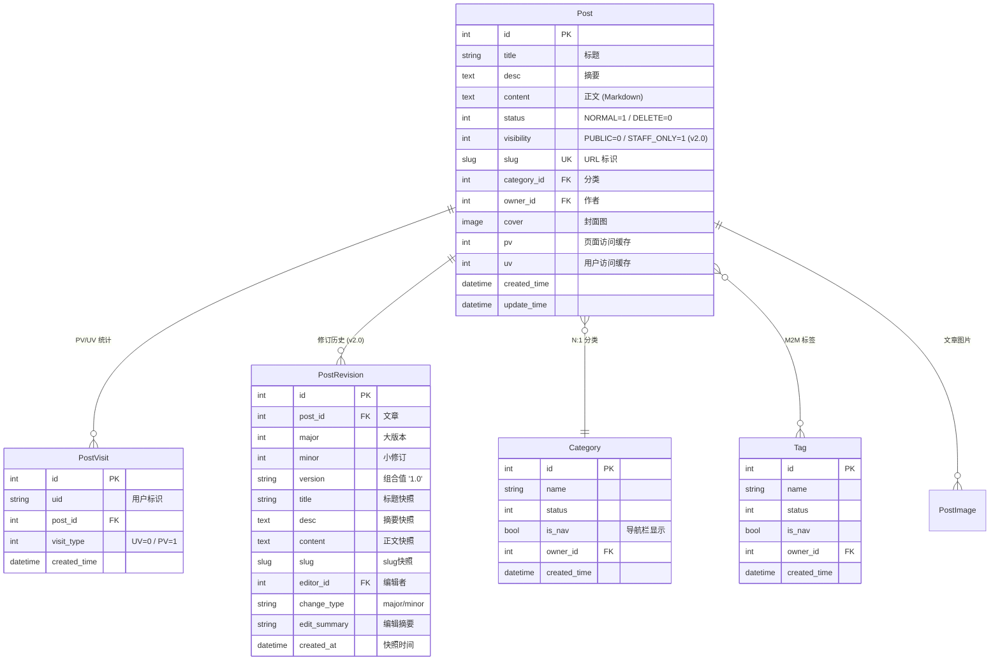
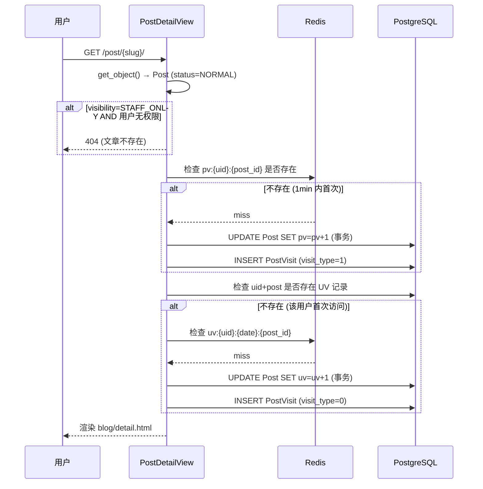
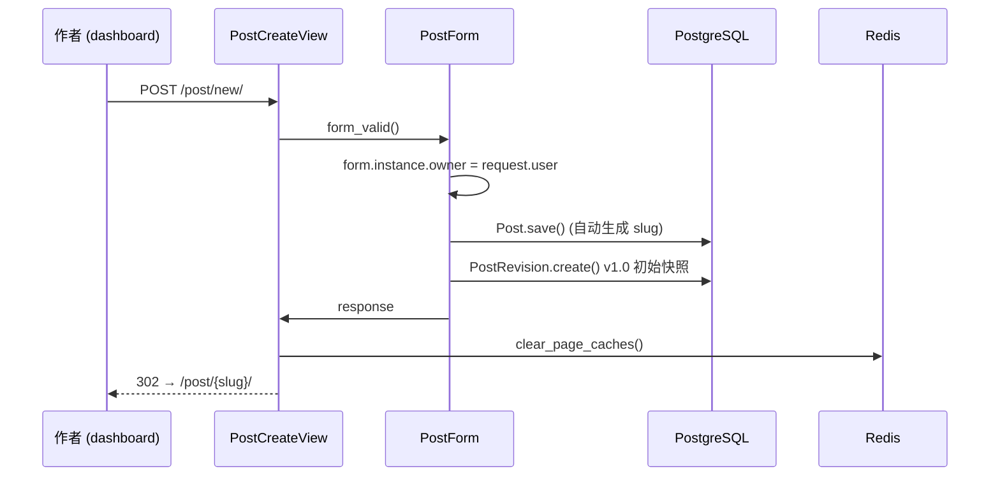
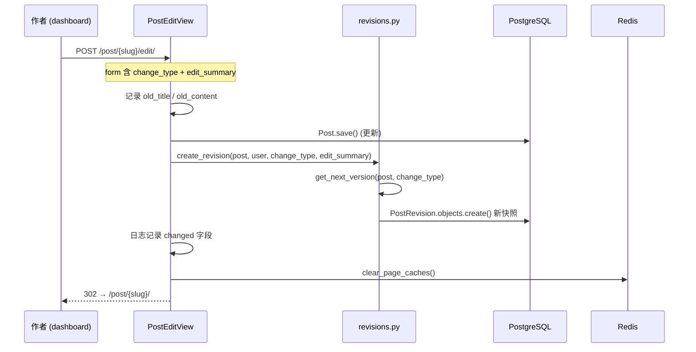
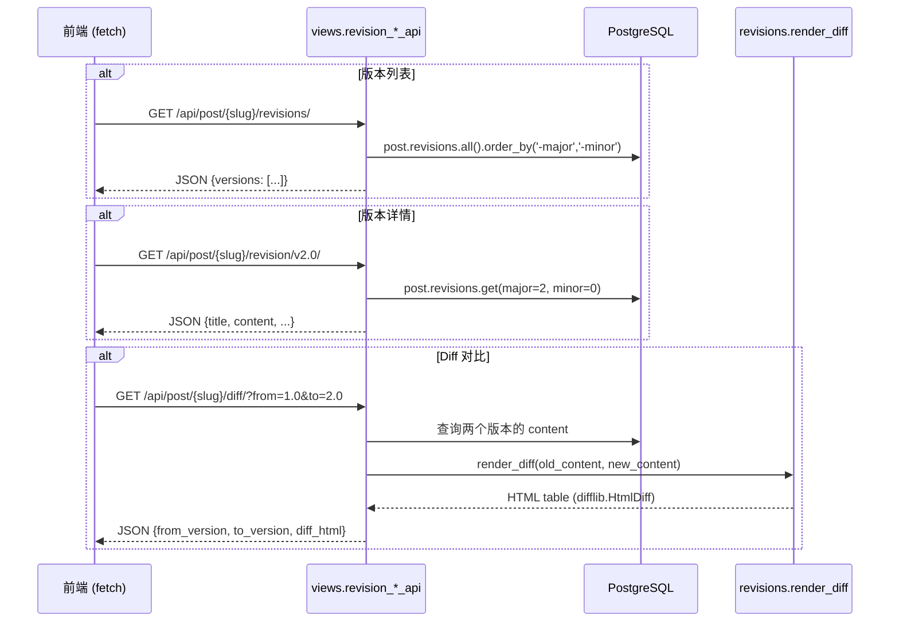
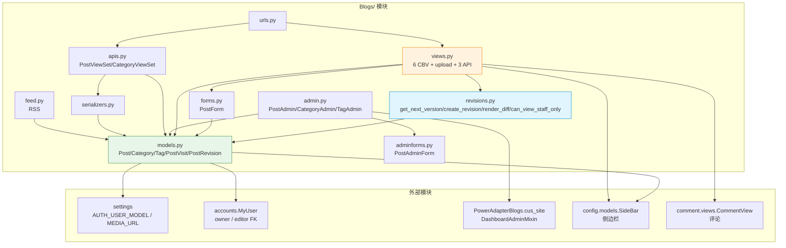

# Blogs 模块 — 开发文档

> **模块**: `Blogs/`  
> **职责**: 博客文章 CRUD、分类/标签管理、PV/UV 统计、修订追踪 (v2.0)、可见性控制  
> **依赖**: Django CBV (ListView/DetailView/CreateView/UpdateView), DRF ViewSet, Redis 缓存  
> **创建**: 2025-08-04  
> **最后更新**: 2026-06-22 — P1 修订追踪 + visibility 权限完成

---

## 0. 变更日志

| 日期 | 版本 | 变更 |
|------|------|------|
| 2026-06-22 | v2.3 | **Dashboard 分行 Action**: rewrap_content_action + rewrap_posts 管理命令 |
| 2026-06-22 | v2.2 | **Diff 优化**: _word_wrap() 预处理 + backfill_diffs 命令 + diff 布局分离 |
| 2026-06-22 | v2.0 | **P1 修订追踪**: PostRevision 模型 + 3个API + visibility 权限 + PostForm 字段扩展 |
| 2026-06-22 | v1.1 | 日志代码补全 (Create/Edit/Visit/Upload/Cache 全链路) |
| 2025-08-04 | v1.0 | 初始：Post/Category/Tag 模型 + CBV 视图 + DRF API |

### v2.0 详细变更

| Feature | 文件 | 描述 |
|---------|------|------|
| PostRevision 模型 | `models.py` | 语义化版本号 (v{major}.{minor})，内容快照，change_type/edit_summary |
| Visibility 权限 | `models.py` + `views.py` | Post 新增 PUBLIC/STAFF_ONLY 字段；全视图过滤 (非 staff → 404/排除) |
| 修订 API (×3) | `urls.py` + `views.py` | 版本列表 / 版本详情 / diff HTML 片段 |
| 快照自动创建 | `views.py` | PostCreateView → v1.0；PostEditView → 自动递增 |
| 版本计算工具 | `revisions.py` (新建) | `get_next_version()` / `create_revision()` / `render_diff()` / `can_view_staff_only()` |
| Admin 扩展 | `admin.py` | PostRevisionInline (只读) + PostAdmin 加 visibility 列/过滤 |
| Data Migration | `migrations/0004` | 50 篇现有文章批量创建 v1.0 初始快照 |

---

## 1. 模块架构总览



**核心设计原则**：
- **Post 是内容主体** (v2.0)：前端直接渲染 Post.title/content
- **PostRevision 是纯历史快照**：编辑时自动创建，通过 API 查询
- **visibility 不可泄露**：非授权访问 STAFF_ONLY 文章 → 404（不是 403）
- **缓存自动失效**：`clear_page_caches()` 在创建/编辑后清除 Redis 页面缓存

---

## 2. 组件清单

| 文件 | 核心类/函数 | 职责 |
|------|------------|------|
| `models.py` | `Post`, `Category`, `Tag`, `PostVisit`, `PostRevision`, `PostImage` | 6 个数据模型 |
| `views.py` | 6 个 CBV + `post_img_upload` + 3 个修订 API | 前台浏览 + 编辑器 + 图片上传 + API |
| `forms.py` | `PostForm` | 文章编辑表单 (+visibility/change_type/edit_summary) |
| `admin.py` | `PostAdmin`, `CategoryAdmin`, `TagAdmin`, `LogEntryAdmin` | Dashboard Admin 注册 |
| `adminforms.py` | `PostAdminForm` | Admin 专用表单 (覆盖 widgets) |
| `apis.py` | `PostViewSet`, `CategoryViewSet` | DRF REST API |
| `serializers.py` | `PostSerializer`, `CategorySerializer` | DRF 序列化器 |
| `urls.py` | — | 前台路由 + DRF 路由 + 修订 API 路由 |
| `revisions.py` | `get_next_version()`, `create_revision()`, `render_diff()`, `can_view_staff_only()` | 修订工具函数 |
| `feed.py` | — | RSS Feed |
| `tests.py` | — | 测试 (空) |

---

## 3. 数据模型

### 3.1 模型关系图



### 3.2 Post 模型关键方法

| 方法 | 类型 | 说明 |
|------|------|------|
| `get_normal_posts()` | `@classmethod` | 返回 `status=NORMAL` 的 QuerySet |
| `get_by_category(cate_id)` | `@classmethod` | 按分类过滤 |
| `get_by_tag(tag_id)` | `@staticmethod` | 按标签过滤，返回 `(posts, tag)` |
| `latest_posts(num=5)` | `@classmethod` | 最新 N 篇文章 |
| `hot_posts()` | `@classmethod` | 热门文章 (pv 排序，Redis 缓存 10min) |
| `get_uv_count()` | 实例方法 | 从 PostVisit 实时计算 UV |
| `sync_uv_from_visits()` | `@classmethod` | 同步 PostVisit UV → Post.uv 缓存 |
| `save()` | 重写 | 自动生成 slug (`slugify(title)-pk`) |
| `get_absolute_url()` | — | `reverse("Blogs:post_detail", slug=self.slug)` |

### 3.3 PostRevision 版本号规则

```
v{major}.{minor}

major 递增，minor 归零 → 大版本 (重大内容变更)
minor 递增               → 小修订 (错别字/措辞/补充)

示例:
  v1.0 → (major) → v2.0
  v1.0 → (minor) → v1.1
  v2.3 → (major) → v3.0
  v2.3 → (minor) → v2.4
```

`unique_together = ('post', 'major', 'minor')` 保证同一篇文章不会有重复版本号。

---

## 4. 详细数据流

### 4.1 文章浏览 + PV/UV 统计



**PV 防刷**：同一用户对同一文章 1 分钟内只计 1 次 PV (Redis `pv:{uid}:{post_id}` TTL=1min)  
**UV 唯一**：`unique_together = ('uid', 'post', 'visit_type')` 保证同文章同用户只计 1 次 UV

### 4.2 文章创建流程



### 4.3 文章编辑 + 修订流程



### 4.4 修订 API 调用链



---

## 5. API 设计

### 5.1 DRF REST API (`/api/posts/` + `/api/categories/`)

由 `PostViewSet` + `CategoryViewSet` (DRF `ModelViewSet`) 提供完整 CRUD。

### 5.2 修订历史 API (v2.0 P1)

| 端点 | 方法 | 说明 |
|------|------|------|
| `/api/post/{slug}/revisions/` | GET | 版本列表 JSON |
| `/api/post/{slug}/revision/v{major}.{minor}/` | GET | 指定版本完整内容 |
| `/api/post/{slug}/diff/?from=1.0&to=2.0` | GET | diff HTML 片段 |

> 这三个 API 在 DRF router 之前注册，避免被 `/api/` 通配路由拦截。

### 5.3 图片上传

| 端点 | 方法 | 说明 |
|------|------|------|
| `/img_upload/` | POST | 上传图片 → `MEDIA_URL/post_images/{uuid}.{ext}` |

CSRF 豁免 (`@csrf_exempt`)，文件以 UUID 重命名防冲突。

---

## 6. Admin 配置

### 6.1 双后台注册

```python
# 注册 1: admin.site → /super_admin/
admin.site.register(Post)
admin.site.register(Category)
admin.site.register(Tag)

# 注册 2: custom_site → /dashboard/
@admin.register(Post, site=custom_site)
class PostAdmin(DashboardAdminMixin, BaseOwnerAdmin): ...

@admin.register(Category, site=custom_site)
class CategoryAdmin(DashboardAdminMixin, BaseOwnerAdmin): ...

@admin.register(Tag, site=custom_site)
class TagAdmin(DashboardAdminMixin, BaseOwnerAdmin): ...
```

### 6.2 PostAdmin 配置详情

| 配置项 | 值 | 说明 |
|--------|-----|------|
| `list_display` | title, category, status, **visibility**, created_time, owner | v2.0 新增 visibility |
| `list_filter` | category, **visibility** | 按可见性过滤 |
| `inlines` | `[PostRevisionInline]` | 修订历史只读内联 |
| `fieldsets` | 基础配置 / 内容 / 额外信息 (含 visibility) | 三栏布局 |
| `search_fields` | title, category__name | |

### 6.3 PostRevisionInline

- `readonly_fields = ('version', 'change_type', 'edit_summary', 'editor', 'created_at')`
- `extra = 0` — 不显示空行
- `can_delete = False` — 禁止删除
- `has_add_permission = False` — 系统自动创建，禁止手动添加

---

## 7. 可见性权限矩阵

| 用户类型 | 公开文章 | STAFF_ONLY 文章 | 实现 |
|----------|:---:|:---:|------|
| 匿名用户 | ✅ 可见 | ❌ 404 (列表中排除) | `can_view_staff_only()` → False |
| 已登录普通用户 | ✅ 可见 | ❌ 404 (列表中排除) | `can_view_staff_only()` → False |
| dashboard 用户 | ✅ 可见 | ✅ 可见 | `can_view_staff_only()` → True |
| staff | ✅ 可见 | ✅ 可见 | `is_staff = True` |
| superuser | ✅ 可见 | ✅ 可见 | `is_staff = True` |

**权限判断函数** (`revisions.py`):
```python
def can_view_staff_only(user) -> bool:
    if not user or not user.is_authenticated:
        return False
    return user.is_staff or user.is_dashboard_user
```

**设计决策**：
- 非授权用户访问 STAFF_ONLY 文章 → **404** 而非 403
- 原因：不泄露"这篇文章存在但你无权查看"的信息
- 列表视图用 `.exclude(visibility=STAFF_ONLY)` 排除，详情视图用 `get_object()` 中抛 `Http404`

### 7.1 所有视图的 visibility 过滤

| 视图 | 过滤位置 | 方式 |
|------|---------|------|
| `PostListView` | `get_queryset()` | `.exclude(visibility=STAFF_ONLY)` (非 staff) |
| `CategoryView` | `get_queryset()` | 同上 |
| `TagView` | 继承 PostListView | 自动继承 |
| `SearchView` | 继承 PostListView | 自动继承 |
| `PostDetailView` | `get_object()` | 判断后 `raise Http404` |

---

## 8. 缓存架构

### 8.1 缓存层级

| 层级 | 缓存目标 | Key 模式 | TTL |
|------|---------|---------|-----|
| 页面缓存 | `PostListView` 匿名访问 | `views.decorators.cache.cache_page.*` | 15min |
| 片段缓存 | SideBar / 导航分类 | `template.cache.*` | 15min |
| 查询缓存 | `hot_posts` | `hot_posts` | 10min |
| PV 去重 | 用户+文章 PV | `pv:{uid}:{post_id}` | 1min |
| UV 去重 | 用户+日期+文章 UV | `uv:{uid}:{date}:{post_id}` | 24h |

### 8.2 缓存失效

`clear_page_caches()` 在创建/编辑文章后调用：
1. `cache.delete_pattern("*views.decorators.cache.cache_page.*")` — 页面缓存
2. `cache.delete_pattern("*template.cache.*")` — 模板片段缓存
3. `cache.delete('hot_posts')` — 热门文章查询缓存

> `delete_pattern` 仅 Redis 后端支持，`LocMemCache` 会捕获 `AttributeError` 降级。

---

## 9. v2.0 → v2.1 演进路线

### 当前 v2.0 架构

```
Post (内容主体) ← 前端直接读取
  ├── title, desc, content, slug  ← 内容字段
  ├── status, category, tag, owner, cover, pv, uv, visibility  ← 元数据
  └── created_time, update_time

PostRevision (历史快照) ← API 查询
  ├── major, minor, version
  ├── title, desc, content, slug  ← 内容快照
  ├── editor, change_type, edit_summary
  └── created_at
```

### v2.1 目标架构

```
Post (纯元数据容器)
  ├── status, category, tag, owner, cover, pv, uv, visibility
  ├── current_revision FK → PostRevision  ← 新增，指向最新版本
  ├── created_time, update_time
  └── ❌ 移除: title, desc, content, slug

PostRevision (内容唯一来源)
  ├── major, minor, version
  ├── title, desc, content, slug  ← 唯一内容来源
  ├── editor, change_type, edit_summary
  └── created_at
```

**路由变化**：
- v2.0：`post.title` → 直接渲染
- v2.1：`post.current_revision.title` → 通过 FK 取最新快照
- 前端无感：模板只需改 `post.title` → `post.current_revision.title`

### v2.1 迁移步骤

| # | 步骤 | 文件 |
|---|------|------|
| 1 | Post 加 `current_revision` FK (nullable → 数据迁移后改 not null) | `models.py` |
| 2 | Data migration：每篇文章 `current_revision = revisions.latest()` | `migrations/` |
| 3 | Data migration：从 Post 复制内容字段到 current_revision (补齐漏网内容) | `migrations/` |
| 4 | 所有视图改内容来源：`post.title` → `post.current_revision.title` | `views.py` |
| 5 | 模板改：`{{ post.title }}` → `{{ post.current_revision.title }}` | `templates/` |
| 6 | Post 移除 `title/desc/content/slug` 列 | `models.py` + migration |
| 7 | PostRevision 去掉"快照"字样 (verbose_name 改为"文章版本") | `models.py` + migration |
| 8 | PostAdmin fieldsets 改为从 current_revision 代理读取 | `admin.py` |
| 9 | DRF serializer 更新字段来源 | `serializers.py` |

---

## 10. 文件依赖图



---

## 11. 已知问题 / TODO

| Issue | 严重 | 描述 |
|-------|------|------|
| PostImage 无 CRUD 视图 | 🟢 低 | 模型已定义，无前端上传/管理界面 |
| hot_posts 缓存不区分 visibility | 🟡 中 | 缓存 key 单一，STAFF_ONLY 文章可能泄露到公开 hot_posts。**待 P2 修复** |
| PV/UV 非原子操作 | 🟢 低 | `F('pv')+1` 在 Django ORM 中是原子 UPDATE，但 `PostVisit.objects.get_or_create` 存在竞态。当前依赖 `IntegrityError` 降级，可接受 |
| slug 唯一性由 DB 保证 | 🟢 低 | `save()` 中手动生成 slug，并发创建可能冲突。概率极低 |
| 修订历史无分页 | 🟢 低 | `revision_list_api` 返回全量版本，文章版本数 < 100 时无问题 |
| 无单元测试 | 🟡 中 | `tests.py` 为空 |

---

## 12. 附录

### A. 路由表

| URL 模式 | 视图 | 名称 |
|----------|------|------|
| `/post/` | `PostListView` | `post_list` |
| `/post/{slug}/` | `PostDetailView` | `post_detail` |
| `/post/{slug}/comment/` | `CommentView` | `post_comment` |
| `/post/{slug}/edit/` | `PostEditView` | `post_edit` |
| `/post/new/` | `PostCreateView` | `post_create` |
| `/category/{id}/` | `CategoryView` | `category_list` |
| `/tag/{id}/` | `TagView` | `tag_list` |
| `/search/` | `SearchView` | `search` |
| `/img_upload/` | `post_img_upload` | `post_img_upload` |
| `/api/post/{slug}/revisions/` | `revision_list_api` | `revision_list` |
| `/api/post/{slug}/revision/{version}/` | `revision_detail_api` | `revision_detail` |
| `/api/post/{slug}/diff/` | `revision_diff_api` | `revision_diff` |
| `/api/posts/` | DRF `PostViewSet` | (REST) |
| `/api/categories/` | DRF `CategoryViewSet` | (REST) |
| `/api/schema/` | `SpectacularAPIView` | `schema` |
| `/api/docs/` | `SpectacularSwaggerView` | `swagger-ui` |

### B. 关键配置

```python
# settings/base.py
MEDIA_URL = "/media/"
MEDIA_ROOT = BASE_DIR / "media"

# Post 封面存储路径: post-covers/%Y/%m/
# PostImage 存储路径: post_images/%Y/%m/
# 上传图片存储路径: post_images/{uuid}.{ext}
```

### C. 管理命令速查

```bash
# 文章内容分行（单词边界 80 字换行，提升 diff 颗粒度）
python manage.py rewrap_posts --post-ids 1,2,3        # 指定文章
python manage.py rewrap_posts --all                   # 全部正常文章
python manage.py rewrap_posts --all --dry-run         # 预览模式

# Dashboard admin action（勾选文章 → 下拉 → "📝 对选中文章内容执行单词边界分行"）
# 位置：/dashboard/Blogs/post/

# Diff 回填/重算
python manage.py backfill_diffs --limit 60            # 回填 NULL diff
python manage.py backfill_diffs --force               # 强制重算所有
python manage.py backfill_diffs --force --dry-run     # 预览

# 测试数据生成
python manage.py bump_versions --count 10             # 对最近文章生成修订版本

# 同步 PostVisit UV → Post.uv 缓存字段 (全量)
python manage.py shell -c "
from Blogs.models import Post
Post.sync_uv_from_visits()
"

# 同步指定文章
python manage.py shell -c "
from Blogs.models import Post
Post.sync_uv_from_visits(post_id=1)
"

# 查看文章修订历史
python manage.py shell -c "
from Blogs.models import Post
p = Post.objects.get(slug='hello-world')
for r in p.revisions.all():
    print(f'v{r.version} {r.change_type} {r.edit_summary}')
"
```
