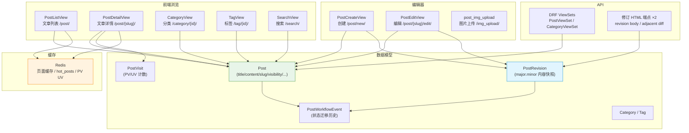
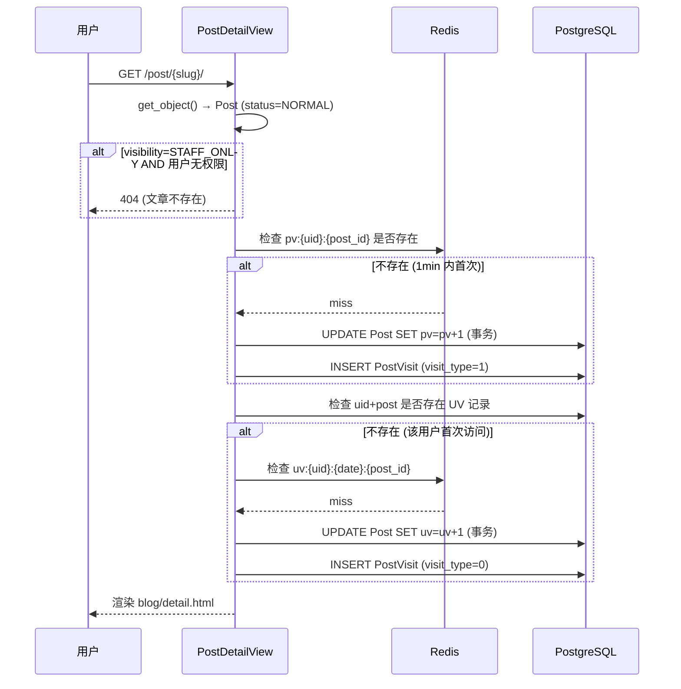
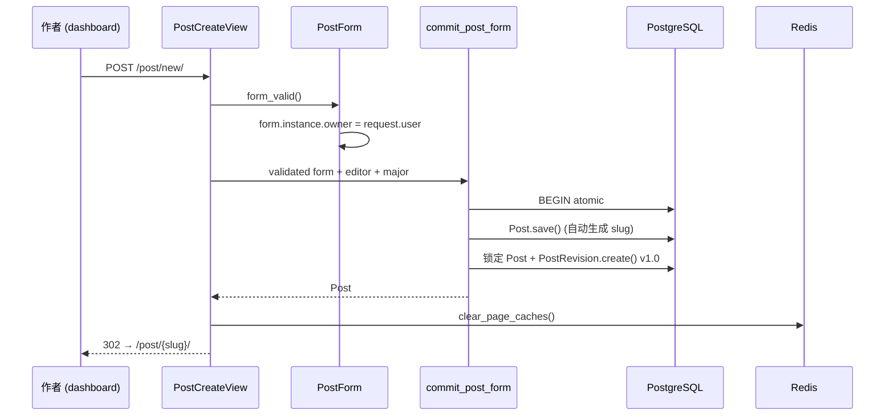
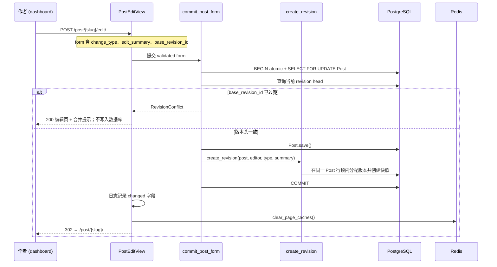
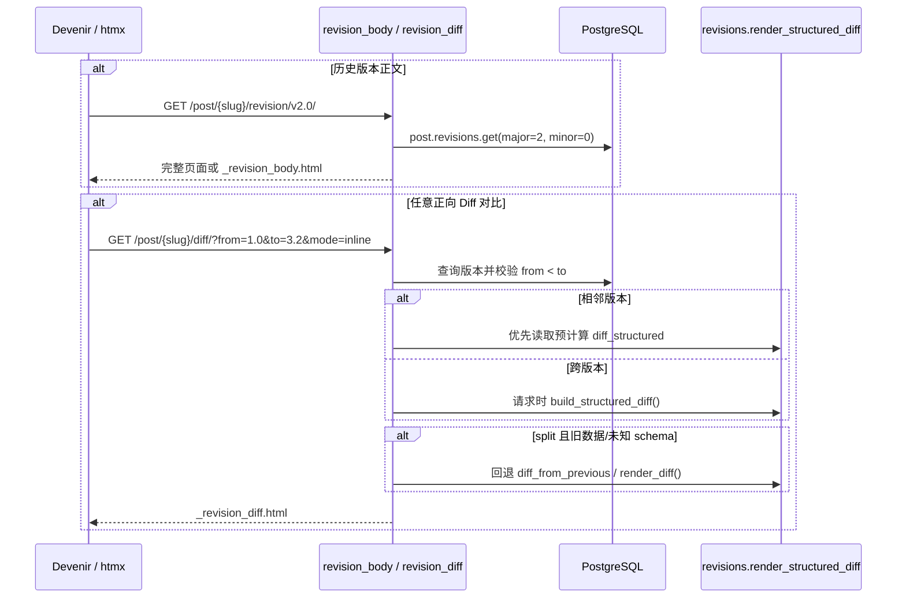
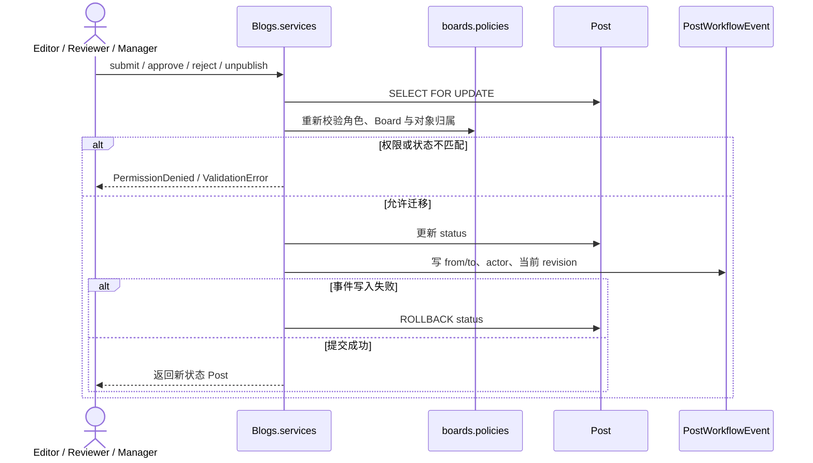
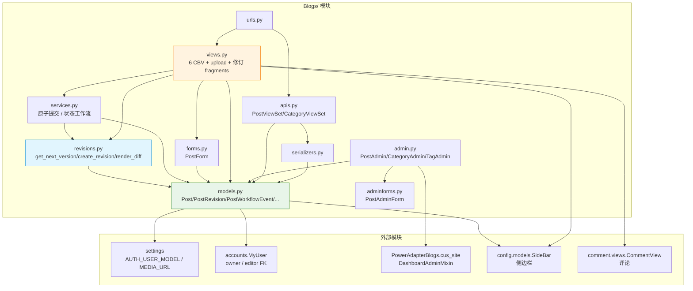

# Blogs 模块 — 开发文档

> **文档权重**：85（Blogs 当前实现与模块 TODO）
> **模块**: `Blogs/`  
> **职责**: 博客文章 CRUD、分类/标签管理、PV/UV 统计、修订追踪 (v2.0)、可见性控制  
> **依赖**: Django CBV (ListView/DetailView/CreateView/UpdateView), DRF ViewSet, Redis 缓存  
> **创建**: 2025-08-04  
> **最后更新**: 2026-07-25 — PostRevision R0–R4：任意版本比较与展示模式

---

## 0. 变更日志

| 日期 | 版本 | 变更 |
|------|------|------|
| 2026-07-25 | v2.15 | **作者预览闭环**：投稿/保存成功后显示 messages 并跳转详情；草稿/审核中仅作者可查看详情和修订；详情页按 Policy 显示 Edit；安全过滤上一篇/下一篇；114 项回归通过 |
| 2026-07-25 | v2.14 | **投稿表单修复**：Devenir 显式渲染中文可见性及本地化错误；移除五张预设封面和伪上传逻辑；空封面按分类使用静态默认图；111 项回归通过 |
| 2026-07-25 | v2.13 | **PostRevision R4**：允许任意正向版本比较；Devenir 增加服务端版本选择器和双栏/行内/统计模式；补齐回滚与人工验收说明；108 项回归通过 |
| 2026-07-25 | v2.12 | **PostRevision R3**：新增 `markdown-block-sentence-char-v1` 结构化 Diff、统计与迁移 0008；新旧双写、结构化优先渲染、旧 HTML 回退；105 项回归通过 |
| 2026-07-25 | v2.11 | **PostRevision R2**：新增 `PostWorkflowEvent` 与迁移 0007；状态事件不再制造伪 revision；Dashboard 提供 Board-scoped 只读历史；R2 相关测试及既有 99 项全量回归通过，新增 Board Scope 用例另行通过 |
| 2026-07-25 | v2.10 | **PostRevision R0–R1**：补齐修订契约测试；`create_revision()` 锁定 Post；前台 Post + revision 原子提交；`base_revision_id` 拒绝陈旧编辑 |
| 2026-07-20 | v2.9 | **Django 5.2 LTS**：分页 URL 改用 `reverse(query=...)` 生成并统一注入模板；保留 5.1 过渡降级路径；5.2.16 与 5.1.5 各 87 项回归通过 |
| 2026-07-20 | v2.8 | **Post Stream HDA**：Category/Search 复用 PostList QuerySet、context 与模板 fragment；HX 请求局部刷新并保留完整页面回退；匿名页面缓存按 `HX-Request` 隔离 |
| 2026-07-19 | v2.7 | **Board Scope Stage 5**：新增事务状态 Service；写作 View、上传、STAFF_ONLY/修订端点与只读 DRF API 接入 Policy |
| 2026-07-19 | v2.6 | **Board Scope Stage 4**：Post/PostRevision Admin queryset、对象权限、Category 表单与 autocomplete 接入 boards Policy；修复 Manager 编辑覆盖 owner |
| 2026-07-12 | v2.5 | **上传与权限加固**: 图片恢复 CSRF、登录和角色检查，校验大小/MIME/真实格式/像素；修订端点补 visibility；前台写作入口对齐 dashboard 角色；修复 serializer tags source |
| 2026-07-12 | v2.4 | **缓存安全**: 公开/内部 hot_posts 分离，公开榜单排除 STAFF_ONLY；补回归测试 |
| 2026-06-22 | v2.3 | **Dashboard 分行 Action**: rewrap_content_action + rewrap_posts 管理命令 |
| 2026-06-22 | v2.2 | **Diff 优化**: _word_wrap() 预处理 + backfill_diffs 命令 + diff 布局分离 |
| 2026-06-22 | v2.0 | **P1 修订追踪**: PostRevision 模型 + 3个API + visibility 权限 + PostForm 字段扩展 |
| 2026-06-22 | v1.1 | 日志代码补全 (Create/Edit/Visit/Upload/Cache 全链路) |
| 2025-08-04 | v1.0 | 初始：Post/Category/Tag 模型 + CBV 视图 + DRF API |

### v2.0 详细变更

| Feature | 文件 | 描述 |
|---------|------|------|
| PostRevision 模型 | `models.py` | 语义化版本号 (v{major}.{minor})，内容快照，change_type/edit_summary |
| Visibility 权限 | `models.py` + `boards/policies.py` | PUBLIC 对所有人可见；STAFF_ONLY 仅所属 Board 的可见角色或 superuser 可见 |
| 修订 HTML 端点 (×2) | `urls.py` + `views.py` | 历史版本正文 / 相邻版本 diff；完整页面与 htmx fragment 共用 Policy |
| 快照自动创建 | `views.py` + `services.py` | PostCreateView → v1.0；PostEditView → 原子递增并检测陈旧版本 |
| 版本计算工具 | `revisions.py` | 版本分配、结构化 Diff 构建/安全渲染与旧 `render_diff()` 兼容；可见性由 boards Policy 负责 |
| Admin 扩展 | `admin.py` | PostRevisionInline (只读) + PostAdmin 加 visibility 列/过滤 |
| Data Migration | `migrations/0004` | 50 篇现有文章批量创建 v1.0 初始快照 |
| Workflow Event | `models.py` + `migrations/0007` | R2 新增状态迁移历史；新表无历史数据回填 |
| Structured Diff | `revisions.py` + `migrations/0008` | R3 新增 JSON 契约、算法版本与统计；旧 HTML 保留兼容，可用 `backfill_diffs` 补齐 |

---

## 1. 模块架构总览



**核心设计原则**：
- **Post 是内容主体** (v2.0)：前端直接渲染 Post.title/content
- **PostRevision 是纯历史快照**：编辑时自动创建，通过详情页时间线和修订 HTML 端点查询
- **文章保存与快照同事务**：前台统一通过 `commit_post_form()`；任一步失败均回滚数据库写入
- **并发采用双层保护**：`select_for_update()` 串行化短提交，`base_revision_id` 拒绝长编辑会话的静默覆盖
- **内容版本与状态事件分离**：`PostRevision` 只描述内容，`PostWorkflowEvent` 记录状态迁移并关联当时 revision
- **默认封面不是上传数据**：`Post.cover` 只保存用户上传文件；空值由分类映射到静态默认图，避免重复复制媒体文件
- **visibility 不可泄露**：非授权访问 STAFF_ONLY 文章 → 404（不是 403）
- **未发布预览仅限作者**：DRAFT/REVIEW 的详情、修订正文与 Diff 只允许 owner，Reviewer/Manager 仍在 Dashboard 工作流中处理
- **文章导航使用安全 QuerySet**：上一篇/下一篇只从 `published_posts_visible_to()` 选取，不直接调用模型日期导航而泄露草稿标题
- **缓存自动失效**：`clear_page_caches()` 在创建/编辑后清除 Redis 页面缓存

---

## 2. 组件清单

| 文件 | 核心类/函数 | 职责 |
|------|------------|------|
| `models.py` | `Post`, `PostRevision`, `PostWorkflowEvent` 等 | 7 个数据模型；内容版本与状态历史分离 |
| `services.py` | `commit_post_form()`, `record_post_workflow_event()`, Post workflow | 文章原子提交、陈旧版本检测、状态事件、行锁与 Policy 重检 |
| `views.py` | 6 个 CBV + `post_img_upload` + 修订 fragment 端点 | 前台浏览 + 编辑器 + 图片上传 + HTML Application API |
| `forms.py` | `PostForm` | 文章编辑表单（visibility/change_type/edit_summary + 隐藏的 `base_revision_id`） |
| `covers.py` | `default_cover_static_path()` | 按分类名选择 Devenir 静态默认封面；未知分类回退 `Cover.png`，不写入 `Post.cover` |
| `admin.py` | `PostAdmin`, `PostRevisionAdmin`, `PostWorkflowEventAdmin` 等 | Dashboard Admin；修订与工作流历史只读并按 Board 收敛 |
| `adminforms.py` | `PostAdminForm` | Admin 专用表单 (覆盖 widgets) |
| `apis.py` | `PostViewSet`, `CategoryViewSet` | DRF REST API |
| `serializers.py` | `PostSerializer`, `CategorySerializer` | DRF 序列化器 |
| `urls.py` | — | 前台路由 + DRF 路由 + 修订 HTML 端点路由 |
| `revisions.py` | `get_next_version()`, `create_revision()`, `render_diff()` | 修订工具；创建时锁定 Post 并校验 change_type，不承载授权判断 |
| `feed.py` | — | **规划、当前不存在**；F3 实现仅公开已发布文章的 RSS/Atom Feed |
| `tests.py` | `PostStreamHtmxTest` 等 | 权限、修订、上传、Post Stream fragment、缓存隔离与管理命令回归 |

### 2.1 Post Stream HTML Application API

`PostListView`、`CategoryView`、`TagView` 与 `SearchView` 共享 `post_list`、分页、`categories` 和 `post.can_edit` 契约。分类与搜索不再维护独立卡片数据形状：

| 请求 | 模板响应 | URL 行为 |
|---|---|---|
| 普通 GET | `list.html` / 兼容 wrapper → 完整 `base.html` 页面 | URL 可刷新、收藏、SEO 与无 JavaScript 访问 |
| `HX-Request: true` | `_post_browser.html` | htmx 替换 `#post-browser`，`hx-push-url` 更新历史 |

`CategoryView` 继承 `PostListView` 的 `published_posts_visible_to()`、`select_related`、分页和编辑权限标注，只额外限定正常状态的 Category。`SearchView` 继续在同一可见 QuerySet 上过滤标题与正文。

匿名页面缓存必须对 `HX-Request` 设置 `Vary`，否则相同 URL 的完整页面和 fragment 会污染彼此。登录用户仍绕过整页缓存。

---

## 3. 数据模型

### 3.1 模型关系图

```mermaid
erDiagram
    Post ||--o{ PostVisit : "PV/UV 统计"
    Post ||--o{ PostRevision : "修订历史 (v2.0)"
    Post ||--o{ PostWorkflowEvent : "状态迁移历史"
    PostRevision ||--o{ PostWorkflowEvent : "事件发生时的内容版本"
    Post }o--|| Category : "N:1 分类"
    Post }o--o{ Tag : "M2M 标签"
    Post ||--o{ PostImage : "文章图片"

    Post {
        int id PK
        string title "标题"
        text desc "摘要"
        text content "正文 (Markdown)"
        int status "NORMAL=1 / DELETE=0"
        int visibility "PUBLIC=0 / STAFF_ONLY=1 (v2.0)"
        slug slug UK "URL 标识"
        int category_id FK "分类"
        int owner_id FK "作者"
        image cover "封面图"
        int pv "页面访问缓存"
        int uv "用户访问缓存"
        datetime created_time
        datetime update_time
    }

    PostRevision {
        int id PK
        int post_id FK "文章"
        int major "大版本"
        int minor "小修订"
        string version "组合值 '1.0'"
        string title "标题快照"
        text desc "摘要快照"
        text content "正文快照"
        slug slug "slug快照"
        int editor_id FK "编辑者"
        string change_type "major/minor"
        string edit_summary "编辑摘要"
        text diff_from_previous "旧 HTML，兼容期保留"
        json diff_structured "结构化差异，可空"
        string diff_algorithm "算法版本"
        json diff_stats "字符/块统计"
        datetime created_at "快照时间"
    }

    PostWorkflowEvent {
        int id PK
        int post_id FK "文章"
        int actor_id FK "操作人，可空"
        string event_type "submitted/approved/rejected/..."
        int from_status "原状态"
        int to_status "新状态"
        int revision_id FK "当时 revision，可空"
        string note "说明"
        datetime created_at "发生时间"
    }

    PostVisit {
        int id PK
        string uid "用户标识"
        int post_id FK
        int visit_type "UV=0 / PV=1"
        datetime created_time
    }

    Category {
        int id PK
        string name
        int status
        bool is_nav "导航栏显示"
        int owner_id FK
        datetime created_time
    }

    Tag {
        int id PK
        string name
        int status
        bool is_nav
        int owner_id FK
        datetime created_time
    }
```



### 3.2 Post 模型关键方法

| 方法 | 类型 | 说明 |
|------|------|------|
| `get_normal_posts()` | `@classmethod` | 返回 `status=NORMAL` 的 QuerySet |
| `get_by_category(cate_id)` | `@classmethod` | 按分类过滤 |
| `get_by_tag(tag_id)` | `@staticmethod` | 按标签过滤，返回 `(posts, tag)` |
| `latest_posts(num=5)` | `@classmethod` | 最新 N 篇文章 |
| `hot_posts()` | `@classmethod` | 热门文章 (pv 排序，Redis 缓存 10min) |
| `get_uv_count()` | 实例方法 | 从 PostVisit 实时计算 UV |
| `sync_uv_from_visits()` | `@classmethod` | 同步 PostVisit UV → Post.uv 缓存 |
| `save()` | 重写 | 自动生成 slug (`slugify(title)-pk`) |
| `get_absolute_url()` | — | `reverse("Blogs:post_detail", slug=self.slug)` |

### 3.3 PostRevision 版本号规则

```
v{major}.{minor}

major 递增，minor 归零 → 大版本 (重大内容变更)
minor 递增               → 小修订 (错别字/措辞/补充)

示例:
  v1.0 → (major) → v2.0
  v1.0 → (minor) → v1.1
  v2.3 → (major) → v3.0
  v2.3 → (minor) → v2.4
```

`unique_together = ('post', 'major', 'minor')` 保证同一篇文章不会有重复版本号。

### 3.4 PostWorkflowEvent 边界

`PostWorkflowEvent` 记录可查询的业务状态历史：提交审核、审核通过并发布、驳回、下架、编辑后退回草稿和其他显式状态变化。每条事件保存 `from_status`、`to_status`、操作人及事件发生时对应的 `PostRevision`。

- 工作流 Service 在同一 `transaction.atomic()` 中更新 Post 并写入事件；事件失败会回滚状态。
- `approve_post()` 不再调用 `create_revision()`；没有内容变化就不抬高文章版本。
- Dashboard 中事件只有 Board-scoped 查看权限，禁止新增、修改和删除。
- 该模型是业务查询层，不替代 MongoDB HMAC 防篡改安全日志，也不宣称自身具有密码学完整性。

### 3.5 R3 结构化 Diff 契约

`PostRevision.diff_structured` 保存展示无关的 JSON 数据，当前 schema 为 `1`，算法标识为 `markdown-block-sentence-char-v1`：

1. 先按 Markdown 标题、代码围栏、表格、引用、列表、分隔线与普通段落划分块。
2. 以块为单位识别新增、删除和替换；替换块先按中英文标点对齐句子，再在变化句内进行字符级比较。
3. `diff_stats` 保存新增/删除/修改块数量和插入/删除字符数；极端长单段文本超过阈值后降级为整段替换，避免平方级比较卡顿。
4. JSON 只保存原始文本与操作类型，`render_structured_diff()` 输出时统一转义；数据库内容不能直接作为可信 HTML。
5. 新 revision 同时写入 `diff_structured` 和旧 `diff_from_previous`。读取端优先使用受支持的结构化 schema；旧数据、未知 schema 或缺失结构化数据时回退旧 HTML。

迁移 0008 只新增可兼容字段，不强制重算历史数据。需要补齐历史记录时先执行 `python manage.py backfill_diffs --dry-run`，确认后再去掉 `--dry-run`；默认保留已有旧 HTML，只有 `--force` 才重新计算两种格式。

### 3.6 R4 任意版本比较与展示模式

`revision_diff` 接受 `from`、`to` 和 `mode`：

- `from` 与 `to` 必须存在、不同，且 `from` 的 `(major, minor)` 必须小于 `to`；反向或相同版本返回 400。
- `mode=split` 为双栏，`mode=inline` 以 `del/ins` 行内显示，`mode=stats` 只显示块和字符统计；其他值返回 400。
- 相邻版本优先使用目标 revision 已保存的 `diff_structured`；跨版本即时调用 `build_structured_diff()`，不写数据库，也不伪造 revision。
- 端点继续先检查已发布文章和 `can_view_published_post()`。PUBLIC 可按公开规则查看，STAFF_ONLY 必须满足原 Board Policy；R4 不新增权限旁路。
- Devenir 时间线提供原生 GET 表单，默认选择最早版和最新版；htmx 只增强局部替换。结果 fragment 内可继续切换双栏、行内和统计模式。

---

## 4. 详细数据流

### 4.1 文章浏览 + PV/UV 统计



**PV 防刷**：同一用户对同一文章 1 分钟内只计 1 次 PV (Redis `pv:{uid}:{post_id}` TTL=1min)  
**UV 唯一**：`unique_together = ('uid', 'post', 'visit_type')` 保证同文章同用户只计 1 次 UV

### 4.2 文章创建流程



### 4.3 文章编辑 + 修订流程



### 4.4 修订 HTML 与任意版本 Diff 调用链



### 4.5 工作流事件流程（R2）



---

## 5. API 设计

### 5.1 DRF REST API (`/api/posts/` + `/api/categories/`)

由 `PostViewSet` + `CategoryViewSet` 提供 Policy-scoped 只读数据 API；写方法当前明确返回 405。

### 5.2 修订历史 HTML Application API (v2.0 P1)

| 端点 | 方法 | 说明 |
|------|------|------|
| `/post/{slug}/revision/v{major}.{minor}/` | GET | 普通请求返回完整历史页面；htmx 返回正文 fragment |
| `/post/{slug}/diff/?from=1.0&to=1.1` | GET | 仅允许相邻版本，返回 diff HTML fragment |

> 修订交互属于 HTML Application API，不挂在 DRF router 下；时间线元数据随文章详情页返回。

### 5.3 图片上传

| 端点 | 方法 | 说明 |
|------|------|------|
| `/img_upload/` | POST | 上传图片 → `MEDIA_URL/post_images/{uuid}.{ext}` |

端点要求登录、CSRF 和 Board 创建权限，并校验大小、MIME、真实图片格式与像素；文件以 UUID 重命名防冲突。

---

## 6. Admin 配置

### 6.1 双后台注册

```python
# 注册 1: admin.site → /super_admin/
admin.site.register(Post)
admin.site.register(Category)
admin.site.register(Tag)

# 注册 2: custom_site → /dashboard/
@admin.register(Post, site=custom_site)
class PostAdmin(DashboardAdminMixin, admin.ModelAdmin): ...

@admin.register(Category, site=custom_site)
class CategoryAdmin(DashboardAdminMixin, BaseOwnerAdmin): ...

@admin.register(Tag, site=custom_site)
class TagAdmin(DashboardAdminMixin, BaseOwnerAdmin): ...
```

### 6.2 PostAdmin 配置详情

| 配置项 | 值 | 说明 |
|--------|-----|------|
| `list_display` | title, category, status, **visibility**, created_time, owner | v2.0 新增 visibility |
| `list_filter` | status, `BoardScopedCategoryFilter`, **visibility** | 分类选项不泄露非所属 Board |
| `inlines` | `[PostRevisionInline, PostWorkflowEventInline]` | 内容修订与工作流事件分别只读展示 |
| `fieldsets` | 基础配置 / 内容 / 额外信息 (含 visibility) | 三栏布局 |
| `search_fields` | title, category__name | |

Stage 4 的对象范围由 `boards.policies` 统一裁决：

- Contributor/Editor 只看到自己在有效 Membership Board 中的文章；Reviewer/Manager 可看到所属 Board 的全部文章。
- Reviewer 只读；Manager 可编辑他人文章，但 `owner` 保持原作者，不再被 `BaseOwnerAdmin.save_model()` 改写。
- 新建/编辑表单与 `CategoryAutocomplete` 只接受具有创建权限且 Category→Board 映射唯一的分类。
- `PostRevisionAdmin` 跟随对应 Post 的可见范围。
- 提交、审核、发布、驳回和下架 action 已在 Stage 5 恢复；每个对象通过 `Blogs.services` 加锁并重新校验 Policy。批量分行仍只对 superuser 开放。

### 6.3 PostRevisionInline

- `readonly_fields = ('version', 'change_type', 'edit_summary', 'editor', 'created_at')`
- `extra = 0` — 不显示空行
- `can_delete = False` — 禁止删除
- `has_add_permission = False` — 系统自动创建，禁止手动添加

---

## 7. 可见性权限矩阵

| 用户类型 | 公开文章 | STAFF_ONLY 文章 | 实现 |
|----------|:---:|:---:|------|
| 匿名用户 | ✅ 可见 | ❌ 404 | `published_posts_visible_to()` |
| 已登录但无 Membership | ✅ 可见 | ❌ 404 | 全局旗标不扩大 Board Scope |
| Contributor/Editor | ✅ 可见 | 仅自己的所属 Board 文章 | `posts_visible_to()` |
| Reviewer/Manager | ✅ 可见 | 所属 Board 全部文章 | `posts_visible_to()` |
| 仅 `is_staff` | ✅ 可见 | ❌ 404 | Stage 5 回归测试固定该边界 |
| superuser | ✅ 可见 | ✅ 可见 | Policy 应急 bypass |

**设计决策**：
- 非授权用户访问 STAFF_ONLY 文章 → **404** 而非 403
- 原因：不泄露"这篇文章存在但你无权查看"的信息
- 列表/API 使用 `published_posts_visible_to()`，详情与修订端点使用 `can_view_published_post()`；拒绝时继续返回 404

### 7.1 所有视图的 visibility 过滤

| 视图 | 过滤位置 | 方式 |
|------|---------|------|
| `PostListView` | `get_queryset()` | `published_posts_visible_to()` |
| `CategoryView` | 继承 PostListView 后按 Category 过滤 | 同一 `published_posts_visible_to()`；Category 自身必须为正常状态 |
| `TagView` | 继承 PostListView | 自动继承 |
| `SearchView` | 继承 PostListView | 自动继承 |
| `PostDetailView` | `get_object()` | 判断后 `raise Http404` |
| `revision_body` / `revision_diff` | 函数入口 | `can_view_published_post()` |
| DRF Post/Category | `get_queryset()` | Policy-scoped 只读；写方法 405 |

---

## 8. 缓存架构

### 8.1 缓存层级

| 层级 | 缓存目标 | Key 模式 | TTL |
|------|---------|---------|-----|
| 页面缓存 | `PostListView` 及其 Category/Tag/Search 子类的匿名访问 | `views.decorators.cache.cache_page.*`；按路径、query string 与 `Vary: HX-Request` 隔离 | 15min |
| 片段缓存 | SideBar / 导航分类 | `template.cache.*` | 15min |
| 查询缓存 | `hot_posts` | `hot_posts` | 10min |
| PV 去重 | 用户+文章 PV | `pv:{uid}:{post_id}` | 1min |
| UV 去重 | 用户+日期+文章 UV | `uv:{uid}:{date}:{post_id}` | 24h |

### 8.2 缓存失效

`clear_page_caches()` 在创建/编辑文章后调用：
1. `cache.delete_pattern("*views.decorators.cache.cache_page.*")` — 页面缓存
2. `cache.delete_pattern("*template.cache.*")` — 模板片段缓存
3. `cache.delete('hot_posts')` — 热门文章查询缓存

> `delete_pattern` 仅 Redis 后端支持，`LocMemCache` 会捕获 `AttributeError` 降级。

---

## 9. v2.0 → v2.1 演进路线

### 9.1 PostRevision R0–R4 Linear

| 阶段 | 状态 | 严重度 | 当前结论 / 验收 |
|---|---|---|---|
| R0 特征测试 | ✅ 已完成 | 🔴 高 | `PostRevisionCharacterizationTest` 固定版本递增、快照、HTML 转义、相邻 diff、格式校验、唯一约束和非法类型拒绝 |
| R1 一致性 | ✅ 已完成 | 🔴 高 | `create_revision()` 锁定 Post；`commit_post_form()` 原子保存；陈旧 revision head 返回表单错误；全量 96 项测试通过 |
| R2 版本/事件分离 | ✅ 已完成 | 🟡 中 | `PostWorkflowEvent` 记录 from/to、actor 与当时 revision；状态与事件原子提交；纯状态 Dashboard 编辑不再创建 revision；既有 99 项全量回归与新增 Board Scope 用例均通过 |
| R3 结构化 Diff | ✅ 已完成 | 🟡 中 | `markdown-block-sentence-char-v1`、统计和迁移 0008 已落地；新旧双写、结构化优先、旧 HTML/未知 schema 回退；兼容回填测试与 105 项全量回归通过 |
| R4 编辑体验与迁移 | ✅ 已完成 | 🟢 低 | 任意正向版本比较、split/inline/stats htmx 模式、Devenir 服务端表单、回滚/人工验收说明完成；108 项全量回归通过 |

R0–R4 只加固当前 v2.0 快照架构。`Post.current_revision`、三段版本号和内容唯一来源仍属于下面的 v2.1 独立迁移，未经用户确认不得从本路线顺带实施。

#### R4 部署与回滚

1. 部署 R3/R4 前先应用迁移 0007、0008，再更新应用代码与静态文件；R4 本身没有新增迁移。
2. 历史结构化数据回填不是上线前置条件。先运行 `backfill_diffs --dry-run`，确认规模后再决定是否正式执行。
3. 应用层回滚时保留 0008 新字段即可，旧代码会忽略它们；不要在仍有 R3/R4 代码运行时反向删除字段。
4. 若结构化数据异常，可停止回填并切回旧 `diff_from_previous` 展示。旧 HTML 在兼容期持续双写，因此回滚不需要删除 revision，也不会丢失文章内容。

#### R4 人工验收

- 准备至少三个版本，比较最早版与最新版，确认跨版本请求成功且没有创建新 revision。
- 分别切换双栏、行内、统计；确认中英文、Markdown 标题、列表、代码块和移动端单栏样式可读。
- 反向选择版本应返回明确的 400，不应自动交换用户输入。
- 匿名用户访问 STAFF_ONLY 历史仍为 404；具备对应 Board 可见权限的用户可以查看。
- 找一条只有旧 `diff_from_previous` 的历史记录，确认相邻双栏模式仍能回退显示。
- 生产环境运行 `collectstatic` 后确认 Devenir 的选择器、模式按钮与高亮样式生效。

### 9.2 v2.1 内容唯一来源（独立规划）

#### 9.2.1 当前 v2.0 架构

```
Post (内容主体) ← 前端直接读取
  ├── title, desc, content, slug  ← 内容字段
  ├── status, category, tag, owner, cover, pv, uv, visibility  ← 元数据
  └── created_time, update_time

PostRevision (历史快照) ← 详情页时间线与 HTML fragment 查询
  ├── major, minor, version
  ├── title, desc, content, slug  ← 内容快照
  ├── editor, change_type, edit_summary
  └── created_at
```

#### 9.2.2 v2.1 目标架构

```
Post (纯元数据容器)
  ├── status, category, tag, owner, cover, pv, uv, visibility
  ├── current_revision FK → PostRevision  ← 新增，指向最新版本
  ├── created_time, update_time
  └── ❌ 移除: title, desc, content, slug

PostRevision (内容唯一来源)
  ├── major, minor, version
  ├── title, desc, content, slug  ← 唯一内容来源
  ├── editor, change_type, edit_summary
  └── created_at
```

**路由变化**：
- v2.0：`post.title` → 直接渲染
- v2.1：`post.current_revision.title` → 通过 FK 取最新快照
- 前端无感：模板只需改 `post.title` → `post.current_revision.title`

#### 9.2.3 v2.1 迁移步骤

| # | 步骤 | 文件 |
|---|------|------|
| 1 | Post 加 `current_revision` FK (nullable → 数据迁移后改 not null) | `models.py` |
| 2 | Data migration：每篇文章 `current_revision = revisions.latest()` | `migrations/` |
| 3 | Data migration：从 Post 复制内容字段到 current_revision (补齐漏网内容) | `migrations/` |
| 4 | 所有视图改内容来源：`post.title` → `post.current_revision.title` | `views.py` |
| 5 | 模板改：`{{ post.title }}` → `{{ post.current_revision.title }}` | `templates/` |
| 6 | Post 移除 `title/desc/content/slug` 列 | `models.py` + migration |
| 7 | PostRevision 去掉"快照"字样 (verbose_name 改为"文章版本") | `models.py` + migration |
| 8 | PostAdmin fieldsets 改为从 current_revision 代理读取 | `admin.py` |
| 9 | DRF serializer 更新字段来源 | `serializers.py` |

---

## 10. 文件依赖图



`feed.py` 不属于当前依赖图；它是 `blog_foundation_linear` F3 的规划组件，落地后再接入 `Post` 的统一公开 QuerySet。

---

## 11. 已知问题 / TODO

| Issue | 严重 | 描述 |
|-------|------|------|
| PostImage 无 CRUD 视图 | 🟢 低 | 模型已定义，无前端上传/管理界面 |
| 图片上传安全 | ✅ 已修复 | 正文与封面共用图片校验器；限制 5MB、2500 万像素及 JPEG/PNG/GIF/WEBP，正文上传恢复 CSRF 与 dashboard 权限 |
| 投稿表单隐藏必填可见性、预设封面占据首屏 | ✅ 已修复 | 显式显示“公开/仅本板块成员可见”和中文错误；删除预设选择器，分类切换仅更新空封面的默认预览 |
| hot_posts 缓存不区分 visibility | ✅ 已修复 | 公开/内部使用独立 cache key，公开榜单强制过滤 STAFF_ONLY，并有回归测试 |
| PV/UV 非原子操作 | 🟢 低 | `F('pv')+1` 在 Django ORM 中是原子 UPDATE，但 `PostVisit.objects.get_or_create` 存在竞态。当前依赖 `IntegrityError` 降级，可接受 |
| slug 唯一性由 DB 保证 | 🟢 低 | `save()` 中手动生成 slug，并发创建可能冲突。概率极低 |
| 修订时间线无分页 | 🟢 低 | 详情页一次加载全部版本元数据；个人博客文章版本数 < 100 时可接受，R4 再评估 |
| 修订 Diff 尚不支持块移动检测 | 🟢 低 | R4 已支持任意正向版本比较与三种展示模式；独立的块移动识别收益有限，留作 v2.5+ 候选 |
| 普通 View/API 未使用 Board Policy | ✅ 已修复 | Stage 5 已覆盖写作 View、上传、修订端点、评论提交和只读 DRF ViewSet |
| `/super_admin/` 的 Post 默认注册依赖 Django `is_staff` + Permission | 🟡 中 | 当前仅 superuser 创建流程授予 `is_staff`；未来引入非 superuser staff 前补 Policy 或显式 superuser 边界 |
| 公开归档与 RSS/Atom | 🟡/🟢 规划 | 当前均未实现；按 `docs/guides/BLOG_FOUNDATION_GUIDE.md` F3 复用公开文章 QuerySet，禁止输出草稿和内部文章 |

---

## 12. 附录

### A. 路由表

| URL 模式 | 视图 | 名称 |
|----------|------|------|
| `/post/` | `PostListView` | `post_list` |
| `/post/{slug}/` | `PostDetailView` | `post_detail` |
| `/post/{slug}/comment/` | `CommentView` | `post_comment` |
| `/post/{slug}/edit/` | `PostEditView` | `post_edit` |
| `/post/new/` | `PostCreateView` | `post_create` |
| `/category/{id}/` | `CategoryView` | `category_list` |
| `/tag/{id}/` | `TagView` | `tag_list` |
| `/search/` | `SearchView` | `search` |
| `/img_upload/` | `post_img_upload` | `post_img_upload` |
| `/post/{slug}/revision/{version}/` | `revision_body` | `revision_body` |
| `/post/{slug}/diff/` | `revision_diff` | `revision_diff` |
| `/api/posts/` | DRF `PostViewSet` | (REST) |
| `/api/categories/` | DRF `CategoryViewSet` | (REST) |
| `/api/schema/` | `SpectacularAPIView` | `schema` |
| `/api/docs/` | `SpectacularSwaggerView` | `swagger-ui` |

### B. 关键配置

```python
# settings/base.py
MEDIA_URL = "/media/"
MEDIA_ROOT = BASE_DIR / "media"

# Post 封面存储路径: post-covers/%Y/%m/
# PostImage 存储路径: post_images/%Y/%m/
# 上传图片存储路径: post_images/{uuid}.{ext}
```

### C. 管理命令速查

```bash
# 文章内容分行（单词边界 80 字换行，提升 diff 颗粒度）
python manage.py rewrap_posts --post-ids 1,2,3        # 指定文章
python manage.py rewrap_posts --all                   # 全部正常文章
python manage.py rewrap_posts --all --dry-run         # 预览模式

# Dashboard admin action（勾选文章 → 下拉 → "📝 对选中文章内容执行单词边界分行"）
# 位置：/dashboard/Blogs/post/

# Diff 回填/重算
python manage.py backfill_diffs --limit 60            # 回填 NULL diff
python manage.py backfill_diffs --force               # 强制重算所有
python manage.py backfill_diffs --force --dry-run     # 预览

# 测试数据生成
python manage.py bump_versions --count 10             # 对最近文章生成修订版本

# 同步 PostVisit UV → Post.uv 缓存字段 (全量)
python manage.py shell -c "
from Blogs.models import Post
Post.sync_uv_from_visits()
"

# 同步指定文章
python manage.py shell -c "
from Blogs.models import Post
Post.sync_uv_from_visits(post_id=1)
"

# 查看文章修订历史
python manage.py shell -c "
from Blogs.models import Post
p = Post.objects.get(slug='hello-world')
for r in p.revisions.all():
    print(f'v{r.version} {r.change_type} {r.edit_summary}')
"
```
