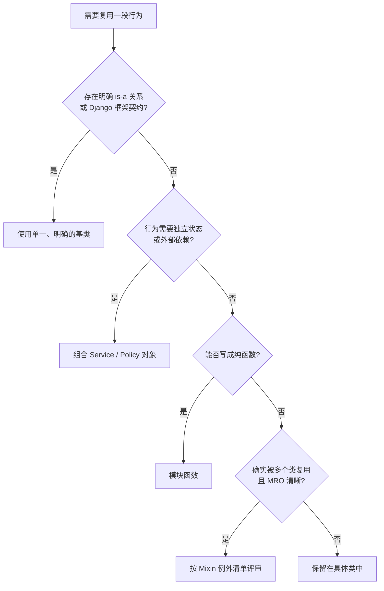
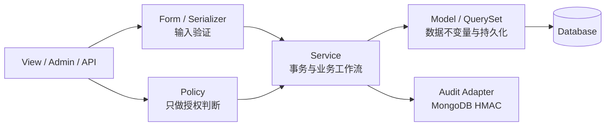

# PowerAdapterBlogs Python 编码指南

> **文档权重**：95（全项目 Python/Django 编码硬约束）
> **状态**：生效；新代码必须遵守，旧代码在修改时渐进整改
> **日期**：2026-07-13
> **适用范围**：项目内 Python / Django 代码
> **原则来源**：Python 之禅、Django 官方惯例，以及 JetBrains《Java Best Practices》中可迁移到 Python 的通用工程原则

## 1. 原则优先级

发生冲突时按以下顺序判断：

1. 正确性、安全边界与 Django 框架契约。
2. Python 之禅：显式优于隐式、简单优于复杂、扁平优于嵌套、可读性重要、错误不应静默。
3. 本项目已经确认的权限、审计、迁移和日志规范。
4. 跨语言通用工程建议。
5. Java 专属写法不直接移植到 Python。

“组合优于继承”是默认倾向，不是禁止继承。Python/Django 中合理的框架继承仍然成立，例如 `models.Model`、`admin.ModelAdmin`、`FormView` 和 Django 官方提供的兼容 Mixin。

## 2. 新代码硬性约束

| 规则 | 项目要求 |
|---|---|
| 清晰优先 | 不用炫技式一行表达式、隐式副作用或难以解释的元编程替代直白代码 |
| 单一职责 | View 负责 HTTP 编排，Form 负责输入验证，Policy 负责授权，Service 负责工作流，Model 负责数据不变量 |
| 显式依赖 | 依赖通过参数、明确 import 或对象属性表达；禁止依赖未记录的全局可变状态 |
| 命名 | 使用领域名称；时间、大小等数值带单位后缀，例如 `_seconds`、`_bytes`、`_pixels` |
| 异常 | 禁止裸 `except:`、`except Exception: pass` 和无说明地吞错；捕获可处理的具体异常 |
| 资源 | 文件、锁、事务等使用 context manager；跨多次写操作使用 `transaction.atomic()` |
| 嵌套 | 优先 guard clause；出现三层以上条件嵌套时必须评估拆分 |
| 类型 | Policy、Service、公共工具函数及非显然返回值添加类型标注；不为 Django 已明确的简单 override 制造 Java 式样板 |
| 可变性 | 不修改调用者传入的集合；常量优先 `tuple` / `frozenset` / `Final`，但不强行冻结 Django Model |
| 日志 | 结构化参数日志，不使用运行时 `print()`；密码、Token、密钥、TOTP secret/code 永不记录 |
| 测试 | 权限、认证、审计、状态机和迁移必须包含允许与拒绝路径；测试名表达场景和结果 |
| 依赖 | 不盲目追最新版；先检查安全公告、兼容性、锁定版本和回归测试 |
| 模块关系 | 禁止新增循环依赖；局部 import 只能作为有注释、有后续 TODO 的临时解法 |

函数或类是否“过长”以职责和可解释性判断。JetBrains 文中的 10–20 行是审查提示，不是 Python 项目的机械行数上限；为了满足行数而拆出无语义的小函数同样不可取。

## 3. Mixin 与继承约束

### 3.1 默认决策

### 3.2 新建项目自定义 Mixin 的准入条件

项目自定义 Mixin 默认不新增；只有同时满足以下条件才能采用：

1. 只提供一个聚合度高、名称明确的行为。
2. 至少存在两个真实消费者；不能为“以后可能复用”提前抽象。
3. 不保存业务状态，不定义 Django Model 字段，不在调用者不知情时写数据库。
4. 不隐藏权限判定、事务边界、审计写入或外部网络调用。
5. 与宿主类的必需属性、方法及调用顺序在 docstring 中明确。
6. 涉及 override 时遵循 cooperative `super()`，并验证 MRO；禁止直接跳过未知父类。
7. 有独立测试，并覆盖与宿主类组合后的行为。
8. 类名以 `Mixin` 结尾；一个类组合多个项目自定义 Mixin 时必须增加设计说明。

不满足条件时优先选择：纯函数 → Policy/Service 组合 → 明确基类 → 在具体类中保留少量重复。少量显式重复通常比隐式 MRO 耦合更容易维护。

### 3.3 Django 官方 Mixin

Django 官方 Mixin 可以使用，但必须属于兼容的通用视图族，并检查方法覆盖和 MRO。不要组合多个都实现 `get()`、`post()`、`get_queryset()` 或 `form_valid()` 的父类来碰运气；不确定时退回较简单的 `View`、单一 generic view 或拆分端点。

### 3.4 当前 `DashboardAdminMixin` 结论

`PowerAdapterBlogs.base_admin.DashboardAdminMixin` 暂不立即删除，因为它仍承担现有 dashboard 的统一入口兼容；但它不符合长期的 Board 对象权限设计：

- 同时覆盖模块、查看、修改、新增、删除和 queryset，职责偏宽。
- 权限来自全局 `is_dashboard_user`，无法表达 Board Scope。
- `get_queryset()` 直接调用 `admin.ModelAdmin`，依赖并绕过继承链行为。
- 未来若继续叠加 Mixin，MRO 和权限来源会更难追踪。

因此将其标为 **🟡 迁移项**：实施 `boards/policies.py` 时，让具体 Admin 显式调用 Policy；公共且稳定的 Admin 框架行为可放入一个明确的 `PolicyModelAdmin(admin.ModelAdmin)` 基类，而不是继续扩大 Mixin。迁移完成前不得再向 `DashboardAdminMixin` 增加新业务权限分支。

### 3.5 现有自定义 Mixin 清单

| Mixin | 当前用途 | 结论 | 后续方向 |
|---|---|---|---|
| `DashboardAdminMixin` | dashboard Admin 的全局入口和 CRUD 权限 | 🟡 迁移 | Board Policy 落地时改为显式 Policy + 明确 Admin 基类 |
| `SideBarMixin` / `CategoryNavMixin` / `CommonViewMixin` | 为页面补充公共 context | 🟡 评估 | 优先评估 context processor 或单个明确 helper，避免三层 Mixin 继承 |
| `LoggingMixin` | 历史日志 helper | 🟡 删除 | 已标记弃用且 `PostCreateView` 直接使用 logger；修改该区域时删除 |
| `AnonymousPageCacheMixin` | 仅匿名用户整页缓存 | 🟢 可保留至触碰 | 当前只有一个消费者；修改缓存时优先内聚到具体 View 或独立装饰器 |
| `DashboardAuthorMixin` | 写作入口与文章编辑授权 | 🔴 优先迁移 | 授权依赖全局旗标和 `isinstance(UpdateView)`；Board Policy 阶段改为显式 `can_create_post` / `can_edit_post` |

这张表只记录现状和迁移方向，不表示需要立即清除全部 Mixin。整改顺序按安全影响和代码触碰范围决定，避免纯风格重构制造回归。

## 4. JetBrains Java 建议的 Python 转译

| 原文建议 | Python/Django 采用方式 |
|---|---|
| Be clear, not clever | 完全采用；优先易读和易解释 |
| Keep it short | 作为职责审查信号，不设机械行数限制 |
| Careful naming | 完全采用；使用领域词和单位后缀 |
| Test, test, test | 完全采用；安全路径必须同时测 allow/deny |
| Switch over excessive if | 不硬搬；根据场景选择 guard clause、映射、`match` 或多态 |
| Avoid empty catch | 完全采用；Python 中禁止静默吞异常 |
| Collections over arrays | 不适用为硬规则；按语义选择 `list`、`tuple`、`set`、QuerySet 或迭代器 |
| Embrace immutability | 采用意图，不模仿 Java `final class`；优先不可变常量和值对象 |
| Composition over inheritance | 作为默认方向；保留 Django 框架要求的继承 |
| Lambdas / streams | 不硬搬；短表达式可用 comprehension/generator，复杂逻辑用命名函数或普通循环 |
| Try-with-resources | 对应 Python `with` / context manager，完全采用 |
| Untangle nesting | 完全采用；guard clause 和职责拆分优先 |
| Update dependencies | 有控制地采用；安全与兼容验证优先于追新 |
| Avoid circular dependencies | 完全采用 |

## 5. Django 分层约束

- View/Admin/API 不复制权限布尔表达式，统一调用 Policy。
- Policy 默认无写入副作用；输入是用户和领域对象，输出是明确的布尔值或决策结果。
- Service 是注册验证、权限申请审批、MFA 重置、密钥轮换等多步骤工作流的唯一入口。
- Model 保证不可绕过的数据不变量，但不塞入完整 HTTP/通知工作流。
- Signal 只用于真正跨模块、允许最终一致的附加行为；关键授权和事务流程不得只靠 Signal 触发。
- 外部系统通过 Adapter 隔离，调用失败策略必须显式。

## 6. Code Review 清单

- [ ] 这段抽象是否解决了已经存在的重复，而不是预测未来？
- [ ] 权限来源、数据库写入和外部调用是否在调用点可发现？
- [ ] 能否用函数或组合替代自定义 Mixin/多继承？
- [ ] 如果保留 Mixin，MRO、依赖和 `super()` 是否明确并经过测试？
- [ ] 是否存在裸捕获、静默错误、深层嵌套或含糊命名？
- [ ] Policy、Service 和 Model 的职责是否混在一起？
- [ ] 安全功能是否覆盖拒绝路径、重放、并发和回滚？
- [ ] 文档写的是已验证行为，还是明确标注的未来计划？

## 7. 已知问题 / TODO

| 严重度 | 问题 | 建议 |
|---|---|---|
| 🟡 中 | `DashboardAdminMixin` 权限职责过宽且绕过部分继承链 | 随 Board Policy 实施迁移，迁移前冻结功能扩展 |
| 🔴 高 | `DashboardAuthorMixin` 将对象授权隐藏在 MRO 和 View 类型判断中 | Board Policy 阶段优先替换，并补跨 Board/owner 拒绝测试 |
| 🟡 中 | `CommonViewMixin` 叠加两个项目自定义 Mixin | 触碰页面 context 时评估 context processor 或显式 helper |
| 🟡 中 | 已弃用 `LoggingMixin` 仍参与 `PostCreateView` 继承 | 修改该 View 时删除，并继续使用模块 logger |
| 🟡 中 | `.pylintrc` 当前禁用 `too-many-ancestors`，不能发现复杂继承 | Django 框架类保留豁免；通过 Code Review 检查项目自定义多继承 |
| 🟡 中 | 现有 View/Admin 中仍有分散权限布尔判断 | 按 `accounts_linear` 收敛到 Policy，不做一次性大改 |
| 🟢 低 | 旧代码存在 Java 风格文件头和过时注释 | 修改相关文件时逐步清理，不单独制造大范围 diff |

## 8. 参考依据

- [PEP 20 — The Zen of Python](https://peps.python.org/pep-0020/)
- [Django 5.2 — Using mixins with class-based views](https://docs.djangoproject.com/en/5.2/topics/class-based-views/mixins/)
- [JetBrains — Java Best Practices](https://blog.jetbrains.com/idea/2024/07/bonnes-pratiques-pour-la-programmation-java)
- 用户提供的 [JetBrains 中文文章入口](https://mp.weixin.qq.com/s/fXJiMVIZ8KrSEsk83SxMJw)
