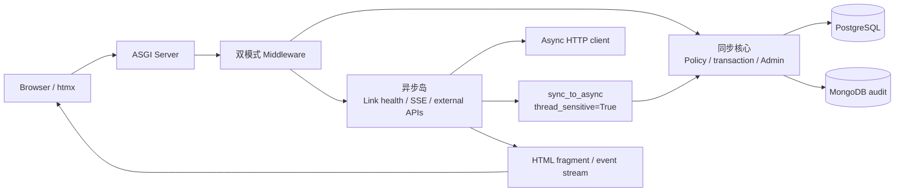

# Django 异步演进指南

> **文档权重**：84（跨模块异步试验路线与安全边界）
> **状态**：规划中；尚未切换 ASGI 部署，尚无生产异步 View
> **最后更新**：2026-07-21
> **目标**：以个人博客为实验场渐进学习 ASGI、异步 I/O 与流式交互，不以“全部 async”作为完成标准

## 1. 异步能为本项目带来什么

异步的核心收益不是让 Python 计算更快，而是在一个请求等待网络、数据库或流式客户端时，让同一进程继续处理其他连接。

| 能力 | 对 PowerAdapterBlogs 的实际价值 | 适合度 |
|---|---|---:|
| 并行外部 I/O | 同时检查多个友情链接、拉取 GitHub/音乐/文章元数据，耗时接近最慢的一项而不是所有项目相加 | 高 |
| 长连接 | 通过 SSE 提供检查进度、生成任务进度或实时状态，不需要浏览器反复轮询 | 高 |
| 取消与超时 | 浏览器断开时取消仍在等待的外部请求，并为第三方服务设置明确超时 | 高 |
| 高并发等待 | 用较少线程维持大量慢连接，适合流式输出和长轮询 | 中 |
| 异步生态学习 | 实践 ASGI、协程、任务组、异步 HTTP 客户端、连接池和背压 | 高（学习价值） |

异步不会自动改善以下问题：

- Django 模板、Markdown、图片解码等 CPU 工作不会因为 `async def` 变快。
- 普通 PostList 的主要成本仍是查询、缓存和模板渲染；低流量个人博客很难仅靠 async 获得可感知提速。
- async 不是后台任务队列。需要脱离请求、支持重试和持久化的工作仍应使用独立 Worker。
- htmx 2.x 与 async 相互独立：htmx 决定浏览器交换 HTML 的方式，ASGI 决定服务器如何调度等待中的连接。

## 2. 当前代码的真实边界

项目已经有 `PowerAdapterBlogs/asgi.py`，但生产入口仍以 `WSGI_APPLICATION` 和同步请求链为主。全面异步化前必须处理：

| 边界 | 当前事实 | 异步风险 |
|---|---|---|
| Middleware | `ClientMetaMiddleware`、`UserIdMiddleware` 使用 `MiddlewareMixin` | 同步 Middleware 会让 Django 为请求保留线程，抵消完整异步栈收益 |
| 请求用户上下文 | `accounts.thread_local` 使用 `threading.local()` | 协程并发时不能把线程等同于请求；应评估 `contextvars.ContextVar` |
| 写入工作流 | Post 状态 Service、生成命令和审核使用 `transaction.atomic()` | Django 5.2 的异步 ORM 尚不支持异步事务；必须保留同步事务函数 |
| 审计 | `pymongo.MongoClient` 与 HMAC 审计链是同步实现 | 直接放进事件循环会阻塞；只能桥接或另建异步 Adapter |
| 缓存 | 页面缓存与 `django-redis` 当前按同步 API 使用 | 需要确认客户端能力，不能只给 View 改名为 async |
| CBV | PostList/Category/Search 依赖 `ListView`、分页、Mixin 和模板响应 | 全量改造耦合较大，且收益弱于外部 I/O 试验 |

## 3. 目标架构：异步岛，而不是全站翻写

核心原则：

1. Policy 仍是唯一授权入口，异步 View 不复制权限条件。
2. 多步写入和行锁继续放在同步 Service 的单个事务中。
3. 只有真正等待外部 I/O 或维持长连接的路径才使用 `async def`。
4. 同步桥接必须包住完整函数，不跨线程传递数据库 connection、QuerySet 游标或线程敏感对象。
5. 禁止用 `DJANGO_ALLOW_ASYNC_UNSAFE` 绕过 Django 的数据安全保护。

## 4. 推荐的第一个实验

首选“友情链接健康检查 + htmx/SSE 状态流”，因为它同时覆盖有意义的异步知识，又不触碰文章权限和事务核心。

建议流程：

1. 浏览器请求一次健康检查。
2. 异步 Service 为每个链接设置连接/读取超时，并限制并发数。
3. 使用异步 HTTP 客户端并行请求外站。
4. 按完成顺序通过 SSE 推送状态，或在全部完成后返回 Django HTML fragment。
5. htmx 只负责触发和替换 HTML；无 JavaScript 时保留普通检查结果页。
6. 用户断开连接时捕获 `asyncio.CancelledError`，取消未完成任务并释放资源。

这项实验能实际学习：`async`/`await`、任务并发、超时、取消、限流、ASGI、流式响应和渐进增强。

## 5. 分阶段路线

### Phase A：建立基线

- 记录当前 WSGI 页面延迟、查询数、缓存命中率和并发基线。
- 选择并固定 ASGI Server 版本，优先评估 Uvicorn 或 Hypercorn。
- 在不改业务 View 的情况下启动 ASGI，确认静态文件、Session、CSRF、Admin、htmx 和错误页不回归。

### Phase B：请求链兼容

- 开启 `django.request` 调试日志，识别被 Django 适配的同步 Middleware。
- 将项目 Middleware 改为明确支持 sync/async 双模式。
- 用 `ContextVar` 取代请求级 `threading.local()` 前，先补并发隔离测试。
- 异步模式禁用 `CONN_MAX_AGE`，数据库连接池另行配置和压测。

### Phase C：第一个异步岛

- 实现友情链接并发检查和超时策略。
- 增加普通 HTTP 结果页，再增加 htmx/SSE 增强。
- 覆盖成功、超时、DNS 错误、TLS 错误、取消和部分失败。

### Phase D：按证据扩展

- 可考虑外部元数据聚合、生成任务状态和其他长连接功能。
- PostList/Search 只有在性能数据证明等待 I/O 是瓶颈时才评估异步 ORM。
- Post 创建、审批、驳回、修订和审计事务保持同步，直到 Django 提供完整异步事务能力且项目有明确收益。

## 6. 验收标准

- WSGI/同步回归测试继续通过，ASGI 新测试覆盖同一权限边界。
- 同一用户并发请求不会发生 request user 串线。
- 同步 Middleware 适配日志已清点，已知残留有明确理由。
- 外部请求具有连接超时、总超时、并发上限和取消处理。
- 断开客户端不会留下失控协程或未关闭连接。
- 异步端点不直接进入 `transaction.atomic()`，不调用 async-unsafe ORM 路径。
- 部署有回退到同步入口的步骤，且不要求修改数据库结构。

## 7. 后端对话 TODO

- [ ] **红色 / 高权重**：审计 `accounts.thread_local`、`RequestUserMiddleware` 与 `security.signals` 的请求身份传播；在引入并发 async View 前建立 `ContextVar` 方案和并发隔离测试。
- [ ] **红色 / 高权重**：固定异步写入边界；Post/Comment 审批、修订、权限复检与 MongoDB HMAC 审计继续由同步事务 Service 完成。
- [ ] **黄色 / 中权重**：选择 ASGI Server 与 async HTTP client，检查许可证、维护状态、超时/连接池能力并锁定版本。
- [ ] **黄色 / 中权重**：逐项审计 Middleware 的 sync/async 能力，并记录 Django 的 handler adaptation 日志。
- [ ] **黄色 / 中权重**：设计 ASGI 数据库连接策略；异步模式关闭 `CONN_MAX_AGE`，评估 PostgreSQL 连接池。
- [ ] **黄色 / 中权重**：为友情链接检查定义 SSR 回退、htmx fragment 和 SSE 三种响应契约。
- [ ] **绿色 / 低权重**：在基线数据后评估 PostList/Search 是否值得使用异步 ORM；没有证据时保持同步。
- [ ] **绿色 / 低权重**：评估生成任务进度流，把真正的后台执行与 SSE 状态传输分开设计。

## 8. 官方参考

- [Django 5.2 异步支持](https://docs.djangoproject.com/en/5.2/topics/async/)
- [Django 5.2 ASGI 部署](https://docs.djangoproject.com/en/5.2/howto/deployment/asgi/)
- [Django 异步 QuerySet](https://docs.djangoproject.com/en/5.2/topics/db/queries/#async-queries)
