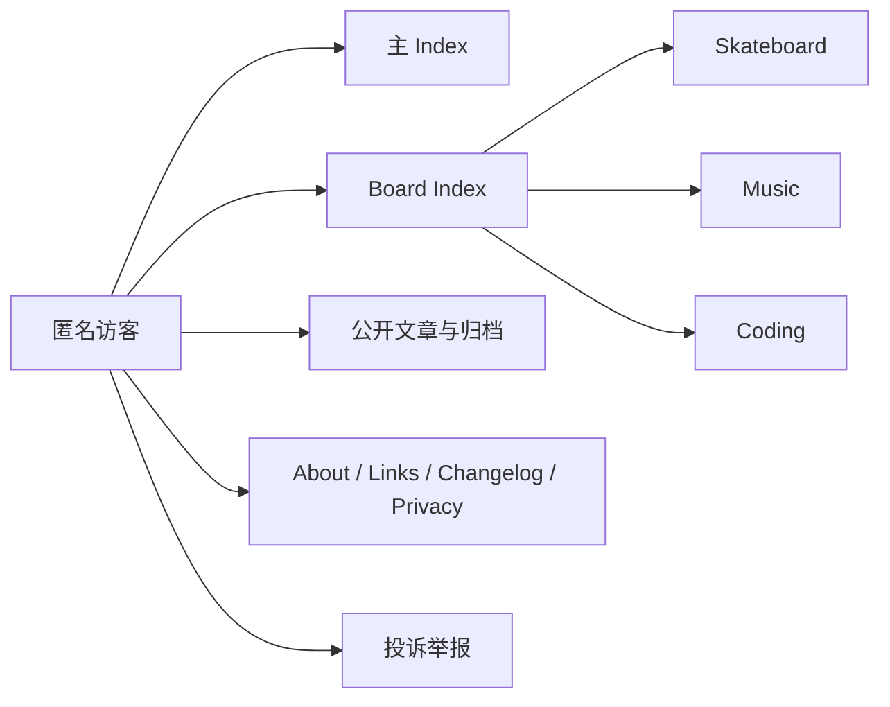
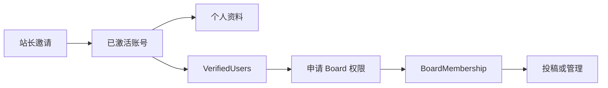
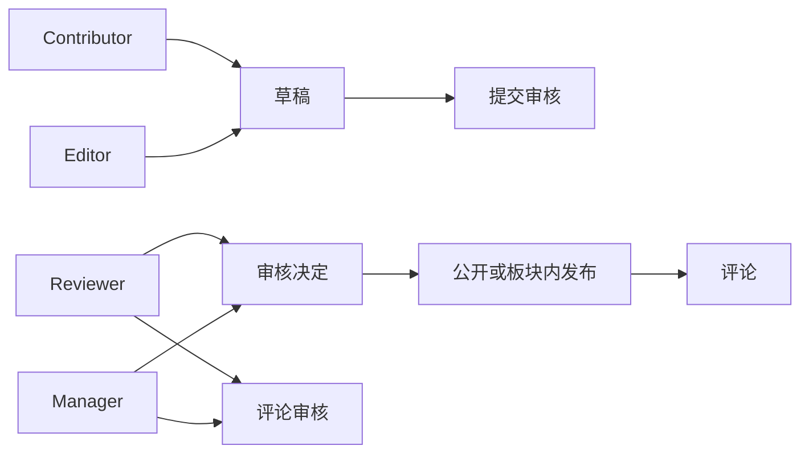
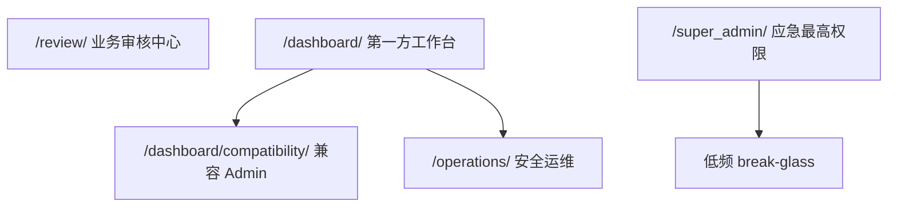
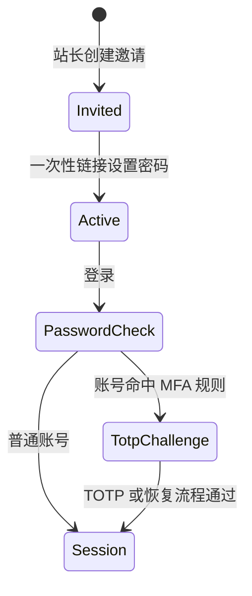
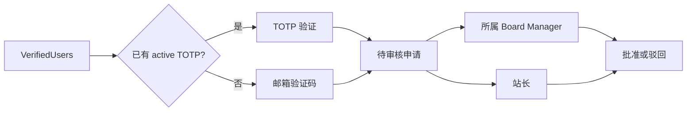
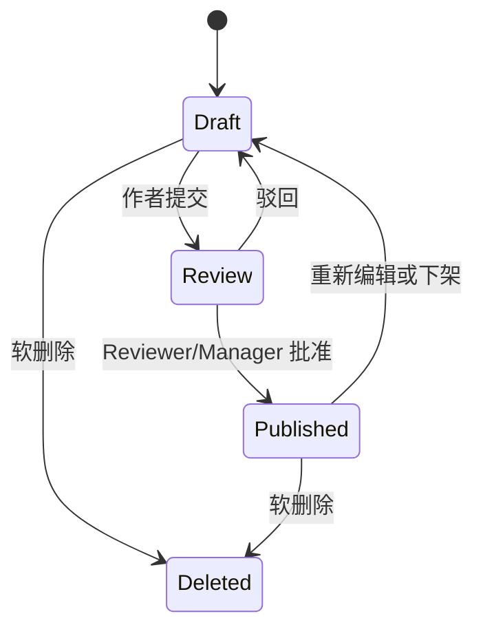
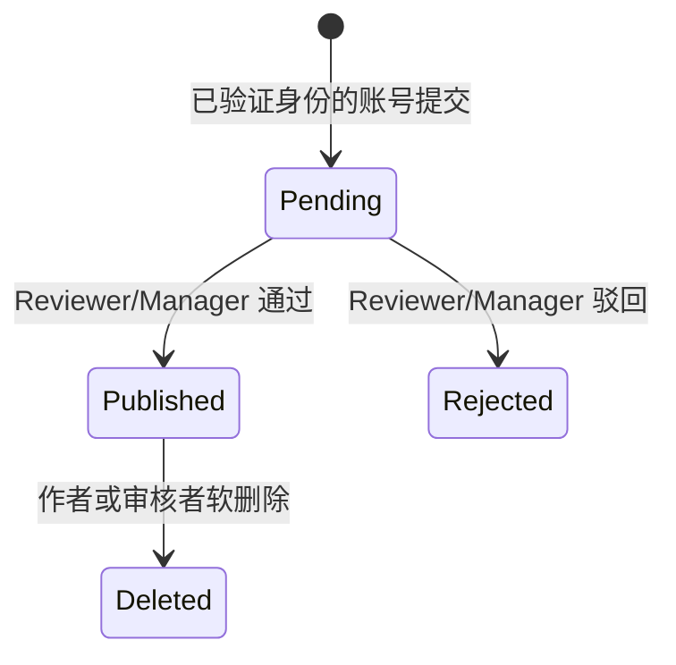
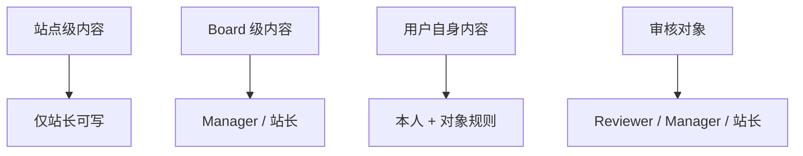
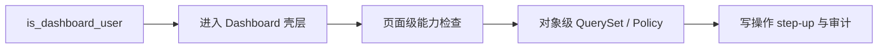

# PowerAdapterBlogs 功能逻辑与治理边界

> **文档权重**：88（跨 App 功能现状、角色边界与整改顺序）
> **职责**：描述当前代码实际如何工作，并标出目标规则与尚未收口的逻辑问题
> **更新时间**：2026-08-30
> **事实优先级**：用户当前决定 → 代码、迁移与测试 → 本文 → 各 App 历史文档

本文不是页面清单，也不把视觉完成等同于业务完成。每项功能均区分：

- **当前实现**：代码现在真实执行的行为；
- **目标边界**：项目希望长期维持的规则；
- **缺口**：当前实现与目标之间仍需处理的逻辑问题。

状态标记：✅ 已实现且边界清楚；🟡 可用但边界或闭环不完整；🔴 当前可达的高风险问题；⬜ 尚未实现。

威胁等级单独使用 P0/P1/P2：P0 表示当前可达的越权、泄露、认证绕过或不可逆数据风险；P1 表示所有权/状态机不一致、第二套写入路径或合理配置变化后会形成安全问题；P2 表示只读占位、文档漂移、维护性或低规模体验问题。本轮曾发现并已修复 1 个 P0：兼容 Admin 向只有壳层权限的 Dashboard Operator 暴露全站 Django `LogEntry`。当前已知 P0 为 0。

---

## 1. 系统分层

### 1.1 公开站点层

公开层只负责观看、发现和发起举报。Board Membership 授予的是参与和治理能力，不能成为观看公开 Board Index、公开 Clip 或公开文章的前提。

### 1.2 身份与参与层

项目不开放公共注册。普通账号通过一次性邀请激活；`VerifiedUsers` 只表示具备申请资格，不直接获得任何 Board 内容权限。

### 1.3 内容与治理层

文章、评论和 Board 内容属于不同生命周期。文章走投稿审核流；评论走独立审核流；SK8、Music、Coding 的固定 Index 内容目前由 Board Manager 直接维护，不复用文章审核状态机。

### 1.4 控制面层

这些入口不能被统称为“后台”：

| 控制面 | 正确职责 | 当前状态 |
|---|---|---|
| `/review/` | 账号、稿件、评论、Board 申请等业务判断 | ✅ 已按能力显示入口并执行对象级 Policy |
| `/dashboard/` | 日常观测、跳转和少量受控工作流 | 🟡 第一方页面已成形，但多处仍为只读或占位 |
| `/dashboard/memberships/` | 全站 Membership 管理 | ✅ 独立 Permission、特权 Session、逐操作 TOTP step-up 与原因审计 |
| `/dashboard/compatibility/` | 尚未迁出的兼容 ModelAdmin | 🟡 需 Dashboard 壳层 + 真实模型能力；不再暴露全局操作日志 |
| `/super_admin/` | active superuser 的低频最高权限与应急入口 | ✅ mTLS + TOTP 强边界；不应成为日常工作区 |
| `/operations/security/` | 审计完整性查看与核验 | ✅ 由独立全局 Permission 控制 |

---

## 2. 角色与授权事实

### 2.1 规范术语

| 术语 | 本项目中的精确定义 |
|---|---|
| 站长（Site Owner） | 当前单站点部署中的 active superuser；拥有站点级内容与结构的最终决定权 |
| Dashboard Operator | active `is_dashboard_user`；只获得工作台壳层入口，不自动获得 Board、账号或安全能力 |
| 全局职责 | Django Group/Permission 表达的跨 Board 能力，如 UserManager、SiteOperator |
| Board 角色 | `BoardMembership(board, user, role, is_active)`；是板块内角色唯一事实来源 |
| Board Policy | 将账号状态、Board、Membership、对象归属与动作组合后的最终授权判断 |
| 固定 Board 内容 | SK8 Clip、Music Record/Artist、Coding Project/Principle/Experiment 等 Index 专属数据 |

`is_staff`、`is_dashboard_user`、`is_superuser` 不是三个逐级递增的角色。它们必须保持独立语义；尤其不能把 `is_dashboard_user` 当作“可修改所有业务对象”。

### 2.2 Board 角色能力

| 动作 | Contributor | Editor | Reviewer | Manager | 站长 |
|---|:---:|:---:|:---:|:---:|:---:|
| 查看公开内容 | ✅ | ✅ | ✅ | ✅ | ✅ |
| 创建板块文章 | ✅ | ✅ | — | ✅ | ✅ |
| 编辑自己的草稿 | ✅ | ✅ | — | ✅ | ✅ |
| 编辑自己非草稿文章 | — | ✅ | — | ✅ | ✅ |
| 编辑他人文章 | — | — | — | ✅ | ✅ |
| 查看所属 Board 审核队列 | — | — | ✅ | ✅ | ✅ |
| 审核自己的文章 | — | — | — | — | ✅（应急例外） |
| 审核他人文章/评论 | — | — | ✅ | ✅ | ✅ |
| 管理 Board 成员 | — | — | — | ✅ | ✅ |
| 管理固定 Board Index 内容 | — | — | — | ✅ | ✅ |
| 创建/删除 Board、改变 slug/模板绑定 | — | — | — | — | ✅ |

当前固定 Board 内容使用 `can_manage_board_content()`，实际等价于 Manager 的 Board 设置能力。这是有意边界，不应因为模型带有 `owner` 或编辑按钮而放宽给所有 Editor。

---

## 3. 账号与安全流程

### 3.1 邀请与登录

当前实现：

- ✅ 关闭公共注册，使用 24 小时一次性邀请；
- ✅ 登录失败按用户名与客户端来源限流；
- ✅ 普通资料页与资料编辑只处理本人数据；
- ✅ 改密先做短时邮箱验证，再验证旧密码；
- ✅ 特权账号使用 TOTP；`/super_admin/` 还要求可信客户端证书；
- ✅ 新建但尚未绑定 TOTP 的账号不会被错误卡死在无法完成的 TOTP 挑战中。

### 3.2 Board 权限申请

当前实现：申请提交已遵循“有 TOTP 则优先 TOTP，否则邮箱验证”。审批后原子更新 `BoardMembership` 并保留申请与事件历史。

✅ **AUTH-01（P1，已解决）：** `withdraw_membership` 已与申请流程统一：已有 active TOTP 时必须使用 TOTP 且不能在退出流程中降级；忘记或丢失验证器时必须先通过账户恢复取消原 TOTP，设备不再 active 后才允许邮箱短时授权。step-up 前先检查本人、状态、角色和待审申请，授权在写入前消费，事务服务再次加锁复核；失败限流、审计方式、本人边界与 Manager 禁止自助退出均有回归。

---

## 4. 内容功能逻辑

### 4.1 文章

| 能力 | 当前实现 | 缺口 |
|---|---|---|
| 公开列表、分类、标签、搜索、归档 | ✅ 只展示公开且已发布内容 | 无阻断问题 |
| RSS / Atom / Sitemap | ✅ 共用公开 QuerySet | 无阻断问题 |
| 创建、编辑、提交审核 | ✅ 使用 Board Policy | Dashboard 只提供列表和跳转，未形成完整编辑闭环 |
| 审核、发布、驳回 | ✅ `/Blogs/review/` 与 `/review/` 按 Board 范围执行 | 工作台没有内联状态动作 |
| 修订历史与 Diff | ✅ HTMX 片段并执行可见性检查 | 时间线无分页，低优先级 |
| 正文图片与封面 | ✅ 有安全校验与上传入口 | 🟡 `PostImage` 没有独立 CRUD/引用管理 |

### 4.2 评论

评论提交、限流、身份验证、作者删除和按 Board 范围审核均已接入 Policy。`/dashboard/comments/` 当前只是阅读队列并跳转 `/review/comments/` 执行写操作，这一分工安全但交互未闭环。

### 4.3 三个固定 Board

| Board | 公开展示 | 管理模型 | 管理权限 | 当前状态 |
|---|---|---|---|---|
| Skateboard | Homies、Line、公开 Clips、播放器与地图 | `SkateHomie`、`SkateClip`、`SkateClipMedia` | Manager / 站长 | ✅ 视频上传、校验、处理、派生资源、替换、去重与运维链路已成形 |
| Music | Spotify/Apple 周期、年度记录、Artists | `MusicRecord*`、`MusicArtist` | Manager / 站长 | ✅ CRUD、导入数据和头像已落在 `boards`；`music` App 文档已明确兼容壳职责 |
| Coding | Projects、Principles、Experiments | `CodingProject`、`CodingPrinciple`、`CodingExperiment` | Manager / 站长 | ✅ CRUD 已存在；工作台未提供聚合入口 |

固定 Board 并不是可由普通用户动态创建的论坛分区。新增 Board 还需要模板、视觉、静态资源、内容模型和 Category 映射，因此结构变更只允许站长，并且必须经过代码发布。

🟡 **BOARD-01（P2）：文章归属仍通过 `Board.category → Post.category` 间接推断。** Policy 会在 Category 对应零个或多个 Board 时 fail closed。新增 Board 前必须确保一对一映射；若未来需要跨 Board 文章，应显式建模而不是继续扩展隐式推断。

✅ **DOC-01（P2，已解决）：** `music/DEVELOPMENT.md` 已区分 `music` 兼容壳与 `boards` 中的真实 Music 模型、CRUD 和 Index 运行时。

---

## 5. 站点级页面的所有权

### 5.1 分类原则

站点级内容不是“谁创建谁拥有”的多人业务对象。Links、全站侧边栏、公开站点说明、全局设置等代表 PowerAdapter 本身，应由站长维护。

### 5.2 Links 当前问题

公开 `/links/` 只读取 `status=正常` 的记录，这部分逻辑正确。写入目前仅通过 `config.LinkAdmin`；模型却包含 `owner`，Admin 又继承通用 `BaseOwnerAdmin`，表达的是“后台用户只管理自己的友链”。

✅ **OWN-01（P1，已解决）：** Link 和 SideBar Admin 现在共用 `is_site_owner()` 显式 Policy，模块、查看、新增、修改、删除与 QuerySet 均拒绝非 active superuser。`owner` 仅保留为创建者审计元数据。

目标规则：

1. `/links/` 永远公开只读；
2. Link 的创建、修改、排序、隐藏和删除只允许站长；
3. 第一方入口应位于 `/dashboard/settings/links/` 或独立 Site Content 区；
4. 服务端必须显式检查 active superuser，不能只隐藏按钮；
5. `owner` 若保留，只作为审计创建者，不作为授权事实；若不再需要则通过迁移移除。

### 5.3 其他站点级资源

| 资源 | 当前实现 | 目标边界 | 问题编号 |
|---|---|---|---|
| `SideBar` | 显式 Site Owner Admin；支持可信站长自定义 HTML | 仅站长写；HTML 不接受普通用户输入 | ✅ OWN-02（P1，已解决） |
| About / Privacy | 模板随代码发布 | 仅代码变更，不做在线富文本编辑 | ✅ |
| Changelog | 受校验的 JSON 随代码发布 | 继续由发布流程维护，不进入 Dashboard CRUD | ✅ |
| 站点 settings | Dashboard 只读展示 settings.py 值 | 继续保持单一配置事实；若增加数据库设置必须逐项建模 | 🟡 DASH-05（P2） |
| 投诉举报 | 公众提交、随机编号查询；super_admin 处理 | 增加站长/受权 SiteOperator 的第一方处理队列 | 🟡 MOD-01（P2） |

---

## 6. 工作台现状与缺口

### 6.1 当前工作台不是完整 CMS

`/dashboard/` 的真实定位是“日常观测与跳转控制面”，不是所有模型的通用 CRUD：

| 页面 | 已完成 | 尚未完成 |
|---|---|---|
| Overview | 文章状态、待审评论、PV/UV、媒体数量、安全摘要、快捷入口 | 排期、风险分级、外部 uptime、存储容量等仍为空值 |
| Posts | 权限过滤、状态/搜索过滤、分页、编辑跳转 | 没有提交/批准/驳回/发布、修订查看等聚合动作 |
| Comments | 权限范围内队列与上下文 | 写操作仍跳转审核中心；无批量、风险标记、详情历史 |
| Audit | Membership 与文章流程事件聚合 | 不是完整安全审计；来源、筛选、分页和导出不完整 |
| Media | 文章正文图片与封面只读网格 | 不含 SK8 原片/派生资源、Music Artist 头像、Board 视觉；无引用和孤儿分析 |
| Site Settings | 展示少量运行配置 | 完全只读；Links、Sidebar、举报等站点级工作流未接入 |
| Memberships | 列表、筛选、授予、调权、停用、恢复、Manager 交接、事件历史 | PostgreSQL 真实并发演练仍应保留为上线维护项 |

### 6.2 工作台权限结构问题

正确顺序为四层：入口旗标 → 页面能力 → 对象范围 → 动作验证。当前导航、页面 View 与首页卡片已共用 Dashboard Capability Map，QuerySet 继续按 Board Policy 收窄。

✅ **DASH-01（P1，已解决）：** 导航、View、Overview 卡片和快捷动作已共用 `dashboard_capabilities()`；只有壳层旗标的账号可看 Overview，访问其他页面返回 403，Settings 仅站长可见。

🟡 **DASH-02（P2）：补齐真实闭环而不是复制 Admin。** 优先把常用判断动作接入第一方页面；低频模型操作继续留在兼容区或 super_admin，避免两套写入规则。

🟡 **DASH-03（P2）：统一媒体资产目录。** 应定义 Asset/Usage 的跨模型只读投影，再决定是否需要独立上传；不能把文件系统浏览器直接暴露为媒体库。

🟡 **DASH-04（P1，已降低暴露面）：逐步淘汰 `/dashboard/compatibility/`。** 兼容区现在同时要求 Dashboard 壳层与真实的 Post/Tag/站长能力，只有壳层旗标时不显示入口且直访被拒绝；全局 `LogEntry` 已移除。剩余 Post/Revision/Workflow 写入面在第一方闭环完成前保留，但不允许新模型进入。

### 6.3 文档漂移

根 `DEVELOPMENT.md` 仍把 `/dashboard/` 描述为自定义 AdminSite，并将 `is_staff` 解释为 `/super_admin/` 入口条件。当前代码实际为：

- `/dashboard/`：第一方 Devenir 工作台；
- `/dashboard/compatibility/`：`custom_site` 兼容 Admin；
- `/super_admin/`：应用层只接受 active superuser，并叠加生产 mTLS/TOTP；
- `is_staff` 单独存在不等于可以获得系统后台 Session。

✅ **DOC-02（P2，已解决）：** 根开发文档已区分第一方 Dashboard、兼容 Admin 与 super_admin，并纠正 `is_staff` / `is_dashboard_user` / `is_superuser` 三旗语义。

### 6.4 问题登记表

| 编号 | 等级 | 状态 | 修复/当前边界 | 回归证据 |
|---|---|---|---|---|
| COMPAT-01 | P0 | ✅ 已解决 | 兼容 Admin 不再注册全局 Django `LogEntry` | allowlist/注册表显式排除日志模型 |
| OWN-01/02 | P1 | ✅ 已解决 | Link/SideBar 共用显式 Site Owner Policy，非站长 QuerySet 为空 | Admin 全动作拒绝测试 |
| DASH-01 | P1 | ✅ 已解决 | 导航、View、卡片共用 capability map | shell-only 页面直访 403 且无越权链接 |
| AUTH-01 | P1 | ✅ 已解决 | Membership 退出强制 active TOTP；仅取消设备后允许邮箱恢复路径 | 成功、缺码、错码、锁定、降级拒绝、撤销后邮箱与审计方式测试 |
| DASH-04 | P1 | 🟡 持续收缩 | 需 shell + 真实模型能力；只有壳层时隐藏且拒绝直访 | 兼容入口与 registry 边界测试 |
| DASH-02/03/05 | P2 | ⬜ 产品迭代 | 只读/占位不会形成写入越权 | 每项必须选择完成闭环或删除占位 |
| BOARD-01 | P2 | ⬜ 需建模决策 | Category 零/多 Board 时 Policy fail closed | 未决定跨 Board 文章前不冒然加 `Post.board` |
| DOC-01/02 | P2 | ✅ 已解决 | Music 包边界、Dashboard 路由和三旗语义已同步 | 根/模块文档与代码一致 |

---

## 7. 整改优先级

### Phase A：P0/P1 站点所有权与授权收口（已完成）

1. 移除兼容 Admin 中对全局 Django `LogEntry` 的注册；
2. Link/SideBar 显式收口到 active superuser，`owner` 仅作审计字段；
3. 建立 Dashboard Capability Map，导航与 View 共用服务端判断；
4. 统一 Membership 申请/退出的 TOTP 优先 step-up；
5. 同步 Dashboard、compatibility、super_admin 与 Music 包边界文档。

验收点：普通 Dashboard Operator 即使拥有零散 Model Permission，也无法写 Link、SideBar 或站点设置；站长仍能完成维护。

### Phase B：工作台形成闭环

1. Posts 增加受 Policy 保护的常用流程动作与修订入口；
2. Comments 在工作台完成单条审核，或明确永久只做跳转并简化重复页面；
3. 建立投诉举报处理队列；
4. 媒体库纳入文章、SK8、Music 的统一只读资产视图与引用状态。

验收点：日常操作不需要进入 super_admin；同一写动作只有一套 Service/Policy，工作台与审核中心不复制状态机。

### Phase C：兼容面收缩

1. 盘点 `/dashboard/compatibility/` 每个已注册模型；
2. 已有第一方闭环的模型从兼容 Admin 移除；
3. 保留仅站长低频处理的模型，或迁入明确的 Site Content 页面；
4. 更新路由、文档和回归矩阵。

验收点：兼容区不再是“找不到入口时就注册一个 ModelAdmin”的兜底方案。

### Phase D：长期增强

1. 评估显式 `Post.board`，避免长期依赖 Category 隐式归属；
2. 数据量增长后再增加 Dashboard 分析、通知、排期和导出。

---

## 8. 新功能接入检查表

每个新页面或动作必须先回答：

1. 它属于站点级、Board 级、用户自身还是审核对象？
2. 谁能看，谁能写，匿名访问是否合理？
3. 入口旗标、页面 capability、对象 Policy、动作 step-up 分别是什么？
4. 写操作是否复用唯一 Service，而不是在 View/Admin 中复制状态机？
5. 是否留下业务事件或安全审计，是否避免记录敏感值？
6. 是否需要第一方工作台入口，还是应随代码发布？
7. 是否新增了第二套管理入口；若是，旧入口何时移除？
8. 模板隐藏按钮之外，服务端是否有对应拒绝测试？

当这些问题没有答案时，不应先做“看起来可用”的 Dashboard 卡片或 CRUD。
