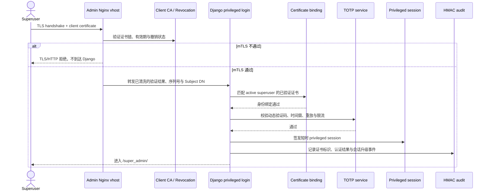
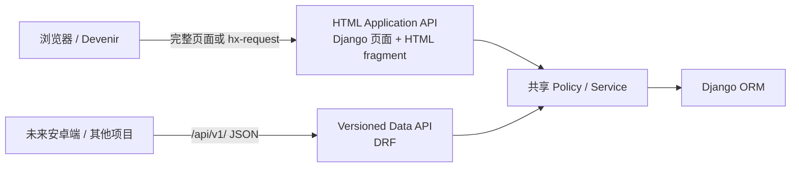
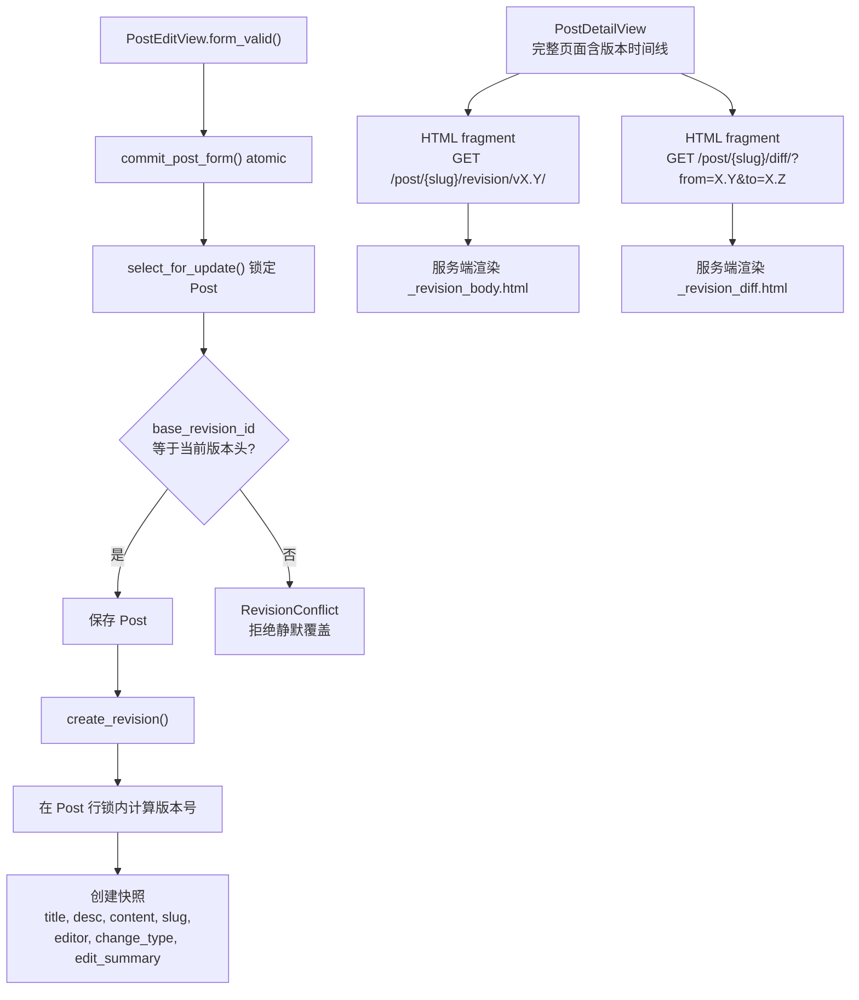

# PowerAdapterBlogs V2 — 开发指南

> **文档权重**：100（最高；项目当前版本、架构与路线的首要依据）
> **版本**: v2.4-planning
> **更新**: 2026-07-29
> **状态**: Board Scope Stage 0–6b 已完成，Stage 7 正在进行入口收敛与遗留 `is_reviewer` 零授权读取验收；`/review/` 已成为账号、板块权限、稿件、评论审核的统一业务入口，`/dashboard/` 仅供显式 `dashboard_user` 与 superuser 日常运维；MFA/mTLS 生产开关默认关闭，待真实设备、Client CA、独立管理 vhost 与 break-glass 演练
> **继承**: V1 基础设施（Redis、Waitress/Nginx）+ Devenir 主题 + htmx 2.x

---

## 0. V2 需求总览与优先级

| 优先级 | 需求 | 类型 | 预计工时 |
|--------|------|------|---------|
| **P0** | MongoDB 日志完整性修复 | 🐛 Bugfix | 3-4h |
| **P1** | 文章修订追踪 · Phase 1（后端） | ✨ Feature | 6-8h |
| **P2** | 文章修订追踪 · Phase 2（前端） | ✨ Feature | WebStorm 完成 |
| **P3** | Boards 首页板块管理 + Glitch 颜色效果 | ✨ Feature | 2-3h |
| **P4** | Dashboard 批量分行 Action + rewrap_posts 命令 | ✨ Feature | 1-2h |

> **前端说明**：前端（devenir 主题、timeline CSS/JS）在 WebStorm 中独立完成，不在本指南后端范围内。

### 0.1 v2.4—v2.5+ 路线

| 版本 | 目标 | 主文档 |
|---|---|---|
| v2.4 | accounts 管身份/全局 Group，boards 管 Membership/申请审批/跨 App Policy；Board 创建仅限 superuser | `accounts/PERMISSIONS_GUIDE.md` |
| v2.4 | 个人博客基础体验：Profile、密码修改、About/隐私、归档、Feed、SEO 与错误页 | `docs/guides/BLOG_FOUNDATION_GUIDE.md`（本地，git-ignored） |
| v2.5 | superuser 证书绑定 + TOTP、Board Manager 强制 TOTP；`/super_admin/` 增加 Nginx mTLS 边界验证 | `accounts/SECURITY_ROADMAP.md` |
| v2.5+ | 密钥产生、分发、存储、使用、更新、归档、撤销、备份、恢复和销毁 | `accounts/SECURITY_ROADMAP.md` |
| v2.6+ 候选 | ASGI 基线、异步 Middleware 审计与友情链接异步岛 | 本地试验规划（不入库） |
| v2.6+ 候选 | Passkey、外部 IdP/Entra 或合规密码设备 | 需求成熟后再立项 |

复杂功能可以后移；只有在前置测试、恢复方案和回滚路径提前成熟时才允许前移。v2.1 内容模型对接仍由另一项目完成后再推进，不与本路线强绑定。

#### v2.5 特权账户强认证边界（TOTP 与 mTLS 应用侧已实现；真实 CA/网关仍待验收）

superuser 的目标链路为“受信客户端证书 + TOTP 动态验证码”；首轮实现默认仍保留密码校验，形成 mTLS、应用身份和 TOTP 三道独立闸门。只有完成威胁模型、恢复流程和兼容性测试后，才单独评估是否允许证书 + TOTP 的无密码登录。Board Manager 首期只强制 TOTP，不强制客户端证书，避免把板块协作入口和站点最高权限入口混成同一门槛。

证书与 TOTP 明确分离：管理域名的服务器证书继续使用 Let’s Encrypt；superuser 客户端证书由离线私有 Client CA 签发，不复用公网服务器证书。H3 生产链正式固定为 Nginx + OpenSSL 4.0.x 最新补丁版终止 TLS 1.3 mTLS，再由 Django 完成证书映射、密码和 TOTP；初始部署基线为 OpenSSL 4.0.1，并接受其非 LTS、需持续跟进补丁和在 EOL 前迁移的维护成本。主流浏览器可直接使用系统证书容器，不依赖国密浏览器。审计事件继续使用现有 SM3-HMAC 完整性链。SM2/TLCP 降为不接生产、不计入 H3 验收的隔离实验，TOTP 保持 RFC 6238 与 Microsoft Authenticator 兼容。

`/super_admin/` 的 mTLS 推荐使用独立管理域名 / Nginx `server`，例如 `admin.poweradapter.xyz`；公网站点不再直接暴露该路径。原因是 Nginx 的 `ssl_verify_client` 作用域为 `http` / `server`，直接在现有站点打开会影响整站 TLS 握手。若暂时只能复用同一域名，必须采用 `ssl_verify_client optional` + location 强制校验，并先验证普通博客访问不会持续弹出客户端证书选择框。



这里的证书绑定与 mTLS 是两层：Nginx 判断“证书是否由受信 CA 签发且当前有效”，Django 再判断“该证书是否绑定到当前 active superuser”。禁止仅凭可伪造的普通请求头授予权限；Nginx 必须覆盖/清除外部同名头，Gunicorn 仍只通过本机 Unix socket 接收请求。客户端证书的签发、分发、续期、吊销、丢失恢复和销毁纳入 v2.5+ 密钥生命周期，不允许成为无人能恢复的单点锁。

截至 2026-07-29，`accounts_linear` Stage 4–5 已把 Board/Post/PostRevision/Comment 的各入口接入 `boards.policies`，Stage 6a 已初始化固定全局 Group，Stage 6b 已实现权限申请、分级审批与 Membership 自动写入。Stage 7 已移除 superuser/测试账号对 `is_reviewer` 的默认赋值和 Admin 分配入口，并以回归测试固定“旧旗标为真仍不产生工作台、Board 或全局权限”；数据库字段及模型层防篡改保护保留到用户完成一次生产等价的本地/预发布角色流程验收，不要求先部署服务器，之后才进入 Stage 8 删除迁移。

生产运维入口采用 Tailscale：管理员或 Agent 先进入受控 Tailnet，再以专用非 root 账号通过 SSH key 登录并按需 `sudo`。公网安全组不得为临时 Agent 出口长期开放 SSH，也不得通过放宽云主机安全地区/IP 白名单消除告警；云控制台仅作为 break-glass。Tailscale 负责运维网络入口，不能替代 `/super_admin/` 的 TLS 1.3 mTLS、Django 密码和 TOTP 身份验证。

BoardAccessRequest 提交前复用 accounts 短时邮箱验证已完成：purpose、用户与 Session 三重绑定，密码修改和 Board 申请授权不可互用，发送限流按账号共享，10 分钟 Board grant 在申请成功后立即消费。剩余缺口按风险排队：🟡 三个 Board Index 接入按 Policy 过滤的文章入口/文章流；🟡 Skateboard Clip 固定为每组 1 个 `9:16` 竖屏与 3 个 `16:9` 横屏并在模型/表单验证版式；🟡 `/dashboard/` 为各 Board 提供仅管理所属文章和专属内容的工作区。详细验收与职责边界记录在 `boards/DEVELOPMENT.md`。

Board Index 的访问边界已重新冻结：`/boards/<slug>/` 及其纯展示 htmx 片段是个人站的公开陈列面，不要求 BoardMembership；Membership 只保护投稿、编辑、审核、评论管理、成员管理和专属内容维护等动作。Index 后续先由 K3 补齐对应 Category 的公开文章入口与参与 CTA，且不得修改后端；前端完成后再由后端接入公开文章 QuerySet、申请预选及受保护动作的 403/REFUSE 流程。详细矩阵和前后端契约见 `docs/guides/BOARD_CONTENT_VISIBILITY_GUIDE.md`（本地，git-ignored）。

2026-07-29 的体验补丁已补齐 Board 申请提交后的 Devenir 中央确认层（一次性显示，明确“等待审核或联系管理员”），并新增 `/Blogs/review/` Board-scoped 稿件流程工作区。工作区只列出当前账号、当前 Board、当前状态真正允许执行的转换，将“草稿→提审”“审核中→通过/驳回”“已发布→下架”拆开；“可下架”栏支持 Board、Tag、作者和标题/摘要组合筛选，并以每批 8 篇的签名游标通过 htmx 懒加载，不执行传统分页总数 COUNT。它不替代后续按 Board 管理全部专属内容的完整工作区。

后台加固主线不被 Stage 7 清债阻塞：H2a 已完成 AES-256-GCM encrypted-only 设备、10 分钟绑定页、Microsoft Authenticator QR、一次性恢复码、原子消费、撤销/密钥擦除和 HMAC 审计；敏感页面均 `no-store`。H2b 已完成密码后置 pending challenge、新时间步防重放、账号与账号+IP 双维共享限流、恢复受限重绑状态、15 分钟 privileged Session，以及 `/dashboard/`、`/super_admin/` 双入口保护。强制对象为 active superuser、显式 `dashboard_user` 与 active Board Manager；其中 Board Manager 不再仅因 Membership 获得 `/dashboard/` 入口。代码默认 `MFA_ENFORCEMENT_ENABLED=false`，不得在未执行 readiness 与人工恢复演练前开启。

Stage 7 的管理入口采用两维模型：Django Group 仅包含 `VerifiedUsers`、`UserManagers`、`SiteOperators` 等全站职责；Contributor、Editor、Reviewer、Manager 只存在于带 Board 外键的 `BoardMembership.role`。因此 Django 用户编辑页不出现 `Board Manager` Group 是预期行为，不能通过新增全局 Group“补齐”。

#### 邀请制账号决策（2026-07-26）

本站是小规模个人站，不开放匿名公共注册。superuser 在 `/super_admin/` 中只填写用户名和邮箱，系统创建未激活且没有可用密码的账号，并在数据库提交成功后发送一次性邀请。受邀者通过邮件自行设置密码；激活事务同时加入已绑定 `boards.apply_board_access` 的 `VerifiedUsers`，但不自动获得任何 Board CRUD。重新发送邀请会使旧链接失效，邀请默认 24 小时过期。

邮件传输、模板和公网基址可以继续供投稿审核提醒复用；邀请 Token、账号状态转换和 Board 审核通知不得共用业务逻辑。投稿提醒仍是后续邮件阶段任务。

#### blog_foundation_linear（2026-07-26，推进中）

按当前用户优先级，在 Stage 6a 前插入个人博客基础体验补全。F0 已冻结边界；F1 已实现公开作者 Profile、本人资料编辑及带邮箱短时验证的密码修改；F2 已补齐 About、隐私说明和全局入口；F3 已实现公开年月归档、RSS/Atom 与统一公开文章 QuerySet helper；F4 已接入 canonical/Open Graph、Feed 自动发现、robots、公开 Sitemap 与生产错误页；F5 已按 RFC 9116 发布 `security.txt` 并补齐上线检查清单。该路线 F0–F5 与 accounts Stage 6a–6b 均已完成，Stage 7 旧授权字段观察已经开始。该路线不开放公共注册，也不加入关注、点赞、私信或社区排行榜。详细字段、App 职责、权限矩阵和验收标准以 `BLOG_FOUNDATION_GUIDE.md`（本地 docs/，git-ignored）为准。

#### 2026-07-27 三分支并行决策

当前稳定基线完成后从同一提交派生三个分支：

| 分支 | 所有者 | 范围 | 禁止交叉修改 |
|---|---|---|---|
| `codex/admin-hardening` | Codex | Stage 6a/6b 前置权限身份、特权认证、Session、审计与 mTLS 应用侧契约 | 不实现 Board Index 视觉，不修改其专用模板/CSS |
| `codex/board-back` | Codex | Board Index 内容模型、分派视图、路由、Admin、迁移与种子数据；与 `Board`/`BoardMembership`/Policy 边界 | 不修改 MFA/特权认证相关代码（属 admin-hardening） |
| `codex/board-index-k3` | Kimi K3 | 各 Board 独立 Index 的 Devenir 模板、CSS、展示脚本与空态 | 不修改 Python、Migration、Policy、URLConf、Admin、API 或权限测试 |

三个分支必须使用独立 worktree。后台先冻结只读上下文契约，K3 只消费契约；最终先合并后台数据/权限边界（`board-back`），再合并前端模板（`board-index-k3`），导航与路由由集成方最后接线。具体 HANDOFF 属于本地 Agent 交接材料，不纳入 Git；长期有效边界必须回写本指南或对应 App 文档。

#### Git 分支与多 Agent 交接强制规范（2026-07-29）

将工作交给其他 Agent 前，当前主 Agent **必须先询问用户**，并一次说明目标 Agent、任务范围、基线分支及 commit SHA、拟创建的新分支名、worktree 路径和禁止修改范围。只有用户明确同意后，主 Agent 才能创建新分支；未获确认时不得创建、复用、重建或删除任何分支/ref，也不得让接收任务的 Agent 自行处理 Git 分支。

强制执行以下边界：

1. 每次跨 Agent 交接使用新的 `codex/<task>` 分支和独立 `.local/worktrees/<task>/`；不得为了省事复用陈旧分支，也不得让两个 worktree 检出同一分支。
2. 分支只能从用户已确认的**已提交**基线 SHA 派生。工作区未提交修改不会进入新分支；若任务依赖这些修改，必须先向用户说明并确认是提交、延后交接，还是只让对方读取主工作区的本地 Guide。
3. 同一时刻只允许一个 Agent 写 `.git` 元数据。创建者先保存 refs/worktree 快照，再分两步执行“创建 branch ref → 核验所有既有 refs 未变化 → 挂载 worktree”；禁止用 `git worktree add -b` 把两个动作合并。
4. 接收任务的 Agent 只能在获分配的 worktree 和允许目录内修改文件；不得运行 `git branch`、`git switch -c`、`git worktree add/remove/prune`、`git update-ref`、`git pack-refs`、`git gc/prune`，不得直接写 `.git/`。
5. 若出现 ref 不落盘、HEAD 为 `0000000`、分支突然 `[gone]` 或 Git 把全仓库显示为新增，立即停止所有 Git 写操作并报告；禁止通过反复重建、`reset`、`checkout`、`clean` 或手写 ref 试错。
6. 创建完成后必须核验主工作区 HEAD/状态、全部 `refs/heads/codex/*` SHA 和 `git worktree list --porcelain`；发现非目标 ref 变化时，本轮交接失败，不得继续编码。
7. 提交消息使用英文，并按项目提交 skill 检查范围、文档、测试和敏感文件；提交、推送、合并和分支删除仍分别服从用户授权，不因“已允许创建分支”而自动扩大权限。

2026-07-29 曾发生 `.git/refs/heads/codex/` 整个命名空间丢失：commit 对象和工作区文件仍完整，最终通过 reflog 核验后用 `git update-ref` 恢复。删除来源未被证明，不能把 Agent 沙箱中“写入未持久化”直接归因于 IDE、杀软或外部进程。详细预检、快照、恢复和验收命令见 `docs/guides/GIT_AGENT_WORKFLOW_GUIDE.md`（89，本地、git-ignored）。

> **Board 分支历史基线（2026-07-28）**：`codex/board-back` 的 Board Index 后端已落地（内容模型合并入单一 `boards/models.py`、固定 Board 归属由 Model 层强制、分派视图与路由、数据保留型音乐扁平化迁移）。内容种子数据（`seed_board_index`，Faker 驱动，幂等+`--reset`）已补齐；Music 叙事区（Yearly 大数字 / Monthly bars / Cross-Scale / Companion / Gravity）已全量数据驱动，模板硬编码 mock 与 `` 假数据分支已清除，死脚本 `music-mock-data.js` 已删除。该分支当时通过 system check、迁移漂移检查、100 项 Board/全局角色回归及 215 项全项目测试；其中当时跳过的 16 项 MFA 契约骨架现已由 H2 可执行测试取代，不能作为当前 MFA 状态依据。

### 0.2 前端架构决策：Devenir HDA，不做全面分离

> **决策日期**：2026-07-13
> **结论**：浏览器端继续采用 Django Template + htmx 的 Hypermedia-Driven Application（HDA）模式，不把 Devenir 重写为消费 JSON 的独立 SPA。



这不是未完成的“半耦合”，而是有意选择的服务端驱动架构：状态、权限与可执行操作由服务端决定并编码在 HTML 中，htmx 负责局部交换，JavaScript 只增强视觉和复杂控件。

#### 浏览器端约束

1. htmx 端点默认返回 HTML fragment，不返回 JSON 后再由前端拼接 DOM。
2. 普通请求优先保留完整页面或 POST/Redirect/GET 回退，不能把可用性完全绑定到 JavaScript。
3. HTML、Admin、API 必须共享 Policy / Service，禁止在模板或前端复制授权规则。
4. Devenir 的页面结构、SEO、Session、CSRF 和表单验证继续由 Django 负责。
5. 复杂前端状态仅限编辑器、动画、图表等确有必要的局部组件，不为简单 CRUD 引入 SPA 状态层。

#### JSON API 边界

DRF 是给程序消费的 Data API，不作为 Devenir 的内部渲染依赖。只有出现真实的安卓客户端、第三方消费者、离线工作流或独立前端团队时，才评估扩大 `/api/v1/`；届时必须版本化并保持兼容。

当前 API 尚不能作为分离式前端基础：

| 严重度 | 现状 | 后续要求 |
|---|---|---|
| ✅ | `CategoryViewSet` 原使用无显式权限的 `ModelViewSet` | Stage 5 已改为 `ReadOnlyModelViewSet`，只返回当前用户可见文章关联的分类 |
| ✅ | `PostViewSet` 原使用不理解 BoardMembership 的 `IsAdminUser` | Stage 5 已改为 Policy-scoped 只读 API；写方法明确返回 405，等待真实客户端需求后单独设计写入 Serializer/Service |
| 🟡 中 | API 仅覆盖 Post / Category，未覆盖评论、修订、Board 和权限申请 | 没有真实第二客户端前不补“为完整而完整”的通用 API |

#### 重新评估全面分离的触发条件

- 出现需要长期维护的第二客户端。
- 出现离线编辑、大量客户端状态或实时协同等 HDA 明显不适合的需求。
- 前后端由独立团队和发布周期维护。
- 经过度量确认服务端 HTML 是实际瓶颈，而不是数据库、缓存、静态资源或查询问题。

在这些条件出现前，全面分离属于额外复杂度，不列入 v2.4–v2.5+ 主路线。

参考：[htmx Documentation](https://htmx.org/docs/)、[Hypermedia APIs vs. Data APIs](https://htmx.org/essays/hypermedia-apis-vs-data-apis/)、[Hypermedia-Driven Applications](https://htmx.org/essays/hypermedia-driven-applications/)。

---

## 1. P0 日志完整性修复 ✅ 已完成

MongoDB 日志验证、集合配置和密钥加载已于 2026-06-22 完成；PostgreSQL
`SecureLogEntry` 的 JSON 类型漂移误报已于 2026-07-19 修复。日志完整性属于
`security` App 的已落地实现，不再作为当前 V2 路线的设计约束。

算法、历史签名升级、审计命令和剩余 `bulk_create()` 覆盖缺口统一维护在
[`security/DEVELOPMENT.md`](security/DEVELOPMENT.md)，本指南只保留版本级完成状态。

---

## 2. P1 Feature：文章修订追踪（Phase 1 · 后端）

### 2.1 设计理念

**核心思路**：普通读者只看文章，深度读者才关心你改了什么。因此修订历史不应是独立页面，而是**文章底部的一个轻量折叠组件**，读者需要时展开，不需要时完全无干扰。

### 2.2 版本号方案：文章 SemVer

继承企业级软件版本号思路，针对文章语境做轻量适配：

```
v{major}.{minor}
```

| 版本变化 | 含义 | 示例 |
|---------|------|------|
| `major` 递增，minor 归零 | 重大内容变更 | v1.0 → v2.0（新增整章、重构结构） |
| `minor` 递增 | 小幅修正 | v1.0 → v1.1（错别字、措辞优化、补充说明） |

> 编辑者在保存文章时选择"大版本"或"小修订"，系统自动计算版本号。

**对比**：原方案 `revision_number: 1, 2, 3...` 只有序号，无语义。新方案一眼知道改动规模。

### 2.3 交互设计

> **读者视角**：
> - 文章正文底部一行小字：`📝 v3.2 · 5 个版本 [展开历史 ▼]`
> - 点击展开 → CSS 竖排时间线（节点+连线）
> - 每条显示：版本号、日期、编辑摘要
> - 点击某条 → 展开该版本完整内容
> - 勾选两个版本 → 显示 diff 对比
>
> **不想看的人**：只有一行 14px 灰色小字，完全无干扰。

### 2.4 节点图可视化（CSS Timeline）

**Phase 1 采用纯 CSS timeline**，零依赖，效果类似 GitHub commit 列表：

```
●──── v3.2  2026-06-21  修正错别字
│
○──── v3.1  2026-06-18  补充性能测试章节
│
●──── v2.0  2026-06-10  重构引言、新增第三章
│
○──── v1.1  2026-06-05  修正排版问题
│
●──── v1.0  2026-06-01  初始发布
```

- **实心圆** = major 版本（`v2.0`），更大更亮
- **空心圆** = minor 版本（`v3.1`），较小
- **竖线** = `--accent-deep` 绿色（devenir 配色）
- **hover** = 节点发光 + 右侧滑入详情

> 后续 Phase 2 如需分支效果，可直接替换为 Mermaid gitGraph（纯前端 JS 渲染，后端 API 不变）。

### 2.5 数据模型

```python
class PostRevision(models.Model):
    post = models.ForeignKey(Post, on_delete=models.CASCADE, related_name='revisions')
    
    # 语义化版本号
    major = models.PositiveSmallIntegerField(default=1, verbose_name="大版本")
    minor = models.PositiveSmallIntegerField(default=0, verbose_name="小修订")
    version = models.CharField(max_length=16, editable=False, verbose_name="版本号")  # "3.2"
    
    # 内容快照
    title = models.CharField(max_length=255, verbose_name="标题快照")
    desc = models.CharField(max_length=1024, blank=True, verbose_name="摘要快照")
    content = models.TextField(verbose_name="正文快照")
    slug = models.SlugField(max_length=255, verbose_name="slug快照")
    
    # 版本元信息
    editor = models.ForeignKey(
        settings.AUTH_USER_MODEL, on_delete=models.SET_NULL, null=True, verbose_name="编辑者"
    )
    change_type = models.CharField(
        max_length=16,
        choices=[('major', '大版本'), ('minor', '小修订')],
        verbose_name="变更类型",
    )
    edit_summary = models.CharField(max_length=200, blank=True, verbose_name="编辑摘要")

    created_at = models.DateTimeField(auto_now_add=True, verbose_name="快照时间")

    class Meta:
        unique_together = ('post', 'major', 'minor')
        ordering = ['-major', '-minor']
        verbose_name = "文章修订"
        verbose_name_plural = "文章修订"
```

**相比原版 V2GUIDE 的变化**：
- `revision_number` → `major + minor + version`（语义化版本）
- `unique_together` 改为 `('post', 'major', 'minor')`
- 新增 `change_type` 字段
- 新增 `slug` 快照（防 slug 变更后历史链接失效）

### 2.6 版本号自动计算逻辑

```python
def get_next_version(post, change_type: str) -> tuple:
    """根据变更类型计算下一个版本号"""
    last = post.revisions.order_by('-major', '-minor').first()
    if not last:
        return (1, 0)  # 首版 v1.0
    
    if change_type == 'major':
        return (last.major + 1, 0)   # v1.3 → v2.0
    else:
        return (last.major, last.minor + 1)  # v1.3 → v1.4
```

### 2.7 快照集成点



### 2.8 htmx HTML 端点（实际实现）

修订交互属于浏览器 Application API，返回 HTML 而不是 JSON：

| 请求 | htmx 响应 | 普通请求 |
|---|---|---|
| `GET /Blogs/post/{slug}/revision/{version}/` | `_revision_body.html` | 使用历史版本内容渲染完整 `detail.html` |
| `GET /Blogs/post/{slug}/diff/?from=X.Y&to=X.Z` | `_revision_diff.html` | 当前仍返回相同 HTML 片段 |

时间线元数据由 `PostDetailView` 随完整页面一次返回，不再额外请求 JSON 版本列表。diff 严格只允许相邻版本，并优先读取写时预计算的 `diff_from_previous`。

### 2.9 Diff 渲染

使用 `difflib.HtmlDiff`（Python 标准库，零依赖）：

```python
import difflib

def render_diff(old_text: str, new_text: str, from_ver: str, to_ver: str) -> str:
    """生成 HTML 格式的 side-by-side diff，以内联片段返回"""
    differ = difflib.HtmlDiff(tabsize=4, wrapcolumn=80)
    return differ.make_table(
        old_text.splitlines(),
        new_text.splitlines(),
        fromdesc=f'v{from_ver}',
        todesc=f'v{to_ver}',
        context=True,
        numlines=3,
    )
```

### 2.10 响应与前端职责

服务端完成版本解析、可见性校验、相邻版本校验、diff 生成和 HTML 渲染；htmx 只把响应片段交换到 `#revision-viewer`。前端不保存独立的版本数据模型，也不使用 fetch 重建模板。

### 2.11 实施步骤（Phase 1 · 后端，✅ 已完成并经 R1 加固）

1. 创建 `PostRevision` 模型 → `python manage.py makemigrations`
2. 在 `PostForm` 中新增 `change_type` 和 `edit_summary` 字段
3. 在 `PostCreateView.form_valid()` 中通过 `commit_post_form()` 原子保存文章与 v1.0 初始快照
4. 在 `PostEditView.form_valid()` 中提交 `base_revision_id`，拒绝陈旧页面静默覆盖较新版本
5. 实现 `get_next_version()` 版本号计算，并在 `create_revision()` 中用 Post 行锁保护分配过程
6. 编写修订正文与 Diff HTML fragment 端点
7. `PostAdmin` 中注册 `PostRevision` 只读 inline
8. `clear_page_caches()` 中无需额外处理（快照不缓存）

### 2.12 Phase 2 · Devenir + htmx（✅ 已完成）

- CSS timeline 组件样式（竖线、节点、折叠）
- htmx 懒加载版本正文与相邻 diff
- 普通请求可渲染完整历史版本页面
- Devenir 响应式布局与全宽 diff
- 少量 vanilla JS 只负责折叠、scramble 和视觉增强
- 投稿表单显式渲染中文“可见性”；缺失值使用中文字段错误，不暴露 `visibility` 内部名
- 自定义封面保持可选；字段为空时按分类使用静态默认图，默认图不伪装成上传文件、不写入媒体目录
- 投稿或保存成功后使用 messages 提示并跳转文章详情；草稿/审核中详情与修订端点仅作者本人可见，且不计 PV
- 详情页 Edit 入口严格复用 `can_edit_post()`；上一篇/下一篇仅从当前用户可见的已发布文章生成，不泄露草稿标题

### 2.13 PostRevision 优化路线（R0–R4）

> **路线状态**：R0–R4 已完成并收束。该路线只加固 v2.0，没有提前启动由另一项目对接的 v2.1 内容唯一来源迁移。实现细节与验收入口见 [`Blogs/DEVELOPMENT.md`](Blogs/DEVELOPMENT.md#91-postrevision-r0r4-linear)。

| 阶段 | 状态 | 严重度 | 目标 |
|---|---|---|---|
| R0 | ✅ 已完成 | 🔴 高 | 增加版本分配、快照、Diff 转义、相邻比较、格式校验和唯一约束的特征测试 |
| R1 | ✅ 已完成 | 🔴 高 | `Post` 行锁保护版本分配；前台保存与快照同事务；用 `base_revision_id` 检测陈旧编辑 |
| R2 | ✅ 已完成 | 🟡 中 | `PostWorkflowEvent` 独立记录状态迁移并关联当时 revision；工作流失败同事务回滚；纯状态变化不再制造内容版本 |
| R3 | ✅ 已完成 | 🟡 中 | 新 revision 双写 Markdown 块/中英文句子/字符级结构化 Diff 与旧 HTML；展示优先结构化数据，未知 schema 或旧数据安全回退；105 项回归通过 |
| R4 | ✅ 已完成 | 🟢 低 | 任意正向版本比较、htmx 双栏/行内/统计模式、Devenir 服务端选择器与回滚/人工验收说明；108 项回归通过 |

R1 的并发保证分为两层：悲观行锁只覆盖短数据库提交，乐观版本头负责发现用户长时间打开编辑页后的陈旧提交。二者不能互相替代。

R2 的 `PostWorkflowEvent` 是供业务查询和 Dashboard 展示的状态历史；MongoDB HMAC 日志仍是独立的防篡改安全审计层。业务事件表不宣称具备密码学完整性。

R2 验收覆盖：状态迁移与事件同事务提交、事件写入失败时回滚状态、纯状态变化不创建内容 revision，以及 Dashboard 中工作流事件的 Board Scope 与只读限制。

R3 使用 `markdown-block-sentence-char-v1` 契约：数据库保存 JSON-safe 原始片段、统计与算法版本，渲染时统一 HTML 转义。`diff_from_previous` 在兼容期继续双写，既有数据无需立即回填；`backfill_diffs` 可按需补齐结构化数据且默认不覆盖已有旧 HTML。

R4 允许比较同一文章中任意两个不同版本，但参数必须保持“旧版本 → 新版本”。相邻版本复用 R3 预计算结果，跨版本在请求时构建结构化 Diff。三种展示模式均由 Django 渲染，htmx 只负责替换 fragment；文章可见性仍沿用 `can_view_published_post()`，STAFF_ONLY 不会因历史比较而绕过 Board Policy。

---

## 2A. v2.1 演进：PostRevision 成为内容唯一来源

> **状态**: 规划中；等待另一项目完成内容模型对接后再启动
> **目标**: Post 退化为纯元数据容器，PostRevision 成为内容唯一数据源  
> **影响**: 模型 + 视图 + 模板 + Admin + DRF serializer · 预计 4-6h

### 2A.1 架构变化

```
v2.0 (当前)                          v2.1 (目标)
─────────────                        ────────────
Post (内容主体)                       Post (纯元数据容器)
├─ title, desc, content, slug        ├─ status, category, tag, owner
├─ status, category, tag, ...        ├─ cover, pv, uv, visibility
└─ visibility                        ├─ current_revision FK → PostRevision  ← 新增
                                     ├─ created_time, update_time
PostRevision (历史快照)               └─ ❌ 移除: title, desc, content, slug
├─ title, desc, content, slug
└─ major, minor, version, ...        PostRevision (内容唯一来源)
                                     ├─ title, desc, content, slug  ← 唯一内容
                                     ├─ major, minor, version
                                     └─ editor, change_type, ...
```

### 2A.2 路由逻辑变化

```
v2.0:  GET /post/{slug}/
       → PostDetailView.get_object()
       → Post.objects.get(slug=slug)  ← 直接从 Post 取内容
       → 模板渲染 post.title / post.content

v2.1:  GET /post/{slug}/
       → PostDetailView.get_object()
       → Post.objects.get(slug=slug)  ← Post 只有元数据
       → post.current_revision.title / .content  ← 通过 FK 取内容
       → 模板渲染 (同上，前端无感)
```

### 2A.3 好处

| 方面 | 效果 |
|------|------|
| 数据一致性 | 不会再出现 Post 内容 ≠ 最新版本内容（因为 Post 不再有内容字段） |
| 版本完整性 | 每篇文章天然有完整版本链，不存在"当前版本未归档"的漏洞 |
| 回滚能力 | 切换 `current_revision` 即可实现文章回滚（Phase 3 功能） |
| 代码简洁 | 模板不需要关心内容来源是两个表还是一个表 |

### 2A.4 实施步骤

| # | 步骤 | 文件 | 注意 |
|---|------|------|------|
| 1 | Post 加 `current_revision` FK (nullable, `related_name='current_for'`) | `Blogs/models.py` | 先 nullable，data migration 后改 not null |
| 2 | Schema migration | `makemigrations` | |
| 3 | **Data migration**: 每篇文章 `current_revision = revisions.order_by('-major','-minor').first()` | `migrations/` | 必须先有 v1.0 快照，v2.0 P1 已保证 |
| 4 | **Data migration**: 如果 latest revision 内容 ≠ Post 当前内容 → 补建一个快照 | `migrations/` | 兜底：编辑后未保存快照的边缘情况 |
| 5 | `Post.save()` 新增逻辑：更新后自动设置 `current_revision` 为最新快照 | `Blogs/models.py` | |
| 6 | 所有视图改内容来源：`post.title` → `post.current_revision.title` 等 | `Blogs/views.py` | `PostDetailView` / `PostListView` / `SearchView` 等 |
| 7 | 模板改：`{{ post.title }}` → `{{ post.current_revision.title }}` | `themes/` | 所有引用 post.title/content/desc/slug 的模板 |
| 8 | `PostAdmin` fieldsets 改为从 current_revision 代理读取 | `Blogs/admin.py` + `adminforms.py` | |
| 9 | DRF `PostSerializer` 字段来源改为 `current_revision.*` | `Blogs/serializers.py` | |
| 10 | Post 移除 `title/desc/content/slug` 列 | `models.py` + migration | 最后一步，确认所有引用已迁移 |
| 11 | PostRevision `verbose_name` 去"快照" → 改为"文章版本" | `models.py` + migration | 语义对齐 |

### 2A.5 向后兼容性

| 功能 | v2.0 行为 | v2.1 行为 |
|------|----------|----------|
| 前台文章渲染 | `{{ post.title }}` | `{{ post.current_revision.title }}` |
| 搜索 (title+content) | `Q(title__icontains=...) \| Q(content__icontains=...)` | 通过 `current_revision` 跨表查询 |
| slug 路由 | `Post.slug` | `Post.current_revision.slug` (slug 变更在快照中体现) |
| 修订 API | 不变 | 不变 (PostRevision 表结构无变化) |
| RSS Feed | `post.title` | `post.current_revision.title` |

> 核心原则：**API 不变，模板微调，前端无感**。

---

## 3. 架构与文件组织

V2 新增/修改文件：
```
Blogs/
├── models.py              # + PostRevision
├── forms.py               # + change_type, edit_summary 字段
├── views.py               # PostCreateView/PostEditView 快照逻辑
├── urls.py                # + revisions/diff API 路由
└── revisions.py           # 新建：版本计算、快照、diff 渲染工具

security/
├── mongo_client.py        # 修改：+ verify_log/audit_all, 修复集合命名
├── models.py              # 修改：compose_message 改用 JSON
└── management/
    └── commands/
        └── audit_mongo_logs.py  # 新建：审计管理命令

PowerAdapterBlogs/settings/
└── base.py                # 修改：LOG_HMAC_KEY 环境变量化
```

### 数据库迁移注意事项

| 变更 | 影响 | 处理 |
|------|------|------|
| `PostRevision` 新增表 | 无破坏性 | 普通 migration |
| `SecureLogEntry.compose_message()` 改动 | 旧 HMAC 失效 | **data migration** 重算所有记录 |
| MongoDB collection 改名 | 旧数据需迁移 | 见 §1.4 |

---

## 4. 测试清单

- [x] P0: MongoLogger 写入正确的 `audit_logs` 集合
- [x] P0: `verify_log()` 正常日志返回 True，篡改日志返回 False
- [x] P0: `audit_all()` 返回正确的统计计数
- [x] P0: `LOG_HMAC_KEY` 开发环境有硬编码兜底，生产环境必须环境变量
- [x] P1: 创建文章 → 自动生成 v1.0 快照
- [x] P1: 编辑文章（小修订）→ 自动生成 v1.1 快照
- [x] P1: 编辑文章（大版本）→ 自动生成 v2.0 快照
- [x] P1: Post 保存与 revision 创建同事务回滚
- [x] P1: 陈旧编辑通过 `base_revision_id` 拒绝且不覆盖新内容
- [x] P2: 版本时间线按版本号降序随详情页返回
- [x] P2: htmx 正文与 diff 端点执行 STAFF_ONLY 可见性检查
- [ ] P2: Diff HTML 对中文/代码块/Markdown 的完整回归测试
- [ ] P1: slug 变更后，历史快照 slug 不受影响

---

## 5. V2 明确不做的范围

| 项目 | 决策 | 原因 |
|------|------|------|
| Devenir 全面前后端分离 / SPA 重写 | ❌ 不做 | 与当前 htmx HDA 路线相违，且没有真实第二客户端 |
| htmx 消费 JSON 再拼 DOM | ❌ 不做 | htmx 端点直接返回服务端渲染 HTML fragment |
| 为浏览器建设通用 JSON API | ❌ 不做 | 浏览器走 HTML Application API；JSON API 仅服务真实外部消费者 |
| diff 独立页面 `/post/slug/diff/` | ❌ 不做 | 采用嵌入式 htmx HTML fragment |
| Devenir 主题迁移 | ✅ 已完成 | 当前唯一启用主题，继续按 HDA 演进 |
| PostImage 模型 CRUD | ❌ 不做 | 已有但无视图，暂不启用 |
| music App 功能 | ❌ 不做 | 空壳，无计划 |
| 文章无变化跳过版本 | ❌ 不做 | 简化逻辑，编辑即保存 |
| 版本删除/回滚 | ❌ 不做 | 过度设计，Phase 3 再议 |
| 增量存储（只存 diff） | ❌ 不做 | 博客文章体积小，全量快照足够 |

---

## 6. 编码规范

### 6.1 Google Python 风格注释

本项目采用 **Google Python Style Guide** 注释风格，所有模块、类、方法、函数均需遵循。

#### 模块级 docstring

```python
"""一句话描述模块用途。

细节段落（可选），说明设计思路、限制条件、调用方注意事项等。
"""
```

#### 函数/方法 docstring

```python
def fetch_smalltable_rows(table_handle, keys, require_all_keys=False):
    """从 SmallTable 获取多行数据。

    没有该风格的函数说明（PEP 257）。细节写在后文，与参数之间空一行。

    Args:
        table_handle: open smalltable.Table 实例。
        keys: 要获取数据的字符串键序列。
        require_all_keys: 如果为 True，键缺失时抛出 KeyError。

    Returns:
        一个 dict，将键映射到对应的 table_handle 数据。
        如果 require_all_keys 为 False，缺失键不出现。

    Raises:
        IOError: 如果 table_handle 不可读。
    """
```

#### 类 docstring

```python
class SampleClass:
    """类的概要说明。

    更详细的描述（可选）。可包含使用示例：

    Example:
        >>> obj = SampleClass(123)
        >>> obj.public_method()
        'hello'

    Attributes:
        likes_spam: 布尔值，指示是否喜欢午餐肉。
        eggs: 统计已计数鸡蛋的整数。
    """

    def __init__(self, likes_spam=False):
        """初始化 SampleClass。

        Args:
            likes_spam: 初始化 likes_spam 属性。
        """
```

#### 管理命令 docstring

```python
"""
管理命令简要说明。
用法：python manage.py command_name [--option VALUE]
"""
```

#### 关键规则

| 规则 | 说明 |
|------|------|
| 第一行 | `"""` 后紧跟概要，不空行 |
| 空行 | 概要段落后空一行再写详细描述 |
| Args | 参数名 + 冒号 + 空格 + 类型/描述 |
| Returns | 返回值类型和含义，多类型用 `or` 分隔 |
| Raises | 每个异常一行，注明触发条件 |
| 中文 | 当前项目使用中文描述（便于团队理解） |

#### 示例对照

```python
# ✅ Google 风格
def _word_wrap(text: str, width: int = 80) -> str:
    """按单词边界对文本换行，提升行级 diff 颗粒度。

    规律：
    - Markdown 结构型行保持原样不换行
    - 普通段落按 width 个字符在单词边界处强制换行

    Args:
        text: 原始文本内容。
        width: 每行最大字符数，默认 80。

    Returns:
        换行后的文本字符串。
    """
```

```python
# ❌ 旧风格（需要逐步迁移）
def render_diff(old_text, new_text, from_ver, to_ver):
    """生成 HTML 格式 side-by-side diff
    使用 difflib.HtmlDiff（Python 标准库，零依赖）
    """
```

### 6.2 Pylint 配置

#### 安装

```bash
pip install pylint pylint-django
```

#### `.pylintrc` 配置文件

项目根目录创建 `.pylintrc`：

```ini
[MASTER]
# 使用 pylint-django 插件
load-plugins=pylint_django

# Django 项目：settings 模块
django-settings-module=PowerAdapterBlogs.settings.develop

# 忽略虚拟环境和缓存
ignore=.venv,venv,node_modules,__pycache__,migrations

# 并行检查（加速）
jobs=0

[MESSAGES CONTROL]
# 禁用的检查项（Django 项目常见豁免）
disable=
    C0114,  # missing-module-docstring
    C0115,  # missing-class-docstring
    C0116,  # missing-function-docstring（改为手动审查）
    R0903,  # too-few-public-methods（Django views/models 常见）
    R0801,  # duplicate-code（暂时关闭，后续分阶段开启）
    W0212,  # protected-access（Django _meta 常用）
    E1101,  # no-member（Django ORM 动态属性，pylint-django 已处理大部分）

[FORMAT]
# 每行最大字符数
max-line-length=100

# 缩进
indent-string='    '

[DESIGN]
# 参数数量警告阈值
max-args=8

# 方法/函数行数警告
max-locals=20

[BASIC]
# 变量名风格
good-names=i,j,k,ex,_,pk,id,url,db,ip,ok

# 类属性名
class-attribute-naming-style=any

# Django 的 objects 不应告警
const-naming-style=any
```

#### 运行方式

```bash
# 全项目检查
pylint Blogs/ security/ accounts/ comment/ config/

# 单文件检查
pylint Blogs/views.py

# 仅显示错误（跳过警告和约定）
pylint --errors-only Blogs/

# Git pre-commit hook 集成（可选）
# pylint --fail-under=8.0 Blogs/ security/
```

#### Google 风格兼容说明

| pylint 规则 | 与 Google 风格的关系 |
|------------|---------------------|
| `C0116` (missing-function-docstring) | 禁用以手动审查，Google 风格要求全部函数有 docstring |
| `R0903` (too-few-public-methods) | Django CBV / Model 常见，豁免 |
| `max-line-length=100` | Google 风格建议 80，本项目放宽到 100（Django 惯例） |
| `good-names` | `pk` `id` `db` `ip` 是 Django 项目中合法的短变量名 |

#### 迭代迁移计划

现有代码不要求一次性全部符合 Google 风格，按以下优先级逐步迁移：

| 优先级 | 目标 | 触发条件 |
|--------|------|---------|
| **P0** | 新建文件严格遵循 Google 风格 | 创建新模块/命令/视图时 |
| **P1** | 修改文件时顺带更新 docstring | 修改已有文件时 |
| **P2** | 全局 pylint 检查通过 ≥8.0 分 | 特性冻结前统一处理 |
| **P3** | 启用 `C0116` 严格检查 | P2 完成后 |

---

## 8. 前端效果库参考

> 候选库，尚未引入项目。记录于此供未来参考，避免遗忘。

### 8.1 glitch-text-effect · 已移除 ❌

| 项目 | 信息 |
|------|------|
| **原版本** | `1.0.2` (2025-08-06) |
| **移除原因** | ① overlay 遮罩方案与项目风格不统一 ② `glitch()` 忽略 `trigger` 参数 ③ 缺失 @keyframes 注入 ④ 效果对浏览器性能压力大 |
| **替换者** | 自研 rAF 批处理 scramble（§8.2），零外部依赖 |
| **移除日期** | 2026-06-22，已从 `package.json` 卸载 |

### 8.2 Post Detail Scramble · rAF 批处理内联解密 ✅ 已集成

| 项目 | 信息 |
|------|------|
| **风格参考** | KAMITSUBAKI STORY R&D DIV (`shuffle-text` + `<span class="shuffle trigger">`) |
| **实现方式** | 自研 `scrambleBlock()` — rAF 批处理 + 单文本节点更新，零 DOM 膨胀 |
| **触发方式** | IntersectionObserver，滚动到视口才开始解密 |
| **字符集** | `CHAR_POOL = '{}[]()<>;:=!&|/\\#@$%^*+-_0123456789abcdef<>?`~'`（代码符号风） |
| **优化** | ① rAF 批处理替代 n 个 `setTimeout`（1000 字符块从 ~3000 个 timer → 1 个 rAF loop） ② 单文本节点替代 n 个 `<span>`（500 字文章从 2500+ 个 span → 零） ③ `fastResolve()` 快速滚动即时解密 |

**核心算法**：每个文本块保持单文本节点，`requestAnimationFrame` 每帧揭示 10 个字符，未揭示部分每帧重新随机化。块间 stagger 50ms。全部揭示后恢复 `innerHTML`（保留 Markdown 格式化）。

**快速滚动保护**：`exitObserver` 监听文章容器离开视口 → `fastResolve()` 立即恢复所有进行中的块到原始 `innerHTML` + flash 动画。不阻塞用户浏览。

**性能对比**：

| 指标 | 旧方案（per-char spans） | 新方案（rAF batch） |
|------|--------------------------|---------------------|
| DOM 节点 | 2500+ spans/文章 | 1 text node/block |
| 定时器 | ~2500 setTimeout | 1 rAF loop |
| CSS 动画 | 每帧 2000+ 元素 jitter | 仅 flash 完成时 |
| 10 块文章完成时间 | 2-5 秒 | ~1.2 秒 |
| 快速滚动 | 卡顿，动画继续跑 | 即时 resolve |

**CSS**：`.scramble-active` (opacity 0.82) / `.scramble-done` (decrypt-flash 0.4s)。定义于 `blog.css`。

```javascript
// 标题 — single-block rAF scramble
scrambleBlock(titleEl, CHAR_POOL, 0);

// 正文 — per-block rAF scramble + fast-scroll guard
blocks.forEach(function(block, idx) {
    scrambleBlock(block, CHAR_POOL, idx * BLOCK_STAGGER);
});

// 文章离开视口 → 即时解密所有块
exitObserver: if (!isIntersecting && activeJobs.length > 0) fastResolve();
```

### 8.2 powerglitch · 图像故障效果

| 项目 | 信息 |
|------|------|
| **用途** | `` 元素的 RGB 色散、抖动、切片、颜色反转等复杂 glitch 动画 |
| **体积** | ~5KB (min + gzip ~2KB) |
| **许可证** | MIT |
| **仓库** | `github.com/7PH/powerglitch` |
| **适用场景** | 文章封面图、board visual SVG→raster 化后的 glitch、未来可能的图片画廊 |
| **注意** | 纯 Canvas 渲染，需要 `` 源。不适合当前 boards 的 CSS 视觉区（SVG/波形/代码行）。 |
| **引入时机** | 等有真正的图像内容需要 glitch 时再 `npm install powerglitch` |

```javascript
// 示例用法（未来图片 glitch）
import { PowerGlitch } from 'powerglitch';
PowerGlitch.glitch('.article-cover', {
    playMode: 'hover',
    glitchTimeSpan: false,
    shake: { amplitudeX: 4, amplitudeY: 2 },
    slice: { count: 6, velocity: 12 },
});
```

---

## 7. 已完成修复记录（2026-06-22）

> 详细记录见 `CHANGELOG.md`，此处仅做架构级概述。

### 7.1 双后台入口权限分离

`/super_admin/` 和 `/dashboard/` 两个入口的权限模型完全解耦：

| 入口 | 需要 | 反向解析 |
|------|------|---------|
| `/super_admin/` | active superuser；启用 H2 强制时还需有效 privileged Session | `reverse("admin:index")` |
| `/dashboard/` | 仅 active `is_dashboard_user` 或 active superuser；启用 MFA 强制后必须持有有效 privileged Session | `reverse("cus_admin:index")` |

**关键修复**：
- `CustomSite.has_permission()` 不再继承 Django 的 `is_staff` 单点判断，而是复用工作台访问判定；Board 对象权限仍由 Membership + Policy 裁决
- `MfaPrivilegeMiddleware` 只在 `MFA_ENFORCEMENT_ENABLED=true` 时增加第二道认证门槛，不替代两个 AdminSite 自身的身份与对象授权
- 登录 `NoReverseMatch` 修复：AdminSite URL 必须用 `namespace:name` 反解（`cus_admin:index`），不能用外层 `path()` 的 `name=`
- `DashboardAdminMixin`（`base_admin.py`）仍只负责 dashboard 入口兼容；截至 Stage 4，Board/Post/PostRevision/Comment 的具体 ModelAdmin 已覆盖其全量 queryset 行为，改由 `boards.policies` 按 Membership 与对象归属收敛。

### 7.2 纵深防御（4 层）

```
Layer1: Admin UI 守卫 (has_change/delete)
Layer2: Admin save_related M2M 拦截（groups/user_permissions）
Layer3: Model.save() 字段回滚（is_superuser/is_staff/is_dashboard_user）
Layer4: pre_save/pre_delete 信号拦截（LogEntry/SecureLogEntry）
```

**新增文件**：`accounts/thread_local.py` + `accounts/middleware.py` RequestUserMiddleware

### 7.3 superuser 保护

dashboard 用户不能编辑 superuser 账号（双重保险）：
- `has_change_permission(obj=...)`：目标为 superuser 且请求者非 superuser → 直接拒绝
- `get_readonly_fields(obj=...)`：同上条件 → 全字段只读
