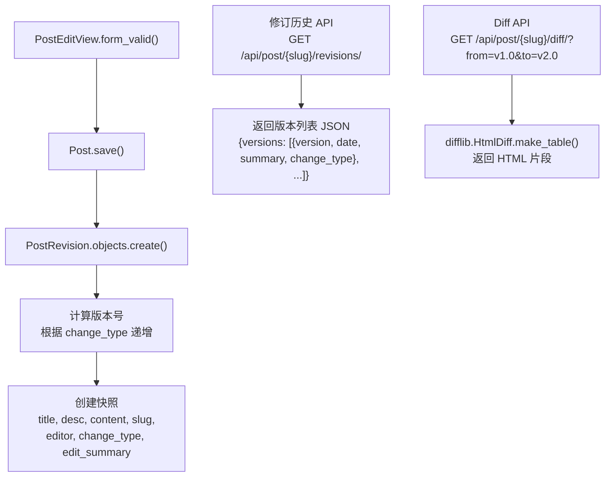

# PowerAdapterBlogs V2 — 开发指南

> **版本**: v2.0-prerelease  
> **更新**: 2026-06-22  
> **状态**: 需求已确定，基础设施加固中  
> **继承**: V1 所有基础设施（Bulma 主题、Redis 缓存、Waitress/Nginx 部署）

---

## 0. V2 需求总览与优先级

| 优先级 | 需求 | 类型 | 预计工时 |
|--------|------|------|---------|
| **P0** | MongoDB 日志完整性修复 | 🐛 Bugfix | 3-4h |
| **P1** | 文章修订追踪 · Phase 1（后端） | ✨ Feature | 6-8h |
| **P2** | 文章修订追踪 · Phase 2（前端） | ✨ Feature | WebStorm 完成 |

> **前端说明**：前端（devenir 主题、timeline CSS/JS）在 WebStorm 中独立完成，不在本指南后端范围内。

---

## 1. P0 Bugfix：MongoDB 日志完整性修复

### 1.1 问题诊断

审查 `security/` 模块后，发现以下 4 个问题：

#### 问题 A：MongoDB 集合命名错误 🔴

`security/mongo_client.py:55`
```python
self.collection = self.db[conf["DB_NAME"]]  # ❌ 集合名 = 数据库名
```
应该用：
```python
self.collection = self.db[conf.get("COLLECTION", "audit_logs")]  # ✅
```

**影响**：所有通过 `MongoLogger` 写入的日志进入名为 `poweradapter_mongo` 的集合，而不是预期的 `audit_logs` 集合。

#### 问题 B：MongoDB 日志无验证能力 🔴

`SecureLogEntry`（PostgreSQL 端）有完整的 `audit()` / `audit_all()` 验证流程，但 `MongoLogger` 只写入了 HMAC，没有任何 `verify_log()` / `audit_logs()` 方法。写了签名但从不校验，形同虚设。

#### 问题 C：LOG_HMAC_KEY 硬编码 🟡

`develop.py:37` 硬编码了 32 字节 key，但 `product.py` 中没有对应的环境变量注入。生产环境部署时这个 key 要么为空导致 crash，要么用开发 key（不安全）。

#### 问题 D：SecureLogEntry compose_message 鲁棒性不足 🟢

`security/models.py` 用 `|` 分隔字段拼接消息。`change_message` 是 Django Admin 的 JSON 字符串，理论上可以包含 `|`，导致 HMAC 校验时消息不一致。

### 1.2 修复方案

#### 修复 A & B：重写 MongoLogger

```python
class MongoLogger:
    def __init__(self):
        conf = settings.MONGO
        # ... 连接代码不变 ...
        self.collection = self.db[conf.get("COLLECTION", "audit_logs")]  # 修复A
        self.hmac_key = settings.LOG_HMAC_KEY

    def insert_log(self, action: str, data: dict):
        now = datetime.utcnow()
        data_bytes = dict_to_bytes(data)
        hmac_val = sm3_hmac(self.hmac_key, data_bytes)
        doc = {
            "action": action,
            "data": data,
            "hmac": hmac_val,
            "created_at": now,          # 新增时间戳
            "verified": False,           # 新增验证标记
        }
        return self.collection.insert_one(doc)

    def verify_log(self, doc_id) -> bool:
        """验证单条日志 HMAC（修复B）"""
        doc = self.collection.find_one({"_id": doc_id})
        if not doc:
            return False
        expected = sm3_hmac(self.hmac_key, dict_to_bytes(doc["data"]))
        is_valid = (doc["hmac"] == expected)
        self.collection.update_one(
            {"_id": doc_id},
            {"$set": {"verified": is_valid, "verified_at": datetime.utcnow()}}
        )
        return is_valid

    def audit_all(self) -> dict:
        """全量审计，返回统计（修复B）"""
        total = tampered = verified = 0
        for doc in self.collection.find({"verified": False}):
            total += 1
            if self.verify_log(doc["_id"]):
                verified += 1
            else:
                tampered += 1
        return {"total": total, "verified": verified, "tampered": tampered}
```

#### 修复 C：KEY 环境变量化

```python
# base.py
LOG_HMAC_KEY = os.getenv("LOG_HMAC_KEY", "").encode()
if not LOG_HMAC_KEY:
    import warnings
    warnings.warn("LOG_HMAC_KEY not set! Log integrity is disabled.", RuntimeWarning)
```

生产 `.env` 中：
```
LOG_HMAC_KEY=<32字节 base64 或 hex>
```

#### 修复 D：消息组合改用 JSON

```python
# models.py SecureLogEntry
@staticmethod
def compose_message(entry: LogEntry) -> bytes:
    """改用 JSON 序列化，避免分隔符冲突"""
    return json.dumps({
        "id": entry.id,
        "action_time": entry.action_time.isoformat(),
        "user_id": entry.user_id,
        "content_type_id": entry.content_type_id,
        "object_id": entry.object_id,
        "object_repr": entry.object_repr,
        "action_flag": entry.action_flag,
        "change_message": entry.change_message,
    }, sort_keys=True, ensure_ascii=False).encode("utf-8")
```

### 1.3 实施步骤

1. 修复 `mongo_client.py` 集合命名（修复 A）
2. 在 `MongoLogger` 中添加 `verify_log()` 和 `audit_all()`（修复 B）
3. `base.py` 中 `LOG_HMAC_KEY` 改为 `os.getenv()`（修复 C）
4. `SecureLogEntry.compose_message()` 改用 JSON 序列化（修复 D）
5. 添加 Django Admin action：选中 LogEntry → "审计 HMAC 完整性"
6. 添加管理命令：`python manage.py audit_mongo_logs`
7. ⚠️ 修复 D **是一次性迁移**——旧 SecureLogEntry 的 HMAC 值在 `compose_message` 输出变化后会全部失效，需要在 migration 中重新计算所有已有记录

### 1.4 MongoDB 旧数据迁移

由于问题 A（集合命名错误），现有 MongoDB 日志在 `poweradapter_mongo` 集合中：

```javascript
// 在 mongosh 中执行
use poweradapter_mongo
db.poweradapter_mongo.renameCollection("audit_logs")
```

---

## 2. P1 Feature：文章修订追踪（Phase 1 · 后端）

### 2.1 设计理念

**核心思路**：普通读者只看文章，深度读者才关心你改了什么。因此修订历史不应是独立页面，而是**文章底部的一个轻量折叠组件**，读者需要时展开，不需要时完全无干扰。

### 2.2 版本号方案：文章 SemVer

继承企业级软件版本号思路，针对文章语境做轻量适配：

```
v{major}.{minor}
```

| 版本变化 | 含义 | 示例 |
|---------|------|------|
| `major` 递增，minor 归零 | 重大内容变更 | v1.0 → v2.0（新增整章、重构结构） |
| `minor` 递增 | 小幅修正 | v1.0 → v1.1（错别字、措辞优化、补充说明） |

> 编辑者在保存文章时选择"大版本"或"小修订"，系统自动计算版本号。

**对比**：原方案 `revision_number: 1, 2, 3...` 只有序号，无语义。新方案一眼知道改动规模。

### 2.3 交互设计

> **读者视角**：
> - 文章正文底部一行小字：`📝 v3.2 · 5 个版本 [展开历史 ▼]`
> - 点击展开 → CSS 竖排时间线（节点+连线）
> - 每条显示：版本号、日期、编辑摘要
> - 点击某条 → 展开该版本完整内容
> - 勾选两个版本 → 显示 diff 对比
>
> **不想看的人**：只有一行 14px 灰色小字，完全无干扰。

### 2.4 节点图可视化（CSS Timeline）

**Phase 1 采用纯 CSS timeline**，零依赖，效果类似 GitHub commit 列表：

```
●──── v3.2  2026-06-21  修正错别字
│
○──── v3.1  2026-06-18  补充性能测试章节
│
●──── v2.0  2026-06-10  重构引言、新增第三章
│
○──── v1.1  2026-06-05  修正排版问题
│
●──── v1.0  2026-06-01  初始发布
```

- **实心圆** = major 版本（`v2.0`），更大更亮
- **空心圆** = minor 版本（`v3.1`），较小
- **竖线** = `--accent-deep` 绿色（devenir 配色）
- **hover** = 节点发光 + 右侧滑入详情

> 后续 Phase 2 如需分支效果，可直接替换为 Mermaid gitGraph（纯前端 JS 渲染，后端 API 不变）。

### 2.5 数据模型

```python
class PostRevision(models.Model):
    post = models.ForeignKey(Post, on_delete=models.CASCADE, related_name='revisions')
    
    # 语义化版本号
    major = models.PositiveSmallIntegerField(default=1, verbose_name="大版本")
    minor = models.PositiveSmallIntegerField(default=0, verbose_name="小修订")
    version = models.CharField(max_length=16, editable=False, verbose_name="版本号")  # "3.2"
    
    # 内容快照
    title = models.CharField(max_length=255, verbose_name="标题快照")
    desc = models.CharField(max_length=1024, blank=True, verbose_name="摘要快照")
    content = models.TextField(verbose_name="正文快照")
    slug = models.SlugField(max_length=255, verbose_name="slug快照")
    
    # 版本元信息
    editor = models.ForeignKey(
        settings.AUTH_USER_MODEL, on_delete=models.SET_NULL, null=True, verbose_name="编辑者"
    )
    change_type = models.CharField(
        max_length=16,
        choices=[('major', '大版本'), ('minor', '小修订')],
        verbose_name="变更类型",
    )
    edit_summary = models.CharField(max_length=200, blank=True, verbose_name="编辑摘要")

    created_at = models.DateTimeField(auto_now_add=True, verbose_name="快照时间")

    class Meta:
        unique_together = ('post', 'major', 'minor')
        ordering = ['-major', '-minor']
        verbose_name = "文章修订"
        verbose_name_plural = "文章修订"
```

**相比原版 V2GUIDE 的变化**：
- `revision_number` → `major + minor + version`（语义化版本）
- `unique_together` 改为 `('post', 'major', 'minor')`
- 新增 `change_type` 字段
- 新增 `slug` 快照（防 slug 变更后历史链接失效）

### 2.6 版本号自动计算逻辑

```python
def get_next_version(post, change_type: str) -> tuple:
    """根据变更类型计算下一个版本号"""
    last = post.revisions.order_by('-major', '-minor').first()
    if not last:
        return (1, 0)  # 首版 v1.0
    
    if change_type == 'major':
        return (last.major + 1, 0)   # v1.3 → v2.0
    else:
        return (last.major, last.minor + 1)  # v1.3 → v1.4
```

### 2.7 快照集成点



### 2.8 后端 API 设计

两个轻量 API，前端（WebStorm）通过 fetch 消费：

```python
# GET /api/post/{slug}/revisions/
# 返回版本列表
{
    "versions": [
        {"version": "3.2", "major": 3, "minor": 2, "change_type": "minor",
         "edit_summary": "修正错别字", "created_at": "2026-06-21T..."},
        {"version": "3.1", "major": 3, "minor": 1, "change_type": "minor",
         "edit_summary": "补充性能测试", "created_at": "2026-06-18T..."},
        ...
    ]
}

# GET /api/post/{slug}/diff/?from=1.0&to=2.0
# 返回 diff HTML 片段
{
    "from_version": "1.0",
    "to_version": "2.0",
    "diff_html": "<table class='diff'>...</table>"
}

# GET /api/post/{slug}/revision/v2.0/
# 返回指定版本的完整内容
{
    "version": "2.0",
    "title": "...",
    "content": "...",
    "created_at": "2026-06-10T..."
}
```

### 2.9 Diff 渲染

使用 `difflib.HtmlDiff`（Python 标准库，零依赖）：

```python
import difflib

def render_diff(old_text: str, new_text: str, from_ver: str, to_ver: str) -> str:
    """生成 HTML 格式的 side-by-side diff，以内联片段返回"""
    differ = difflib.HtmlDiff(tabsize=4, wrapcolumn=80)
    return differ.make_table(
        old_text.splitlines(),
        new_text.splitlines(),
        fromdesc=f'v{from_ver}',
        todesc=f'v{to_ver}',
        context=True,
        numlines=3,
    )
```

### 2.10 Diff 渲染

使用 `difflib.HtmlDiff`（Python 标准库，零依赖），通过 API 返回 HTML 片段，前端内联插入到时间线节点下方。

### 2.11 实施步骤（Phase 1 · 后端）

1. 创建 `PostRevision` 模型 → `python manage.py makemigrations`
2. 在 `PostForm` 中新增 `change_type` 和 `edit_summary` 字段
3. 在 `PostCreateView.form_valid()` 中自动生成 v1.0 初始快照
4. 在 `PostEditView.form_valid()` 中插入快照逻辑（`save()` 之后）
5. 实现 `get_next_version()` 版本号计算
6. 编写修订历史 API + Diff API
7. `PostAdmin` 中注册 `PostRevision` 只读 inline
8. `clear_page_caches()` 中无需额外处理（快照不缓存）

### 2.12 Phase 2 · 前端（WebStorm 完成）

- CSS timeline 组件样式（竖线+节点+动画）
- JS 交互逻辑：展开/折叠、版本选择、diff 加载
- 响应式适配（移动端 timeline 转横向）
- 可选：升级为 Mermaid gitGraph 可视化

---

## 3. 架构与文件组织

V2 新增/修改文件：
```
Blogs/
├── models.py              # + PostRevision
├── forms.py               # + change_type, edit_summary 字段
├── views.py               # PostCreateView/PostEditView 快照逻辑
├── urls.py                # + revisions/diff API 路由
└── revisions.py           # 新建：版本计算、快照、diff 渲染工具

security/
├── mongo_client.py        # 修改：+ verify_log/audit_all, 修复集合命名
├── models.py              # 修改：compose_message 改用 JSON
└── management/
    └── commands/
        └── audit_mongo_logs.py  # 新建：审计管理命令

PowerAdapterBlogs/settings/
└── base.py                # 修改：LOG_HMAC_KEY 环境变量化
```

### 数据库迁移注意事项

| 变更 | 影响 | 处理 |
|------|------|------|
| `PostRevision` 新增表 | 无破坏性 | 普通 migration |
| `SecureLogEntry.compose_message()` 改动 | 旧 HMAC 失效 | **data migration** 重算所有记录 |
| MongoDB collection 改名 | 旧数据需迁移 | 见 §1.4 |

---

## 4. 测试清单

- [ ] P0: MongoLogger 写入正确的 `audit_logs` 集合
- [ ] P0: `verify_log()` 正常日志返回 True，篡改日志返回 False
- [ ] P0: `audit_all()` 返回正确的统计计数
- [ ] P0: `LOG_HMAC_KEY` 未设置时启动警告但不 crash
- [ ] P1: 创建文章 → 自动生成 v1.0 快照
- [ ] P1: 编辑文章（小修订）→ 自动生成 v1.1 快照
- [ ] P1: 编辑文章（大版本）→ 自动生成 v2.0 快照
- [ ] P1: 版本列表 API 按版本号降序返回
- [ ] P1: Diff API 正确渲染中文/代码块/Markdown 差异
- [ ] P1: slug 变更后，历史快照 slug 不受影响

---

## 5. V2 明确不做的范围

| 项目 | 决策 | 原因 |
|------|------|------|
| diff 独立页面 `/post/slug/diff/` | ❌ 不做 | 改为嵌入式组件 + API |
| devenir 主题页面 | ❌ V2 不做 | 独立工作流，WebStorm 推进 |
| PostImage 模型 CRUD | ❌ 不做 | 已有但无视图，暂不启用 |
| music App 功能 | ❌ 不做 | 空壳，无计划 |
| 文章无变化跳过版本 | ❌ 不做 | 简化逻辑，编辑即保存 |
| 版本删除/回滚 | ❌ 不做 | 过度设计，Phase 3 再议 |
| 增量存储（只存 diff） | ❌ 不做 | 博客文章体积小，全量快照足够 |

---

## 6. 已完成修复记录（2026-06-22）

> 详细记录见 `CHANGELOG.md`，此处仅做架构级概述。

### 6.1 双后台入口权限分离

`/super_admin/` 和 `/dashboard/` 两个入口的权限模型完全解耦：

| 入口 | 需要 | 反向解析 |
|------|------|---------|
| `/super_admin/` | `is_staff`（Django 默认） | `reverse("admin:index")` |
| `/dashboard/` | `is_dashboard_user`（CustomSite 自定义） | `reverse("cus_admin:index")` |

**关键修复**：
- `CustomSite.has_permission()` 重写为 `is_dashboard_user` 检查（原继承 `is_staff`）
- 登录 `NoReverseMatch` 修复：AdminSite URL 必须用 `namespace:name` 反解（`cus_admin:index`），不能用外层 `path()` 的 `name=`
- `DashboardAdminMixin`（`base_admin.py`）：7 个方法统一基于 `is_dashboard_user` 授权，覆盖权限检查 + queryset（dashboard 用户看全量数据，不受 owner 过滤）

### 6.2 纵深防御（4 层）

```
Layer1: Admin UI 守卫 (has_change/delete)
Layer2: Admin save_related M2M 拦截（groups/user_permissions）
Layer3: Model.save() 字段回滚（is_superuser/is_staff/is_dashboard_user）
Layer4: pre_save/pre_delete 信号拦截（LogEntry/SecureLogEntry）
```

**新增文件**：`accounts/thread_local.py` + `accounts/middleware.py` RequestUserMiddleware

### 6.3 superuser 保护

dashboard 用户不能编辑 superuser 账号（双重保险）：
- `has_change_permission(obj=...)`：目标为 superuser 且请求者非 superuser → 直接拒绝
- `get_readonly_fields(obj=...)`：同上条件 → 全字段只读
