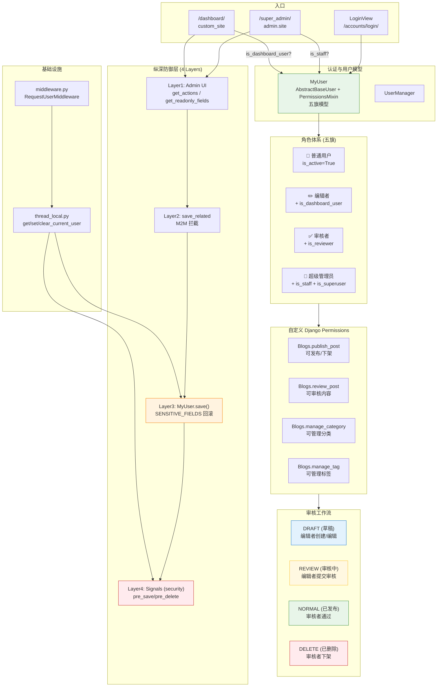
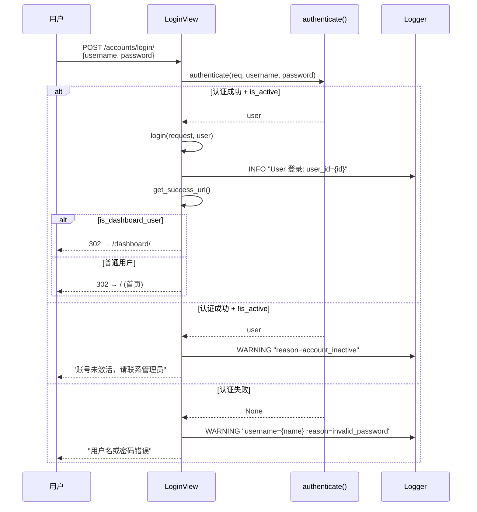
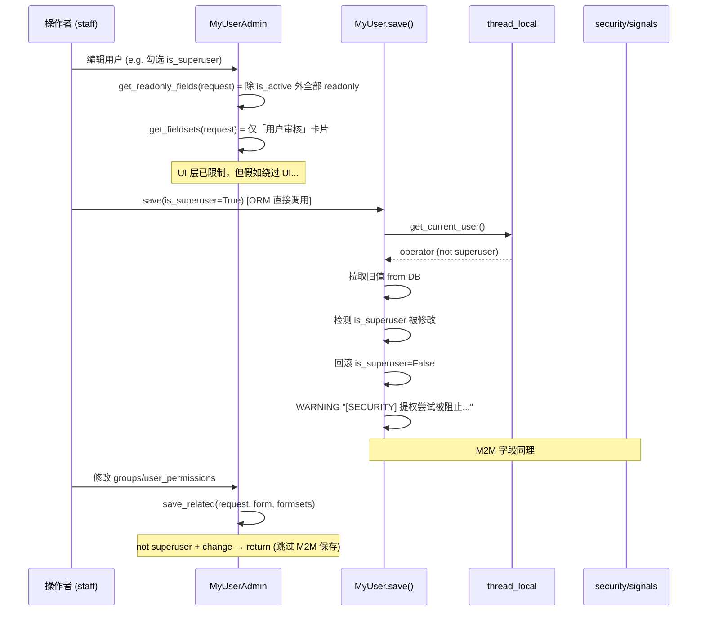
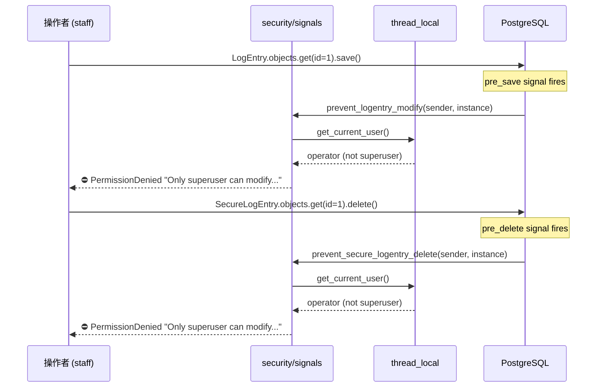
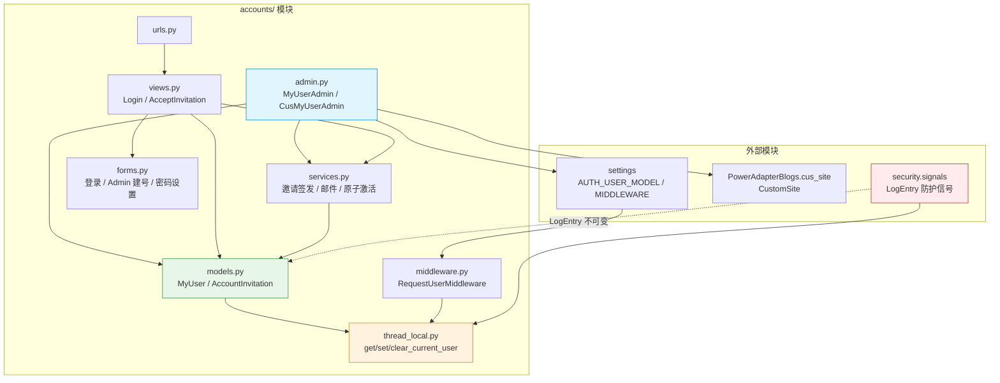
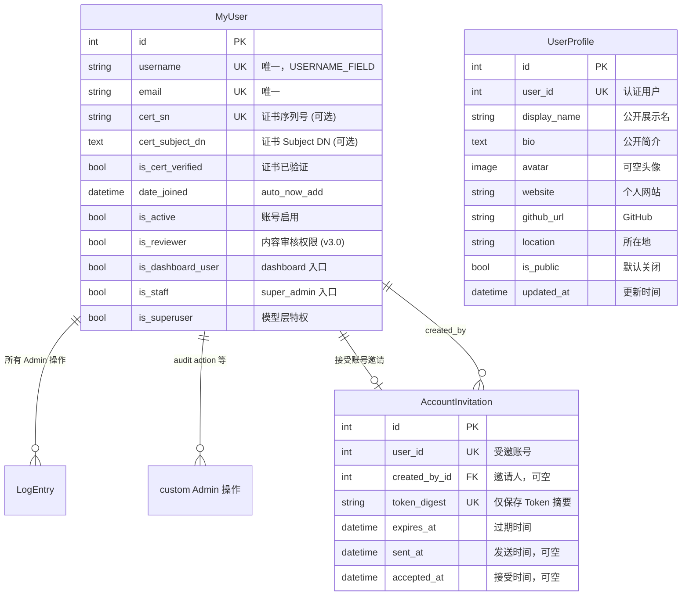

# Accounts 模块 — 开发文档

> **文档权重**：85（accounts 当前实现与模块 TODO）
> **模块**: `accounts/`  
> **职责**: 自定义用户模型、认证、账号状态、全局 Group 编排与用户安全；不拥有 Board Policy
> **依赖**: Django `AbstractBaseUser` + `PermissionsMixin`  
> **创建**: 2025-07-11  
> **最后更新**: 2026-07-26 — 修改密码增加短时邮箱验证、冷却与次数限制

---

## 0. 变更日志

| 日期 | 版本 | 变更 |
|------|------|------|
| 2026-07-26 | v3.11 | 不开放公共注册；superuser 发放未激活账号，受邀者通过一次性邮件链接自行设置密码，成功后原子激活并加入 VerifiedUsers |
| 2026-07-22 | v3.10 | 文档同步：`SECURITY_ROADMAP.md` 新增 superuser 客户端证书绑定、TOTP、独立 admin vhost mTLS、证书生命周期和 break-glass 规划；运行时代码未变 |
| 2026-07-19 | v3.9 | Stage 5 状态 Service、普通 View、上传、修订与只读 API 已停止使用全局审核/staff 旗标 |
| 2026-07-19 | v3.8 | Stage 4 Dashboard Admin 已按 BoardMembership 接入 Policy；`is_reviewer` 不再决定 Post/Comment Admin 对象范围 |
| 2026-07-19 | v3.7 | accounts 收敛为身份/认证/全局 Group 编排；Board 角色、申请审批与 Policy 明确归 boards |
| 2026-07-19 | v3.6 | Stage 3 跨 App ORM Policy 完成，Board 新增/删除收紧为 superuser；运行时入口待 Stage 4 |
| 2026-07-19 | v3.5 | Group 收敛为全站职责；BoardMembership 成为 Blogs/comment 板块角色唯一来源；取消 BoardCreators 设计 |
| 2026-07-13 | v3.4 | `boards.BoardMembership`、唯一约束和 super_admin 只读观察入口落地；Policy 尚未接入运行时 |
| 2026-07-13 | v3.3 | 权限指南补充 Django Group 与 Board Policy 实际交互图；新增 `SECURITY_ROADMAP.md`，规划特权 TOTP MFA 和密钥全生命周期实践 |
| 2026-07-13 | v3.2 | 新增 `PERMISSIONS_GUIDE.md`：明确 Django Group / Permission 与 BoardMembership / Policy 的协作边界，并增加 `accounts_linear` 实施路线 |
| 2026-07-12 | v3.1 | **认证加固**: 用户名+IP 哈希计数，失败 5 次锁定 15 分钟，成功登录清零；补日志修改/删除保护测试 |
| 2026-06-22 | v3.0 | **权限颗粒化**: 四旗模型 (is_reviewer)、Post 审核工作流 (DRAFT→REVIEW→NORMAL)、自定义 Django Permissions、最小权限原则 |
| 2026-06-22 | v2.2 | **dashboard 入口修复**: `CustomSite.has_permission()` 检查 `is_dashboard_user`；登录自动跳转 `/dashboard/` |
| 2026-06-22 | v2.1 | **纵深防御 S1+S2**: `MyUser.save()` 字段回滚 + `save_related()` M2M 拦截 + `LogEntry/SecureLogEntry` 信号防护 |
| 2026-06-22 | v2.0 | **权限重构**: dual Admin 注册 (super_admin + dashboard)；staff 权限收紧为仅审核 (is_active)；移除 readonly_fields 硬锁 |
| 2026-06-22 | v1.1 | 登录日志补全（INFO 成功 / WARNING 失败 + reason code）；LOGGUIDE.md |
| 2025-07-11 | v1.0 | 初始：自定义用户模型 MyUser + 登录/登出 |

### v2.0–v3.0 详细变更

| Issue | 状态 | 描述 |
|-------|------|------|
| superuser 侧边栏无用户管理 | ✅ 已修复 | `admin.site.register(MyUser, MyUserAdmin)` 补充注册 |
| superuser 无法编辑用户 | ✅ 已修复 | 移除全局 `readonly_fields`，改用动态 `get_readonly_fields()` |
| staff 可改 is_superuser/is_staff | ✅ 已修复 | `MyUser.save()` 回滚 SENSITIVE_FIELDS + `save_related()` 跳过 M2M |
| staff 可改/删日志 | ✅ 已修复 | `security/signals.py` 新增 `pre_save`/`pre_delete` 信号拦截 |
| dashboard_user 无法访问后台 | ✅ 已修复 | `CustomSite.has_permission()` → `is_dashboard_user` |
| 登录后不跳转 dashboard | ✅ 已修复 | `get_success_url()` → dashboard 用户跳转 `/dashboard/` |
| db 权限粗粒度（all-or-nothing） | ✅ 已修复 | v3.0 四旗模型 + 自定义 Django Permissions + 审核工作流 |
| 无 Post 审核/草稿机制 | ✅ 已修复 | Post 新增 DRAFT/REVIEW 状态，审核者通过 action 发布/驳回 |
| Post 直接修改不产生审核记录 | ✅ 已修复 | 所有 admin 修改自动创建 PostRevision 快照 |

---

## 1. 模块架构总览



**核心设计原则**：
- **App 边界**：accounts 回答全局身份与职责；boards 回答指定 Board 内可以执行的动作
- **Board 权限迁移状态**：Stage 0–5 已落地；下一步自动化全局 Group 与 BoardAccessRequest 审批
- **单一事实来源**：Contributor / Editor / Reviewer / Manager 不写入 Group；BoardMembership + Policy 跨 App 控制 Post 与 Comment
- **全局旗标边界**：`is_active` / `is_dashboard_user` / `is_staff` / `is_superuser` 只表达账号或入口状态；`is_reviewer` 为待删除遗留字段，不再代表 Board 角色
- **纵深防御**：4 层防护，模型层是最后一道防线
- **双 Admin 注册**：同一 `MyUserAdmin` 注册到 `admin.site` 和 `custom_site`，使用不同的 `has_permission()` 逻辑
- **审核工作流**：编辑者写草稿 → 提交审核 → 审核者通过/驳回，所有变更自动产生 PostRevision 快照

> 🟠 橙色 = 模型层防御 (SENSITIVE_FIELDS 回滚)  
> 🔴 红色 = 跨模块信号防护 (security/signals.py)  
> 🔵 蓝色 = 草稿 — 🟡 黄色 = 审核中 — 🟢 绿色 = 已发布

---

## 2. 组件清单

| 文件 | 核心类/函数 | 职责 |
|------|------------|------|
| `models.py` | `MyUser`, `AccountInvitation`, `UserManager`, `SENSITIVE_FIELDS` | 自定义用户、邀请状态、创建工厂与模型层防御 |
| `services.py` | invitation 与 password email helpers | 邀请激活；改密验证码摘要、发送/错误限流及 Session 验证授权 |
| `admin.py` | `MyUserAdmin`, `CusMyUserAdmin`, `AccountInvitationAdmin` | 双 Admin 注册、邀请发放/重发、字段权限与 M2M 拦截 |
| `views.py` | 登录、邀请、Profile、邮箱验证与密码修改 Views | 账号前台流程与所有者边界 |
| `forms.py` | 登录、邀请、Profile、密码及邮箱验证码 Forms | 输入校验与可编辑字段白名单 |
| `urls.py` | — | 登录/邀请/Profile/邮箱验证/密码修改路由 |
| `thread_local.py` | `get_current_user()`, `set_current_user()`, `clear_current_user()` | thread-local 用户存储 |
| `middleware.py` | `RequestUserMiddleware` | 请求生命周期捕获 `request.user` |
| `apps.py` | `AccountsConfig` | AppConfig |
| `LOGGUIDE.md` | — | 日志规范（含安全红线） |
| `PERMISSIONS_GUIDE.md` | — | Group + Permission + BoardMembership + Policy 授权设计与线性实施路线 |
| `SECURITY_ROADMAP.md` | — | v2.5+ superuser 证书 + TOTP、`/super_admin/` mTLS 与密钥全生命周期规划；均未实现 |

### 2.1 协同模块（审核工作流）

| 模块 | 关键变更 | 职责 |
|------|---------|------|
| `Blogs/models.py` | Post STATUS_DRAFT/REVIEW, custom permissions | 文章状态机 + 权限定义 |
| `Blogs/admin.py` | PostAdmin review actions, granular perms | 编辑者/审核者分离，审核操作 |
| `PowerAdapterBlogs/base_admin.py` | DashboardAdminMixin | dashboard 基础权限（查看/模块可见） |
| `boards/models.py` / `policies.py` | BoardMembership、Policy | 拥有板块角色与跨 App 对象授权；accounts 只提供 MyUser |

### 2.2 与 boards 的明确边界

| accounts 拥有 | boards 拥有 |
|---|---|
| MyUser、UserManager、登录/登出 | Board、BoardMembership |
| `is_active`、`is_staff`、`is_superuser` 等全局账号状态 | Contributor / Editor / Reviewer / Manager 板块角色 |
| 邮箱/证书验证、后续 MFA | `access_rules.py`、`policies.py` |
| VerifiedUsers、UserManagers、SiteOperators 的归组编排 | 后续 BoardAccessRequest、角色审批与 Membership 变更 |
| 全局 Group 与 `user_permissions` 的管理边界 | Post/Comment 的 Board Scope 最终裁决 |

各业务 App 自己定义 Permission；accounts 负责全局 Group 的组合和分配，不接管 security、Blogs 或 comment 的领域模型。Board 申请属于 boards，因为申请对象和审批结果都围绕一个 Board。

---

## 3. 五旗权限模型

`is_dashboard_user` 只控制自定义 `/dashboard/` 工作台外壳入口，不等于账号管理、Board CRUD
或跨 App 对象权限。Board 角色测试账号需要该入口旗标才能使用工作台，但具体模块和对象继续执行
各自的 Policy。`accounts.MyUser` 属于全局身份域；Stage 6 `UserManagers` Group 落地前，工作台中的
账号管理模块仅向激活的 superuser 开放。

`/dashboard/login/` 使用 `DashboardAuthenticationForm`，登录条件为账号激活且具有
`is_dashboard_user` 或 superuser 身份，不要求 `is_staff`。`/super_admin/login/` 继续使用 Django
默认 Admin 登录表单并要求 staff；两套入口不得通过放宽 `is_staff` 相互打通。直接访问
`/dashboard/login/` 未携带 `next` 时默认返回 `/dashboard/`，不使用 Django 的
`/accounts/profile/` 默认回跳。

```
┌──────────────────────────────────────────────────────┐
│                     MyUser                            │
│                                                      │
│  is_active         账号启用（可登录）                   │
│  is_dashboard_user 可访问 /dashboard/ (CustomSite)     │
│  is_reviewer       遗留审核旗标（业务入口已停止读取）      │  ← 待 Stage 7–8 删除
│  is_staff          可访问 /super_admin/ (默认 Django)   │
│  is_superuser      拥有所有模型层特权                    │
│                                                      │
│  groups            Django 权限组 (M2M)                │
│  user_permissions  Django 单独权限 (M2M)               │
│  ────────────────────────────────────────────────     │
│  自定义 Permissions (Blogs app):                      │
│    publish_post    可发布/下架文章                      │
│    review_post     可审核文章内容                       │
│    manage_category 可管理分类                          │
│    manage_tag      可管理标签                          │
└──────────────────────────────────────────────────────┘
```

### 3.1 当前角色来源（最小权限原则）

| 身份/角色 | 来源 | 作用域 | Stage 5 运行时能力 |
|---|---|---|---|
| 普通用户 | `is_active` | 全站账号 | 前台浏览与评论 |
| Contributor | `BoardMembership.role` | 单个 Board | 新建并编辑自己的草稿 |
| Editor | `BoardMembership.role` | 单个 Board | Contributor 能力 + 编辑自己的已发布文章 |
| Reviewer | `BoardMembership.role` | 单个 Board | 查看本 Board 全部文章/修订并审核评论；不能改正文或评论内容 |
| Manager | `BoardMembership.role` | 单个 Board | 编辑本 Board 文章与运营字段；不能改 Board 结构字段 |
| superuser | `is_superuser` | 全站应急 | 两个后台全部权限 |

### 3.2 Stage 5 跨入口权限矩阵

| 操作 | Contributor | Editor | Reviewer | Manager | superuser |
|---|:---:|:---:|:---:|:---:|:---:|
| 查看自己的 Board 文章 | ✅ | ✅ | ✅ | ✅ | ✅ |
| 查看同 Board 他人文章 | ❌ | ❌ | ✅ | ✅ | ✅ |
| 编辑自己的草稿 | ✅ | ✅ | ❌ | ✅ | ✅ |
| 编辑自己的已发布文章 | ❌ | ✅ | ❌ | ✅ | ✅ |
| 编辑同 Board 他人文章 | ❌ | ❌ | ❌ | ✅ | ✅ |
| 查看所属 Board 评论队列 | ❌ | ❌ | ✅ | ✅ | ✅ |
| 修改 Board 运营字段 | ❌ | ❌ | ❌ | ✅ | ✅ |
| 修改 Board slug/category/is_active | ❌ | ❌ | ❌ | ❌ | ✅ |
| 提交审核 action | ✅ | ✅ | ❌ | ✅ | ✅ |
| 审核/发布/驳回 action | ❌ | ❌ | ✅（禁止自审） | ✅（禁止自审） | ✅ |

状态 action 已通过 `Blogs.services` 逐对象加锁、校验角色/Board/作者/状态；评论 action 逐对象调用 Policy 并保留 MongoDB HMAC 审计。完整设计矩阵以权重更高的 [`PERMISSIONS_GUIDE.md`](PERMISSIONS_GUIDE.md) 为准。

### 3.3 文章状态流转（审核工作流）

```
编辑者创建/编辑 → 自动进入 DRAFT
                        │
                        ▼
       ┌──────────┐  提交审核 (action)  ┌──────────┐  通过审核 (action)  ┌──────────┐
       │  DRAFT   │ ──────────────────→ │  REVIEW  │ ─────────────────→ │  NORMAL  │
       │  草稿    │ ←────────────────── │  审核中  │                    │  已发布  │
       └──────────┘   驳回 (action)     └──────────┘                    └────┬─────┘
              ▲                                                              │
              │                         编辑者修改已发布文章（自动回退）         │ 下架 (action)
              └──────────────────────────────────────────────────────────────┘
                                                                             │
                                                                             ▼
                                                                       ┌──────────┐
                                                                       │  DELETE  │
                                                                       │  已删除  │
                                                                       └──────────┘
```

**入口分离逻辑**：
- `admin.site` (Django 默认) → `AdminSite.has_permission()` → 检查 `is_active and is_staff`
- `custom_site` (`cus_site.py`) → `CustomSite.has_permission()` → 检查 `is_active and is_dashboard_user`

---

## 4. 详细数据流

### 4.1 登录流程



### 4.2 Admin 用户管理权限流



### 4.3 日志防护（跨模块信号）



---

## 5. 纵深防御架构

### 5.1 防御层级总览

```
┌──────────────────────────────────────────────────┐
│  Layer 1: Admin UI 守卫                           │
│  - has_change_permission(request, obj) → is_staff │ ← 仅审核 is_active
│  - has_delete_permission(request, obj) → superuser│
│  - has_add_permission(request) → superuser       │
│  - get_readonly_fields() → 非 superuser 全部只读  │
│  - get_fieldsets() → 非 superuser 只显示审核卡片   │
├──────────────────────────────────────────────────┤
│  Layer 2: Admin M2M 拦截                          │
│  - save_related() → 非 superuser 跳过 M2M 保存    │ ← groups/user_permissions
├──────────────────────────────────────────────────┤
│  Layer 3: Model.save() 字段回滚                    │
│  - SENSITIVE_FIELDS = {is_superuser, is_staff,    │ ← 最后一道防线
│    is_dashboard_user, is_reviewer}                │
│  - 检测变更 → 回滚到旧值 → SECURITY WARNING 日志    │
├──────────────────────────────────────────────────┤
│  Layer 4: pre_save/pre_delete 信号拦截             │
│  - LogEntry 不可修改/删除 (非 superuser)            │ ← 跨模块 (security/signals.py)
│  - SecureLogEntry 不可删除 (非 superuser)           │
└──────────────────────────────────────────────────┘
```

### 5.2 基础设施：thread-local 用户传递

`accounts/thread_local.py` + `accounts/middleware.py` 解决了一个核心问题：
**模型层 `save()` 和信号的 `sender` 参数中没有 `request`，如何知道谁在操作？**

```python
# settings/base.py MIDDLEWARE 顺序：
"django.contrib.auth.middleware.AuthenticationMiddleware",  # 先认证
"accounts.middleware.RequestUserMiddleware",                 # 再捕获
"django.contrib.messages.middleware.MessageMiddleware",      # ...
```

```python
# middleware.py
class RequestUserMiddleware:
    def __call__(self, request):
        set_current_user(getattr(request, "user", None))  # 请求开始
        try:
            response = self.get_response(request)
        finally:
            clear_current_user()  # 请求结束，清理
        return response
```

**局限性**：
- 仅覆盖 HTTP 请求上下文。`manage.py shell` / Celery 任务 / 管理命令中 `get_current_user()` 返回 `None`，防御回退到不阻拦（不影响正常操作）
- 这是 Design Decision：非 HTTP 上下文中操作用户属于管理行为，不过度拦截

### 5.3 SENSITIVE_FIELDS 保护逻辑

```python
# models.py
SENSITIVE_FIELDS = {'is_superuser', 'is_staff', 'is_dashboard_user', 'is_reviewer'}

def save(self, *args, **kwargs):
    requesting_user = get_current_user()
    
    if requesting_user and not requesting_user.is_superuser and self.pk:
        old = MyUser.objects.only(*SENSITIVE_FIELDS).get(pk=self.pk)
        for field in SENSITIVE_FIELDS:
            if getattr(self, field) != getattr(old, field):
                setattr(self, field, getattr(old, field))  # 回滚！
                logger.warning(f"[SECURITY] 提权尝试被阻止: ...")
    
    super().save(*args, **kwargs)
```

**设计考虑**：
- 使用 `.only()` 减少查询开销（只取 4 个布尔字段）
- 回滚而非抛异常 — 静默拒绝，避免 `PermissionDenied` 在非 HTTP 上下文崩溃
- 每次修改都查询旧值，这是 O(1) 的性能代价换取安全
- v3.0 扩展 `is_reviewer`：审核权限只能通过 `/super_admin/` 授予，dashboard 用户不可自行提权

---

## 6. Admin 配置详解

### 6.1 双重注册

```python
# admin.py

# 注册 1: admin.site → /super_admin/
admin.site.register(MyUser, MyUserAdmin)

# 注册 2: custom_site → /dashboard/
@admin.register(MyUser, site=custom_site)
class CusMyUserAdmin(MyUserAdmin):
    pass  # 所有行为继承父类
```

两个 Admin 共享同一个 `MyUserAdmin` 类，权限行为通过 `get_*` 方法动态判断。

### 6.2 动态字段权限（v3.0 颗粒化）

| 方法 | superuser 行为 | dashboard 行为 (CusMyUserAdmin) |
|------|---------------|------------|
| `get_readonly_fields()` | 全部可编辑 | 除 `is_active` 外全部只读（含 `is_reviewer`） |
| `get_fieldsets()` | 4 个字段集（基本信息/证书/权限/其他） | 1 个字段集「用户审核」 |
| `has_change_permission()` | ✅ | ✅ (仅 is_active；不可编辑 superuser) |
| `has_delete_permission()` | ✅ | ❌ |
| `has_add_permission()` | ✅ | ❌ |
| `save_related()` | M2M 正常保存 | 跳过 M2M 保存 |

### 6.3 PostAdmin 角色分离（Blogs/admin.py）

| 方法 | superuser | 审核者 | 编辑者 |
|------|:---:|:---:|:---:|
| `get_queryset()` | 全部文章 | 全部文章 | 仅自己的文章 |
| `get_actions()` | 全部操作 | 通过审核/驳回/下架 | 提交审核 |
| `has_add_permission()` | ✅ | ✅ | ✅ |
| `has_change_permission()` | ✅ | ✅ (全部) | ✅ (仅自己的) |
| `has_delete_permission()` | ✅ | ❌ | ❌ |
| `get_readonly_fields()` | 无 | 无 | `status` 只读 |
| `save_model()` 状态 | 自由设置 | 自由设置 | 强制 DRAFT；已发布文章自动回退 |
| 修订快照 | ✅ 自动创建 | ✅ 自动创建 | ✅ 自动创建 |

### 6.4 CategoryAdmin / TagAdmin 权限

| 方法 | superuser | 审核者 (has manage perm) | 编辑者 |
|------|:---:|:---:|:---:|
| add/change/delete | ✅ | ✅ | ❌ |
| view | ✅ | ✅ | ✅ |

---

## 7. 文件依赖图



---

## 8. 数据模型关系



---

## 9. 已知问题 / TODO

| Issue | 严重 | 描述 |
|-------|------|------|
| staff 修改日志（模型层） | ✅ 已验证 | `security/signals.py` 在 pre_save/pre_delete 拦截非 superuser，已补修改和删除回归测试；无需重写 Django LogEntry |
| 公共注册 | ✅ 决策关闭 | 个人站采用管理员邀请制；Admin 不接触用户密码，受邀者通过 24 小时一次性链接激活。 |
| 登录反暴力破解 | ✅ 已修复 | 按用户名 + IP 的哈希 key 计数；默认失败 5 次锁定 15 分钟，成功登录清零 |
| Board 跨入口对象隔离 | ✅ Stage 5 | Admin、状态 action、普通 View、上传、修订与只读 API 均调用 `boards.policies` |
| thread-local 仅 HTTP 上下文 | 🟢 低 | `manage.py shell` 中 `get_current_user()` 返回 None，防御回退。属于设计决策，暂不修改。 |
| 审核通知 | ⏸ 已评估 | 个人站当前 dashboard 状态与 Admin 即时反馈足够，暂不为此新增完整 messaging 模块；开放注册时采用邮件验证，评论通知按实际需要再做轻量站内实现 |
| Category/Tag 管理边界 | 🟡 中 | Category dashboard 已收紧为 superuser-only；Tag 保留全局 Permission，Stage 6a 初始化 Group 时复核 |
| Profile 与密码修改 | ✅ F1 | `UserProfile` 默认私密；公开页仅列公开已发布文章；Profile 改密入口以 `restart=1` 强制开启新邮箱验证（10 分钟、60 秒冷却、每小时 3 封、最多错 5 次），随后仍校验旧密码并保留当前 Session。 |

---

## 10. 附录

### A. 测试现状

- `tests.py` — 已覆盖邀请、登录锁定、双后台边界、Profile 隔离，以及改密邮箱验证的 TTL、Session 绑定、强制重开、倒计时数据、冷却、发送和错误上限；accounts 测试 30 项、全项目 150 项通过（2026-07-27）
- 建议优先覆盖：
  1. `MyUser.save()` SENSITIVE_FIELDS 回滚逻辑
  2. `LoginView` 登录成功/失败/不活跃三种路径
  3. `MyUserAdmin` 权限方法（superuser vs staff）

### B. 管理命令速查

```bash
# 创建超级管理员
python manage.py createsuperuser

# 执行迁移（v3.0 新增）
python manage.py migrate accounts
python manage.py migrate Blogs

# 授予现有 dashboard 用户审核权限
python manage.py shell -c "
from accounts.models import MyUser
# 将 user1 设为审核者
u = MyUser.objects.get(username='user1')
u.is_reviewer = True
u.save()
# 授予 manage_category 权限（Django Permission）
from django.contrib.auth.models import Permission
perm = Permission.objects.get(codename='manage_category')
u.user_permissions.add(perm)
"

# Django shell 验证权限逻辑
python manage.py shell -c "
from accounts.models import MyUser
u = MyUser.objects.get(username='reviewer_user')
print(u.is_dashboard_user, u.is_reviewer, u.is_superuser)
print('perms:', u.get_all_permissions())
"
```

### C. 安全红线 (来自 LOGGUIDE.md)

```
┌─────────────────────────────────────────────────┐
│  ❌ 绝不记录: 密码、密码 hash、邮箱、手机号        │
│  ❌ 绝不记录: Session key、Token、SECRET_KEY      │
│  ✅ 用 user_id 代替用户身份标识                   │
│  ✅ 记录登录失败但仅记录用户名（非邮箱）           │
│  ✅ 连续失败场景记录 attempts 次数                │
└─────────────────────────────────────────────────┘
```

### D. settings 关键配置

```python
# settings/base.py
AUTH_USER_MODEL = "accounts.MyUser"

MIDDLEWARE = [
    ...
    "django.contrib.auth.middleware.AuthenticationMiddleware",
    "accounts.middleware.RequestUserMiddleware",  # ← 必须在 Auth 之后
    ...
]

# settings/develop.py
LOG_HMAC_KEY = "..."  # 用于 security 模块 HMAC，不影响 accounts
```

### E. v3.0 迁移说明

**新增迁移文件**：
- `accounts/migrations/0002_add_is_reviewer.py` — MyUser 添加 `is_reviewer` 字段
- `Blogs/migrations/0006_add_post_status_and_permissions.py` — Post 新增 DRAFT/REVIEW 状态 + 自定义权限

**执行**：
```bash
python manage.py migrate accounts
python manage.py migrate Blogs
```

**向后兼容**：
- `STATUS_NORMAL=1` 和 `STATUS_DELETE=0` 值不变，存量文章不受影响
- `is_reviewer` 默认为 False，现有用户行为完全不变
- 现有 superuser 自动获得所有自定义权限（Django 默认行为）
- 自定义 permissions 不会自动授予现有用户，需手动分配或通过 group 管理
