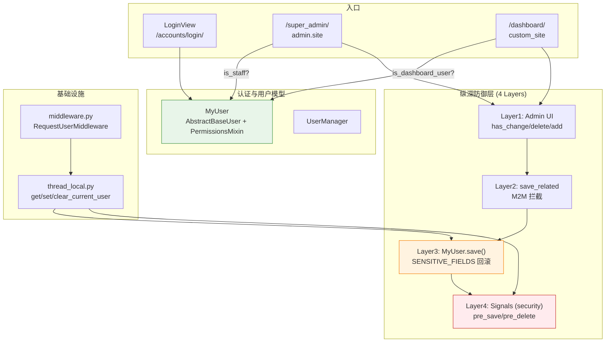
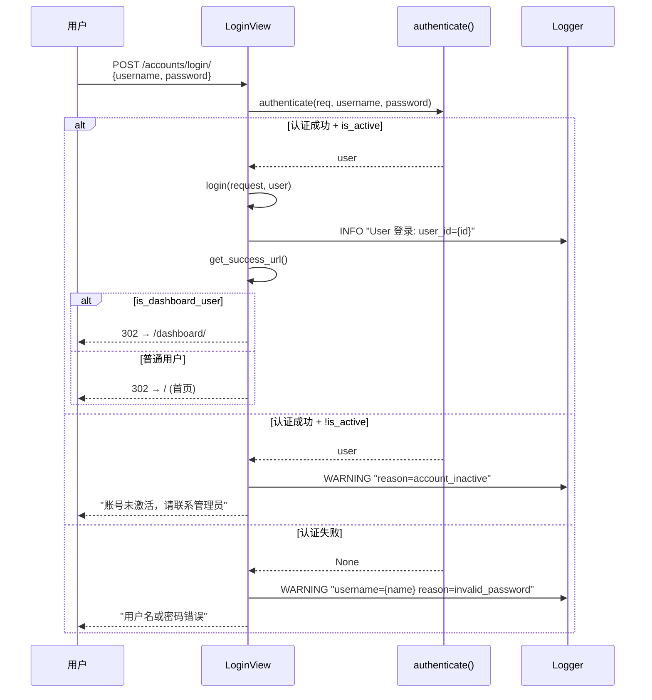
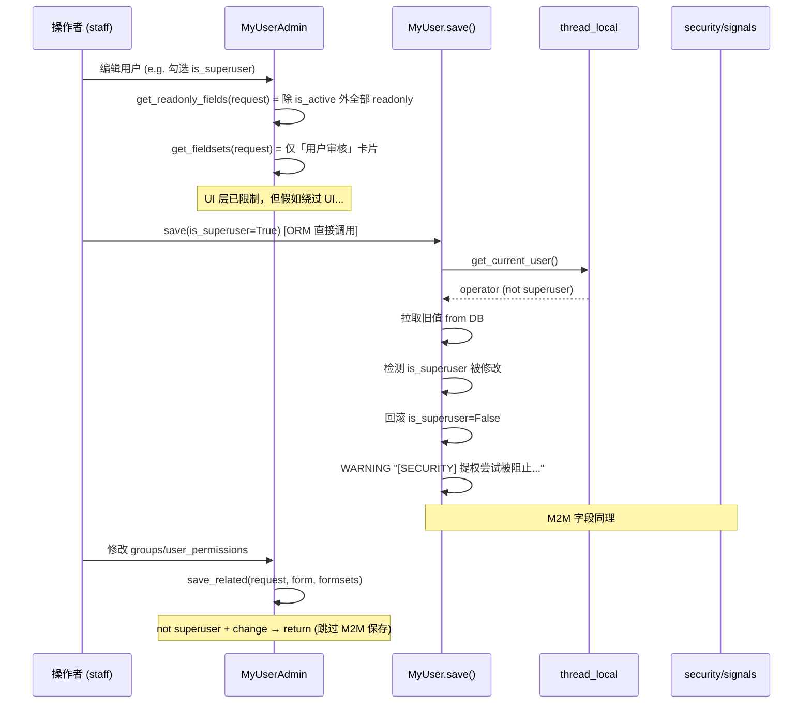
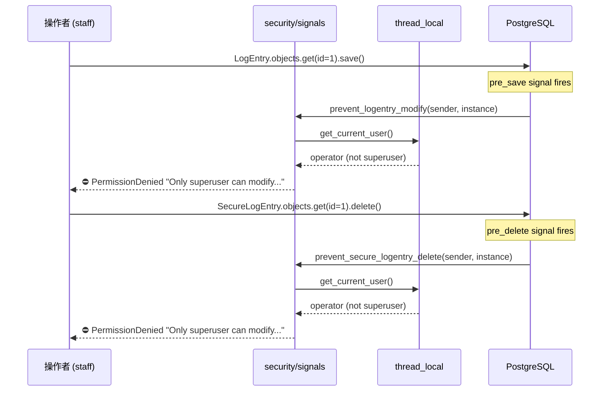
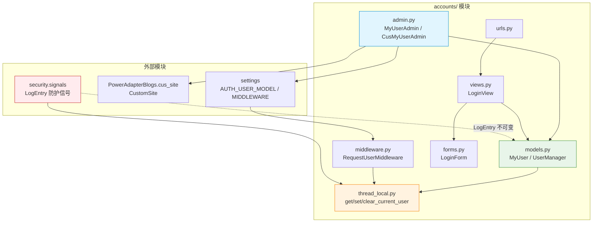
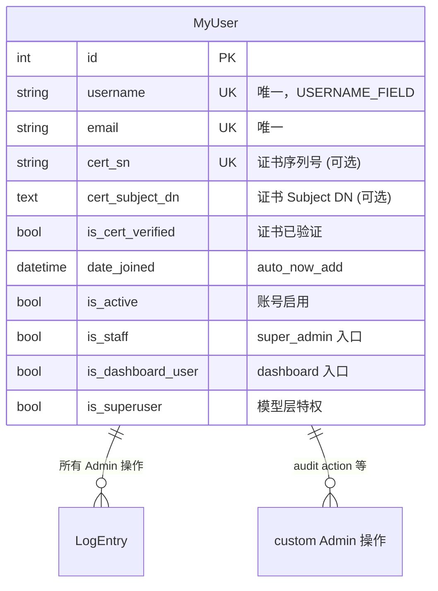

# Accounts 模块 — 开发文档

> **模块**: `accounts/`  
> **职责**: 自定义用户模型 (MyUser)、登录/登出、权限体系、纵深防御  
> **依赖**: Django `AbstractBaseUser` + `PermissionsMixin`  
> **创建**: 2025-07-11  
> **最后更新**: 2026-06-22 — 纵深防御 (S1+S2) + dashboard 入口修复

---

## 0. 变更日志

| 日期 | 版本 | 变更 |
|------|------|------|
| 2026-06-22 | v2.2 | **dashboard 入口修复**: `CustomSite.has_permission()` 检查 `is_dashboard_user`；登录自动跳转 `/dashboard/` |
| 2026-06-22 | v2.1 | **纵深防御 S1+S2**: `MyUser.save()` 字段回滚 + `save_related()` M2M 拦截 + `LogEntry/SecureLogEntry` 信号防护 |
| 2026-06-22 | v2.0 | **权限重构**: dual Admin 注册 (super_admin + dashboard)；staff 权限收紧为仅审核 (is_active)；移除 readonly_fields 硬锁 |
| 2026-06-22 | v1.1 | 登录日志补全（INFO 成功 / WARNING 失败 + reason code）；LOGGUIDE.md |
| 2025-07-11 | v1.0 | 初始：自定义用户模型 MyUser + 登录/登出 |

### v2.0–v2.2 详细变更

| Issue | 状态 | 描述 |
|-------|------|------|
| superuser 侧边栏无用户管理 | ✅ 已修复 | `admin.site.register(MyUser, MyUserAdmin)` 补充注册 |
| superuser 无法编辑用户 | ✅ 已修复 | 移除全局 `readonly_fields`，改用动态 `get_readonly_fields()` |
| staff 可改 is_superuser/is_staff | ✅ 已修复 | `MyUser.save()` 回滚 SENSITIVE_FIELDS + `save_related()` 跳过 M2M |
| staff 可改/删日志 | ✅ 已修复 | `security/signals.py` 新增 `pre_save`/`pre_delete` 信号拦截 |
| dashboard_user 无法访问后台 | ✅ 已修复 | `CustomSite.has_permission()` → `is_dashboard_user` |
| 登录后不跳转 dashboard | ✅ 已修复 | `get_success_url()` → dashboard 用户跳转 `/dashboard/` |

---

## 1. 模块架构总览



**核心设计原则**：
- **三旗权限模型**：`is_staff` (超级管理员入口) / `is_dashboard_user` (运维入口) / `is_superuser` (特权)
- **纵深防御**：4 层防护，模型层是最后一道防线
- **双 Admin 注册**：同一 `MyUserAdmin` 注册到 `admin.site` 和 `custom_site`，使用不同的 `has_permission()` 逻辑

> 🟠 橙色 = 模型层防御 (SENSITIVE_FIELDS 回滚)  
> 🔴 红色 = 跨模块信号防护 (security/signals.py)

---

## 2. 组件清单

| 文件 | 核心类/函数 | 职责 |
|------|------------|------|
| `models.py` | `MyUser`, `UserManager`, `SENSITIVE_FIELDS` | 自定义用户模型 + 创建工厂 + 模型层防御 |
| `admin.py` | `MyUserAdmin`, `CusMyUserAdmin` | 双 Admin 注册 + 字段权限 + M2M 拦截 |
| `views.py` | `LoginView` | 登录视图 + 跳转逻辑 + 日志 |
| `forms.py` | `LoginForm` | 登录表单 |
| `urls.py` | — | `login/` + `logout/` 路由 |
| `thread_local.py` | `get_current_user()`, `set_current_user()`, `clear_current_user()` | thread-local 用户存储 |
| `middleware.py` | `RequestUserMiddleware` | 请求生命周期捕获 `request.user` |
| `apps.py` | `AccountsConfig` | AppConfig |
| `LOGGUIDE.md` | — | 日志规范（含安全红线） |

---

## 3. 三旗权限模型

```
┌─────────────────────────────────────────────────────┐
│                     MyUser                           │
│                                                     │
│  is_active         账号启用（可登录）                 │
│  is_staff          可访问 /super_admin/ (默认 Django) │
│  is_dashboard_user 可访问 /dashboard/  (CustomSite)   │
│  is_superuser      拥有所有模型层特权                  │
│                                                     │
│  groups            Django 权限组 (M2M)               │
│  user_permissions  Django 单独权限 (M2M)              │
└─────────────────────────────────────────────────────┘
```

**角色矩阵**：

| 角色 | is_active | is_staff | is_dashboard_user | is_superuser | 入口 |
|------|:---:|:---:|:---:|:---:|------|
| 普通用户 | ✅ | ❌ | ❌ | ❌ | 前台 |
| 运维 | ✅ | ❌ | ✅ | ❌ | `/dashboard/` |
| 超级管理员 | ✅ | ✅ | ✅ | ✅ | `/super_admin/` + `/dashboard/` |

**入口分离逻辑**：
- `admin.site` (Django 默认) → `AdminSite.has_permission()` → 检查 `is_active and is_staff`
- `custom_site` (`cus_site.py`) → `CustomSite.has_permission()` → 检查 `is_active and is_dashboard_user`

---

## 4. 详细数据流

### 4.1 登录流程



### 4.2 Admin 用户管理权限流



### 4.3 日志防护（跨模块信号）



---

## 5. 纵深防御架构

### 5.1 防御层级总览

```
┌──────────────────────────────────────────────────┐
│  Layer 1: Admin UI 守卫                           │
│  - has_change_permission(request, obj) → is_staff │ ← 仅审核 is_active
│  - has_delete_permission(request, obj) → superuser│
│  - has_add_permission(request) → superuser       │
│  - get_readonly_fields() → 非 superuser 全部只读  │
│  - get_fieldsets() → 非 superuser 只显示审核卡片   │
├──────────────────────────────────────────────────┤
│  Layer 2: Admin M2M 拦截                          │
│  - save_related() → 非 superuser 跳过 M2M 保存    │ ← groups/user_permissions
├──────────────────────────────────────────────────┤
│  Layer 3: Model.save() 字段回滚                    │
│  - SENSITIVE_FIELDS = {is_superuser, is_staff,    │ ← 最后一道防线
│    is_dashboard_user}                             │
│  - 检测变更 → 回滚到旧值 → SECURITY WARNING 日志    │
├──────────────────────────────────────────────────┤
│  Layer 4: pre_save/pre_delete 信号拦截             │
│  - LogEntry 不可修改/删除 (非 superuser)            │ ← 跨模块 (security/signals.py)
│  - SecureLogEntry 不可删除 (非 superuser)           │
└──────────────────────────────────────────────────┘
```

### 5.2 基础设施：thread-local 用户传递

`accounts/thread_local.py` + `accounts/middleware.py` 解决了一个核心问题：
**模型层 `save()` 和信号的 `sender` 参数中没有 `request`，如何知道谁在操作？**

```python
# settings/base.py MIDDLEWARE 顺序：
"django.contrib.auth.middleware.AuthenticationMiddleware",  # 先认证
"accounts.middleware.RequestUserMiddleware",                 # 再捕获
"django.contrib.messages.middleware.MessageMiddleware",      # ...
```

```python
# middleware.py
class RequestUserMiddleware:
    def __call__(self, request):
        set_current_user(getattr(request, "user", None))  # 请求开始
        try:
            response = self.get_response(request)
        finally:
            clear_current_user()  # 请求结束，清理
        return response
```

**局限性**：
- 仅覆盖 HTTP 请求上下文。`manage.py shell` / Celery 任务 / 管理命令中 `get_current_user()` 返回 `None`，防御回退到不阻拦（不影响正常操作）
- 这是 Design Decision：非 HTTP 上下文中操作用户属于管理行为，不过度拦截

### 5.3 SENSITIVE_FIELDS 保护逻辑

```python
# models.py
SENSITIVE_FIELDS = {'is_superuser', 'is_staff', 'is_dashboard_user'}

def save(self, *args, **kwargs):
    requesting_user = get_current_user()
    
    if requesting_user and not requesting_user.is_superuser and self.pk:
        old = MyUser.objects.only(*SENSITIVE_FIELDS).get(pk=self.pk)
        for field in SENSITIVE_FIELDS:
            if getattr(self, field) != getattr(old, field):
                setattr(self, field, getattr(old, field))  # 回滚！
                logger.warning(f"[SECURITY] 提权尝试被阻止: ...")
    
    super().save(*args, **kwargs)
```

**设计考虑**：
- 使用 `.only()` 减少查询开销（只取 3 个布尔字段）
- 回滚而非抛异常 — 静默拒绝，避免 `PermissionDenied` 在非 HTTP 上下文崩溃
- 每次修改都查询旧值，这是 O(1) 的性能代价换取安全

---

## 6. Admin 配置详解

### 6.1 双重注册

```python
# admin.py

# 注册 1: admin.site → /super_admin/
admin.site.register(MyUser, MyUserAdmin)

# 注册 2: custom_site → /dashboard/
@admin.register(MyUser, site=custom_site)
class CusMyUserAdmin(MyUserAdmin):
    pass  # 所有行为继承父类
```

两个 Admin 共享同一个 `MyUserAdmin` 类，权限行为通过 `get_*` 方法动态判断。

### 6.2 动态字段权限

| 方法 | superuser 行为 | staff 行为 |
|------|---------------|------------|
| `get_readonly_fields()` | 全部可编辑 | 除 `is_active` 外全部只读 |
| `get_fieldsets()` | 4 个字段集（基本信息/证书/权限/其他） | 1 个字段集「用户审核」 |
| `has_change_permission()` | ✅ | ✅ (仅 is_active) |
| `has_delete_permission()` | ✅ | ❌ |
| `has_add_permission()` | ✅ | ❌ |
| `save_related()` | M2M 正常保存 | 跳过 M2M 保存 |

---

## 7. 文件依赖图



---

## 8. 数据模型关系



---

## 9. 已知问题 / TODO

| Issue | 严重 | 描述 |
|-------|------|------|
| staff 仍可修改日志（模型层） | 🟡 中 | 当前通过 `security/signals.py` 信号拦截，但重写 Django `LogEntry` 能提供更强保护。**搁置中**，工作量较大。 |
| 无用户注册功能 | 🟢 低 | 当前仅 superuser 可通过 Admin 创建用户。如需开放注册需补充视图 + 验证流程。 |
| 无反暴力破解 | 🟢 低 | `LoginView` 无连续失败计数/临时锁定。LOGGUIDE 已规划 WARNING + attempts 日志格式，待实现。 |
| 无自定义 Permission | 🟢 低 | 当前权限粗粒度（superuser vs staff），如需字段级权限可引入自定义 Permission（S4 计划）。 |
| thread-local 仅 HTTP 上下文 | 🟢 低 | `manage.py shell` 中 `get_current_user()` 返回 None，防御回退。属于设计决策，暂不修改。 |

---

## 10. 附录

### A. 测试现状

- `tests.py` — 空文件，**无单元测试**
- 建议优先覆盖：
  1. `MyUser.save()` SENSITIVE_FIELDS 回滚逻辑
  2. `LoginView` 登录成功/失败/不活跃三种路径
  3. `MyUserAdmin` 权限方法（superuser vs staff）

### B. 管理命令速查

```bash
# 创建超级管理员
python manage.py createsuperuser

# Django shell 验证权限逻辑
python manage.py shell -c "
from accounts.models import MyUser
u = MyUser.objects.get(username='staff_user')
print(u.is_dashboard_user, u.is_staff, u.is_superuser)
"
```

### C. 安全红线 (来自 LOGGUIDE.md)

```
┌─────────────────────────────────────────────────┐
│  ❌ 绝不记录: 密码、密码 hash、邮箱、手机号        │
│  ❌ 绝不记录: Session key、Token、SECRET_KEY      │
│  ✅ 用 user_id 代替用户身份标识                   │
│  ✅ 记录登录失败但仅记录用户名（非邮箱）           │
│  ✅ 连续失败场景记录 attempts 次数                │
└─────────────────────────────────────────────────┘
```

### D. settings 关键配置

```python
# settings/base.py
AUTH_USER_MODEL = "accounts.MyUser"

MIDDLEWARE = [
    ...
    "django.contrib.auth.middleware.AuthenticationMiddleware",
    "accounts.middleware.RequestUserMiddleware",  # ← 必须在 Auth 之后
    ...
]

# settings/develop.py
LOG_HMAC_KEY = "..."  # 用于 security 模块 HMAC，不影响 accounts
```
