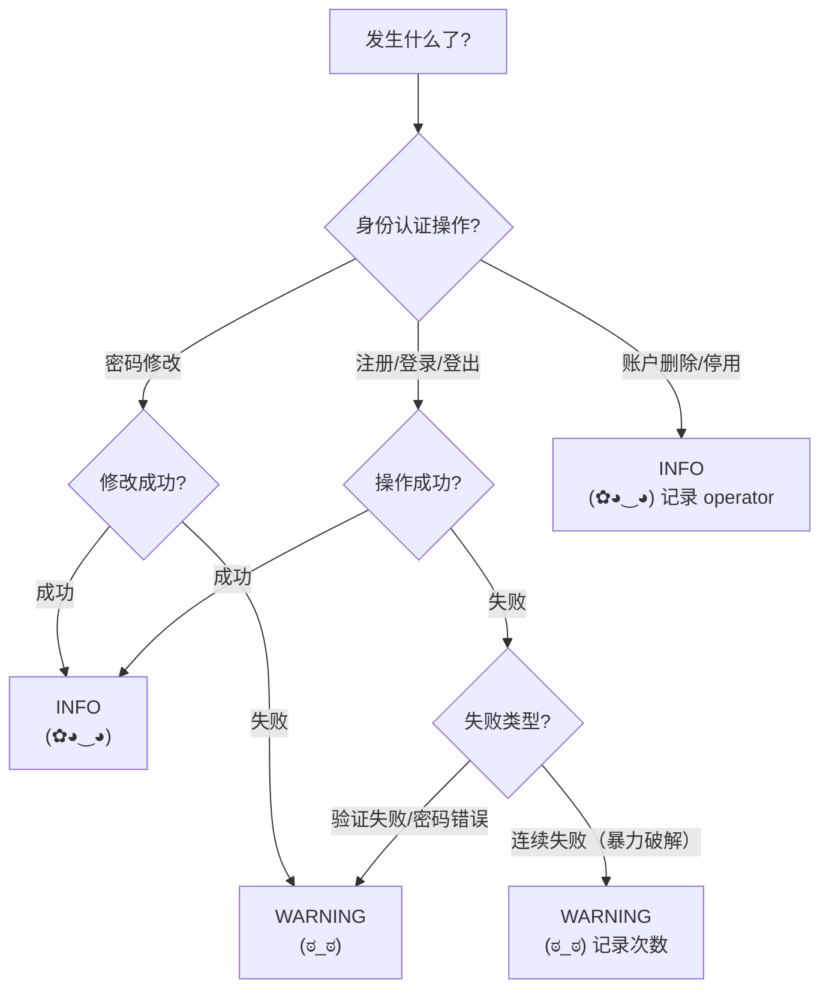

# Accounts App — 日志指南

> 配套：[根目录 LOGGUIDE.md](../LOGGUIDE.md)

---

## 日志级别快速参考

| Python Logger | Kaomoji | 含义 | 使用场景 |
|---------------|---------|------|---------|
| `logger.info()` | `(✿◕‿◕)` | 一切安好 | 注册成功、登录成功、密码修改成功 |
| `logger.warning()` | `(ಠ_ಠ)` | 不对劲了 | 登录失败、连续失败、注册失败 |
| `logger.error()` | `(╯°□°）╯︵ ┻━┻` | 出大问题了 | 账户操作异常（极少使用） |

### 日志级别决策树



---

## 职责边界

Accounts app 管理自定义用户模型 (`MyUser`)、注册、登录、密码修改。**用户认证操作具有安全敏感性，必须打日志但不得记录密码等敏感信息。**

---

## 日志点清单

### A. 注册

| 时机 | 级别 | 内容 |
|------|------|------|
| 注册成功 | INFO | user_id（不记邮箱！不记用户名！） |
| 注册失败 | WARNING | 失败原因（如"邮箱已存在"），不记具体邮箱 |

```python
# 注册成功
logger.info(f"User 注册: user_id={user.id}")

# 注册失败
logger.warning(f"User 注册失败: reason={reason}")
```

> **绝不记录**：明文密码、密码 hash、邮箱地址、手机号、真实姓名。

### B. 登录

| 时机 | 级别 | 内容 |
|------|------|------|
| 登录成功 | INFO | user_id |
| 登录失败 | WARNING | 用户名（非邮箱），失败原因（密码错误/用户不存在） |
| 连续失败 | WARNING | 用户名，连续失败次数（暴力破解检测） |

```python
# 登录成功
logger.info(f"User 登录: user_id={user.id}")

# 登录失败
logger.warning(f"User 登录失败: username={username} reason=invalid_password")

# 连续失败（如 3 次）
logger.warning(f"User 连续登录失败: username={username} attempts={attempt_count}")
```

> 如果需要反暴力破解：连续 5 次失败后打 `WARNING`，10 次后考虑临时锁定。

### C. 登出

| 时机 | 级别 | 内容 |
|------|------|------|
| 登出 | INFO | user_id |

```python
logger.info(f"User 登出: user_id={request.user.id}")
```

### D. 密码修改

| 时机 | 级别 | 内容 |
|------|------|------|
| 密码修改成功 | INFO | user_id |
| 密码修改失败 | WARNING | user_id, 失败原因 |

```python
# 密码修改成功
logger.info(f"User 密码修改: user_id={user.id}")

# 密码修改失败
logger.warning(f"User 密码修改失败: user_id={user.id} reason=old_password_mismatch")
```

> 同样，**绝不记录**新旧密码。

### E. 账户删除/停用

| 时机 | 级别 | 内容 |
|------|------|------|
| 账户停用 | INFO | user_id, operator_id（谁操作的） |
| 账户删除 | INFO | user_id, operator_id |

```python
logger.info(f"User 停用: user_id={target_user.id} operator={request.user.id}")
logger.info(f"User 删除: user_id={target_user.id} operator={request.user.id}")
```

### F. Django Admin 用户操作

Django Admin 中对 `MyUser` 的编辑操作已自动记录 `LogEntry → SecureLogEntry`。不需要在 `admin.py` 中额外加日志。

如需记录非 `LogEntry` 覆盖的操作（如自定义 Admin action），在对应方法中加：

```python
def make_inactive(self, request, queryset):
    for user in queryset:
        logger.info(f"Admin 停用 User: user_id={user.id} operator={request.user.id}")
    queryset.update(is_active=False)
```

---

## 不打日志的位置 (accounts)

| 位置 | 原因 |
|------|------|
| 每次请求的身份验证（`request.user` 获取） | 每个请求都触发，日志洪水 |
| 权限检查 | Django 内部操作，高频 |
| Session 读写 | Redis 操作，无需日志 |

---

## 安全规则（重点）

```
┌─────────────────────────────────────────────────┐
│  ❌ 绝不记录: 密码、密码 hash、邮箱、手机号        │
│  ❌ 绝不记录: Session key、Token、SECRET_KEY      │
│  ✅ 用 user_id 代替用户身份标识                   │
│  ✅ 记录登录失败但仅记录用户名（非邮箱）           │
│  ✅ 连续失败场景记录 attempts 次数                │
└─────────────────────────────────────────────────┘
```

---

## 与其他 App 对比

| App | 复杂度 | 日志量 | 主要日志来源 |
|-----|--------|--------|-------------|
| **accounts** | **低** | **低** | 登录/注册/密码修改 |
| Blogs | 高 | 高 | 文章 CRUD + 修订 + diff |
| comment | 中 | 中 | 评论提交 + 审核 |
| security | 中 | 低 | 审计链验证 |
| boards | 低 | 极低 | seed 命令（一次性） |
| config | 低 | 低 | 侧边栏配置变更 |
| music | 空壳 | 无 | 暂无功能 |
