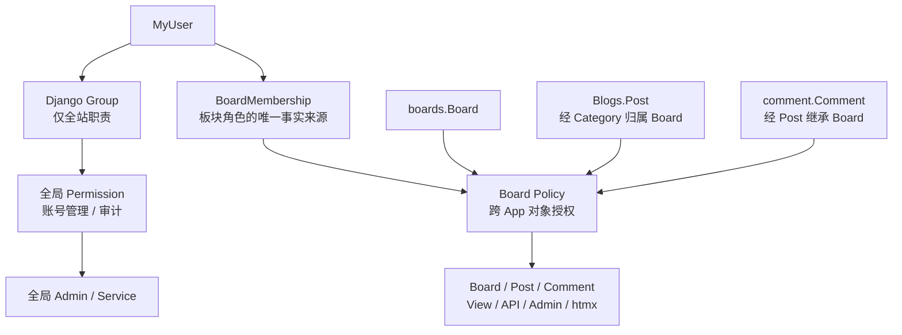
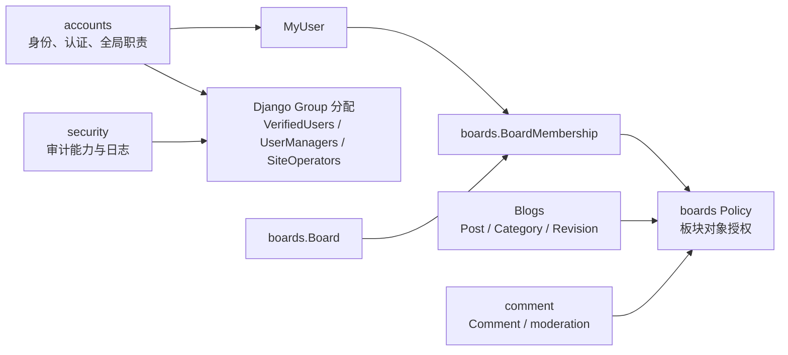
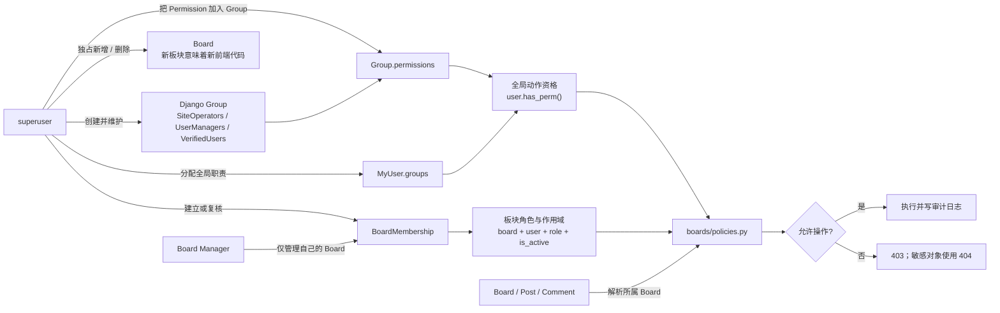
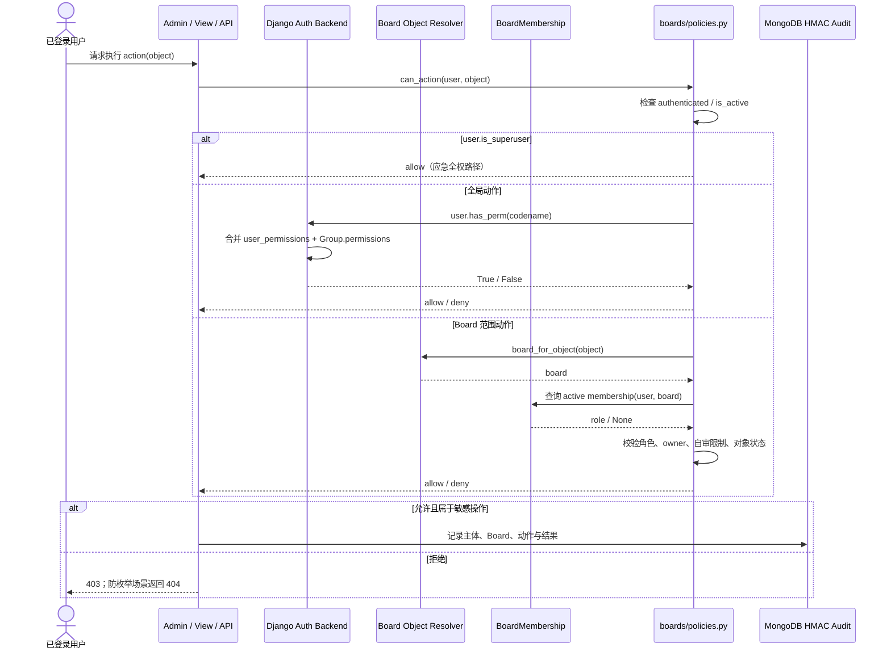

# Accounts 权限颗粒度设计指南（Board Scope）

> **文档权重**：90（当前 Board Scope 权限与 `accounts_linear` 主设计）
> **归档模块**：`accounts/`
> **主要作用域**：`boards.Board`
> **文档职责**：治理整个授权架构；BoardMembership、申请审批与 Policy 的实现归 `boards` App
> **状态**：`accounts_linear` 阶段 0–5 已完成；下一步为全局 Group 初始化与 BoardAccessRequest 自动审批
> **日期**：2026-07-19（完成 Admin、状态 Service、普通 View、上传、修订端点与只读 API 的统一 Policy）
> **目标**：以后续功能围绕 Board 展开，在不引入第三方对象权限库的前提下实现最小权限、职责分离和可测试的板块级授权。

## 1. 当前问题

Stage 4 前，`BoardAdmin` 继承 `DashboardAdminMixin`，实际权限只有一个全局开关：

```text
is_dashboard_user=True → 仍可查看、修改所有现有 Board
is_superuser=True      → 可以新增、删除 Board
```

Stage 4 已在 Dashboard Admin 修复这条全量访问路径；当前缺口转移到审核 action、上传、普通 View 和 DRF API。Board 与 Post 仍通过 `Board.category → Post.category` 间接关联，Comment 再通过 Post 继承板块归属，因此所有剩余入口仍必须复用同一跨 App Policy，不能回退到全局旗标。

本项目的 Board 不是可由业务用户动态扩张的论坛分区。每个新 Board 都伴随独立的模板、SVG、CSS 或 JavaScript，因此新增和删除 Board 属于代码结构变更，只允许 superuser；`BoardCreators` 全局 Group 不再进入设计。

## 2. 推荐的三层授权模型



| 层级 | 职责 | 示例 |
|---|---|---|
| Group | 仅承载不带 Board 范围的全站职责 | `SiteOperators`、`UserManagers` |
| Permission | 全局模型或运维动作能力 | `security.run_integrity_audit`、`accounts.manage_user_accounts` |
| BoardMembership | 用户在某个 Board 内是什么角色 | Coding 的 Editor、Music 的 Reviewer |
| Policy | 结合板块角色、对象归属、作者和状态作最终判断 | 只能编辑所属 Board 的文章 |

`is_active`、`is_staff`、`is_superuser` 保留 Django 原生语义；`is_dashboard_user` 暂时只作为 dashboard 入口开关，不再代表具体业务权限。`is_reviewer` 在迁移完成后可删除。

### 2.1 App 职责边界



| App | 拥有的业务事实 | 不应承担 |
|---|---|---|
| `accounts` | MyUser、登录/登出、账号启停、邮箱/证书验证、MFA、全局 Group 的编排与用户归组 | Board 角色、板块申请审批、Post/Comment 对象授权 |
| `boards` | Board、BoardMembership、角色矩阵、Policy、未来的 BoardAccessRequest 与审批服务 | 密码、登录、MFA、全局 Group 管理 |
| `Blogs` | Post、Category、文章状态机、修订及 Blogs Permission 定义 | 判断用户属于哪个 Board 或复制 Membership 规则 |
| `comment` | Comment、评论状态、提交与审核执行及 comment Permission 定义 | 自行判断 Reviewer 的 Board 范围 |
| `security` | 审计日志、完整性能力及 security Permission 定义 | 分配 Board 角色或维护用户 Group 关系 |

判断口诀：`accounts` 回答 **Who are you globally?**；`boards` 回答 **What can you do here?**。业务 App 拥有自己的模型和动作，在入口处调用 `boards.policies`，不把 Policy 复制回各 App。

`accounts/PERMISSIONS_GUIDE.md` 继续放在 accounts，是因为它治理全局身份、Group 与 Board Scope 的协作边界；这不表示 Board Policy 或 Membership 模型属于 accounts。

## 3. 建议数据模型

```python
class BoardMembership(models.Model):
    class Role(models.TextChoices):
        CONTRIBUTOR = 'contributor', '投稿者'
        EDITOR = 'editor', '编辑者'
        REVIEWER = 'reviewer', '审核者'
        MANAGER = 'manager', '板块管理员'

    board = models.ForeignKey(Board, on_delete=models.CASCADE, related_name='memberships')
    user = models.ForeignKey(settings.AUTH_USER_MODEL, on_delete=models.CASCADE,
                             related_name='board_memberships')
    role = models.CharField(max_length=16, choices=Role.choices)
    is_active = models.BooleanField(default=True)
    created_by = models.ForeignKey(settings.AUTH_USER_MODEL, null=True, blank=True,
                                   on_delete=models.SET_NULL,
                                   related_name='created_board_memberships')
    created_at = models.DateTimeField(auto_now_add=True)

    class Meta:
        constraints = [
            models.UniqueConstraint(fields=['board', 'user'], name='unique_board_member'),
        ]
```

第一阶段继续使用 `Board.category` 判断文章所属板块。若未来一个分类可进入多个 Board，或一篇文章可跨板块展示，再增加明确的 `Post.board` 或中间表，不要长期依赖隐式推断。

## 4. 板块内角色建议

| 能力 | 普通用户 | Contributor | Editor | Reviewer | Manager | SiteOperator | superuser |
|---|:---:|:---:|:---:|:---:|:---:|:---:|:---:|
| 查看公开板块/文章 | ✅ | ✅ | ✅ | ✅ | ✅ | ✅ | ✅ |
| 在所属板块投稿 | — | ✅ | ✅ | — | ✅ | — | ✅ |
| 编辑自己的草稿 | — | ✅ | ✅ | — | ✅ | — | ✅ |
| 编辑自己已提交/发布的文章 | — | — | ✅，发布内容回退草稿 | — | ✅，发布内容回退草稿 | — | ✅ |
| 编辑他人正文 | — | — | ⚠️ 可选 | — | ✅ | — | ✅ |
| 提交审核 | — | ✅ | ✅ | — | ✅ | — | ✅ |
| 查看所属板块审核队列 | — | — | — | ✅ | ✅ | — | ✅ |
| 通过/驳回他人文章 | — | — | — | ✅ | ✅ | — | ✅ |
| 审核自己的文章 | — | — | — | ❌ | ❌ | — | ✅ |
| 管理评论 | — | — | — | ✅ | ✅ | — | ✅ |
| 修改 Board 运营文案/关键词 | — | — | — | — | ✅ | — | ✅ |
| 修改 Board slug/前端代码绑定 | — | — | — | — | ❌ | — | ✅ |
| 管理板块成员 | — | — | — | — | ✅ | — | ✅ |
| 查看/运行全站审计 | — | — | — | — | — | ✅ | ✅ |
| 创建/删除 Board | — | — | — | — | ❌ | ❌ | ✅ |

建议默认不允许 Editor 修改他人正文；需要协作编辑时再单独开放，并保留修订记录。Reviewer 只负责审核，不能直接改正文。

## 5. 建议 Permission 划分

Permission 由动作所属的 App 定义；`accounts` 只负责把真正的全局 Permission 编排进 Group，并管理用户的全局 Group 归属。Board 范围动作即使存在 codename，也由 `boards.policies` 结合 Membership 作最终裁决。

### Boards

```text
boards.apply_board_access
boards.view_board_dashboard
boards.change_board_settings
boards.activate_board
boards.manage_board_members
```

Board 的新增和删除不通过 Group 分配：只使用 superuser 边界。上述 Board 内 codename 是 Policy 动作标识，不表示要把 Contributor / Editor / Reviewer / Manager 写入 Django Group。

### Blogs

```text
Blogs.create_board_post
Blogs.change_own_board_post
Blogs.change_any_board_post
Blogs.submit_board_post
Blogs.view_board_review_queue
Blogs.review_board_post
Blogs.publish_board_post
Blogs.unpublish_board_post
Blogs.view_staff_post
```

### Comment / Security

```text
comment.moderate_board_comment
security.view_audit_log
security.run_integrity_audit
```

### Accounts

```text
accounts.manage_user_accounts
```

Django 自带的 `add/change/delete/view` 权限继续保留；自定义权限用于表达业务语义，避免把 `change_post` 同时解释成编辑、审核和发布。

## 6. 统一 Policy 建议

所有 View、API、Admin 和模板调用同一组纯函数，避免重复手写布尔判断：

```python
can_access_dashboard(user)
get_board_role(user, board)
can_create_post(user, board)
can_edit_post(user, post)
can_submit_post(user, post)
can_review_post(user, post)
can_manage_comments(user, board)
can_change_board_settings(user, board)
can_manage_board_members(user, board)
```

关键约束：

```python
def can_review_post(user, post):
    board = board_for_post(post)
    return (
        user.is_superuser
        or (
            get_board_role(user, board) in {'reviewer', 'manager'}
            and post.owner_id != user.id
        )
    )
```

权限失败对外统一返回 403；隐藏内容和 STAFF_ONLY 内容为避免泄露是否存在，继续返回 404。

## 7. Django Group / Permission 如何与 Board 权限协作

Django 原生授权和板块授权解决的是两个不同维度：

| 组件 | 回答的问题 | 是否带 Board 范围 |
|---|---|:---:|
| `Permission` | 系统中是否定义了某个动作 | ❌ |
| `Group.permissions` | 哪类全局角色默认获得哪些动作 | ❌ |
| `user_permissions` | 某个用户的少量例外授权 | ❌ |
| `BoardMembership` | 用户在某个 Board 中担任什么角色 | ✅ |
| Policy | 此用户现在能否对这个对象执行该动作 | ✅，最终裁决 |

Django 的 `user.has_perm()` 默认只判断全局权限。即使 Permission 的名字包含 `board`，它也不会自动理解“只能操作 Coding Board”。因此任何 Board 对象操作都不能只调用 `has_perm()`；必须进入统一 Policy，并同时检查对象所属 Board。

### 7.1 推荐协作规则

1. `Group` 只打包真正跨 Board 的全局职责，不表示任何板块角色，也不为每个 Board 动态创建 Group。
2. `BoardMembership.role` 是板块内角色的唯一事实来源，负责 Contributor / Editor / Reviewer / Manager。
3. Policy 先处理 `is_active` 与 `is_superuser`，再根据动作分别检查全局 Permission 或 BoardMembership。
4. Board 范围内的编辑、审核、成员管理必须命中相应 Membership；拥有同名全局 Permission 也不能绕过范围检查。
5. `user_permissions` 只用于临时或极少量全局例外，不用于代替 Membership。

推荐的全局 Group：

| Group | 用途 |
|---|---|
| `SiteOperators` | 查看并运行审计，不具备文章或成员管理权 |
| `UserManagers` | 激活账号、分配板块成员；不能授予 superuser/staff |
| `VerifiedUsers` | 邮箱验证后的基础组，可提交 Board 权限申请；不直接获得任何 Board 操作权 |

Contributor、Editor、Reviewer、Manager 属于板块内角色，应放在 `BoardMembership.role`，否则用户加入 `Editors` Group 后会自动获得所有板块的编辑能力，违反最小权限原则。

### 7.2 权限配置的实际交互



职责边界：

- superuser 维护 Group、Group 中的 Permission，以及用户的全局 Group 归属。
- Manager 只能在自己管理的 Board 中增删 Membership，不能分配 Group、`user_permissions`、`is_staff` 或 `is_superuser`。
- Group 变化只影响全局职责；Membership 变化只影响指定 Board 及其关联的 Post / Comment。
- 两类配置都只提供 Policy 输入，不能绕过 Policy 直接授权对象操作。

### 7.3 一次请求中的实际判定顺序



上述流程中的关键点是：Django Auth Backend 会合并用户直接权限和其所有 Group 的权限，但它不解析 Board；BoardMembership 也不产生 Django 全局 Permission。两者只在 Policy 层汇合。

### 7.4 最终判定方式

```python
def can_review_post(user, post):
    if not user.is_authenticated or not user.is_active:
        return False
    if user.is_superuser:
        return True

    membership = get_active_membership(user, board_for_post(post))
    return (
        membership is not None
        and membership.role in {Role.REVIEWER, Role.MANAGER}
        and post.owner_id != user.id
    )
```

全局 Group 动作仍走 Django Permission；Board 新增是本项目的 superuser 专属结构变更：

```python
def can_create_board(user):
    return user.is_active and user.is_superuser
```

这意味着 Group 和 Membership 可以叠加，但不会互相扩大作用域。例如，一个用户可以属于 `SiteOperators` Group，同时只是 Music Board 的 Reviewer：他可以执行全站日志完整性审计，也只能审核 Music Board 中他人提交的文章。Board 的新增和删除仍只属于 superuser。

### 7.5 Admin 中的协作边界

Django Admin 的全局账号和审计模块可以使用 Group Permission 决定菜单和入口是否出现；涉及 Board、Post 或 Comment 时，模块入口、`has_change_permission()`、action、queryset 过滤和保存路径都必须调用 Board Policy。隐藏按钮只是界面层，后端 Policy 才是授权边界。

首期不建议建立 `CodingEditors`、`MusicEditors` 这类组合 Group。Board 增多后会形成“板块数 × 角色数”的 Group 膨胀，也容易发生 Group 与 Membership 状态漂移。

## 8. 推荐迁移顺序

1. 为 Board、Blogs、comment、security 增加业务 Permission。
2. 新建 `BoardMembership` 和数据迁移。
3. 将现有 `is_dashboard_user=True, is_reviewer=False` 用户迁为默认 Board 的 Editor/Manager，由 superuser 人工复核。
4. 将 `is_reviewer=True` 用户迁为相应 Board 的 Reviewer。
5. 建立 `boards/policies.py`，先让测试使用，再逐步替换 View/API/Admin 判断。
6. dashboard 入口保留 `is_dashboard_user`，模型操作改查 Policy。
7. 权限矩阵测试通过后，停止读取 `is_reviewer`。
8. 最后删除 `is_reviewer` 字段；是否删除 `is_dashboard_user` 另行评估。

不要在同一个迁移中同时创建 Membership、迁数据、删除旧字段，确保每一步可回滚和核验。

## 9. 必测矩阵

- 普通用户不能进入 dashboard，也不能上传正文图片。
- Contributor 只能在所属 Board 投稿和编辑自己的草稿。
- Editor 不能编辑其他 Board 的文章。
- Reviewer 只能看到所属 Board 的审核队列，且不能审核自己的文章。
- Manager 不能查看全站审计，除非同时属于 `SiteOperators`。
- SiteOperator 不能编辑文章、评论或 Board 配置。
- 被停用的 Membership 立即失效。
- superuser 始终可恢复和管理系统。
- View、API 与 Admin 对同一操作给出一致结果。

## 10. 决策建议

| 决策 | 建议 |
|---|---|
| 是否引入 django-guardian | 暂不引入；BoardMembership + Policy 足够，未来对象规则爆炸时再评估 |
| 审核者能否改正文 | 默认不能 |
| 能否审核自己文章 | 禁止，superuser 应急除外 |
| Manager 能否查看审计 | 默认不能，职责与 SiteOperator 分离 |
| 一个用户能否有多个板块角色 | 首期每个 Board 一个互斥角色；不同 Board 可不同。角色变更不表示能力必然累计 |
| Group 是否表示 Editor/Reviewer | 不建议，避免权限扩散到全部 Board |

## 11. 已知风险 / TODO

| 严重度 | 问题 | 建议 |
|---|---|---|
| ✅ | dashboard 用户可修改全部现有 Board | Stage 4 已按 Manager Membership 限定 queryset；slug/category/is_active 只允许 superuser 修改 |
| ✅ | 普通 View/API 与遗留状态动作读取全局旗标 | Stage 5 已改调 Board Policy/Service，并固定跨 Board、staff 旁路与禁止自审测试 |
| 🟡 中 | Board 与 Post 仅通过 Category 间接关联 | 第一阶段封装 `board_for_post()`；未来按产品关系显式建模 |
| 🟡 中 | `/super_admin/` 仍采用 Django 默认 `is_staff` 入口语义 | 当前仅 superuser 创建流程授予 `is_staff`；引入非 superuser staff 前，需确保 Board 模型入口仍调用 Policy 或显式限制为 superuser |
| ✅ | View/API 权限判断分散 | Admin、普通 View、上传、修订端点和只读 API 均已收敛到 `boards.policies` |
| 🟡 中 | BoardMembership 与全局 Group 仍需手工配置 | Stage 6a 初始化全局 Group；Stage 6b 用 BoardAccessRequest/审批 Service 自动写入 Membership |
| ✅ | 角色矩阵、ORM Policy 与跨入口拒绝路径已有测试 | Stage 4–5 新增 17 个测试；加入手测账号/导航契约后完整测试集 70 个通过 |

## 12. accounts_linear

以下步骤严格按顺序推进；每一步完成验收后再进入下一步，避免同时修改模型、数据和所有入口。

`accounts_linear` 名称为既有路线标识，继续保留以便 Agent 交接；从阶段 2 开始，BoardMembership、Policy、BoardAccessRequest 和审批服务的代码所有权均属于 `boards`，accounts 只参与用户身份和全局 Group 部分。

| 阶段 | 工作 | 完成条件 |
|---:|---|---|
| 0 ✅ | 固化角色矩阵、Group 名称和 Permission codename | 2026-07-19 修订：移除 BoardCreators，Board 新增/删除仅限 superuser；未改运行时授权入口 |
| 1 ✅ | 先写 Policy 拒绝路径与角色矩阵测试 | `boards/tests/test_access_rules.py` 已覆盖跨 Board、禁止自审、停用成员与角色矩阵 |
| 2 ✅ | 新建 `BoardMembership` 模型、约束和 Admin 只读观察入口 | 2026-07-13 已完成；同一用户在同一 Board 只有一条记录，观察入口仅限 superuser |
| 3 ✅ | 实现 `boards/policies.py` 与跨 App Board resolver | 2026-07-19 已完成；12 个新增 Admin/Policy 测试通过，尚不替换旧入口 |
| 4 ✅ | 接入 Board/Post/PostRevision/Comment 的 queryset、对象与关键字段权限 | 2026-07-19 已完成；跨 Board URL、表单 Category、作者保持与只读审核队列均有测试 |
| 5 ✅ | 接入审核 action、上传接口、普通 View/API | 2026-07-19 已完成；状态 Service 逐对象校验，API 暂定只读并明确拒绝写方法 |
| 6a | accounts 创建全局 Group 并迁移全局身份 | Group 只承载 VerifiedUsers、UserManagers、SiteOperators 等全站职责 |
| 6b | boards 实现 BoardAccessRequest、审批与 Membership 迁移 | Manager/superuser 审批边界生效，用户无需手工勾选权限 |
| 7 | 停止读取 `is_reviewer`，观察一个发布周期 | 日志中无旧字段授权路径，回归测试全部通过 |
| 8 | 删除 `is_reviewer`；单独评估 `is_dashboard_user` | 迁移可回滚，文档与权限矩阵同步更新 |

### 12.1 阶段 0 冻结结果

#### 角色语义

| 角色 | 能力定位 | 是否继承前一角色 |
|---|---|:---:|
| Contributor | 投稿、编辑自己的草稿、提交审核 | — |
| Editor | Contributor 能力；可编辑自己的已提交/发布文章，发布内容修改后回退草稿；不能编辑他人正文 | ✅ |
| Reviewer | 查看审核队列、审核/发布他人文章、管理评论；不能编辑正文 | ❌，职责分离 |
| Manager | 投稿、编辑、审核、评论、运营文案和成员管理；不能创建/删除 Board 或修改前端代码绑定 | 组合角色，但仍禁止自审 |

首期 `BoardMembership` 对 `(board, user)` 保持唯一，一次只有一个角色。Editor 切换为 Reviewer 后会失去编辑能力；确实需要同时编辑与审核时，应申请 Manager，而不是给同一 Board 堆叠多个隐式角色。

#### Group 与 Permission 固定名称

| Group | 自动获得的 Permission | 分配者 |
|---|---|---|
| `VerifiedUsers` | `boards.apply_board_access` | 邮箱验证服务自动加入 |
| `SiteOperators` | `security.view_audit_log`、`security.run_integrity_audit` | superuser |
| `UserManagers` | `accounts.manage_user_accounts` | superuser |

Board 内动作的 codename 继续采用第 5 节定义，但不放入全局 Group；Policy 将其作为动作标识，与 Membership role 对照。Django Group 不创建 Contributor/Editor/Reviewer/Manager，也不创建 `CodingEditors` 之类的动态组。

Board 新增和删除由 superuser 独占，不建立 `BoardCreators` Group。原因不是 Django 无法表达 `add_board`，而是本项目新增 Board 等价于引入一组新的前端代码和部署变更，不属于可委派的日常业务操作。

#### 审批边界

- Manager 可审批自己 Board 的 Contributor、Editor、Reviewer 申请及三者之间的角色变更。
- Manager 不得审批自己的申请，不得授予 Manager、全局 Group、`is_staff` 或 `is_superuser`。
- Manager 申请、全局 Group 申请和权限恢复只能由 superuser 审批。
- superuser 保留应急全权，但审批服务仍记录操作者、申请人、Board、原角色、目标角色和结果。

#### 阶段 1 测试边界

阶段 1 只建立不访问数据库的纯规则内核 `boards/access_rules.py`，用于冻结角色矩阵和拒绝条件；它尚未替换任何 View/Admin/API。阶段 2 创建 Membership，阶段 3 再由 `boards/policies.py` 将 ORM 对象适配到这些规则。

### 12.2 阶段 2 实现结果

- `boards.models.BoardMembership` 已实现 Contributor / Editor / Reviewer / Manager 单角色模型。
- 数据库约束 `unique_board_member` 保证同一 `(board, user)` 只有一条记录；角色变化和停用直接更新原记录。
- `created_by` 使用 `SET_NULL`，允许系统初始化或迁移记录没有人工创建者，同时保留成员本身。
- `/super_admin/boards/boardmembership/` 提供完全只读的观察入口，仅激活的 superuser 可见；在 Board 范围 queryset 落地前不注册到 `/dashboard/`。
- ORM、角色枚举对齐、唯一约束和 Admin 拒绝路径已有 5 个测试；完整测试集共 28 个测试通过。
- 本阶段没有改变任何 View、API、BoardAdmin 或 PostAdmin 的运行时授权逻辑。

### 12.3 阶段 3 实现结果

- `boards.policies` 成为 Board、Post、Comment 业务授权的统一 ORM 适配入口。
- `board_for_post()` 通过 Category 解析 Board；未映射或同一 Category 对应多个 Board 时返回 `None`，默认拒绝。
- `board_for_comment()` 通过 Comment → Post → Category → Board 继承相同作用域。
- `get_active_membership()` 同时要求账号、Board 和 Membership 有效。
- Contributor / Editor / Reviewer / Manager 的创建、编辑、提交、审核、发布、评论管理、运营设置和成员管理规则已接入阶段 1 的纯规则内核。
- Contributor 提交文章补充“必须是作者本人”的拒绝条件；Reviewer 与 Manager 继续禁止自审和自发布。
- Django `user_permissions` 即使拥有 `Blogs.change_post` 也不能扩大 Board Scope，已有回归测试固定该边界。
- `can_create_board()`、`can_delete_board()` 和 `can_change_board_structure()` 只允许激活的 superuser。
- `BoardAdmin` 已先行禁止普通 dashboard 用户新增和删除 Board；修改现有 Board 的字段级 Policy 留给阶段 4。
- 完整测试集共 40 个测试通过；本阶段仍未替换任何 Post/Comment View、Admin action 或 API 授权入口。

### 12.4 阶段 4 实现结果

- `BoardAdmin` 只向 Manager 展示其有效 Membership 所属 Board；Manager 可维护运营文案、颜色、关键词和排序，但 `slug`、`category`、`is_active` 以及新增/删除仍为 superuser 边界。
- `PostAdmin` 不再读取全局 `is_reviewer` 决定对象范围：Contributor/Editor 只见自己的所属板块文章，Reviewer/Manager 可见所属板块全部文章；Reviewer 只读，Manager 可编辑。
- Post 新建表单与 Category autocomplete 仅返回用户具有创建能力且 Category→Board 映射唯一的分类；缺失或重复映射继续默认拒绝。
- `PostAdmin` 已移除会在 Manager 编辑他人文章时覆盖 `owner` 的 `BaseOwnerAdmin` 行为，并由测试保证作者保持不变。
- `PostRevisionAdmin` 继承其 Post 的可见范围；dashboard Comment 队列仅对所属 Board 的 Reviewer/Manager 可见，阶段 4 保持只读。
- 非 superuser 的提交、审核、发布、驳回和评论批量审核 action 暂不开放，避免在阶段 5 对状态流转逐项接入 Policy 前形成批量越权入口。
- `boards/tests/test_admin_scope.py` 新增 8 个运行时隔离测试，包括直接访问跨 Board change URL 无法读取或修改对象；完整测试集 56 个全部通过，Django system check 为 0。

### 12.5 阶段 5 实现结果

- 新增 `Blogs/services.py`，提交、通过、驳回、下架均在事务中锁定 Post，并在状态变更前重新调用 Board Policy；Admin action 不再使用批量 `queryset.update()`。
- Dashboard 文章 action 按用户在不同 Board 的 Membership 动态组合；Reviewer/Manager 的评论 action 逐对象调用 `can_moderate_comment()`，继续复用 MongoDB HMAC 审计服务。
- 删除 `DashboardAuthorMixin` 与 `LoggingMixin`，PostCreateView/PostEditView 显式调用 Policy；新建文章强制 DRAFT，编辑已提交或已发布文章自动退回 DRAFT，且保持原作者。
- PostForm、图片上传、STAFF_ONLY 文章、修订正文/diff 与评论提交入口均使用 Board 能力；单独拥有 `is_staff` 不再绕过内部文章范围。
- Devenir 的“新文章/编辑”按钮按 Policy 结果渲染；Category 页面移除未区分用户的片段缓存，避免内部文章 HTML 被共享给匿名用户。
- Post/Category DRF ViewSet 收敛为 Policy-scoped `ReadOnlyModelViewSet`；匿名用户只见公开已发布文章，Board Reviewer/Manager 可见所属 Board 内部文章，所有写方法返回 405。
- Category dashboard 结构管理收紧为 superuser-only；Tag 继续作为全局词汇管理，后续随 Group 初始化复核。
- Stage 5 新增 7 个跨入口测试，Stage 4 增补 2 个 action 测试；完整测试集 65 个全部通过，Ruff 与 Django system check 均通过。

当前下一步为 **阶段 6a：初始化并迁移 VerifiedUsers/UserManagers/SiteOperators 全局 Group；随后阶段 6b 实现 BoardAccessRequest、审批 Service 与 Membership 自动写入**。

## 13. 参考依据

- [Django 5.2：用户、Group 与 Permission](https://docs.djangoproject.com/en/5.2/topics/auth/default/#groups)
- [Django 5.2：自定义授权后端](https://docs.djangoproject.com/en/5.2/topics/auth/customizing/#handling-authorization-in-custom-backends)
