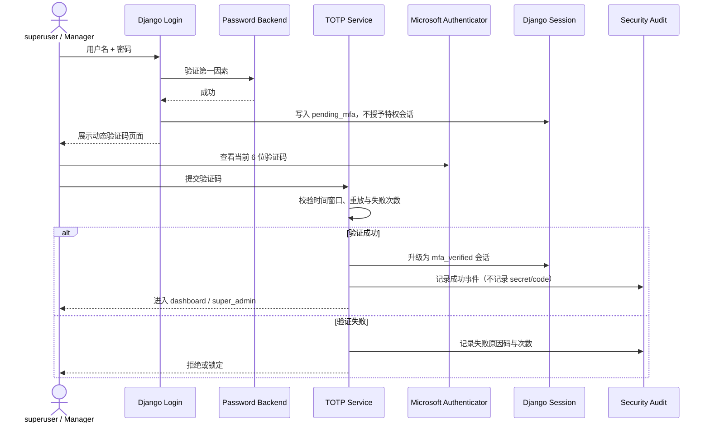
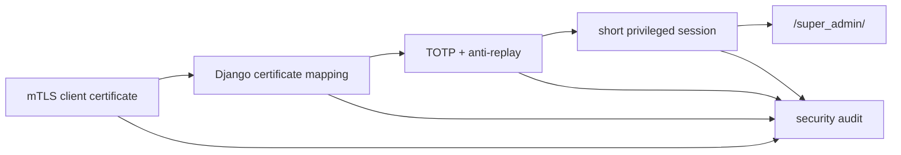
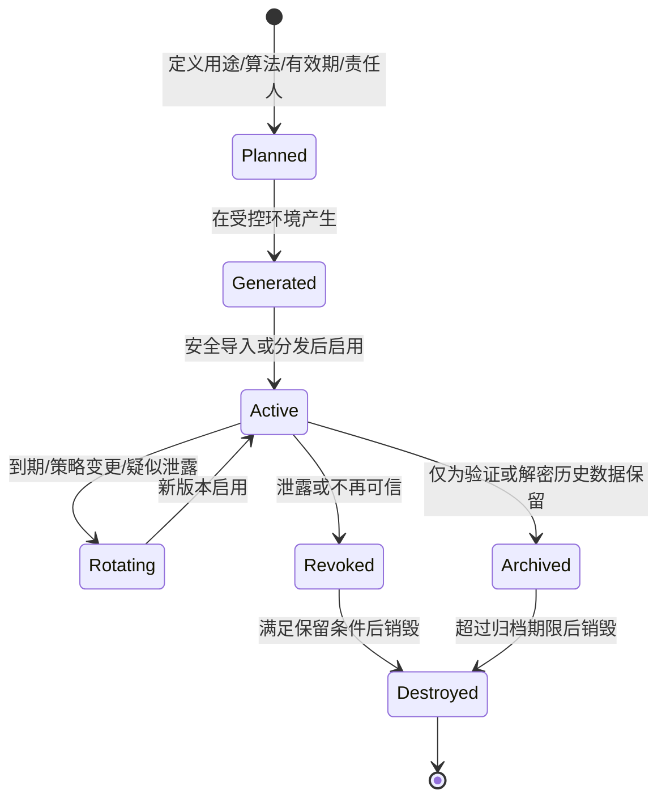

# Accounts 安全能力路线图

> **文档权重**：88（v2.5+ 安全规划；状态为规划时不得视为已实现）
> **模块**：`accounts/`、`security/`
> **状态**：规划，尚未实施
> **日期**：2026-07-22
> **版本原则**：复杂安全能力默认进入 v2.5+；若前置测试、运维方案和回滚路径提前成熟，可以前移，但不以赶版本为目标。

## 1. 目标与边界

后续安全建设分为三条相互依赖但可独立验收的路线：

1. v2.4：完成 Board Scope 权限颗粒化，为 Manager 身份提供可靠定义。
2. v2.5：为 superuser 建立客户端证书绑定 + TOTP，为 Board Manager 强制启用 TOTP，并以 mTLS 隔离 `/super_admin/`。
3. v2.5+：以密评要求为参照，实践密钥从产生到销毁的全生命周期管理。

这里的“密评实践”是个人项目的合规导向自我验证，不等同于正式商用密码应用安全性评估，也不声称达到某一等级。正式评估还涉及适用范围、合规密码产品、管理制度、运行记录和有资质的评估活动。

## 2. 版本路线

| 版本 | 目标 | 是否修改运行时 | 进入条件 |
|---|---|:---:|---|
| v2.4 | `accounts_linear`：Group + Permission + BoardMembership + Policy | ✅ | 权限矩阵和拒绝路径测试先完成 |
| v2.4.x | 密钥资产清单、用途分类、威胁模型、轮换演练文档 | ❌ 为主 | 不阻塞 Board 权限实施 |
| v2.5 | superuser 证书绑定 + TOTP、Manager 强制 TOTP、`/super_admin/` mTLS | ✅ | Manager 身份稳定；客户端 CA、恢复与回滚方案完成 |
| v2.5+ | 密钥版本、轮换、备份恢复、归档撤销、销毁与审计 | ✅ | 先完成密钥清单和恢复演练设计 |
| v2.6+ 候选 | Passkey、外部 IdP/Entra、硬件或合规密码设备 | ✅，复杂 | 仅在个人站实际需要时评估 |

版本号是实施窗口，不是完成承诺。任何复杂项都可以后移；若依赖和验收条件提前满足，也可以作为较早版本的可选增强。

## 3. TOTP 动态验证码规划

### 3.1 推荐方案

首期使用标准 TOTP：6 位验证码、30 秒周期，通过 `otpauth://` QR Code 绑定。Android Microsoft Authenticator 可按“其他账户”扫描此类二维码；这条路线不依赖 Microsoft Entra，也不提供 Microsoft 推送批准能力。



### 3.2 强制范围

- `is_superuser=True`：强制绑定并在特权登录时验证。
- 任意有效 `BoardMembership.role=manager`：强制验证后才能进入 dashboard。
- 普通 Contributor / Editor / Reviewer：首期不强制，后续可配置扩展。
- `SiteOperators`、`UserManagers`：安全上也属于高权限角色，v2.5 实施前应决定是否一并强制；默认建议强制。

### 3.3 必须具备的安全控制

| 严重度 | 控制 | 验收要点 |
|---|---|---|
| 🔴 高 | TOTP secret 加密存储且禁止进入日志 | 数据库泄露时不能直接读取 seed；日志中无 QR URI、secret、验证码 |
| 🔴 高 | 两阶段 Session | 仅密码成功的 `pending_mfa` 会话不能访问任何特权入口 |
| 🔴 高 | 防重放与限流 | 同一时间步验证码不能重复使用；失败计数独立于密码锁定 |
| 🔴 高 | MFA 重置保护 | 重置需重新验证密码并由更高权限复核；全过程写 HMAC 审计 |
| 🟡 中 | 恢复码 | 一次性恢复码仅保存 hash，展示一次，使用后立即作废 |
| 🟡 中 | 时钟与容差 | 服务端时间同步；只接受经过测试的最小时间窗口 |
| 🟡 中 | 角色变化 | 用户获得 Manager 后必须先完成绑定；失去全部特权角色后按策略保留或撤销设备 |
| 🟢 低 | 多设备绑定 | 首期可限制单设备，稳定后再支持多个独立 TOTP device |

### 3.4 明确不在首期实现

- 不接 Microsoft Authenticator 推送通知或号码匹配。
- 不依赖 Microsoft Entra tenant。
- 不以邮件或短信作为同等级 MFA 因素。
- 不在 v2.5 同时引入 Passkey/WebAuthn，避免扩大恢复和兼容性范围。

## 3A. superuser 客户端证书与 `/super_admin/` mTLS

### 3A.1 目标认证链

superuser 访问管理后台时同时经过：

1. Nginx mTLS：验证客户端证书链、有效期和撤销状态，未通过的请求不进入 Django。
2. Django 证书绑定：将 Nginx 传入的 verified 状态、证书序列号 / Subject DN 与 `MyUser.cert_sn`、`cert_subject_dn`、`is_cert_verified` 匹配。
3. TOTP：证书身份通过后再校验动态验证码、重放和失败限流，升级为短时 privileged session。

目标产品形态可以是“证书 + TOTP 登录”，但首轮默认不直接删除密码因素。客户端证书和手机 TOTP 都可能属于 possession factor，尤其二者放在同一设备时并不天然等于两类独立因素；是否无密码化必须经过单独威胁模型与恢复评审。

### 3A.2 Nginx 部署建议

优先建立独立管理域名 / vhost：

```text
public poweradapter.xyz       -> 普通博客，不请求客户端证书
admin.poweradapter.xyz        -> ssl_verify_client on -> 仅代理 /super_admin/
```

Nginx 官方 `ssl_verify_client` 的配置上下文是 `http` / `server`，不是任意 `location`。因此独立 vhost 比在整站 `server` 上设置 `optional` 再按路径判断更清晰，也不会让普通访客遇到客户端证书选择提示。公网站点上的 `/super_admin/` 应拒绝访问或跳转到管理域名，不能保留一个绕过 mTLS 的平行入口。

传递给 Django 的客户端证书信息必须满足：

- 仅在 `$ssl_client_verify = SUCCESS` 时转发；
- Nginx 覆盖或清除外部传入的同名 Header，避免伪造；
- 优先传递序列号、Subject DN、fingerprint 等最小标识，不默认传递完整 PEM；
- Gunicorn 继续只监听 Unix socket / 本机可信链路，不能开放一个绕过 Nginx 的公网端口；
- Nginx 配置更新必须先 `nginx -t`，并保留独立的 break-glass / 回滚操作流程。

### 3A.3 证书生命周期

| 阶段 | 必须定义 | 证据 / 验收 |
|---|---|---|
| 签发 | 独立 Client CA、用途限制、有效期、唯一序列号 | 证书清单不含私钥；错误 CA 被拒绝 |
| 分发 | 私钥生成位置、加密容器、Android/桌面导入步骤 | 私钥不经聊天、邮件或仓库明文传递 |
| 绑定 | serial + Subject DN/fingerprint 与 MyUser 的绑定审批 | 只能绑定 active superuser；重复绑定拒绝 |
| 使用 | mTLS SUCCESS + Django mapping + TOTP | 任意一层失败均不能获得 privileged session |
| 续期 | 新旧证书短暂并行窗口 | 可无停机切换且旧证书按期失效 |
| 吊销 | 丢失、离职、疑似泄露时的 CRL/OCSP 或短证书策略 | 吊销后现有 TLS/特权 Session 均失效 |
| 恢复 | 双人/离线恢复材料或本机紧急流程 | 不降低为仅邮箱重置；全过程审计 |
| 销毁 | 客户端私钥和 CA 旧材料的销毁条件 | 销毁确认与不可再次认证测试 |

### 3A.4 纵深防御与测试



- [ ] **红色 / 高权重**：无客户端证书、过期证书、错误 CA、已吊销证书均不能到达 `super_admin` 应用页面。
- [ ] **红色 / 高权重**：伪造 `X-SSL-*` / `X-Client-Cert-*` Header 不能绕过 Nginx 或 Django 映射。
- [ ] **红色 / 高权重**：已验证证书不能直接获得权限；必须属于 active superuser 且完成 TOTP。
- [ ] **红色 / 高权重**：证书或 TOTP 撤销后，关联 privileged session 必须失效。
- [ ] **红色 / 高权重**：存在经过演练的 break-glass 与配置回滚；恢复材料不得长期在线明文保存。
- [ ] **黄色 / 中权重**：验证桌面浏览器、Android 证书容器和 Microsoft Authenticator 的实际兼容性。
- [ ] **黄色 / 中权重**：审计日志只记录证书最小标识和结果码，不记录私钥、完整证书、TOTP seed/code。

## 4. 密钥全生命周期规划（v2.5+）

### 4.1 生命周期状态



覆盖环节以“产生、分发、存储、使用、更新、归档、撤销、备份、恢复、销毁”为基线，每个环节都需要责任主体、操作条件、审计证据和失败处置。

### 4.2 第一批资产清单

| 资产 | 用途 | 首要难点 | 初步策略 |
|---|---|---|---|
| `LOG_HMAC_KEY` | MongoDB 审计日志完整性 | 轮换后仍需验证历史日志 | 每条日志记录 `key_id`；旧验证密钥进入只读归档，不立即销毁 |
| Django `SECRET_KEY` | 签名、Session 等框架能力 | 轮换可能使既有签名失效 | 制定 `SECRET_KEY_FALLBACKS` 过渡窗口和会话影响测试 |
| TOTP seed | 特权用户第二因素 | 展示、备份、重置和销毁 | 每设备独立密文；只在绑定时展示；撤销后不可再次验证 |
| TLS 私钥 | HTTPS 服务身份 | 通常由 Web Server/证书工具管理 | 纳入清单但不在 Django 数据库管理 |
| 数据加密密钥（未来） | 敏感字段或备份加密 | 密钥层级与历史数据重加密 | 有真实加密需求后再引入 KEK/DEK，不为演示提前造系统 |

数据库密码、API Token 等应进入“凭据生命周期”清单，但不要与密码学密钥混成同一种资产。

### 4.3 分阶段实施

| 阶段 | 工作 | 可交付证据 |
|---:|---|---|
| K0 | 资产、用途、算法、位置、责任人、有效期清单 | `key_inventory` 文档；不含任何密钥明文 |
| K1 | 定义 Key ID、状态、版本和轮换策略 | 数据字典、状态机、威胁模型 |
| K2 | 先为 `LOG_HMAC_KEY` 增加版本识别和双 key 验证 | 新旧日志均可验证的自动化测试 |
| K3 | 轮换与应急撤销流程 | dry-run、回滚步骤、Mongo HMAC 审计记录 |
| K4 | 加密备份与恢复演练 | 恢复结果、责任人和时间记录；备份不暴露明文 |
| K5 | 归档和不可逆销毁 | 保留条件、销毁确认、销毁后不可恢复测试 |
| K6 | 对照标准形成差距表 | 符合/部分符合/不适用/未验证及证据索引 |

任何实际轮换前必须先证明“能恢复”；不能把生产密钥销毁当作验证销毁流程的第一次演练。

## 5. 风险 / TODO

| 严重度 | 问题 | 处理窗口 |
|---|---|---|
| 🔴 高 | 当前尚无稳定的 Board Manager 身份，无法可靠决定 MFA 强制范围 | v2.4 权限模型先完成 |
| 🔴 高 | `LOG_HMAC_KEY` 若直接轮换会影响历史日志验证 | v2.5+ K2 前禁止无版本轮换 |
| 🔴 高 | TOTP seed 的根加密密钥会引入新的密钥管理问题 | v2.5 设计评审必须说明根密钥来源与恢复方案 |
| 🔴 高 | mTLS 若直接作用于现有整站 vhost，可能干扰普通用户 TLS 握手；若保留公网平行入口又会被绕过 | 优先独立 admin vhost，并对公网 `/super_admin/` 做拒绝测试 |
| 🔴 高 | 客户端 CA 或唯一管理员证书丢失可能把站点管理员永久锁在门外 | 上线前完成离线 CA、break-glass 和回滚演练 |
| 🔴 高 | 仅信任代理 Header 会允许绕过证书验证 | Header 清洗 + Unix socket + Django 二次映射测试 |
| 🟡 中 | MFA 丢失设备后的恢复流程尚未定义 | v2.5 实施前确定恢复码和人工重置边界 |
| 🟡 中 | 个人项目无法凭软件实现本身证明正式密评合规 | 始终标注为自我实践，保留证据但不做合规承诺 |
| 🟢 低 | Passkey 与推送认证体验更好但范围显著扩大 | v2.6+ 按实际需要再评估 |

## 6. 参考依据

- [GB/T 39786-2021《信息安全技术 信息系统密码应用基本要求》](https://std.samr.gov.cn/gb/search/gbDetailed?id=BD89DE8E07393D08E05397BE0A0A4FAD)
- [国家密码管理局：《商用密码应用安全性评估管理办法》](https://www.oscca.gov.cn/sca/xxgk/2023-10/07/content_1061109.shtml)
- [国家密码管理局：《信息系统密码应用测评要求》附录 A——密钥生存周期管理检查要点](https://oscca.gov.cn/sca/xwdt/2020-12/08/1060792/files/d2f1665e78bb4c658ca06bfaaa16eae1.pdf)
- [Microsoft Learn：支持 TOTP 的 Authenticator 应用](https://learn.microsoft.com/azure/active-directory-b2c/multi-factor-authentication)
- [NGINX `ngx_http_ssl_module`：`ssl_client_certificate`、`ssl_verify_client` 与客户端证书变量](https://nginx.org/en/docs/http/ngx_http_ssl_module.html)
