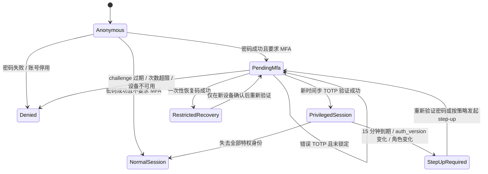
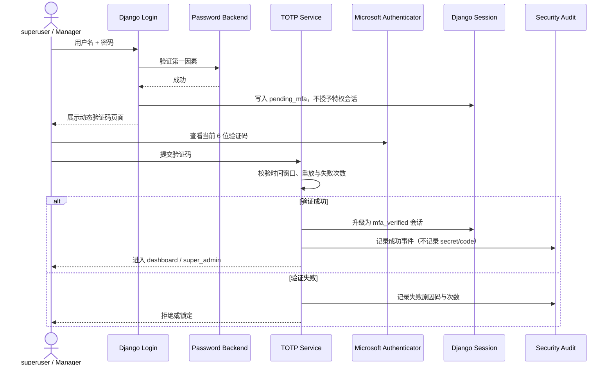
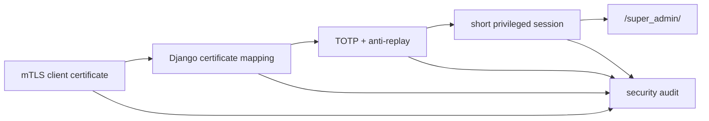
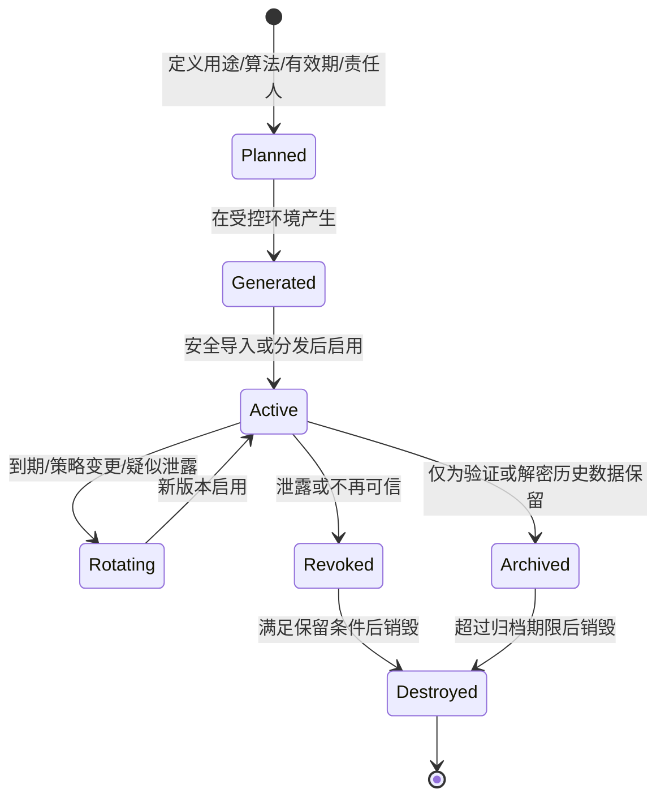

# Accounts 安全能力路线图

> **文档权重**：88（v2.5+ 安全规划；状态为规划时不得视为已实现）
> **模块**：`accounts/`、`security/`
> **状态**：H0–H3 应用代码与自动化验收已完成；MFA/mTLS 生产强制均默认关闭，待真实设备、独立管理 vhost、客户端 CA 和 break-glass 人工演练
> **日期**：2026-07-28
> **版本原则**：复杂安全能力默认进入 v2.5+；若前置测试、运维方案和回滚路径提前成熟，可以前移，但不以赶版本为目标。

## 1. 目标与边界

后续安全建设分为三条相互依赖但可独立验收的路线：

1. v2.4：完成 Board Scope 权限颗粒化，为 Manager 身份提供可靠定义。
2. v2.5：为 superuser 建立客户端证书绑定 + TOTP，为 Board Manager 强制启用 TOTP，并以 mTLS 隔离 `/super_admin/`。
3. v2.5+：以密评要求为参照，实践密钥从产生到销毁的全生命周期管理。

这里的“密评实践”是个人项目的合规导向自我验证，不等同于正式商用密码应用安全性评估，也不声称达到某一等级。正式评估还涉及适用范围、合规密码产品、管理制度、运行记录和有资质的评估活动。

## 2. 版本路线

后台加固分支不直接跳到证书和 TOTP。实施顺序为：H0 固定特权入口/拒绝路径测试；H1 完成 Stage 6a/6b 使 Manager 身份稳定；H2 实现 TOTP、恢复码和短时特权 Session；H3 完成独立管理域名的 mTLS Header 契约与应用侧证书绑定；H4 进行恢复、撤销、审计和回滚演练。任何阶段均不得以隐藏 URL 或 `robots.txt` 作为安全边界。

### H0 完成结果（2026-07-27）

- 默认 Django `AdminSite` 已通过 `SuperuserAdminConfig` 替换为 active-superuser-only 的 `SuperuserAdminSite`；`is_staff=True` 不再单独授予 `/super_admin/` 入口。
- `/dashboard/` 继续只接受 active `is_dashboard_user` 或 active superuser；普通账号与 staff-only 账号均被拒绝。
- 自动化测试固定匿名、普通账号、dashboard 用户、staff-only、active superuser 和 inactive superuser 的入口矩阵，并验证 staff-only 凭据无法建立系统后台 Session。
- H0 不实现 TOTP 或 mTLS，也不把 `robots.txt`、URL 隐蔽性视为授权控制。

### H1 / Stage 6a–6b 完成结果（2026-07-27）

- 固定 `VerifiedUsers`、`UserManagers`、`SiteOperators` 三个全局 Group 及其最小 Permission 集。
- UserManagers 与 SiteOperators 的 Permission 已接入 dashboard 外壳及各自 Admin 模块；普通 dashboard 旗标不能越权查看全站审计或账号。
- 迁移不根据旧 `is_reviewer` 推断安全运维身份，避免把 Board 审核职责错误升级为全站审计权限。
- Stage 6b 已通过 `BoardAccessRequest` 审批服务稳定产生 Manager Membership；H2 不再读取旧 `is_reviewer` 推断强制范围。

### H2 分段与实施闸门（2026-07-27 冻结）

H2 必须拆成两个可独立回滚的阶段，禁止在首次引入密钥模型时同时修改登录链路：

| 阶段 | 范围 | 明确不做 | 完成条件 |
|---|---|---|---|
| H2a | TOTP 设备绑定、首次验证码确认、加密 seed、恢复码、撤销/重置审计 | 不拦截登录，不签发 `mfa_verified` Session，不生成仓库内测试 seed | superuser 与 Manager 可在已有登录 Session 中完成绑定和恢复材料验证；失败不会改变现有登录 |
| H2b | 密码后置 TOTP challenge、防重放、限流、短时特权 Session、角色变化失效 | 不加入 mTLS、无密码登录、Microsoft 推送或 Passkey | 仅密码不能进入特权入口；TOTP/恢复码成功、失败、锁定、过期、撤销和回滚均有测试 |

H2a 上线后先保留“可绑定但不强制”的观察窗口。确认至少一个 active superuser 已绑定、恢复码已离线保存且 break-glass 流程经过演练后，才允许开启 H2b。不得把“用户没有设备”自动降级成密码直通，也不得在没有恢复证据时强制唯一管理员启用 MFA。

H2 首期明确强制 active superuser 与任意 active Board Manager。`UserManagers`、`SiteOperators` 同样属于敏感全局职责，是否随 H2b 一并强制是进入 H2b 前的显式决策；旧 `is_dashboard_user` 旗标本身不构成 MFA 身份。推荐最终把两个全局敏感 Group 纳入，但不得在未确认时静默扩大上线范围。

#### H2a 实施切片

| 切片 | 状态 | 交付 |
|---|---|---|
| H2a-0 | ✅ | 固定 `PyOTP==2.10.0` 与 `cryptography==49.0.0`；实现无持久化的 AES-256-GCM seed 加密边界和 5 个可执行测试 |
| H2a-1 | ✅ | `MfaTotpDevice` 单用户单设备模型、状态/时间戳/版本/时间步约束、迁移与 encrypted-only ORM 测试；未开放页面 |
| H2a-2 | ✅ | 10 分钟 pending 绑定、Microsoft Authenticator QR、首次 TOTP 确认、一次性 provisioning URI 与过期 seed 擦除 |
| H2a-3 | ✅ | 10 枚恢复码仅存 password hash、条件更新原子消费、superuser 重置/撤销、`auth_version` 递增与 HMAC 审计 |
| H2a-UI | ✅ 代码 | 已有 Session 内的绑定/确认、恢复码一次展示、`no-store` 与受限重绑页面；真实手机和 break-glass 仍需人工验收 |
| H2b | ✅ 代码 | 密码后置 challenge、防重放、5 次/15 分钟共享冷却、恢复受限态、15 分钟 privileged Session 与双后台 middleware |

#### H3 实施切片

| 切片 | 状态 | 交付 |
|---|---|---|
| H3a | ✅ 代码 | `ClientCertificateBinding` 多证书轮换模型；issuer 使用 SM3 摘要索引，issuer + serial 唯一，保存 Subject/profile/有效期/状态/`auth_version`，不保存 PEM 或私钥 |
| H3b | ✅ 代码 | 独立管理 Host、可信代理网络或 Unix socket、代理共享认证值、`SUCCESS` 与最小证书 Header 的 fail-closed 契约；伪造 Header、错误 Host/profile/用户/Subject 均拒绝 |
| H3c | ✅ 代码 | `/super_admin/` 证书 → 密码 → TOTP 串联；privileged Session 绑定同一证书及版本，证书撤销/过期/替换后要求重新认证 |
| H3d | ✅ 工具骨架 | `deploy/mtls/` 提供仓库外 CA、clientAuth、CRL、轮换、丢失与 break-glass 契约；生产边界固定 OpenSSL 4.0.x 最新补丁版，readiness 强制版本证据等五项人工确认且不读取密钥 |
| H3-ops | 🟡 部分实测 | OpenSSL 4.0.1 已通过开发 CA、clientAuth、PKCS#12、撤销与 CRL error 23 流程；独立 Nginx vhost、真实浏览器、Django 真实绑定和 break-glass 尚未验收，`MTLS_ENFORCEMENT_ENABLED` 保持关闭 |

H3 提供 `bind_client_certificate`、`revoke_client_certificate` 与 `check_mtls_readiness` 三个命令。readiness 要求显式确认代理边界、Client CA、吊销、break-glass 和 OpenSSL 4.0.x 版本证据；声明不能替代 `nginx -t` 或 TLS 握手证据。绑定/撤销进入现有 `LogEntry → SecureLogEntry` SM3-HMAC 审计链；Admin 只读观察绑定，不能在表单里随意改写身份材料。旧 `MyUser.cert_*` 字段不再作为运行时事实来源，待观察并确认无历史依赖后另行迁移删除。

H2a-0 的 `accounts.authn.mfa_crypto` 不读取数据库或环境。H2a-1 的 `MfaTotpDevice` 只保存密文、96-bit nonce、key ID 与生命周期元数据，AAD 固定绑定 user ID 和 device UUID。H2a-2/3 的 `accounts.authn.mfa_services` 从 `MFA_TOTP_KEYRING_JSON` 与 `MFA_TOTP_ACTIVE_KEY_ID` 读取版本化 KEK；缺失、非法或 active key 不存在时，在生成/持久化 seed 前默认拒绝。`MFA_TOTP_ISSUER` 可配置显示名称。仓库与测试不得写入真实 KEK、业务 seed、二维码 URI、TOTP code 或恢复码。设备与恢复码均不注册到 Django Admin。

服务层授权边界固定为：active superuser 或拥有任一 active Manager Membership 的用户只能给自己绑定和确认；恢复码消费也只允许本人，且只标记一次性材料已用，不创建 Session。设备重置只允许 active superuser；superuser 重置自己时还必须重新校验当前密码，重置其他账号时形成更高权限复核。撤销或过期会用随机数据覆盖 seed 密文与 nonce、删除恢复码并递增 `auth_version`。审计仅记录固定事件/原因码，通过 `LogEntry` 同步生成 `SecureLogEntry` HMAC，不记录用户输入或认证材料。

#### H2 生产启用顺序

1. 保持 `MFA_ENFORCEMENT_ENABLED=false`，通过环境变量配置 `MFA_TOTP_KEYRING_JSON`、`MFA_TOTP_ACTIVE_KEY_ID` 与可选 `MFA_TOTP_ISSUER`；KEK 不得写入仓库或聊天记录。
2. 执行迁移并由所有 active superuser/Board Manager 在 `/accounts/security/mfa/` 完成真实设备绑定；分别离线保存只展示一次的恢复码。
3. 人工验证 Microsoft Authenticator 扫码、TOTP 登录、单码恢复重绑、唯一管理员 break-glass 与关闭开关回滚。
4. 执行 `python manage.py check_mfa_readiness --acknowledge-recovery-material`。命令会检查版本化 keyring、全部强制用户的 active 设备、seed 可解密性和剩余恢复码，但不会输出认证材料。
5. 仅在上述步骤全部通过后设置 `MFA_ENFORCEMENT_ENABLED=true` 并重启服务；分别从账号登录页、`/dashboard/` 与 `/super_admin/` 验证。紧急回滚只关闭该开关，不删除设备、恢复码或审计记录。

| 版本 | 目标 | 是否修改运行时 | 进入条件 |
|---|---|:---:|---|
| v2.4 | `accounts_linear`：Group + Permission + BoardMembership + Policy | ✅ | 权限矩阵和拒绝路径测试先完成 |
| v2.4.x | 密钥资产清单、用途分类、威胁模型、轮换演练文档 | ❌ 为主 | 不阻塞 Board 权限实施 |
| v2.5 | superuser 证书绑定 + TOTP、Manager 强制 TOTP、`/super_admin/` mTLS | ✅ | Manager 身份稳定；客户端 CA、恢复与回滚方案完成 |
| v2.5+ | 密钥版本、轮换、备份恢复、归档撤销、销毁与审计 | ✅ | 先完成密钥清单和恢复演练设计 |
| v2.6+ 候选 | Passkey、外部 IdP/Entra、硬件或合规密码设备 | ✅，复杂 | 仅在个人站实际需要时评估 |

版本号是实施窗口，不是完成承诺。任何复杂项都可以后移；若依赖和验收条件提前满足，也可以作为较早版本的可选增强。

## 3. TOTP 动态验证码规划

### 3.0 数据模型契约（H2a）

首期单用户只允许一个逻辑设备，避免多设备撤销和恢复语义扩散。建议模型归 `accounts` 所有：

```text
MfaTotpDevice
  user: OneToOne(settings.AUTH_USER_MODEL)
  status: pending | active | revoked
  secret_ciphertext: BinaryField        # 永不保存明文 seed
  secret_nonce: BinaryField             # AES-GCM 唯一 nonce
  key_id: CharField                     # 指向环境中的版本化 KEK
  confirmed_at / revoked_at
  last_accepted_step: BigIntegerField   # 行锁内更新，阻止同一步重放
  auth_version: PositiveIntegerField    # 撤销/重置后使既有特权 Session 失效
  created_at / updated_at

MfaRecoveryCode
  device: ForeignKey(MfaTotpDevice)
  code_hash: CharField                   # 使用 Django password hasher，只展示一次
  used_at: DateTimeField(null=True)
  created_at: DateTimeField
```

约束与密钥边界：

- seed 只在服务内存中产生，写库前使用独立于 Django `SECRET_KEY` 的版本化 KEK 加密；KEK 只来自部署环境/密钥管理设施，不进入数据库、日志、邮件、二维码缓存、仓库或测试快照。
- 每次加密使用独立随机 nonce，并把 `user_id`、设备 ID/临时绑定 ID 与 `key_id` 作为认证上下文；解密失败必须默认拒绝并写不含密文的结果码。
- `pending` 绑定默认 10 分钟过期；首次有效 TOTP 确认后才转为 `active`。中断或过期绑定应删除密文，不能成为可登录设备。
- 首期生成 10 枚高熵恢复码，只保存 password hash；页面只展示一次，单枚成功后立即原子写入 `used_at`。不得提供“重新显示旧恢复码”。
- 撤销或重置递增 `auth_version`、清除可用恢复码并使相关 privileged Session 失效；历史审计只保留 device ID、actor、原因码和时间。

H2a-0 已根据官方文档固定 `PyOTP==2.10.0` 与 `cryptography==49.0.0`，分别使用标准 TOTP API 与 `AESGCM`；项目不自行实现 OTP、Base32 或加密算法。AES-GCM 使用 256-bit key、每次随机 96-bit nonce，并要求调用者提供绑定用户/设备身份的 AAD。

### 3.0.1 登录与 Session 状态机（H2b）



状态机约束：

- 对强制 MFA 的用户，密码通过后不得先调用 Django `login()` 建立完整认证 Session；pending challenge 只保存最小 user ID、签发时间、随机 nonce、目标入口和失败计数，不保存密码、seed 或验证码。
- TOTP 使用 6 位、30 秒周期，首期最多接受当前时间步前后各 1 步；成功时在同一事务内锁定设备并更新 `last_accepted_step`，相同或更旧时间步一律拒绝。
- challenge 默认 5 分钟有效、最多错误 5 次；按账号与客户端地址执行 15 分钟冷却。具体缓存/数据库实现必须保证多进程 Gunicorn 下共享，不能依赖进程内字典。
- 验证成功后才建立/升级 Session，并记录 `mfa_verified_at`、设备 ID 与 `auth_version`。特权有效期首期 15 分钟；到期可保留普通站点 Session，但 `/dashboard/`、`/super_admin/` 及敏感 action 必须重新 step-up。
- 恢复码成功只授予受限的恢复状态，不直接等价于长期特权 Session；用户必须立即重新绑定设备。重置与 break-glass 需要当前密码和更高权限复核，单一 superuser 场景使用预先演练的离线流程，不能降级为仅邮箱重置。
- 所有失败对外使用统一提示，审计内部只记录枚举原因码。任何日志和异常不得包含 seed、`otpauth://` URI、二维码内容、TOTP code 或恢复码。

### 3.0.2 分阶段验收标准

H2a：

- [x] pending 设备未确认、过期或撤销时不能被当作 active 设备。
- [x] 数据库与 HMAC 审计中不保存 seed、URI、TOTP code 或恢复码明文；绑定/恢复响应使用 `no-store`。
- [x] 首次验证码错误不会激活设备；正确验证码只激活一次。
- [x] 恢复码由服务只返回一次、库中只有 hash、条件更新保证竞争消费最多成功一次。
- [x] 重置需要 superuser 边界；自助重置还需当前密码，并递增 `auth_version`。
- [x] 未启用 H2b 时，新增模型与绑定页面不改变现有登录成功/失败行为。

H2b：

- [x] 强制用户仅通过密码后仍未认证，不能访问任何特权页面或 action。
- [x] challenge 绑定用户、服务端 Session nonce 和白名单目标；换用户、过期、外部目标或状态篡改均失败。
- [x] 当前允许窗口内的新时间步成功，同一步重放及窗口外验证码失败。
- [x] 第 5 次失败进入账号与账号+IP共享冷却；生产默认 Redis，因此不能通过更换 Gunicorn worker 绕过。
- [x] privileged Session 15 分钟到期，设备撤销或 `auth_version` 变化后立即失效；角色失效同时失去对应后台权限。
- [x] 普通非特权用户的登录、Profile 与公开阅读路径不受影响。
- [x] 功能开关关闭时回滚到 H2a，不删除已加密设备，也不把密码直通误标为 MFA 成功。

### 3.1 推荐方案

首期使用标准 TOTP：6 位验证码、30 秒周期，通过 `otpauth://` QR Code 绑定。Android Microsoft Authenticator 可按“其他账户”扫描此类二维码；这条路线不依赖 Microsoft Entra，也不提供 Microsoft 推送批准能力。



### 3.2 强制范围

- `is_superuser=True`：强制绑定并在特权登录时验证。
- 任意有效 `BoardMembership.role=manager`：强制验证后才能进入 dashboard。
- 普通 Contributor / Editor / Reviewer：首期不强制，后续可配置扩展。
- `SiteOperators`、`UserManagers`：安全上也属于高权限角色，v2.5 实施前应决定是否一并强制；默认建议强制。

### 3.3 必须具备的安全控制

| 严重度 | 控制 | 验收要点 |
|---|---|---|
| 🔴 高 | TOTP secret 加密存储且禁止进入日志 | 数据库泄露时不能直接读取 seed；日志中无 QR URI、secret、验证码 |
| 🔴 高 | 两阶段 Session | 仅密码成功的 `pending_mfa` 会话不能访问任何特权入口 |
| 🔴 高 | 防重放与限流 | 同一时间步验证码不能重复使用；失败计数独立于密码锁定 |
| 🔴 高 | MFA 重置保护 | 重置需重新验证密码并由更高权限复核；全过程写 HMAC 审计 |
| 🟡 中 | 恢复码 | 一次性恢复码仅保存 hash，展示一次，使用后立即作废 |
| 🟡 中 | 时钟与容差 | 服务端时间同步；只接受经过测试的最小时间窗口 |
| 🟡 中 | 角色变化 | 用户获得 Manager 后必须先完成绑定；失去全部特权角色后按策略保留或撤销设备 |
| 🟢 低 | 多设备绑定 | 首期可限制单设备，稳定后再支持多个独立 TOTP device |

### 3.4 明确不在首期实现

- 不接 Microsoft Authenticator 推送通知或号码匹配。
- 不依赖 Microsoft Entra tenant。
- 不以邮件或短信作为同等级 MFA 因素。
- 不在 v2.5 同时引入 Passkey/WebAuthn，避免扩大恢复和兼容性范围。

## 3A. superuser 客户端证书与 `/super_admin/` mTLS

### 3A.0 证书、TOTP 与国密路线决策（2026-07-28）

TOTP 不使用、也不签发 TLS 证书。当前项目的 TOTP 是 RFC 6238 时间型动态口令，seed 由 Django 生成后交给 Microsoft Authenticator 保存；TLS 客户端证书是另一套身份材料。两者可以共同保护 `super_admin`，但不得在配置、恢复或审计中混成同一种资产。

建议把证书分成两条互不替代的信任链：

| 证书用途 | 推荐签发方 | 用途边界 |
|---|---|---|
| `admin.poweradapter.xyz` 服务器证书 | Let’s Encrypt / 公网 Web PKI | 浏览器验证管理域名服务器身份；可以继续自动续期 |
| superuser 客户端证书 | 项目私有 Client CA | Nginx/TLCP 网关验证访问者设备身份；不使用 Let’s Encrypt |

Let’s Encrypt 已在 2026 年停止签发带 TLS Client Authentication EKU 的新证书，因此不应把公网服务器证书复用为客户端身份。所谓“自签”应具体实现为：离线保存一个**自签 Root CA**，由它签发带 `clientAuth` 用途、独立序列号和较短有效期的客户端叶证书；不要为每台设备建立互不关联的自签叶证书，否则信任分发、统一吊销和轮换都会变得更困难。

国密实践分为两个层级，不宣称仅靠算法替换即可通过正式密评：

1. **当前可用基线**：公网/管理域名继续使用标准 TLS；客户端证书由私有 CA 签发；Django 只绑定 issuer + serial + subject 等最小身份，证书事件继续进入现有 SM3-HMAC 审计链。该方案优先完成浏览器、Android 证书容器与 Nginx 的可靠双向验证。
2. **隔离的国密实验基线**：客户端身份使用 SM2 证书；若传输层也要求 SM 系列，则另建测试管理域名/端口，以 TLCP、SM2、SM3、SM4 和支持该协议的终止网关进行兼容性验证。标准 Nginx 文档只保证其编译所用 OpenSSL 提供的 TLS 能力，不能把普通构建自动视为 TLCP/国密网关。该实验不属于 H3 发布范围，也不得接入生产 `/super_admin/`。

TLCP 路线可能涉及签名证书与加密证书分离，并显著增加浏览器、Android、证书容器、Nginx 构建和恢复演练成本。因此 H3 生产认证固定为 `standard-tls`：普通 Nginx 终止 TLS 1.3 mTLS，Django 再完成证书映射、密码和 TOTP。数据模型保留 `sm2-tlcp` 仅用于表达隔离实验元数据；生产请求解析、绑定命令和 readiness 均拒绝该 profile。若未来重启 TLCP 实验，必须使用独立域名或端口、独立命令与握手证据，不能由一个可伪造的 Django Header 自证。

依赖名称必须区分：PyPI 的 `gmssl==3.2.2` 是纯 Python 的 SM2/SM3/SM4 包，本项目仅用它计算审计日志的 SM3-HMAC；它不是 GmSSL/OpenSSL 的 TLS provider，也不参与 Nginx、mTLS 或 TLCP 握手。所谓“3.2.3 provider bug、升级至 3.2.4”属于 OpenSSL 3.2 发布线，不能通过安装不存在的 `pip gmssl==3.2.4` 修复。生产 `super_admin` 默认采用普通 Nginx + TLS 1.3 mTLS；Tongsuo/TLCP 只在独立域名或端口的实验环境验证，不要求日常管理员安装国密浏览器。

最终推荐认证链为：

```text
生产管理链：TLS 1.3 mTLS 私有 Client CA 证书 + Django 用户映射 + 密码 + RFC 6238 TOTP
隔离实验链（不接生产）：SM2 Client CA / TLCP 网关 + 独立互操作验证
```

RFC 6238 TOTP 继续保持 Microsoft Authenticator 兼容，不为“算法全换成 SM”而自行发明 SM3-TOTP。若未来研究 GB/T 38556 动态口令，应作为新的认证器适配项目，不覆盖当前可恢复、可互操作的 TOTP 实现。

### 3A.1 目标认证链

superuser 访问管理后台时同时经过：

1. Nginx mTLS：验证客户端证书链、有效期和撤销状态，未通过的请求不进入 Django。
2. Django 证书绑定：将边界网关传入的 verified 状态、profile、证书序列号、Issuer DN 与 Subject DN 映射到 active `ClientCertificateBinding`，并再次确认其用户是 active superuser。旧 `MyUser.cert_*` 字段不参与判定。
3. TOTP：证书身份通过后再校验动态验证码、重放和失败限流，升级为短时 privileged session。

目标产品形态可以是“证书 + TOTP 登录”，但首轮默认不直接删除密码因素。客户端证书和手机 TOTP 都可能属于 possession factor，尤其二者放在同一设备时并不天然等于两类独立因素；是否无密码化必须经过单独威胁模型与恢复评审。

### 3A.2 Nginx 部署建议

优先建立独立管理域名 / vhost：

```text
public poweradapter.xyz       -> 普通博客，不请求客户端证书
admin.poweradapter.xyz        -> ssl_verify_client on -> 仅代理 /super_admin/
```

Nginx 官方 `ssl_verify_client` 的配置上下文是 `http` / `server`，不是任意 `location`。因此独立 vhost 比在整站 `server` 上设置 `optional` 再按路径判断更清晰，也不会让普通访客遇到客户端证书选择提示。公网站点上的 `/super_admin/` 应拒绝访问或跳转到管理域名，不能保留一个绕过 mTLS 的平行入口。

传递给 Django 的客户端证书信息必须满足：

- 仅在 `$ssl_client_verify = SUCCESS` 时转发；
- Nginx 覆盖或清除外部传入的同名 Header，避免伪造；
- 优先传递序列号、Subject DN、fingerprint 等最小标识，不默认传递完整 PEM；
- Gunicorn 继续只监听 Unix socket / 本机可信链路，不能开放一个绕过 Nginx 的公网端口；
- Nginx 配置更新必须先 `nginx -t`，并保留独立的 break-glass / 回滚操作流程。

H3 应用侧固定使用以下 Header 契约；名称由 Nginx 覆盖，浏览器传入的同名值不得透传：

```nginx
# admin.poweradapter.xyz 的独立 server 块；示例仅用于配置评审，证书路径按部署调整。
ssl_client_certificate /etc/nginx/mtls/client-ca.pem;
ssl_verify_client on;
ssl_verify_depth 2;
ssl_crl /etc/nginx/mtls/client-ca.crl.pem;

proxy_set_header X-PA-mTLS-Verify     $ssl_client_verify;
proxy_set_header X-PA-mTLS-Serial     $ssl_client_serial;
proxy_set_header X-PA-mTLS-Issuer-DN  $ssl_client_i_dn;
proxy_set_header X-PA-mTLS-Subject-DN $ssl_client_s_dn;
proxy_set_header X-PA-mTLS-Profile    standard-tls;

# 此行应来自 root-only、仓库外的 include 文件，值至少 32 个随机字符。
proxy_set_header X-PA-Proxy-Auth      "部署侧共享认证值";
```

管理 vhost 必须同时代理 `/super_admin/`、`/accounts/login/`、`/accounts/logout/` 与 `/accounts/security/mfa/`，否则密码后置 TOTP challenge 无法持续看到同一客户端证书。公网 vhost 对 `/super_admin/` 直接拒绝，不做一个绕过 mTLS 的平行入口。Django 配置至少包括：

```text
MTLS_ENFORCEMENT_ENABLED=true
MTLS_ADMIN_HOST=admin.poweradapter.xyz
MTLS_CERTIFICATE_PROFILE=standard-tls   # 生产唯一允许值
MTLS_PROXY_AUTH_SECRET=<仓库外随机值>
MTLS_TRUST_UNIX_SOCKET_PROXY=true       # Gunicorn 确实只监听 Unix socket 时
# 或 MTLS_TRUSTED_PROXY_NETWORKS=127.0.0.1/32（仅本机 TCP upstream）
```

`MTLS_TRUST_UNIX_SOCKET_PROXY=true` 只允许在 Gunicorn 没有任何 TCP 监听、socket 文件权限已收紧时使用；否则必须按真实代理地址配置 `MTLS_TRUSTED_PROXY_NETWORKS`。两种模式仍都要求代理共享认证值。应用只记录 SM3 化的 issuer 索引、序列号、Subject、profile、状态和有效期，不保存 PEM 或私钥。

可评审的完整配置模板位于 `deploy/nginx/super_admin_mtls.conf.example`，CA 与证书运维契约位于 `deploy/mtls/README.md`。模板不包含真实域名私钥、Client CA 私钥或代理共享认证值；这些材料必须在服务器仓库外以 root-only 权限管理。

### 3A.3 证书生命周期

| 阶段 | 必须定义 | 证据 / 验收 |
|---|---|---|
| 签发 | 离线自签 Root Client CA、CA 签发的 `clientAuth` 叶证书、用途限制、有效期、唯一序列号；国密实验另标 SM2/TLCP profile | 证书清单不含私钥；错误 CA 和错误 profile 被拒绝 |
| 分发 | 私钥生成位置、加密容器、Android/桌面导入步骤 | 私钥不经聊天、邮件或仓库明文传递 |
| 绑定 | serial + Subject DN/fingerprint 与 MyUser 的绑定审批 | 只能绑定 active superuser；重复绑定拒绝 |
| 使用 | mTLS SUCCESS + Django mapping + TOTP | 任意一层失败均不能获得 privileged session |
| 续期 | 新旧证书短暂并行窗口 | 可无停机切换且旧证书按期失效 |
| 吊销 | 丢失、离职、疑似泄露时的 CRL/OCSP 或短证书策略 | 吊销后现有 TLS/特权 Session 均失效 |
| 恢复 | 双人/离线恢复材料或本机紧急流程 | 不降低为仅邮箱重置；全过程审计 |
| 销毁 | 客户端私钥和 CA 旧材料的销毁条件 | 销毁确认与不可再次认证测试 |

### 3A.4 纵深防御与测试



- [ ] **红色 / 高权重**：无客户端证书、过期证书、错误 CA、已吊销证书均不能到达 `super_admin` 应用页面。
- [x] **红色 / 高权重（应用侧）**：伪造证书 Header 缺少可信代理地址/Unix socket 契约与代理共享认证值时不能通过 Django 映射；Nginx Header 覆盖仍待真实配置验收。
- [x] **红色 / 高权重（应用侧）**：已验证证书不能直接获得权限；必须映射 active superuser 并完成密码与 TOTP。
- [x] **红色 / 高权重（应用侧）**：证书或 TOTP 撤销、过期、版本变化后，关联 privileged Session 失效。
- [ ] **红色 / 高权重**：存在经过演练的 break-glass 与配置回滚；恢复材料不得长期在线明文保存。
- [ ] **黄色 / 中权重**：验证桌面浏览器、Android 证书容器和 Microsoft Authenticator 的实际兼容性。
- [ ] **低权重 / 延后实验**：如未来确有密评研究需要，再在隔离环境验证 SM2/TLCP 网关、双证书要求和客户端互操作；不计入 H3 发布验收。
- [ ] **黄色 / 中权重**：审计日志只记录证书最小标识和结果码，不记录私钥、完整证书、TOTP seed/code。

## 4. 密钥全生命周期规划（v2.5+）

### 4.1 生命周期状态



覆盖环节以“产生、分发、存储、使用、更新、归档、撤销、备份、恢复、销毁”为基线，每个环节都需要责任主体、操作条件、审计证据和失败处置。

### 4.2 第一批资产清单

| 资产 | 用途 | 首要难点 | 初步策略 |
|---|---|---|---|
| `LOG_HMAC_KEY` | MongoDB 审计日志完整性 | 轮换后仍需验证历史日志 | 每条日志记录 `key_id`；旧验证密钥进入只读归档，不立即销毁 |
| Django `SECRET_KEY` | 签名、Session 等框架能力 | 轮换可能使既有签名失效 | 制定 `SECRET_KEY_FALLBACKS` 过渡窗口和会话影响测试 |
| TOTP seed | 特权用户第二因素 | 展示、备份、重置和销毁 | 每设备独立密文；只在绑定时展示；撤销后不可再次验证 |
| TLS 私钥 | HTTPS 服务身份 | 通常由 Web Server/证书工具管理 | 纳入清单但不在 Django 数据库管理 |
| 数据加密密钥（未来） | 敏感字段或备份加密 | 密钥层级与历史数据重加密 | 有真实加密需求后再引入 KEK/DEK，不为演示提前造系统 |

数据库密码、API Token 等应进入“凭据生命周期”清单，但不要与密码学密钥混成同一种资产。

### 4.3 分阶段实施

| 阶段 | 工作 | 可交付证据 |
|---:|---|---|
| K0 | 资产、用途、算法、位置、责任人、有效期清单 | `key_inventory` 文档；不含任何密钥明文 |
| K1 | 定义 Key ID、状态、版本和轮换策略 | 数据字典、状态机、威胁模型 |
| K2 | 先为 `LOG_HMAC_KEY` 增加版本识别和双 key 验证 | 新旧日志均可验证的自动化测试 |
| K3 | 轮换与应急撤销流程 | dry-run、回滚步骤、Mongo HMAC 审计记录 |
| K4 | 加密备份与恢复演练 | 恢复结果、责任人和时间记录；备份不暴露明文 |
| K5 | 归档和不可逆销毁 | 保留条件、销毁确认、销毁后不可恢复测试 |
| K6 | 对照标准形成差距表 | 符合/部分符合/不适用/未验证及证据索引 |

任何实际轮换前必须先证明“能恢复”；不能把生产密钥销毁当作验证销毁流程的第一次演练。

## 5. 风险 / TODO

| 严重度 | 问题 | 处理窗口 |
|---|---|---|
| ✅ | Board Manager 身份稳定性 | Stage 6b 已以 active `BoardMembership.role=manager` 作为 H2 强制范围事实来源 |
| 🔴 高 | `LOG_HMAC_KEY` 若直接轮换会影响历史日志验证 | v2.5+ K2 前禁止无版本轮换 |
| 🔴 高 | TOTP seed 的根加密密钥会引入新的密钥管理问题 | v2.5 设计评审必须说明根密钥来源与恢复方案 |
| 🔴 高 | mTLS 若直接作用于现有整站 vhost，可能干扰普通用户 TLS 握手；若保留公网平行入口又会被绕过 | 优先独立 admin vhost，并对公网 `/super_admin/` 做拒绝测试 |
| 🔴 高 | 客户端 CA 或唯一管理员证书丢失可能把站点管理员永久锁在门外 | 上线前完成离线 CA、break-glass 和回滚演练 |
| 🔴 高 | 仅信任代理 Header 会允许绕过证书验证 | Header 清洗 + Unix socket + Django 二次映射测试 |
| 🟡 中 | MFA 丢失设备后的恢复流程尚未定义 | v2.5 实施前确定恢复码和人工重置边界 |
| 🟡 中 | 个人项目无法凭软件实现本身证明正式密评合规 | 始终标注为自我实践，保留证据但不做合规承诺 |
| 🟢 低 | Passkey 与推送认证体验更好但范围显著扩大 | v2.6+ 按实际需要再评估 |

## 6. 参考依据

- [GB/T 39786-2021《信息安全技术 信息系统密码应用基本要求》](https://std.samr.gov.cn/gb/search/gbDetailed?id=BD89DE8E07393D08E05397BE0A0A4FAD)
- [国家密码管理局：《商用密码应用安全性评估管理办法》](https://www.oscca.gov.cn/sca/xxgk/2023-10/07/content_1061109.shtml)
- [国家密码管理局：《信息系统密码应用测评要求》附录 A——密钥生存周期管理检查要点](https://oscca.gov.cn/sca/xwdt/2020-12/08/1060792/files/d2f1665e78bb4c658ca06bfaaa16eae1.pdf)
- [Microsoft Learn：支持 TOTP 的 Authenticator 应用](https://learn.microsoft.com/azure/active-directory-b2c/multi-factor-authentication)
- [NGINX `ngx_http_ssl_module`：`ssl_client_certificate`、`ssl_verify_client` 与客户端证书变量](https://nginx.org/en/docs/http/ngx_http_ssl_module.html)
