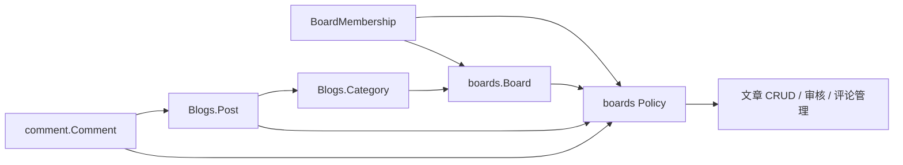

# Boards 模块 — 开发文档

> **文档权重**：85（boards 当前实现与模块 TODO）
> **模块**: `boards/`  
> **职责**: 管理首页 Editorial 板块（Skateboard / Music / Coding 等）  
> **依赖**: `Blogs.Category` (ForeignKey)  
> **创建**: 2026-06-22  
> **最后更新**: 2026-07-19 — accounts_linear 阶段 3 ORM Policy

---

## 0. 变更日志

| 日期 | 版本 | 变更 |
|------|------|------|
| 2026-07-19 | v1.6 | 新增 `policies.py` 跨 App resolver/Policy；Board 新增删除已收紧为 superuser；运行时对象过滤待 Stage 4 |
| 2026-07-19 | v1.5 | 冻结 Board 为 Blogs/comment 跨 App 授权边界；新增/删除 Board 仅限 superuser，当前 Admin 尚待 Stage 4 收紧 |
| 2026-07-13 | v1.4 | 新增 `BoardMembership`、唯一约束、super_admin 只读观察入口及 5 个 ORM/Admin 测试 |
| 2026-07-13 | v1.3 | 新增 `access_rules.py` 纯权限规则与 7 个角色矩阵/拒绝路径测试；尚未接入 ORM 和运行时入口 |
| 2026-07-13 | v1.2 | 权限指南移至 `accounts/PERMISSIONS_GUIDE.md`，Board app 仅保留领域模型与 Policy 实现职责 |
| 2026-07-12 | v1.1 | 新增 `PERMISSIONS_GUIDE.md`：Group + BoardMembership + Policy 三层权限建议（尚未实施） |
| 2026-06-22 | v1.0 | 初始：Board 模型 + 种子数据 + Dashboard 管理 + 上下文处理器 |

---

## 1. 架构概览

```
boards/
├── __init__.py
├── apps.py              # BoardsConfig
├── models.py            # Board、BoardMembership 模型
├── admin.py             # BoardAdmin + Membership 只读观察入口
├── views.py             # boards_context 上下文处理器
├── access_rules.py      # Board 角色动作矩阵与纯拒绝规则（无 ORM）
├── policies.py          # Post/Comment → Board ORM 解析与统一授权入口
├── tests/
│   ├── test_access_rules.py  # accounts_linear 阶段 1 契约测试
│   ├── test_membership.py    # 阶段 2 ORM 与 Admin 边界测试
│   └── test_policies.py      # 阶段 3 跨 App Policy 契约测试
├── management/
│   └── commands/
│       └── seed_boards.py   # 种子数据命令
└── DEVELOPMENT.md       # 本文档
```

### 数据流

```
Dashboard (BoardAdmin)
    │ POST / PATCH
    ▼
Board 表 (SQLite)
    │ boards_context() 上下文处理器
    ▼
{{ boards }} 模板变量
    │ index.html 
    ▼
editorial-section × N (动态渲染)
```

---

## 2. 模型

### Board

| 字段 | 类型 | 说明 |
|------|------|------|
| `slug` | SlugField(64) UNIQUE | 标识符，如 `skateboard` |
| `name` | CharField(64) | 板块名称 |
| `description` | TextField | HTML 描述，渲染到 editorial-body |
| `glitch_color` | CharField(32) | CSS 颜色值，悬停时叠加到 visual |
| `keywords` | CharField(256) | 逗号分隔，竖排展示 |
| `sort_order` | PositiveSmallInteger | 排序（越小越靠前） |
| `category` | FK → Blogs.Category | 关联分类，点击跳转 |
| `is_active` | BooleanField | 启用/禁用 |
| `created_at` / `updated_at` | DateTimeField | 时间戳 |

**属性**：
- `keywords_list` → list（逗号拆分）
- `metadata_words` → list（取前三词，不足时用 name 填充）

### BoardMembership

| 字段 | 类型 | 说明 |
|------|------|------|
| `board` | FK → Board | 权限所属板块；删除 Board 时级联删除 |
| `user` | FK → MyUser | 成员用户；删除用户时级联删除 |
| `role` | CharField(16) | Contributor / Editor / Reviewer / Manager 单一角色 |
| `is_active` | BooleanField | 停用后不授予任何 Board 动作 |
| `created_by` | FK → MyUser, nullable | 人工创建者；删除创建者时保留记录并置空 |
| `created_at` | DateTimeField | 创建时间 |

数据库约束 `unique_board_member` 保证同一用户在同一 Board 只有一条记录。角色调整或停用更新原记录，不堆叠历史角色；后续审批和审计流程引用这条稳定记录。

---

## 3. 种子数据

```bash
# 创建 3 个默认板块
python manage.py seed_boards

# 预览
python manage.py seed_boards --dry-run
```

默认 3 板块：

| slug | name | glitch_color | keywords |
|------|------|-------------|----------|
| skateboard | Skateboard | #4ed7af | Ollie,Grind,Flip |
| music | Music | #b794f4 | Melody,Harmony,Noise |
| coding | Coding | #f6ad55 | Logic,Struct,Create |

---

## 4. Dashboard 管理

- URL: `/dashboard/boards/board/`
- 查看/修改权限：仍为全局 `is_dashboard_user`，Stage 4 收敛到 Policy
- 新增/删除权限：仅激活的 superuser
- 行内编辑：`sort_order`、`is_active`
- 颜色预览：列表显示色块 + 颜色值
- 搜索：name、slug、keywords

> 当前权限仍为全局 `is_dashboard_user`，存在跨 Board 越权风险。授权模型、Django Group 协作方式与迁移建议见 [`accounts/PERMISSIONS_GUIDE.md`](../accounts/PERMISSIONS_GUIDE.md)。

> 新增或删除 Board 已只允许 superuser，因为新 Board 会引入专属模板、SVG、CSS 或 JavaScript，等价于代码和部署变更。普通 dashboard 用户仍能修改所有现有 Board，这是 Stage 4 必须修复的运行时差距。

> `BoardMembership` 已建立，但 `access_rules.py` 和 Membership 尚未被 Board/Post/Comment 的运行时入口调用。下一阶段由 `boards/policies.py` 适配 ORM 对象。

### BoardMembership 观察入口

- URL：`/super_admin/boards/boardmembership/`
- 仅激活的 superuser 可查看。
- 禁止新增、修改和删除；成员写入将在后续审核入组流程中实现。
- 暂不注册到 `/dashboard/`，避免 Board 范围 queryset 尚未接入时泄露跨板块成员关系。

### 跨 App 授权关系



Board 是授权边界，不是 Django Group：Group 只承载 `SiteOperators`、`UserManagers` 等全局职责；Contributor / Editor / Reviewer / Manager 的唯一事实来源是 `BoardMembership`。

### Stage 3 Policy 状态

`policies.py` 已实现但尚未被旧入口调用：

- Post 通过 Category 唯一解析 Board，缺失或歧义映射默认拒绝。
- Comment 通过 Post 继承 Board。
- Policy 检查账号、Board、Membership、角色、作者和自审边界。
- superuser 保留结构和对象应急权限。
- `user_permissions` 和 Group 不会扩大 Board Scope。

因此当前测试可以证明 Policy 自身正确，但 Dashboard 页面仍使用旧授权；Stage 4 才会接入 queryset、对象和字段权限。

---

## 5. 上下文处理器

```python
# boards/views.py
def boards_context(request):
    """注入活跃板块列表到所有模板"""
    return {'boards': Board.objects.filter(is_active=True)...}
```

已在 `TEMPLATES[0].OPTIONS.context_processors` 注册，无需视图手动添加。

---

## 6. 前端集成

### 模板链

```
index.html
  ├──           ← boards_context 注入
  │   ├── editorial-number              ← forloop.counter (01-99)
  │   ├── editorial-content
  │   │   ├── board.name / description
  │   │   └── board.category (link)
  │   ├── editorial-visual              ← data-glitch-color="{{ board.glitch_color }}"
  │   │   └── _board_visuals.html      ← 按 board.slug 分支渲染 SVG/波形/代码
  │   └── editorial-keywords           ← board.keywords
  └── 
      └── _board_fallback.html          ← 静态回退（seed_boards 前）
```

### Glitch 颜色效果

1. `main.js` 在 DOMReady 读取 `data-glitch-color`，写入 CSS 变量 `--glitch-c`
2. CSS `editorial-visual::after` 伪元素使用 `--glitch-c` 作为背景色
3. Hover 触发 `glitch-chromatic` 动画（±3px 水平抖动 + 透明度闪烁）
4. 伪元素 `mix-blend-mode: lighten` 模拟 PS 单通道效果
