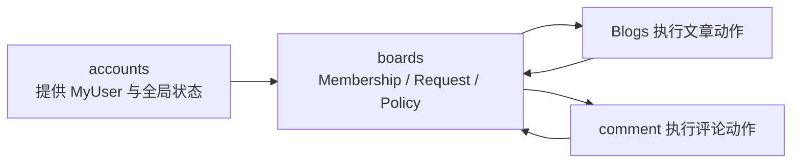
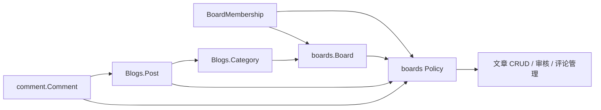

# Boards 模块 — 开发文档

> **文档权重**：85（boards 当前实现与模块 TODO）
> **模块**: `boards/`  
> **职责**: Board 领域、板块成员关系、角色规则、跨 App Policy，以及板块申请审批
> **依赖**: `Blogs.Category` (ForeignKey)  
> **创建**: 2026-06-22  
> **最后更新**: 2026-07-28 — Board Index 后端落地（codex/board-back）+ 文档与代码同步

---

## 0. 变更日志

| 日期 | 版本 | 变更 |
|------|------|------|
| 2026-07-27 | v2.1 | Stage 6b：BoardAccessRequest、用户入口、分级审批、事务写入与审计完成；完整测试 179 个 |
| 2026-07-28 | v2.2 | Board Index 后端落地（codex/board-back）：content 模型合并入单一 `models.py`；board 由模型类型固定（auto-default + Admin 隐藏）；`board_index.py` 分派、`BoardIndexView`+`HomieLineView` 路由、Admin 注册完成；board-index 测试 15 项全绿 |
| 2026-07-19 | v2.0 | 增加仅限 DEBUG 的幂等测试账号命令，覆盖四种 Board 角色和无 Membership 拒绝样本 |
| 2026-07-19 | v1.9 | Stage 5：状态 action、写作 View、上传、修订端点与只读 API 接入 Policy；完整测试 65 个 |
| 2026-07-19 | v1.8 | Stage 4：Board/Post/PostRevision/Comment Admin 接入 Board Policy，新增 8 个运行时隔离测试 |
| 2026-07-19 | v1.7 | 明确 boards 拥有 Membership、Policy 和未来 BoardAccessRequest；accounts 仅提供身份与全局职责 |
| 2026-07-19 | v1.6 | 新增 `policies.py` 跨 App resolver/Policy；Board 新增删除已收紧为 superuser；运行时对象过滤待 Stage 4 |
| 2026-07-19 | v1.5 | 冻结 Board 为 Blogs/comment 跨 App 授权边界；新增/删除 Board 仅限 superuser，当前 Admin 尚待 Stage 4 收紧 |
| 2026-07-13 | v1.4 | 新增 `BoardMembership`、唯一约束、super_admin 只读观察入口及 5 个 ORM/Admin 测试 |
| 2026-07-13 | v1.3 | 新增 `access_rules.py` 纯权限规则与 7 个角色矩阵/拒绝路径测试；尚未接入 ORM 和运行时入口 |
| 2026-07-13 | v1.2 | 权限指南移至 `accounts/PERMISSIONS_GUIDE.md`，Board app 仅保留领域模型与 Policy 实现职责 |
| 2026-07-12 | v1.1 | 新增 `PERMISSIONS_GUIDE.md`：Group + BoardMembership + Policy 三层权限建议（尚未实施） |
| 2026-06-22 | v1.0 | 初始：Board 模型 + 种子数据 + Dashboard 管理 + 上下文处理器 |

---

## 1. 架构概览

### 1.1 App 所有权

boards 是 Board Scope 授权领域的所有者：

- 当前拥有 `Board`、`BoardMembership`、`BoardAccessRequest`、`access_rules.py`、`policies.py` 和审批 `services.py`。
- Stage 4–5 由 boards Policy 被 Blogs/comment 的 Admin、View、API 调用，但 Post 和 Comment 模型仍归各自 App。
- Stage 6b 的 `BoardAccessRequest`、审批服务和 Membership 变更已落在 boards；它们只通过 `settings.AUTH_USER_MODEL` 引用申请人和审批人。
- boards 不处理密码、登录、邮箱验证、MFA 或全局 Group；这些属于 accounts。



图中的双向箭头表示运行时协作，不表示模型所有权互相转移：业务对象仍由 Blogs/comment 保存，最终 Board Scope 判定集中在 boards。

```
boards/
├── __init__.py
├── apps.py              # BoardsConfig
├── models.py            # Board / BoardMembership / BoardAccessRequest + Board Index 内容模型（SkateHomie/SkateClip、Music Spotify/Apple、Coding Project/Principle/Experiment）
├── board_index.py       # assemble_context 分派（ASSEMBLERS + 三板 assemble_*）
├── admin.py             # BoardAdmin + Membership 只读观察入口 + Board Index 内容模型（superuser）
├── views.py             # boards_context 上下文处理器 + BoardIndexView / HomieLineView
├── access_rules.py      # Board 角色动作矩阵与纯拒绝规则（无 ORM）
├── policies.py          # Post/Comment → Board ORM 解析与统一授权入口
├── tests/
│   ├── test_access_rules.py  # accounts_linear 阶段 1 契约测试
│   ├── test_membership.py    # 阶段 2 ORM 与 Admin 边界测试
│   ├── test_policies.py      # 阶段 3 跨 App Policy 契约测试
│   ├── test_admin_scope.py   # 阶段 4 Dashboard 隔离与阶段 5 action 测试
│   ├── test_stage5_runtime.py # 阶段 5 View/Upload/API/Service 测试
│   ├── test_board_index_models.py  # Board Index 内容模型行为测试
│   └── test_board_index_views.py   # BoardIndexView / HomieLineView 分派与渲染测试
├── management/
│   └── commands/
│       ├── seed_boards.py   # 板块种子数据命令
│       └── seed_permission_test_users.py # 本地角色测试账号
└── DEVELOPMENT.md       # 本文档
```

### 数据流

```
Dashboard (BoardAdmin)
    │ POST / PATCH
    ▼
Board 表 (SQLite)
    │ boards_context() 上下文处理器
    ▼
{{ boards }} 模板变量
    │ index.html 
    ▼
editorial-section × N (动态渲染)
```

---

## 2. 模型

### Board

| 字段 | 类型 | 说明 |
|------|------|------|
| `slug` | SlugField(64) UNIQUE | 标识符，如 `skateboard` |
| `name` | CharField(64) | 板块名称 |
| `description` | TextField | HTML 描述，渲染到 editorial-body |
| `glitch_color` | CharField(32) | CSS 颜色值，悬停时叠加到 visual |
| `keywords` | CharField(256) | 逗号分隔，竖排展示 |
| `sort_order` | PositiveSmallInteger | 排序（越小越靠前） |
| `category` | FK → Blogs.Category | 关联分类，点击跳转 |
| `is_active` | BooleanField | 启用/禁用 |
| `created_at` / `updated_at` | DateTimeField | 时间戳 |

**属性**：
- `keywords_list` → list（逗号拆分）
- `metadata_words` → list（取前三词，不足时用 name 填充）

### BoardMembership

| 字段 | 类型 | 说明 |
|------|------|------|
| `board` | FK → Board | 权限所属板块；删除 Board 时级联删除 |
| `user` | FK → MyUser | 成员用户；删除用户时级联删除 |
| `role` | CharField(16) | Contributor / Editor / Reviewer / Manager 单一角色 |
| `is_active` | BooleanField | 停用后不授予任何 Board 动作 |
| `created_by` | FK → MyUser, nullable | 人工创建者；删除创建者时保留记录并置空 |
| `created_at` | DateTimeField | 创建时间 |

数据库约束 `unique_board_member` 保证同一用户在同一 Board 只有一条记录。角色调整或停用更新原记录，不堆叠历史角色；后续审批和审计流程引用这条稳定记录。

### Board Index 内容模型

Board Index 三页（skateboard / music / coding）的内容模型也位于 `boards/models.py`，与 `Board` 同 app。分为三组：

| 组 | 模型 | 所属板块（固定） |
|----|------|------------------|
| Skateboard | `SkateHomie`（成员节点）、`SkateClip`（动作片段） | skateboard |
| Music | `MusicSnapshotBase`（抽象）+ `SpotifySnapshot` / `AppleSnapshot`，以及 `MusicEntryBase`（抽象）+ `SpotifyEntry` / `AppleEntry` | music |
| Coding | `CodingProject`、`CodingPrinciple`、`CodingExperiment` | coding |

**关键约束（2026-07-28 用户决策）**：内容模型的 `board` 外键**不由人工选择**，而是由模型类型固定——每个内容模型声明 `BOARD_SLUG` 类属性，`board` 字段的 `default` 通过 `_board_default(slug)` → `_board_for_slug(slug)` 按 slug 自动解析对应 `Board`；Admin 中 `SuperuserBoardContentAdmin.exclude = ("board",)` 统一隐藏该字段。任何内容记录创建时都被强制归属到正确板块，不存在“任选板块”的可能。

- `SkateHomie.memberships` 为 M2M → `BoardMembership`，仅作展示/归属标注，**绝不作为授权依据**（决策 3）。
- `SkateClip.is_public` 过滤在查询层完成（`boards/board_index.py` 的 `assemble_skateboard`），不泄露非公开内容。
- 三组的查询分派由 `boards/board_index.py` 的 `ASSEMBLERS` 表按 `board.slug` 完成，详见 §7 与 `boards/guide/BOARD_INDEX_BACKEND_GUIDE.md`。

---

## 3. 种子数据

```bash
# 创建 3 个默认板块
python manage.py seed_boards

# 预览
python manage.py seed_boards --dry-run
```

默认 3 板块：

| slug | name | glitch_color | keywords |
|------|------|-------------|----------|
| skateboard | Skateboard | #4ed7af | Ollie,Grind,Flip |
| music | Music | #b794f4 | Melody,Harmony,Noise |
| coding | Coding | #f6ad55 | Logic,Struct,Create |

### 本地权限手测账号

目标 Board 已启用且绑定 Category 后，可运行：

```bash
python manage.py seed_permission_test_users --board coding
```

命令只允许在 `DEBUG=True` 下运行，并在输出末尾生成一组随机共用密码。也可在纯本地环境用
`--password` 显式指定。命令幂等地创建或重置以下保留账号：

| 账号 | BoardMembership | 用途 |
|------|-----------------|------|
| `perm_contributor` | Contributor | 本人草稿、编辑与提交边界 |
| `perm_editor` | Editor | 板块文章编辑边界 |
| `perm_reviewer` | Reviewer | 审核但不可自审边界 |
| `perm_manager` | Manager | 板块运营管理边界 |
| `perm_no_board` | 无有效 Membership | Dashboard 有入口但对象默认拒绝 |

五个账号都启用 `is_dashboard_user`，但不授予 `is_staff`、`is_superuser`、Group 或直接
`user_permissions`。重复对另一 Board 运行时，命令会停用这些保留账号在旧 Board 的 Membership，
保证每个账号始终是单一角色样本。superuser 双入口测试使用现有管理员账号，不额外生成共享密码管理员。

---

## 4. Dashboard 管理

- URL: `/dashboard/boards/board/`
- 查看/修改权限：仅有效 Manager Membership 可访问对应 Board
- 新增/删除权限：仅激活的 superuser
- Manager 可编辑运营字段与 `sort_order`；`slug`、`category`、`is_active` 只允许 superuser 修改
- 颜色预览：列表显示色块 + 颜色值
- 搜索：name、slug、keywords

> 新增、删除或改变 Board 的 slug/Category/启用状态仍只允许 superuser，因为这些操作可能改变专属模板、SVG、CSS、JavaScript 或授权映射。授权模型与 Django Group 协作方式见 [`accounts/PERMISSIONS_GUIDE.md`](../accounts/PERMISSIONS_GUIDE.md)。

### BoardMembership 观察入口

- URL：`/super_admin/boards/boardmembership/`
- 仅激活的 superuser 可查看。
- 禁止新增、修改和删除；成员写入将在后续审核入组流程中实现。
- 暂不注册到 `/dashboard/`，避免 Board 范围 queryset 尚未接入时泄露跨板块成员关系。

### 跨 App 授权关系



Board 是授权边界，不是 Django Group：Group 只承载 `SiteOperators`、`UserManagers` 等全局职责；Contributor / Editor / Reviewer / Manager 的唯一事实来源是 `BoardMembership`。

Stage 6a 已创建 `boards.apply_board_access` 并只授予 `VerifiedUsers`。该 Permission 仅作为申请入口资格，不授予 Board、Post 或 Comment 的任何 CRUD；最终对象授权仍由 Membership + Policy 裁决。

### Stage 4–5 Policy 状态

`policies.py` 已被 Dashboard Admin 的 queryset、对象和关键字段入口调用：

- Post 通过 Category 唯一解析 Board，缺失或歧义映射默认拒绝。
- Comment 通过 Post 继承 Board。
- Policy 检查账号、Board、Membership、角色、作者和自审边界。
- superuser 保留结构和对象应急权限。
- `user_permissions` 和 Group 不会扩大 Board Scope。
- Post Category 表单与 autocomplete 只返回具备创建能力且映射唯一的 Board Category。
- PostRevision 跟随 Post 可见范围；Comment 审核队列仅向本 Board Reviewer/Manager 只读展示。
- 直接输入跨 Board Admin URL 无法读取或修改对象；Manager 编辑他人文章不会改写原作者。

Stage 5 已恢复审核/发布/驳回和评论 action，但每个对象都会在事务 Service 或审核 Service 中重新校验 Policy，不再批量直写状态。Stage 6a 已初始化固定全局 Group；Stage 6b 已通过 `/boards/access/`、`BoardAccessRequest` 和审批 Service 自动写入 Membership。当前完整测试集 179 个全部通过，下一步为 Stage 7 旧字段观察。

Board 独立 Index 视觉在 `codex/board-index-k3` 并行推进，K3 仅修改 Devenir 专用模板/CSS/展示脚本；路由、QuerySet、Policy 与上下文组装仍由 boards 后端所有。本地 HANDOFF 仅用于临时交接，不进入 Git；长期边界以本节和 V2 指南为准。

板块权限申请与审批属于 boards：accounts 只确认用户已登录、激活和完成邮箱验证，boards 负责申请的目标 Board、目标角色、审批人边界、结果及 Membership 更新。

---

## 5. 上下文处理器

```python
# boards/views.py
def boards_context(request):
    """注入活跃板块列表到所有模板"""
    return {'boards': Board.objects.filter(is_active=True)...}
```

已在 `TEMPLATES[0].OPTIONS.context_processors` 注册，无需视图手动添加。

---

## 6. 前端集成

### 模板链

```
index.html
  ├──           ← boards_context 注入
  │   ├── editorial-number              ← forloop.counter (01-99)
  │   ├── editorial-content
  │   │   ├── board.name / description
  │   │   └── board.category (link)
  │   ├── editorial-visual              ← data-glitch-color="{{ board.glitch_color }}"
  │   │   └── _board_visuals.html      ← 按 board.slug 分支渲染 SVG/波形/代码
  │   └── editorial-keywords           ← board.keywords
  └── 
      └── _board_fallback.html          ← 静态回退（seed_boards 前）
```

### Glitch 颜色效果

1. `main.js` 在 DOMReady 读取 `data-glitch-color`，写入 CSS 变量 `--glitch-c`
2. CSS `editorial-visual::after` 伪元素使用 `--glitch-c` 作为背景色
3. Hover 触发 `glitch-chromatic` 动画（±3px 水平抖动 + 透明度闪烁）
4. 伪元素 `mix-blend-mode: lighten` 模拟 PS 单通道效果

---

## 7. Board Index 后端（已落地）

> **状态**：已落地（`codex/board-back` 分支）。详细设计文档见 `boards/guide/`（本地非跟踪，git-ignored）。

三个 Board Index 页（Skateboard / Music / Coding）的后端已在 `boards` app 内完整实现：

- **模型**：`boards/models.py` 单文件承载全部内容模型（见 §2 Board Index 内容模型）。
- **分派**：`boards/board_index.py` 的 `ASSEMBLERS`（`{"skateboard": assemble_skateboard, ...}`）+ 三板 `assemble_*` 函数组装上下文；`BOARD_TEMPLATES` 给出每板模板。
- **路由/视图**：`boards/views.py` 的 `BoardIndexView`（`/boards/<slug>/`，按 slug 分派 + 404 未知/下线板块）与 `HomieLineView`（htmx 端点 `/boards/<slug>/homie/<node_index>/`，返回 `_selected_line.html` 片段）。`boards/urls.py` 已注册。
- **Admin**：`SuperuserBoardContentAdmin` 注册 9 个内容模型于 `custom_site`，仅 superuser 可维护；`board` 字段已从表单隐藏（见 §2）。
- **迁移**：`boards/migrations/0005_board_index_content.py`（10 个 CreateModel + 唯一约束 `unique_homie_node_per_board`）。
- **测试**：`boards/tests/test_board_index_models.py`（7）+ `test_board_index_views.py`（8）= 15 项全绿；`manage.py test boards` 全量 89 项通过。

详细设计、决策记录与边界见 `boards/guide/`：

- `BOARD_INDEX_BACKEND_GUIDE.md`（82）：单 app 架构、`Board.slug` 判别、单一 `models.py`、分派视图、路由与 htmx 端点、与 `Board`/`BoardMembership`/Policy 边界、决策记录。
- `SKATEBOARD_BACKEND_GUIDE.md`（80）：`SkateHomie` + `SkateClip`。
- `MUSIC_BACKEND_GUIDE.md`（80）：Spotify / Apple Music 分离模型。
- `CODING_BACKEND_GUIDE.md`（80）：`CodingProject` / `CodingPrinciple` / `CodingExperiment`。

### 7.1 如何继续推进（剩余工作）

后端代码已就绪，前端三页为数据驱动 + mock 降级。当前最大缺口是**没有内容种子数据**（`seed_boards` 只写入 `Board` 行，不写内容模型），因此页面目前只走 mock 分支。建议下一步：

1. **填充内容数据（红色/已解）**：已新增 `boards/management/commands/seed_board_index.py`（Faker 驱动，幂等 + `--reset`），填充三块内容模型；三页已渲染真实数据。
2. **`SkateHomie.avatar` 图片校验与存储策略（黄色）**：本地公开图片约束未定，参考 `docs/guides/BLOG_FOUNDATION_GUIDE.md`（本地）。
3. **`CodingProject.status` / experiment 取值表（黄色）**：状态枚举与展示文案未定。
4. **`SkateHomie.call_sign` 与 `name` 展示区分规则（绿色）**：未定。
5. **Music 叙事区数据建模（绿色）**：Yearly 大数字 / Monthly bars / Companion / Gravity / Cross-Scale 仍静态 mock，仅 archive 与 hero 日期已数据驱动；若需全量数据驱动需更丰富快照建模。
6. **mock 降级清理决策（绿色）**：后端已接线，决定是否保留模板 `` mock 分支。

7. **板块申请复用 accounts 邮箱验证流程（红色）**：Open Node / `BoardAccessRequestView` 的申请前置条件应复用 accounts 已有的邮箱验证机制（`PasswordEmailVerification` 会话校验 + 验证邮件发送，见 `accounts/services.py` 的 `mark_password_email_verified` / `password_email_verification_remaining_seconds` 与 `accounts/views.py` 的 `PasswordEmailVerificationView`），不要为每个 Board 重新实现邮箱验证；申请入口应在用户完成邮箱验证后才开放（与 boards §4 “accounts 只确认用户已登录、激活和完成邮箱验证” 保持一致）。

> 注：`V2GUIDE.md` 分支表当前未列出 `codex/board-back`（仅列 `admin-hardening` 与 `board-index-k3`）。若需把后端分支纳入总览，请确认后由我同步更新 V2GUIDE（权重 100，需你确认）。
