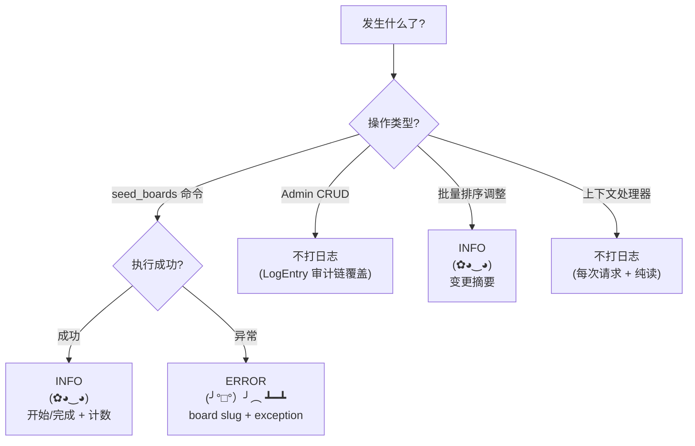

# Boards App — 日志指南

> **文档权重**：70（boards 日志细节；服从根目录 LOGGUIDE）
> 配套：全项目 LOGGUIDE.md（本地 docs/，git-ignored）

---

## 日志级别快速参考

| Python Logger | Kaomoji | 含义 | 使用场景 |
|---------------|---------|------|---------|
| `logger.info()` | `(✿◕‿◕)` | 一切安好 | seed 开始/完成 |
| `logger.warning()` | `(ಠ_ಠ)` | 不对劲了 | 极少（Board 无运行时异常场景） |
| `logger.error()` | `(╯°□°）╯︵ ┻━┻` | 出大问题了 | seed 异常 |

### 日志级别决策树



---

## 职责边界

Boards app 管理首页 Editorial 板块元数据（Board 模型）、种子数据、Dashboard 后台管理。**板块数据是展示型配置，非用户内容，日志量极低。**

---

## 日志点清单

### A. 种子数据

| 时机 | 级别 | 内容 |
|------|------|------|
| seed 开始 | INFO | 目标板板块数 |
| seed 完成 | INFO | 创建数、更新数 |
| seed 异常 | ERROR | 异常上下文（板板块 slug/name） |

```python
# seed_boards 命令
logger.info(f"Boards seed 开始: target_count={board_count}")
logger.info(f"Boards seed 完成: created={created} updated={updated}")
logger.exception(f"Boards seed 异常: board={board_slug}")
```

> `seed_boards` 使用 `update_or_create` 实现幂等，重复执行不产生副作用。

### B. Board CRUD（Dashboard 操作）

Board 的增删改操作通过 Django Admin (`BoardAdmin`) 进行，**已自动由 `LogEntry → SecureLogEntry` 审计链覆盖**，不需要在 `admin.py` 中额外添加业务日志。

仅在以下场景需要额外日志：

| 场景 | 级别 | 内容 |
|------|------|------|
| 板块排序批量调整 | INFO | 变更摘要（哪几块、调了多少位） |

```python
# 如果实现了自定义 admin action（如批量调序）
def reorder_boards(self, request, queryset):
    summary = ", ".join(f"{b.slug}:{b.sort_order}" for b in queryset)
    logger.info(f"Boards 排序调整: {summary} operator={request.user.id}")
```

### C. 上下文处理器

`boards_context()` 是纯只读操作（`filter(is_active=True).select_related('category')`），**不打日志**。每个页面请求都触发，日志洪水。

---

## 不打日志的位置 (boards)

| 位置 | 原因 |
|------|------|
| `boards_context()` 上下文处理器 | 每个请求都触发，读操作 |
| `Board.keywords_list` / `metadata_words` | 纯属性计算 |
| `Board.__str__()` | Django 内部调用 |

---

## 安全规则

```
┌─────────────────────────────────────────────────┐
│  ✅ Board 数据非用户隐私，无敏感信息             │
│  ✅ 日志仅记录 slug/name/sort_order 等公开字段   │
│  ✅ 审计链（SecureLogEntry）自动覆盖 Admin 操作  │
│  ✅ 不记录 category 外键信息（非敏感但冗余）      │
└─────────────────────────────────────────────────┘
```

---

## 与其他 App 对比

| App | 复杂度 | 日志量 | 主要日志来源 |
|-----|--------|--------|-------------|
| **Boards** | **低** | **极低** | seed 命令（一次性） |
| Blogs | 高 | 高 | 文章 CRUD + 修订 + diff |
| comment | 中 | 中 | 评论提交 + 审核 |
| security | 中 | 低 | 审计链验证 |
| accounts | 低 | 低 | 登录/注册/密码修改 |
| config | 低 | 低 | 侧边栏配置变更 |
| music | 空壳 | 无 | 暂无功能 |
