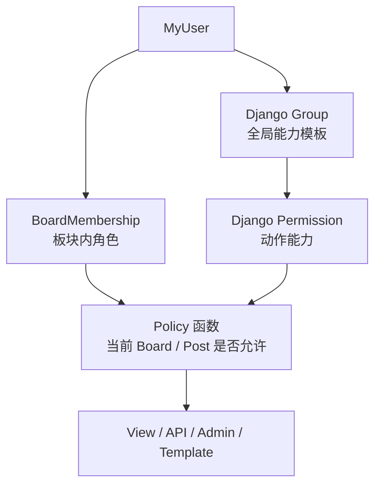

# Boards 权限颗粒度设计指南

> **模块**：`boards/`
> **状态**：设计建议，尚未实施
> **日期**：2026-07-12
> **目标**：以后续功能围绕 Board 展开，在不引入第三方对象权限库的前提下实现最小权限、职责分离和可测试的板块级授权。

## 1. 当前问题

当前 `BoardAdmin` 继承 `DashboardAdminMixin`，实际权限只有一个全局开关：

```text
is_dashboard_user=True → 可以查看、新增、修改所有 Board
is_superuser=True      → 可以删除 Board
```

这无法表达“只能管理某个板块”“能投稿但不能改视觉配置”“能审核他人文章但不能审核自己”等对象级规则。Board 与 Post 目前通过 `Board.category → Post.category` 间接关联，也需要在权限策略中明确归属。

## 2. 推荐的三层授权模型



| 层级 | 职责 | 示例 |
|---|---|---|
| Group | 全站角色模板 | `SiteOperators`、`BoardCreators` |
| Permission | 是否具备某种动作能力 | `boards.create_board`、`boards.audit_board` |
| BoardMembership | 用户在某个 Board 内是什么角色 | Coding 的 Editor、Music 的 Reviewer |
| Policy | 结合能力、板块角色和对象归属作最终判断 | 只能编辑所属 Board 的文章 |

`is_active`、`is_staff`、`is_superuser` 保留 Django 原生语义；`is_dashboard_user` 暂时只作为 dashboard 入口开关，不再代表具体业务权限。`is_reviewer` 在迁移完成后可删除。

## 3. 建议数据模型

```python
class BoardMembership(models.Model):
    class Role(models.TextChoices):
        CONTRIBUTOR = 'contributor', '投稿者'
        EDITOR = 'editor', '编辑者'
        REVIEWER = 'reviewer', '审核者'
        MANAGER = 'manager', '板块管理员'

    board = models.ForeignKey(Board, on_delete=models.CASCADE, related_name='memberships')
    user = models.ForeignKey(settings.AUTH_USER_MODEL, on_delete=models.CASCADE,
                             related_name='board_memberships')
    role = models.CharField(max_length=16, choices=Role.choices)
    is_active = models.BooleanField(default=True)
    created_by = models.ForeignKey(settings.AUTH_USER_MODEL, null=True,
                                   on_delete=models.SET_NULL,
                                   related_name='created_board_memberships')
    created_at = models.DateTimeField(auto_now_add=True)

    class Meta:
        constraints = [
            models.UniqueConstraint(fields=['board', 'user'], name='unique_board_member'),
        ]
```

第一阶段继续使用 `Board.category` 判断文章所属板块。若未来一个分类可进入多个 Board，或一篇文章可跨板块展示，再增加明确的 `Post.board` 或中间表，不要长期依赖隐式推断。

## 4. 板块内角色建议

| 能力 | 普通用户 | Contributor | Editor | Reviewer | Manager | SiteOperator | superuser |
|---|:---:|:---:|:---:|:---:|:---:|:---:|:---:|
| 查看公开板块/文章 | ✅ | ✅ | ✅ | ✅ | ✅ | ✅ | ✅ |
| 在所属板块投稿 | — | ✅ | ✅ | — | ✅ | — | ✅ |
| 编辑自己的草稿 | — | ✅ | ✅ | — | ✅ | — | ✅ |
| 编辑他人正文 | — | — | ⚠️ 可选 | — | ✅ | — | ✅ |
| 提交审核 | — | ✅ | ✅ | — | ✅ | — | ✅ |
| 查看所属板块审核队列 | — | — | — | ✅ | ✅ | — | ✅ |
| 通过/驳回他人文章 | — | — | — | ✅ | ✅ | — | ✅ |
| 审核自己的文章 | — | — | — | ❌ | ❌ | — | ✅ |
| 管理评论 | — | — | — | ✅ | ✅ | — | ✅ |
| 修改 Board 文案/视觉 | — | — | — | — | ✅ | — | ✅ |
| 管理板块成员 | — | — | — | — | ✅ | — | ✅ |
| 查看/运行全站审计 | — | — | — | — | — | ✅ | ✅ |
| 创建/删除 Board | — | — | — | — | — | 可选 | ✅ |

建议默认不允许 Editor 修改他人正文；需要协作编辑时再单独开放，并保留修订记录。Reviewer 只负责审核，不能直接改正文。

## 5. 建议 Permission 划分

### Boards

```text
boards.view_board_dashboard
boards.create_board
boards.change_board_settings
boards.activate_board
boards.manage_board_members
boards.delete_board
```

### Blogs

```text
Blogs.create_board_post
Blogs.change_own_board_post
Blogs.change_any_board_post
Blogs.submit_board_post
Blogs.view_board_review_queue
Blogs.review_board_post
Blogs.publish_board_post
Blogs.unpublish_board_post
Blogs.view_staff_post
```

### Comment / Security

```text
comment.moderate_board_comment
security.view_audit_log
security.run_integrity_audit
```

Django 自带的 `add/change/delete/view` 权限继续保留；自定义权限用于表达业务语义，避免把 `change_post` 同时解释成编辑、审核和发布。

## 6. 统一 Policy 建议

所有 View、API、Admin 和模板调用同一组纯函数，避免重复手写布尔判断：

```python
can_access_dashboard(user)
get_board_role(user, board)
can_create_post(user, board)
can_edit_post(user, post)
can_submit_post(user, post)
can_review_post(user, post)
can_manage_comments(user, board)
can_change_board_settings(user, board)
can_manage_board_members(user, board)
```

关键约束：

```python
def can_review_post(user, post):
    board = board_for_post(post)
    return (
        user.is_superuser
        or (
            get_board_role(user, board) in {'reviewer', 'manager'}
            and post.owner_id != user.id
        )
    )
```

权限失败对外统一返回 403；隐藏内容和 STAFF_ONLY 内容为避免泄露是否存在，继续返回 404。

## 7. Django Group 如何对齐

Group 只表达跨 Board 的全局角色，不复制 BoardMembership：

| Group | 用途 |
|---|---|
| `BoardCreators` | 可以创建新 Board，但不会自动管理已有 Board |
| `SiteOperators` | 查看并运行审计，不具备文章或成员管理权 |
| `UserManagers` | 激活账号、分配板块成员；不能授予 superuser/staff |

Contributor、Editor、Reviewer、Manager 属于板块内角色，应放在 `BoardMembership.role`，否则用户加入 `Editors` Group 后会自动获得所有板块的编辑能力，违反最小权限原则。

## 8. 推荐迁移顺序

1. 为 Board、Blogs、comment、security 增加业务 Permission。
2. 新建 `BoardMembership` 和数据迁移。
3. 将现有 `is_dashboard_user=True, is_reviewer=False` 用户迁为默认 Board 的 Editor/Manager，由 superuser 人工复核。
4. 将 `is_reviewer=True` 用户迁为相应 Board 的 Reviewer。
5. 建立 `boards/policies.py`，先让测试使用，再逐步替换 View/API/Admin 判断。
6. dashboard 入口保留 `is_dashboard_user`，模型操作改查 Policy。
7. 权限矩阵测试通过后，停止读取 `is_reviewer`。
8. 最后删除 `is_reviewer` 字段；是否删除 `is_dashboard_user` 另行评估。

不要在同一个迁移中同时创建 Membership、迁数据、删除旧字段，确保每一步可回滚和核验。

## 9. 必测矩阵

- 普通用户不能进入 dashboard，也不能上传正文图片。
- Contributor 只能在所属 Board 投稿和编辑自己的草稿。
- Editor 不能编辑其他 Board 的文章。
- Reviewer 只能看到所属 Board 的审核队列，且不能审核自己的文章。
- Manager 不能查看全站审计，除非同时属于 `SiteOperators`。
- SiteOperator 不能编辑文章、评论或 Board 配置。
- 被停用的 Membership 立即失效。
- superuser 始终可恢复和管理系统。
- View、API 与 Admin 对同一操作给出一致结果。

## 10. 决策建议

| 决策 | 建议 |
|---|---|
| 是否引入 django-guardian | 暂不引入；BoardMembership + Policy 足够，未来对象规则爆炸时再评估 |
| 审核者能否改正文 | 默认不能 |
| 能否审核自己文章 | 禁止，superuser 应急除外 |
| Manager 能否查看审计 | 默认不能，职责与 SiteOperator 分离 |
| 一个用户能否有多个板块角色 | 每个 Board 一个最高角色；不同 Board 可不同 |
| Group 是否表示 Editor/Reviewer | 不建议，避免权限扩散到全部 Board |

## 11. 已知风险 / TODO

| 严重度 | 问题 | 建议 |
|---|---|---|
| 🔴 高 | 当前所有 dashboard 用户可修改全部 Board | 实施 BoardMembership 与 BoardAdmin Policy |
| 🔴 高 | 审核权限目前是全局 `is_reviewer` | 迁为板块级 Reviewer，并禁止自审 |
| 🟡 中 | Board 与 Post 仅通过 Category 间接关联 | 第一阶段封装 `board_for_post()`；未来按产品关系显式建模 |
| 🟡 中 | View/API/Admin 权限判断分散 | 收敛到 `boards/policies.py` |
| 🟡 中 | 缺少完整角色矩阵测试 | 实施权限前先写拒绝路径测试 |
