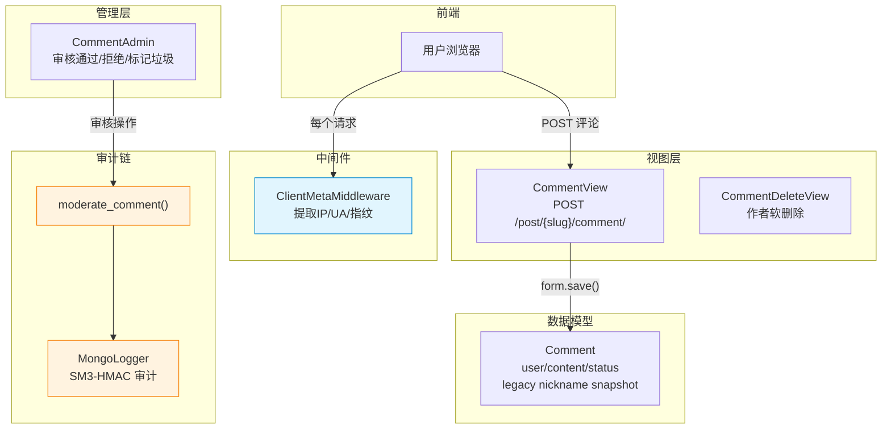
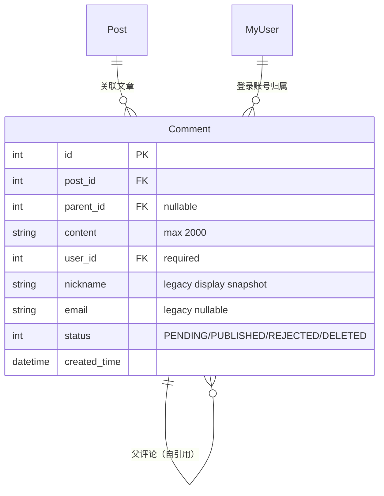
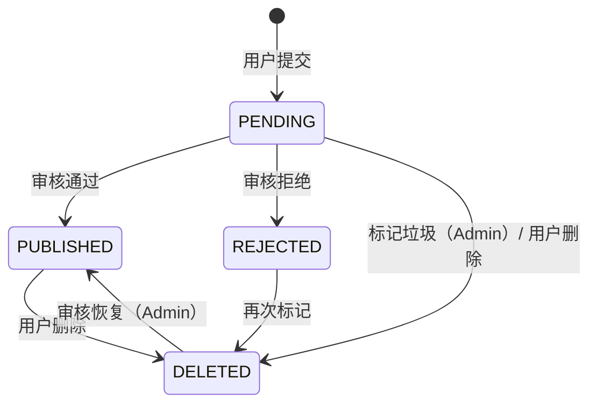
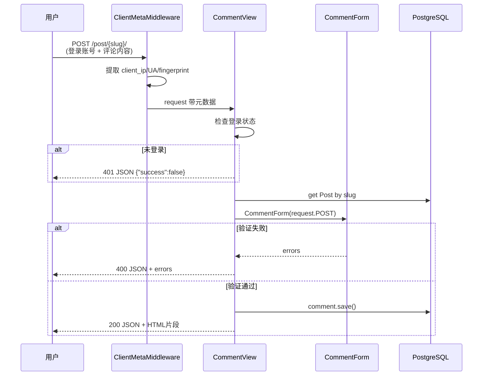
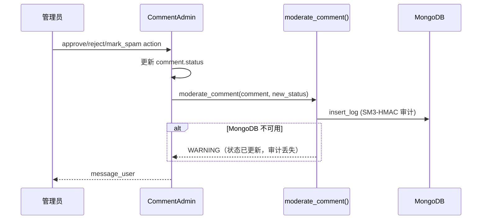
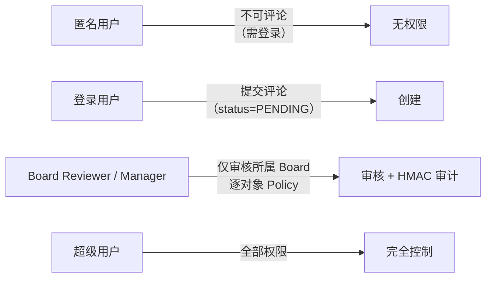
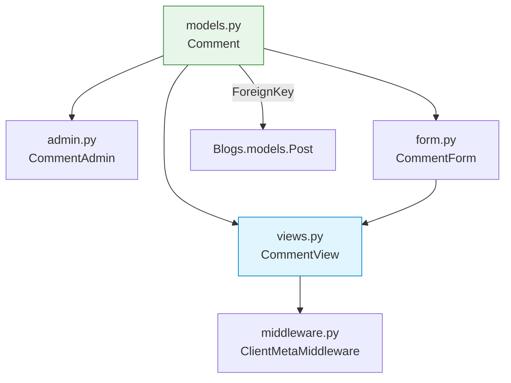

# Comment 模块 — 开发文档

> **文档权重**：85（comment 当前实现与模块 TODO）
> **模块**: `comment/`  
> **职责**: 博客评论的提交、审核、展示，以及客户端元数据中间件  
> **依赖**: `Blogs.models.Post`, `gmssl.sm3`, `accounts.MyUser`  
> **创建**: 2026-06-22  
> **更新**: 2026-07-29 — 评论表单改为登录账号身份，移除客户端匿名昵称

---

## 0. 变更日志

| 版本 | 日期 | 变更 |
|------|------|------|
| v2.6 | 2026-07-29 | 前台仅向登录账号展示评论表单，作者名读取 Profile 公共名称并回退 username；客户端不再提交 nickname，服务端忽略伪造昵称并保留账号归属 |
| v2.5 | 2026-07-19 | Stage 5：Reviewer/Manager 恢复所属 Board 评论 action，逐对象 Policy 校验并保留 MongoDB HMAC 审计 |
| v2.4 | 2026-07-19 | Stage 4：新增 `/dashboard/` Board-scoped 只读评论队列，Reviewer/Manager 仅见所属 Board 评论 |
| v2.3 | 2026-07-19 | 修正 `0003_comment_user` 数据迁移：删除无归属旧评论后增加非空 `user_id`，修复开发库前端查询 500 |
| v1.1 | 2026-07-12 | Comment 强制关联用户；每用户+IP 限流；作者软删除；Admin 审核统一调用 MongoDB HMAC 审计服务；补回归测试 |
| v1.0 | 2026-06-22 | 新建文档，覆盖评论提交、审核、中间件架构 |

---

## 1. 模块架构概览



**设计原则**:
- 评论提交返回 JSON（API 兼容 + HTMX 片段），不跳转页面
- 登录拦截返回 401 JSON 而非 302 重定向
- 客户端指纹使用 SM3 哈希，不存明文 UA/IP 组合
- 评论审核审计由 MongoDB + SM3-HMAC 链独立完成，不依赖应用日志

---

## 2. 文件清单

| 文件 | 类/函数 | 职责 |
|------|---------|------|
| `models.py` | `Comment` | 评论模型（含状态枚举、`get_by_target`） |
| `views.py` | `CommentView` | 评论提交端点（LoginRequired + JSON 响应） |
| `form.py` | `CommentForm` | 表单只接收正文并验证内容≥10字符；作者身份不接受客户端输入 |
| `admin.py` | `CommentAdmin` | Admin 审核操作（approve/reject/mark_spam） |
| `middleware.py` | `ClientMetaMiddleware` | 提取客户端 IP/UA/指纹（每个请求） |
| `middleware.py` | `get_client_ip()` | IP 提取（X-Forwarded-For 反伪造 + 兜底） |
| `apps.py` | `CommentConfig` | App 配置 |

---

## 3. 数据模型



`nickname` 与 `email` 暂留为历史兼容列，不再出现在公开评论表单中，也不作为授权或当前显示身份来源。展示名称由 `Comment.author_name` 从关联账号的公开 Profile 名称读取，并回退到 username；服务端会覆盖客户端伪造的同名字段。

### 状态机



### 关键方法

| 方法 | 说明 |
|------|------|
| `Comment.get_by_target(post)` | 获取某文章的一级发布评论（不含回复） |
| `CommentForm.clean_content()` | 内容去空白 + 长度≥10 校验 |

---

## 4. 详细工作流

### 4a. 评论提交流程



### 4b. 审核流程



---

## 5. API 端点

| 端点 | 方法 | 格式 | 说明 |
|------|------|------|------|
| `/post/{slug}/` | POST | JSON | 提交评论（仅 `content`，需登录；作者身份由服务端账号确定） |

> 评论列表在文章详情页中通过模板标签 `comment_block` 渲染，无独立 API 端点。

---

## 6. Admin 配置

```python
# /super_admin/：既有批量审核入口
@admin.register(Comment)
class CommentAdmin(admin.ModelAdmin):
    list_display = ['content_short_description', 'post', 'nickname', 'created_time']
    actions = ['approve_comments', 'reject_comments', 'mark_spam']

# /dashboard/：Stage 5 Board-scoped 审核队列
@admin.register(Comment, site=custom_site)
class BoardScopedCommentAdmin(DashboardAdminMixin, admin.ModelAdmin):
    actions = ['approve_comments', 'reject_comments', 'mark_spam']
```

| Action | 目标状态 | 说明 |
|--------|---------|------|
| `approve_comments` | PUBLISHED | 批量通过 |
| `reject_comments` | REJECTED | 批量拒绝 |
| `mark_spam` | DELETED | 批量标记垃圾 |

Dashboard 队列通过 `boards.policies.comments_visible_to_moderator()` 限定 Reviewer/Manager 的有效 Membership Board。每条 action 在写入前再次调用 `can_moderate_comment()`，然后复用 `security.services.moderate_comment()` 写状态和 MongoDB HMAC 审计；即使构造跨 Board queryset 也会跳过非所属评论。

---

## 7. 权限矩阵



| 角色 | 提交评论 | 审核评论 | 删除评论 |
|------|---------|---------|---------|
| 匿名 | ✖ | ✖ | ✖ |
| 登录用户 | ✅ (PENDING) | ✖ | ✅ (仅自己的) |
| Board Reviewer / Manager | ✅ | ✅（所属 Board） | ✖ |
| 超级用户 | ✅ | ✅ | ✅ |

---

## 8. 缓存架构

Comment 模块目前无独立缓存。评论列表通过 `comment_block` 模板标签实时查询渲染。

| 缓存层 | 状态 | 说明 |
|--------|------|------|
| 评论列表 | 无缓存 | 每次请求实时查询，量小 |
| IP 解析 | 无缓存 | 每次请求计算，轻量 |

---

## 9. 演进路径

### 当前状态 (v1.0)

- 基础评论提交 + Admin 审核
- 客户端元数据中间件
- 评论数较少，无需复杂架构

### 目标状态 (v2.0)

| 特性 | 当前 | 目标 |
|------|------|------|
| 评论嵌套 | 仅一级回复 | 多级嵌套 + 折叠 |
| 反垃圾 | 无 | 内容过滤 / 频率限制 |
| 通知 | 无 | 被回复者邮件通知 |
| 审核队列 | Admin 手动 | 可配置自动审核策略 |

---

## 10. 文件依赖图



---

## 11. 已知问题 / TODO

| 严重度 | 问题 | 说明 |
|--------|------|------|
| ✅ 已修复 | 评论删除 | Comment 强制关联用户；作者和 superuser 可通过 CSRF 保护的接口软删除 |
| ✅ 已修复 | 开发库缺少 `comment_comment.user_id` | `0003_comment_user` 先清理无法归属的旧评论，再建立非空用户外键；旧数据需重新导入 |
| ✅ 已修复 | 无频率限制 | 按用户 + IP 使用 cache 限制提交频率，默认每分钟 5 条，超限返回 429 |
| ✅ 已修复 | Dashboard 审核 action 缺对象级 Policy | Stage 5 已逐对象调用 Policy，并有跨 Board action + MongoDB 审计回归测试 |
| 🟢 低 | `email` 字段未使用 | Comment 模型有 email 字段但 CommentForm 未包含 |

---

## 12. 附录

### 路由

```
# 评论提交通过文章详情路由处理（POST 到 /post/{slug}/）
# 无独立 URL 配置，CommentView 在 Blogs 的 URL 配置中注册
```

### 中间件配置

```python
# settings/base.py
MIDDLEWARE = [
    ...
    'comment.middleware.ClientMetaMiddleware',  # 放在 AuthenticationMiddleware 之后
    ...
]
```

### 管理命令

| 命令 | 说明 |
|------|------|
| `purge_old_comment_logs` | 清理过期 MongoDB 审核日志 |

### 注意事项

- `redirect_field_name = None` 禁止 Django 302 跳转，确保 API 返回 JSON 而非 HTML
- `ClientMetaMiddleware` 每个请求都触发，正常路径不打日志
- 评论审核审计由 `security` 模块的 `MongoLogger` + SM3-HMAC 链完成，不依赖 `comment` 应用日志
