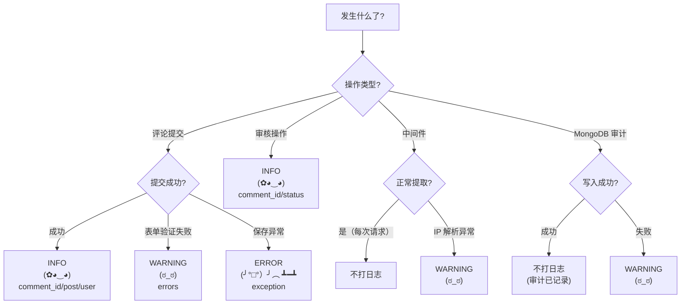

# Comment App — 日志指南

> 配套：[根目录 LOGGUIDE.md](../LOGGUIDE.md)

---

## 日志级别快速参考

| Python Logger | Kaomoji | 含义 | 使用场景 |
|---------------|---------|------|---------|
| `logger.info()` | `(✿◕‿◕)` | 一切安好 | 评论提交成功、审核操作 |
| `logger.warning()` | `(ಠ_ಠ)` | 不对劲了 | 表单验证失败、IP 解析异常、MongoDB 写入失败 |
| `logger.error()` | `(╯°□°）╯︵ ┻━┻` | 出大问题了 | 评论保存异常、MongoDB 连接失败 |

### 日志级别决策树



---

## 职责边界

Comment app 负责博客评论的提交、审核、展示，以及客户端元数据中间件。**评论审核已有 MongoDB 审计链（SM3-HMAC），这里的应用日志用于排查问题。**

---

## 日志点清单

### A. 视图层 (views.py)

#### A1. CommentView — 评论提交

| 时机 | 级别 | 内容 |
|------|------|------|
| 提交成功 | INFO | comment_id, post_slug, user_id, nickname |
| 表单验证失败 | WARNING | post_slug, user_id, errors |
| 保存异常 | ERROR | post_slug, user_id, error |

```python
def form_valid(self, form):
    response = super().form_valid(form)
    # 注意：不记录用户邮箱！
    logger.info(f"Comment 提交: comment_id={self.object.id} "
                f"post_slug={self.post.slug} user={self.request.user.id if self.request.user.is_authenticated else 'anon'} "
                f"nickname={form.cleaned_data.get('nickname')[:20]}")  # 昵称截断防过长
    return response

def form_invalid(self, form):
    logger.warning(f"Comment 提交失败: post_slug={self.kwargs.get('slug')} "
                   f"user={self.request.user.id if self.request.user.is_authenticated else 'anon'} "
                   f"errors={form.errors}")
    return super().form_invalid(form)
```

> 评论本身的防篡改审计由 `moderate_comment() → MongoLogger → SM3-HMAC` 链完成，不在应用日志中重复。

### B. 中间件 (middleware.py)

#### B1. ClientMetaMiddleware — 客户端元数据提取

| 时机 | 级别 | 内容 |
|------|------|------|
| 正常提取 | — | 不打日志（每个请求都走，高频） |
| IP 解析异常 | WARNING | 原始 header 值，path |

```python
# 只在异常时记录
try:
    ip = extract_ip(request)
except Exception as e:
    logger.warning(f"Client IP 提取异常: path={request.path} "
                   f"x_forwarded_for={request.META.get('HTTP_X_FORWARDED_FOR', 'N/A')}")
    ip = "0.0.0.0"
```

### C. 管理层 (admin.py)

#### C1. CommentAdmin — 审核操作

| 时机 | 级别 | 内容 |
|------|------|------|
| 审核通过 | INFO | comment_id, old_status, new_status=approved, moderator |
| 审核拒绝 | INFO | comment_id, old_status, new_status, reason, moderator |
| 标记垃圾 | INFO | comment_id, old_status, new_status=spam, moderator |

```python
def approve_comments(self, request, queryset):
    for comment in queryset:
        logger.info(f"Comment 审核通过: comment_id={comment.id} "
                    f"old_status={comment.status} user={request.user.id}")
    # 注意：审核具体逻辑在 moderate_comment() 中，那里有 MongoDB 审计日志
    # 这里的应用日志是补充（方便 grep 排查）
```

### D. 管理命令 (management/commands/)

#### D1. purge_old_comment_logs

```python
logger.info(f"purge_old_comment_logs 开始: cutoff_date={cutoff}")
# ... 清理逻辑 ...
logger.info(f"purge_old_comment_logs 完成: deleted_count={count}")
```

如果删除过程中 MongoDB 连接失败：

```python
except PyMongoError as e:
    logger.exception(f"MongoDB 日志清理失败: error={e}")
```

### E. 模型层 (models.py)

#### E1. Comment.save()

Comment 模型的 `save()` 不需要额外日志。评论创建通过视图层日志覆盖，审核操作通过 `moderate_comment()` 覆盖。

#### E2. Comment.delete()

```python
# 如果未来实现评论删除（当前可能没有）
def delete(self, *args, **kwargs):
    logger.info(f"Comment 删除: comment_id={self.id} post_id={self.post_id}")
    super().delete(*args, **kwargs)
```

---

## 不打日志的位置 (comment)

| 位置 | 原因 |
|------|------|
| 评论列表渲染 (`comment_block.py` 模板标签) | 每次渲染都调用 |
| `ClientMetaMiddleware` 正常路径 | 每个请求都走 |
| 评论提交成功后的页面跳转 | 已在 form_valid 记录 |

---

## 安全规则（重点）

```
┌─────────────────────────────────────────────────┐
│  ❌ 绝不记录: 邮箱地址、手机号                     │
│  ❌ 绝不记录: 用户密码、Session key、Token         │
│  ❌ 绝不记录: 客户端指纹原文（SM3 哈希后可记）     │
│  ✅ 用 comment_id + user_id 标识评论和评论者      │
│  ✅ 昵称记录截断到 20 字符                        │
│  ✅ 审计链（MongoDB SM3-HMAC）自动覆盖审核操作    │
│  ✅ 不记录 IP 原文 — 仅中间件提取到 request        │
└─────────────────────────────────────────────────┘
```

---

## 与其他 App 对比

| App | 复杂度 | 日志量 | 主要日志来源 |
|-----|--------|--------|-------------|
| Blogs | 高 | 高 | 文章 CRUD + 修订 + diff |
| **comment** | **中** | **中** | 评论提交 + 审核 |
| security | 中 | 低 | 审计链验证 |
| accounts | 低 | 低 | 登录/注册/密码修改 |
| boards | 低 | 极低 | seed 命令（一次性） |
| config | 低 | 低 | 侧边栏配置变更 |
| music | 空壳 | 无 | 暂无功能 |
