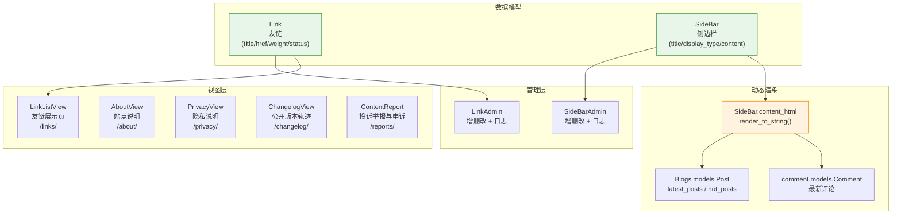
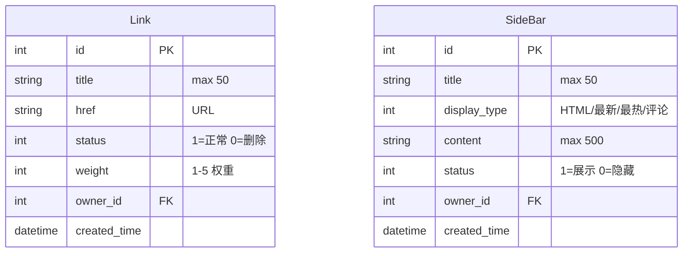
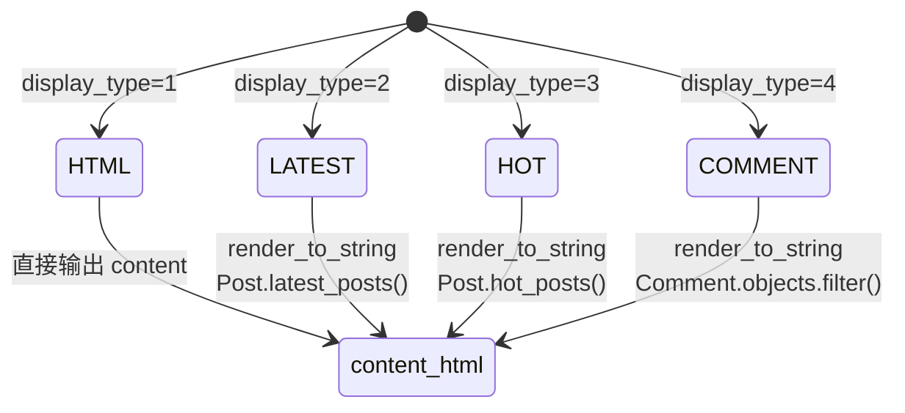
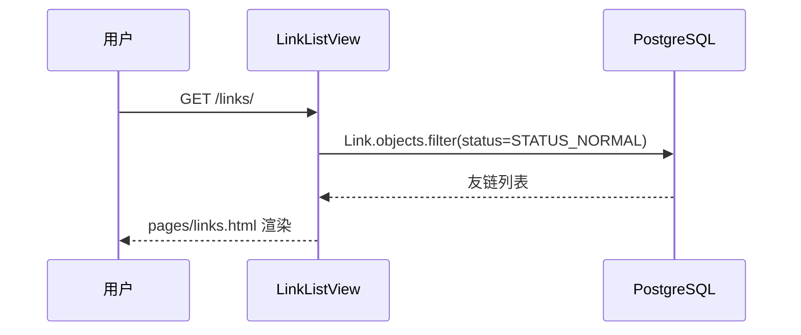
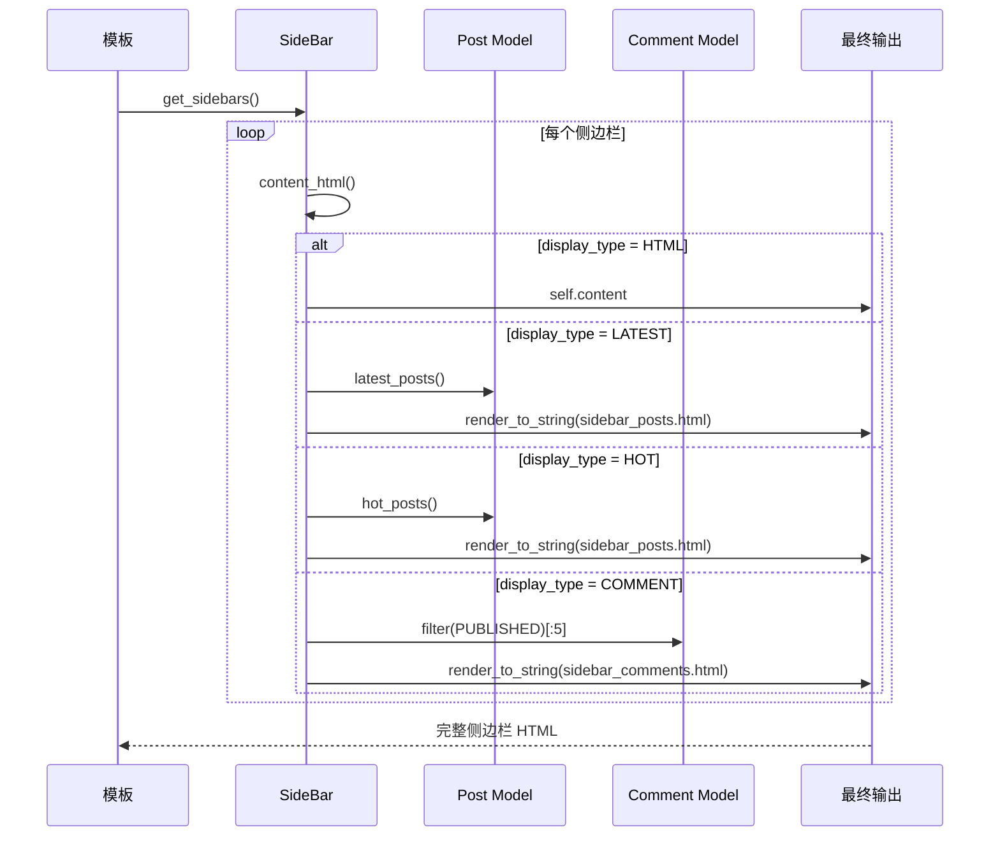
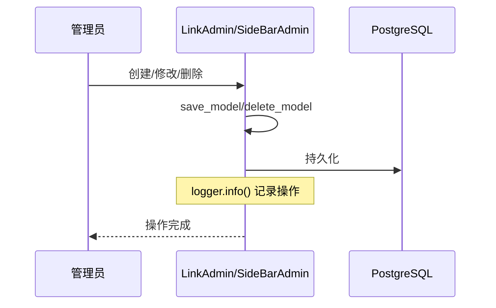
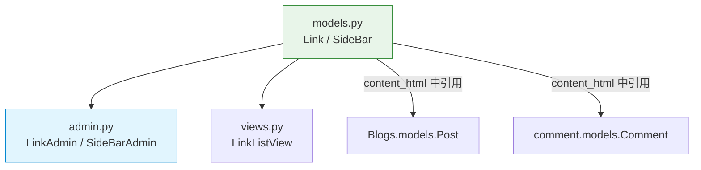

# Config 模块 — 开发文档

> **文档权重**：85（config 当前实现与模块 TODO）
> **模块**: `config/`  
> **职责**: 管理博客站点全局配置项、静态说明页、公开元数据上下文、robots 与错误响应
> **依赖**: `Blogs.models.Post`, `comment.models.Comment`, `config.policies.is_site_owner`
> **创建**: 2026-06-22  
> **更新**: 2026-09-02 — Site Owner Policy 与公开版本轨迹页

---

## 0. 变更日志

| 版本 | 日期 | 变更 |
|------|------|------|
| v1.6 | 2026-08-30 | Link/SideBar 明确为单站点资源；Admin 自身只允许 active superuser，`owner` 仅记录创建者而非授权事实 |
| v1.5 | 2026-08-30 | 新增 `/changelog/` 公开版本轨迹；独立 JSON 只收录访客可感知里程碑，不直接暴露完整工程日志 |
| v1.4 | 2026-08-29 | 新增公开投诉举报表单、随机受理编号、最小状态查询、后台处置及事务型审计留痕 |
| v1.3 | 2026-07-27 | 新增 RFC 9116 `/.well-known/security.txt`，包含 Contact、Expires、Preferred-Languages 与 Canonical |
| v1.2 | 2026-07-27 | 新增固定公网 canonical 上下文、`robots.txt`、生产 404/500 handler 与 4 项契约测试 |
| v1.1 | 2026-07-26 | 新增 `/about/`、`/privacy/` 与公开页面测试 |
| v1.0 | 2026-06-22 | 新建文档，覆盖 Link、SideBar 模型及管理后台 |

---

## 1. 模块架构概览



**设计原则**:
- 友链和侧边栏均为站长配置型数据，非用户内容
- Link/SideBar 的写权限由 `is_site_owner()` 显式判断；`/super_admin/` 外层认证不是唯一防线
- 侧边栏通过 `display_type` 枚举实现多类型动态渲染
- 所有 Admin 写操作记录日志（操作频率极低，无洪水风险）
- 读操作无日志（每次请求都触发）

---

## 2. 文件清单

| 文件 | 类/函数 | 职责 |
|------|---------|------|
| `models.py` | `Link` | 友链模型（title/href/status/weight/owner） |
| `models.py` | `SideBar` | 侧边栏模型（title/display_type/content，含 `content_html` 属性） |
| `models.py` | `ContentReport` | 公众投诉举报、受理状态、内部记录与公开反馈；来源只保存摘要 |
| `services.py` | `submit_content_report/review_content_report` | 业务状态与最小化审计 outbox 同事务写入 |
| `public_changelog.py` | `load_public_changelog` | 校验并读取公开、安全裁剪后的版本轨迹 JSON |
| `data/public_changelog.json` | schema v1 | 访客可感知的版本摘要、板块标签与最多三条展开详情 |
| `admin.py` | `SiteOwnerAdmin` / `LinkAdmin` | active superuser-only 友链 Admin（含日志） |
| `admin.py` | `SiteOwnerAdmin` / `SideBarAdmin` | active superuser-only 侧边栏 Admin（含日志） |
| `views.py` | `LinkListView` | 友链展示页（ListView + CommonViewMixin） |
| `views.py` | `content_report_create/status` | 公开提交、来源限流及最小化状态查询 |
| `apps.py` | `ConfigConfig` | App 配置 |

---

## 3. 数据模型



### SideBar 展示类型



### 关键方法

| 方法 | 说明 |
|------|------|
| `SideBar.get_sidebars()` | 返回所有 `status=SHOW` 的侧边栏 |
| `SideBar.content_html` | 根据 `display_type` 动态渲染模板内容 |

---

## 4. 详细工作流

### 4a. 友链展示流程



### 4b. 侧边栏动态渲染



### 4c. Admin 友链/侧边栏操作



---

## 5. API 端点

| 端点 | 方法 | 模板 | 说明 |
|------|------|------|------|
| `/links/` | GET | `pages/links.html` | 友链展示页 |
| `/changelog/` | GET | `pages/site/changelog.html` | 公开版本轨迹；不直接渲染仓库 `CHANGELOG.md` |

> 侧边栏无独立端点，作为模板片段嵌入所有页面（通过 `CommonViewMixin` 上下文）。

---

## 6. Admin 配置

```python
@admin.register(Link)
class LinkAdmin(SiteOwnerAdmin):
    list_display = ('title', 'href', 'status', 'weight', 'created_time')
    fields = ('title', 'href', 'status', 'weight')

@admin.register(SideBar)
class SideBarAdmin(SiteOwnerAdmin):
    list_display = ('title', 'display_type', 'content', 'created_time')
    fields = ('title', 'display_type', 'content')
```

| Admin | 继承 | 特殊配置 | 日志 |
|-------|------|---------|------|
| `LinkAdmin` | `SiteOwnerAdmin` | active superuser-only；owner 仅记录创建者 | 增删改 INFO |
| `SideBarAdmin` | `SiteOwnerAdmin` | active superuser-only；owner 仅记录创建者 | 增删改 INFO |

---

## 7. 权限矩阵

| 角色 | 查看友链/侧边栏 | 修改配置 | 创建配置 | 删除配置 |
|------|:---:|:---:|:---:|:---:|
| 匿名 | ✅ | ✖ | ✖ | ✖ |
| 登录用户 | ✅ | ✖ | ✖ | ✖ |
| 普通 staff / Dashboard Operator | ✅ | ❌ | ❌ | ❌ |
| 超级用户 | ✅ | ✅ | ✅ | ✅ |

> 权限控制统一依赖 `config.policies.is_site_owner()`；模块入口、查询集和所有写动作都只接受 active superuser。`owner` 是审计元数据，不是授权来源。

---

## 8. 缓存架构

Config 模块无独立缓存层。读操作每次请求实时查询数据库。

| 缓存层 | 状态 | 说明 |
|--------|------|------|
| 友链列表 | 无 | 数据量极小（通常 < 20 条） |
| 侧边栏 | 无 | 每次请求查询，可考虑添加 `site_config` 缓存键 |
| 侧边栏渲染 | Django 模板缓存 | 无显式缓存 |

---

## 9. 演进路径

### 当前状态 (v1.0)

- 基本友链 + 侧边栏配置
- Admin 增删改 + 日志
- 无缓存

### 目标状态 (v2.0)

| 特性 | 当前 | 目标 |
|------|------|------|
| 缓存 | 无 | 添加 `cache.get("site_config")` 预缓存侧边栏 |
| 友链分类 | 无 | 按类别分组（技术/友情/推荐） |
| 侧边栏排序 | 无 | 拖拽排序 |
| SEO 配置 | 侧边栏 HTML | 独立 SEO 模型 |

---

## 10. 文件依赖图



---

## 11. 已知问题 / TODO

| 严重度 | 问题 | 说明 |
|--------|------|------|
| 🟢 低 | 无缓存导致重复渲染 | SideBar.content_html 每次请求都调用 `render_to_string`，可考虑模板缓存 |
| 🟢 低 | 侧边栏无排序字段 | 目前按 `created_time` 排序，无法自定义顺序 |
| ✅ | 静态说明页测试 | About、隐私内容与全局入口已有 3 项契约测试；模型/Admin 仍需后续补齐 |
| ✅ | 公开元数据与错误响应 | canonical 不信任请求 Host；robots 使用绝对 Sitemap；404/500 不暴露异常详情 |

---

## 12. 附录

### 路由

```
# 在项目根 urls.py 中直接注册
path('links/', LinkListView.as_view(), name='links')
path('about/', AboutView.as_view(), name='about')
path('privacy/', PrivacyView.as_view(), name='privacy')
path('robots.txt', robots_txt, name='robots')
path('.well-known/security.txt', security_txt, name='security-txt')

handler404 = 'config.views.page_not_found'
handler500 = 'config.views.server_error'
```

### 管理命令

无独立管理命令。

### 注意事项

- `SideBar.content_html` 在每次请求中都可能被调用（通过网站公共侧边栏），需要关注性能
- `Link.weight` 权重范围 1-5，数字越大越靠前
- Admin `save_model` 和 `delete_model` 中已记录日志，日志量极低（仅站长操作）
