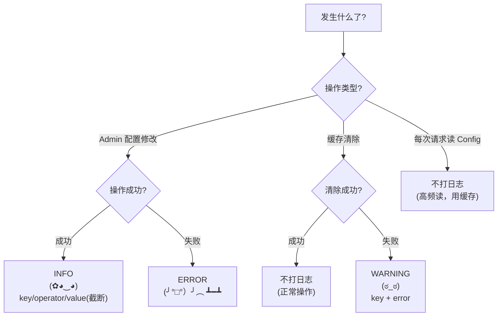

# Config App — 日志指南

> 配套：[根目录 LOGGUIDE.md](../LOGGUIDE.md)

---

## 日志级别快速参考

| Python Logger | Kaomoji | 含义 | 使用场景 |
|---------------|---------|------|---------|
| `logger.info()` | `(✿◕‿◕)` | 一切安好 | 配置修改/创建/删除、Link/SideBar 操作 |
| `logger.warning()` | `(ಠ_ಠ)` | 不对劲了 | 缓存清除失败 |
| `logger.error()` | `(╯°□°）╯︵ ┻━┻` | 出大问题了 | 极少使用（纯配置型操作） |

### 日志级别决策树



---

## 职责边界

Config app 管理博客站点的全局配置项（站点标题、副标题、SEO 元数据、社交链接等）。通常只有站长在 Django Admin 中修改，操作频率极低但影响面大。

---

## 日志点清单

### A. 站点配置修改

| 时机 | 级别 | 内容 |
|------|------|------|
| 配置修改 | INFO | config_key, old_value (截断), new_value (截断), operator_id |
| 配置创建 | INFO | config_key, value (截断), operator_id |
| 配置删除 | INFO | config_key, operator_id |

```python
# 在 admin.py 的 save_model 中
def save_model(self, request, obj, form, change):
    if change:
        old = Config.objects.get(pk=obj.pk)
        logger.info(f"Config 修改: key={obj.key} operator={request.user.id} "
                    f"old={str(old.value)[:50]} new={str(obj.value)[:50]}")
    else:
        logger.info(f"Config 创建: key={obj.key} operator={request.user.id}")
    super().save_model(request, obj, form, change)
```

> 值截断到 50 字符 — 防止配置内容过长。DMeta/SEO 描述字段可能很长。

### B. 缓存失效

Config 修改后通常需要清除相关缓存：

```python
def save_model(self, request, obj, form, change):
    super().save_model(request, obj, form, change)
    # 清除站点配置缓存
    try:
        cache.delete("site_config")
    except Exception as e:
        logger.warning(f"Config 缓存清除失败: key={obj.key} error={e}")
```

---

## 不打日志的位置 (config)

| 位置 | 原因 |
|------|------|
| 每次请求读取 Config | 高频读，用缓存即可 |
| Config 模型 save() | Admin 层已覆盖 |

---

## 安全规则（重点）

```
┌─────────────────────────────────────────────────┐
│  ✅ Config/Link 数据为站点配置，非用户隐私        │
│  ✅ 日志仅记录 title/href/key 等公开字段          │
│  ✅ 配置值截断到 50 字符（防止过长）              │
│  ✅ owner_id 用于审计追溯，非敏感信息              │
│  ✅ 不记录 SideBar 渲染内容（模板动态生成）        │
└─────────────────────────────────────────────────┘
```

---

## 与其他 App 对比

| App | 复杂度 | 日志量 | 主要日志来源 |
|-----|--------|--------|-------------|
| Blogs | 高 | 高 | 文章 CRUD + 修订 + diff |
| comment | 中 | 中 | 评论提交 + 审核 |
| security | 中 | 低 | 审计链验证 |
| accounts | 低 | 低 | 登录/注册/密码修改 |
| boards | 低 | 极低 | seed 命令（一次性） |
| **config** | **低** | **低** | 侧边栏配置变更 |
| music | 空壳 | 无 | 暂无功能 |
