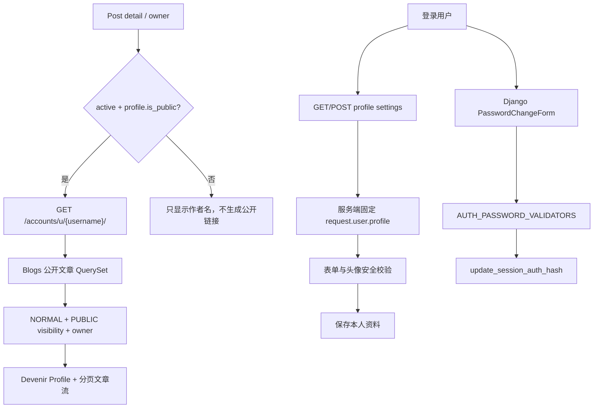

# PowerAdapterBlogs 博客基础体验补全指南

> **文档权重**：87（跨 accounts、Blogs、config 与 Devenir 的当前专项实施规划）
> **路线标识**：`blog_foundation_linear`
> **状态**：F0–F1 已完成；下一步 F2 About / 隐私说明
> **更新**：2026-07-26
> **上位依据**：`V2GUIDE.md`、`docs/guides/CODING_GUIDE.md`

## 1. 目标与边界

将当前“文章展示与审核系统”补全为结构完整的个人博客，同时保持邀请制、小规模协作和 Django Template + htmx 的 HDA 架构。该路线补的是作者身份、站点说明、内容发现和公开站点元数据，不把项目扩张成掘金、CSDN 一类社区平台。

### 1.1 当前已经具备

- 首页 Board、文章列表、分类、标签、搜索、详情与评论。
- 投稿、审核、修订历史和 Board Scope Policy。
- 友链、sitemap、登录、管理员邀请制账号激活。
- Devenir 主题、移动导航、工作台与系统后台入口。

### 1.2 明确不做

- 匿名公共注册、关注/粉丝、点赞排行、积分、私信和用户动态流。
- 为“功能齐全”而新增通用 SPA 或重复的 JSON 写入 API。
- 首期新增联系表单；页脚 `mailto:` 足以满足个人站联系需求，并避免垃圾消息入口。
- 将 Group、Permission、BoardMembership、邮箱、登录时间、证书或 MFA 状态暴露在公开 Profile。

## 2. 缺口与优先级

| 严重度 | 缺口 | 当前事实 | 建议动作 |
|---|---|---|---|
| 🔴 高 | 用户无法自行修改密码 | 邀请时只能首次设置密码，前台没有后续修改入口 | F1 使用 Django 密码校验器和 `update_session_auth_hash()` 实现 |
| 🟡 中 | 作者没有公开 Profile | 文章只有 `owner`，无作者介绍页或资料模型 | F1 新增 `UserProfile` 和公开作者页 |
| 🟡 中 | 缺少 About / 隐私说明 | 页脚只有简短介绍、邮箱和许可证链接 | F2 增加静态站点页面；明确邮箱、IP、Session 与审计日志用途 |
| 🟡 中 | 文章发现缺少归档 | 只有列表、分类、标签和搜索 | F3 增加按年/月聚合的公开文章归档 |
| 🟡 中 | 自定义错误模板未全局接线 | Devenir 已有错误模板，根 URLConf 未声明 handler | F4 接入 404/500 并在 `DEBUG=False` 验证 |
| 🟢 低 | RSS/Atom 缺失 | `Blogs/DEVELOPMENT.md` 曾列出 `feed.py`，实际文件和路由不存在 | F3 使用 Django Syndication Feed，只输出公开已发布文章 |
| 🟢 低 | `robots.txt` 缺失 | 已有 `/sitemap.xml/` | F4 增加文本响应并声明 sitemap |
| 🟢 低 | SEO/分享元数据不足 | 基础模板未定义 canonical、description、Open Graph | F4 建立模板 block，详情页使用文章元数据 |
| 🟢 低 | `security.txt` 缺失 | 站点已有安全实践但无公开报告入口 | F5 评估 `/.well-known/security.txt` |

严重度表示问题影响，不是本文档权重。Profile 的视觉效果优先于微小性能优化，但公开 QuerySet、图片校验和权限边界不得因此放宽。

## 3. App 职责

| 模块 | 本路线职责 | 不负责 |
|---|---|---|
| `accounts` | `UserProfile`、公开作者页、本人资料编辑、密码修改 | 文章归档、RSS、Board 角色展示 |
| `Blogs` | 公开作者文章 QuerySet、归档、RSS/Atom | 保存个人简介、账号安全设置 |
| `config` | About、隐私说明等站点级页面 | 用户身份或文章授权 |
| `PowerAdapterBlogs` | 根路由、`robots.txt`、错误 handler | 复制业务 QuerySet 或 Policy |
| `themes/devenir` | 页面模板、作者卡片、SEO block 与响应式视觉 | 在模板中重新实现授权规则 |

跨 App 查询必须复用当前公开文章约束：`status=Post.STATUS_NORMAL` 且 `visibility=Post.VISIBILITY_PUBLIC`。不能因为访问者已经登录，就在公开 Profile、归档或 Feed 中泄露草稿、审核中或 Board 内部文章。

## 4. F1：Profile 与账号设置

### 4.1 推荐模型

新增 `accounts.UserProfile`，使用 `OneToOneField(settings.AUTH_USER_MODEL)`，避免继续扩大认证核心模型 `MyUser`：

| 字段 | 约束 | 公开性 |
|---|---|---|
| `user` | OneToOne、CASCADE | 公开页只展示 username |
| `display_name` | 64 字符，可空 | 公开 |
| `bio` | 500 字符纯文本，可空 | 公开 |
| `avatar` | 可空图片；复用尺寸、格式与随机文件名校验原则 | 公开 |
| `website` | URL，可空 | 公开，模板增加 `rel="me noopener"` |
| `github_url` | URL，可空 | 公开 |
| `location` | 64 字符，可空 | 公开，由用户主动填写 |
| `is_public` | 默认 False | 用户明确同意后公开 |
| `updated_at` | auto_now | 不必公开精确时间 |

邮箱继续只属于认证域，不复制到 `UserProfile`，也不出现在公开 Serializer、模板或页面元数据中。首期不提供邮箱修改；等邮件重新验证与旧地址通知流程设计完成后另立安全任务。

### 4.2 路由契约

| URL | 访问者 | 行为 |
|---|---|---|
| `/accounts/profile/` | 登录用户 | 跳转到自己的 Profile；未公开时本人仍可预览 |
| `/accounts/u/<username>/` | 公开 | 仅展示 active 且 `is_public=True` 的资料与公开文章；其他情况 404 |
| `/accounts/settings/profile/` | 登录用户 | 只能编辑自己的公开资料 |
| `/accounts/password/change/` | 登录用户 | 校验旧密码、新密码策略；成功后保留当前 Session |

文章详情中的作者名只有在 Profile 可公开时才链接作者页。空 Profile 不显示虚构资料；展示名为空时回退 username，头像为空时使用 Devenir 默认图形。

### 4.3 请求与权限流程

### 4.4 F1 验收

- 匿名访问公开作者页只看到允许公开的资料与公开已发布文章。
- 未公开、未激活或不存在的 Profile 对匿名用户返回 404；本人可以预览自己的未公开页。
- 用户不能通过修改 URL 或 POST 字段编辑他人资料。
- Profile 页面不出现邮箱、权限、Membership、草稿或内部文章。
- 头像拒绝伪造格式、超限体积和像素炸弹；文件名由服务端生成。
- 修改密码后当前会话继续有效，旧密码立即失效，并保留 Django 密码强度验证。
- 桌面和移动 Header 中登录用户名可进入 `/accounts/profile/`。

## 5. F2：站点说明与隐私

About 与隐私说明采用 Django Template 页面，继续继承 Devenir `base.html`，不为静态内容建立通用 CMS。

- About：站点定位、作者、内容主题、Board 视觉概念、技术栈和许可证。
- Privacy：说明账号邮箱、评论、限流 IP、Session、服务日志和 MongoDB HMAC 审计用途；说明保留期限与联系渠道。
- Contact：首期继续使用页脚邮件链接，不保存新的联系表单数据。

## 6. F3：归档与 Feed

- `/Blogs/archive/` 按年/月展示公开已发布文章，复用 Post Stream 卡片，不复制另一套文章摘要结构。
- `/feed/` 使用 Django `django.contrib.syndication.views.Feed`；只输出公开已发布文章，按发布时间倒序并限制合理数量。
- Feed 内容使用绝对 HTTPS URL，不包含评论者数据、草稿、内部文章或修订 diff。
- Profile 作者文章、归档与 Feed 共用清晰命名的公开 QuerySet helper，避免三处过滤条件漂移。

## 7. F4：公开站点元数据与错误页

- `base.html` 增加 title、description、canonical、Open Graph 的可覆盖 block。
- 文章详情使用标题、摘要、封面和 canonical URL；没有上传封面时使用分类默认封面。
- `/robots.txt` 允许公开内容抓取，禁止后台与邀请路径，并指向 `/sitemap.xml/`。
- 在根 URLConf 接入 404/500 handler；使用 `DEBUG=False` 客户端测试确认状态码、模板和敏感信息隐藏。
- canonical 与邮件链接都依赖固定 `PUBLIC_SITE_URL`，不得信任未经校验的请求 Host 拼接外部 URL。

## 8. Linear 顺序

| 阶段 | 状态 | 输出 | 前置关系 |
|---|---|---|---|
| F0 | ✅ 文档完成 | 范围、职责、严重度、路由与验收冻结 | — |
| F1 | ✅ 已完成 | `UserProfile`、公开/本人页面、资料编辑、密码修改、作者链接 | 19 项 accounts 测试与桌面/390px 视觉检查通过 |
| F2 | ⏳ 下一步 | About、隐私说明、导航与页脚入口 | F1 已完成 |
| F3 | ⬜ | 公开归档、RSS/Atom、统一公开文章 helper | F1 作者页查询经验 |
| F4 | ⬜ | SEO block、robots、错误 handler | F2/F3 页面 URL 稳定 |
| F5 | ⬜ 可选 | `security.txt` 与上线检查清单 | 联系地址与生产域名确定 |

完成 F1–F4 后再评估是否继续该路线；它不取消 `accounts_linear` Stage 6a/6b、投稿审核邮件或 v2.5 安全路线，只是按用户当前优先级插入其前。

## 9. 手动验收清单

- 使用匿名、Profile 所有人、另一普通用户和 superuser 四种身份测试 Profile。
- 为作者准备公开文章、草稿、审核中和内部文章，确认公开页面只出现第一类。
- 上传正常头像与伪造/超大图片，确认拒绝路径和错误中文可理解。
- 修改密码后刷新当前页面仍为登录状态，再用旧密码登录应失败。
- 在手机宽度检查 Profile、归档、About 与隐私页面，视觉优先但不得出现横向溢出。
- 以 `DEBUG=False` 检查 RSS XML、robots、canonical、404 和 500 响应。

## 10. 后续 TODO

- [x] **红色 / 高权重**：F1 提供安全的密码修改入口。
- [x] **黄色 / 中权重**：F1 实现公开 Profile、本人资料编辑和作者文章隔离测试。
- [ ] **黄色 / 中权重**：F2 补齐 About 与隐私说明。
- [ ] **黄色 / 中权重**：F3 实现公开文章归档。
- [ ] **黄色 / 中权重**：F4 将 Devenir 错误模板接入生产 handler。
- [ ] **绿色 / 低权重**：F3 实现 RSS/Atom。
- [ ] **绿色 / 低权重**：F4 增加 robots、canonical 与 Open Graph。
- [ ] **绿色 / 低权重**：F5 评估 `security.txt`。
