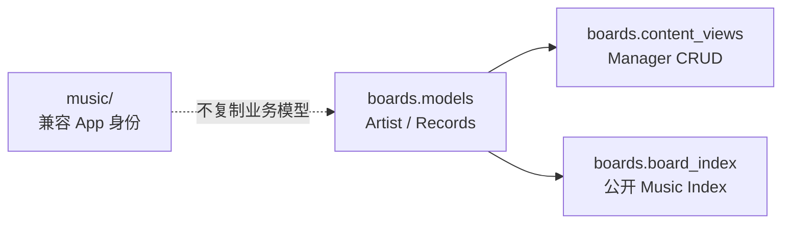
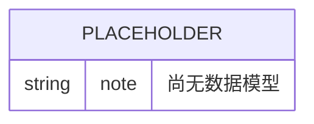
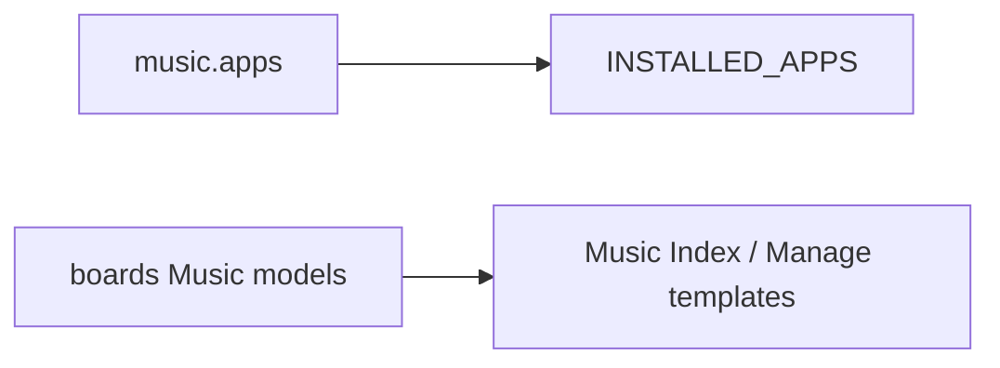

# Music 模块 — 开发文档

> **文档权重**：30（已停用空壳模块，仅作历史参考）
> **模块**: `music/`  
> **职责**: 记录 `music/` 兼容 App 边界；当前 Music Board 运行时模型、CRUD 与展示装配归 `boards`
> **依赖**: `boards.models`, `boards.content_views`, `boards.board_index`
> **创建**: 2026-06-22  
> **更新**: 2026-08-30 — 校正 Music Board 已落地但不由本 App 承载的事实

---

## 0. 变更日志

| 版本 | 日期 | 变更 |
|------|------|------|
| v1.0 | 2026-06-22 | 新建文档，标记为空壳状态 |
| v1.1 | 2026-08-30 | 明确 `music/` 仍是兼容壳，但 Music Board 的 Record、Artist、导入与 Index 已由 `boards` 实现 |

---

## 1. 模块架构概览

**当前状态**：`music/` 包本身仍是兼容壳，不拥有运行时模型和路由；但 Music 功能并非空白。Spotify/Apple Music 记录、周期聚合、Artist 头像、JSON 导入、公开 Index 和 Manager CRUD 均已在 `boards` App 中实现。新增功能不得因为名称相似就同时写入两个 App。

---

## 2. 文件清单

| 文件 | 类/函数 | 状态 |
|------|---------|------|
| `apps.py` | `MusicConfig` | ✅ 已实现（仅 app 注册） |
| `models.py` | — | ⬜ 空占位 |
| `views.py` | — | ⬜ 空占位 |
| `admin.py` | — | ⬜ 空占位 |
| `tests.py` | — | ⬜ 空占位 |

---

## 3. 数据模型

> `music/` 当前无数据模型。运行时事实见 `boards.models.MusicArtist`、`MusicRecordBase` 及 provider 子类；本文不再规划一套平行的 Track/Playlist 模型。

---

## 4. 详细工作流

本 App 无独立工作流。公开与管理流程由 `boards` 负责：JSON 导入/人工 CRUD → provider 记录与 Artist → Music Board Index 聚合展示。

---

## 5. API 端点

无 API 端点，无路由注册。

---

## 6. Admin 配置

无 Admin 注册。

---

## 7. 权限矩阵

本 App 无独立权限入口。Music 固定内容通过 `boards.policies.can_manage_board_content()` 限定 Music Board Manager 或 active superuser。

---

## 8. 缓存架构

无缓存需求。

---

## 9. 演进路径

### 当前状态

`music` App 只保留稳定的 Django App 身份；运行时 Music Board 已在 `boards` 内完成。未来若出现与“听歌记录/Board 展示”不同的独立领域，例如站内音频播放或曲库，再先做领域边界评审，不能直接在本 App 创建与 `boards` 重叠的模型。

---

## 10. 文件依赖图

> `music` 与运行时 Music Board 是两个不同边界：前者保留 App 身份，后者由 `boards` 持有业务事实。

---

## 11. 已知问题 / TODO

| 严重度 | 问题 | 说明 |
|--------|------|------|
| 🟢 P2 | 包职责容易误导 | 保留兼容 App 但不复制 `boards` 中已经存在的 Music 模型、路由或权限；若确认无迁移依赖再单独评估删除 |

---

## 12. 附录

### 路由

无路由配置。

### 管理命令

无管理命令。

### 注意事项

- 该 app 已注册在 `INSTALLED_APPS` 中，迁移时会产生空 migrations
- 不要删除 `migrations/__init__.py`（Django 需要此文件识别 app）
