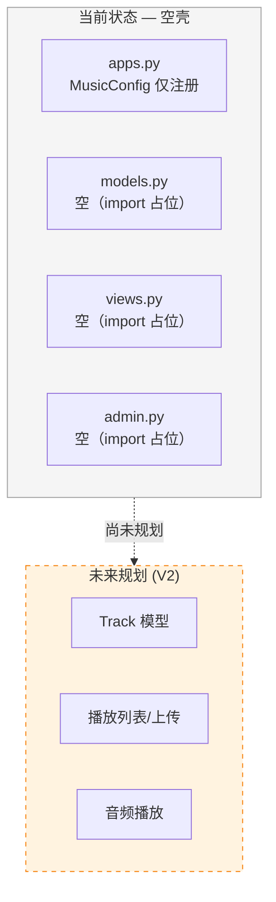
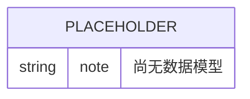
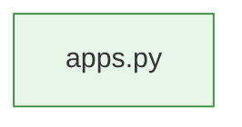

# Music 模块 — 开发文档

> **文档权重**：30（已停用空壳模块，仅作历史参考）
> **模块**: `music/`  
> **职责**: 音乐模块占位（空壳，无运行时功能）  
> **依赖**: 无  
> **创建**: 2026-06-22  
> **更新**: 2026-06-22 — 新建文档

---

## 0. 变更日志

| 版本 | 日期 | 变更 |
|------|------|------|
| v1.0 | 2026-06-22 | 新建文档，标记为空壳状态 |

---

## 1. 模块架构概览

**当前状态**: Music app 仅有 Django 应用骨架（`apps.py` 中的 `MusicConfig`），其他所有文件均为空占位。该模块不在 V1/V2 开发范围内。

---

## 2. 文件清单

| 文件 | 类/函数 | 状态 |
|------|---------|------|
| `apps.py` | `MusicConfig` | ✅ 已实现（仅 app 注册） |
| `models.py` | — | ⬜ 空占位 |
| `views.py` | — | ⬜ 空占位 |
| `admin.py` | — | ⬜ 空占位 |
| `tests.py` | — | ⬜ 空占位 |

---

## 3. 数据模型

> 当前无数据模型。建议未来模型：`Track`（曲目）、`Album`（专辑）、`Playlist`（播放列表）。

---

## 4. 详细工作流

无运行时工作流。

---

## 5. API 端点

无 API 端点，无路由注册。

---

## 6. Admin 配置

无 Admin 注册。

---

## 7. 权限矩阵

无权限控制需求。

---

## 8. 缓存架构

无缓存需求。

---

## 9. 演进路径

### 当前状态 (v1.0)

空壳 app，注册在 `INSTALLED_APPS` 中但无功能代码。

### 建议激活路线 (V2+)

| 阶段 | 内容 | 依赖 |
|------|------|------|
| 1 | 创建 `Track` 模型（title/artist/file/cover/duration） | `django.db.models` |
| 2 | 音乐上传端点 + Admin | `accounts` (用户认证) |
| 3 | 前端播放器 + 播放列表 | `themes/devenir` 前端 |
| 4 | 播放统计 + 缓存 | Redis |

---

## 10. 文件依赖图

> 仅有 `apps.py` 一个有效文件，无外部依赖。

---

## 11. 已知问题 / TODO

| 严重度 | 问题 | 说明 |
|--------|------|------|
| 🟢 低 | app 为空壳 | 等待 V2 或后续版本激活 |

---

## 12. 附录

### 路由

无路由配置。

### 管理命令

无管理命令。

### 注意事项

- 该 app 已注册在 `INSTALLED_APPS` 中，迁移时会产生空 migrations
- 不要删除 `migrations/__init__.py`（Django 需要此文件识别 app）
