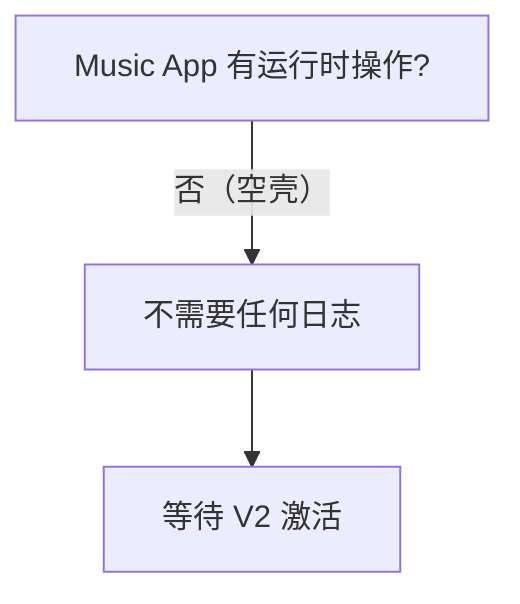

# Music App — 日志指南

> **文档权重**：30（已停用空壳模块，仅作历史参考）
> 配套：[全项目 LOGGUIDE.md](../docs/guides/LOGGUIDE.md)

---

## 日志级别快速参考

| Python Logger | Kaomoji | 含义 | 使用场景 |
|---------------|---------|------|---------|
| `logger.info()` | `(✿◕‿◕)` | 一切安好 | 暂不使用（空壳） |
| `logger.warning()` | `(ಠ_ಠ)` | 不对劲了 | 暂不使用（空壳） |
| `logger.error()` | `(╯°□°）╯︵ ┻━┻` | 出大问题了 | 暂不使用（空壳） |

### 日志级别决策树



---

## 状态：空壳

Music app 当前只有模型定义和基础结构，**没有视图、没有路由、没有功能**。V2 也不在其范围内。

---

## 职责边界

Music app 是预留的音乐模块占位。当前仅 `apps.py` 中有 `MusicConfig` 注册，所有运行时文件（`models.py`、`views.py`、`admin.py`）均为空占位。

---

## 日志点清单

### 当前：无

该 app 目前无任何运行时操作，不需要打任何日志。

### 未来启用时的日志点

当 Music app 被激活时，建议在以下位置加日志：

| 操作 | 级别 | 内容 |
|------|------|------|
| 音乐上传成功 | INFO | filename, size, user_id |
| 音乐删除 | INFO | track_id, title, user_id |
| 播放（如有统计） | — | 不需要，除非做播放量统计且异常时 |
| 上传失败 | ERROR | filename, error |

```python
# 未来示例
logger.info(f"Music 上传: filename={filename} size={size} user={user_id}")
logger.info(f"Music 删除: track_id={track_id} title={title} user={user_id}")
logger.error(f"Music 上传失败: filename={filename} error={e}")
```

---

## 不打日志的位置 (music)

| 位置 | 原因 |
|------|------|
| 整个 app | 空壳，无运行时操作 |

---

## 安全规则

```
┌─────────────────────────────────────────────────┐
│  ✅ 当前无功能，不需要安全规则                    │
│  ✅ 未来激活时参考 comment app 安全红线           │
│  ✅ 不记录用户播放历史（隐私）                    │
│  ✅ 不记录音频文件内容或哈希原文                  │
└─────────────────────────────────────────────────┘
```

---

## 与其他 App 对比

| App | 复杂度 | 日志量 | 主要日志来源 |
|-----|--------|--------|-------------|
| Blogs | 高 | 高 | 文章 CRUD + 修订 + diff |
| comment | 中 | 中 | 评论提交 + 审核 |
| security | 中 | 低 | 审计链验证 |
| accounts | 低 | 低 | 登录/注册/密码修改 |
| boards | 低 | 极低 | seed 命令（一次性） |
| config | 低 | 低 | 侧边栏配置变更 |
| **music** | **空壳** | **无** | 暂无功能 |
