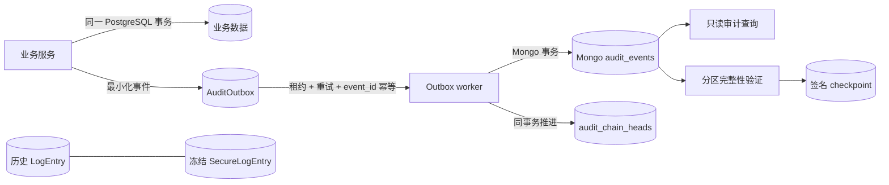

# Security 模块开发与运维

> **文档权重**：92（安全审计当前实现与运维契约）
>
> **最后更新**：2026-08-26
>
> **权威边界**：MongoDB schema v1 是新安全审计事件的唯一正式查询源；PostgreSQL
> `AuditOutbox` 只是可靠投递设施；`SecureLogEntry` 仅保留历史证据。

## 1. 当前架构



- 业务状态和 outbox 必须在同一 `transaction.atomic()` 中提交；审计入队失败时业务变更回滚。
- worker 使用 `lock_token` 租约；租约过期的旧 worker 不能覆盖新 worker 的结果。
- Mongo `_id = event_id`；重复投递只接受内容、分区完全一致且原记录 HMAC 有效的事件。
- Mongo 按“业务域 + UTC 月”分区，每个分区维护 `sequence`、`previous_mac` 和链头。
- HMAC-SM3 覆盖完整 canonical envelope（仅排除 `integrity.mac`）。
- 正式查询只读 Mongo schema v1；Mongo 不可用时返回 503，不回退读取 outbox payload。
- `SecureLogEntry` 不再由新 `LogEntry` 自动创建，也禁止修改、删除和重签。

## 2. 已接入的高价值事件

| 业务 | 事件 | 原子边界 | 数据最小化 |
| --- | --- | --- | --- |
| Django Admin 单条/批量 | `django_admin.object.*` | Admin 保存事务 + outbox | actor/target ID、变更字段名；不复制展示值和字段值 |
| 评论创建/软删除/审核 | `comment.*` | Comment 状态 + outbox | comment/post/user ID、状态、固定 reason code；不记录正文/IP/UA |
| 板块申请与 Membership | `board.*` | 申请或 MembershipEvent + outbox | board/user/membership ID、角色和状态；不复制自由文本原因 |
| TOTP 生命周期 | `mfa.*` | 设备状态 + outbox | device/user ID、状态、auth version、固定 reason code；绝不记录 seed/code/recovery code |
| mTLS 绑定与撤销 | `mtls.*` | binding 状态 + outbox | binding/user ID、profile、状态、auth version；不记录私钥或 DN |

新增安全相关状态修改入口时，必须经过显式服务并在业务事务内调用
`enqueue_audit_event()`；不要用泛化 model signal 猜测业务语义。

## 3. 关键文件

| 文件 | 职责 |
| --- | --- |
| `audit.py` | canonical JSON、schema v1、keyring、单条/链验证 |
| `outbox.py` | 原子入队、租约投递、退避/死信、健康指标、交付对账 |
| `mongo_client.py` | Mongo 事务写入、链头、幂等、部署预检 |
| `admin_audit.py` | Django Admin LogEntry 最小化转换与 bulk hook |
| `queries.py` | 白名单过滤、最大 200 条、复合 cursor、逐条验证 |
| `models.py` | 冻结历史证据、outbox、checkpoint、verification run |
| `signals.py` | Admin 捕获与应用层 append-only 防护 |

## 4. 运维命令

```text
python manage.py init_mongo_audit
python manage.py check_mongo_audit_deployment
python manage.py process_audit_outbox --limit 100 --max-attempts 12 --lease-seconds 300
python manage.py audit_outbox_health --max-pending 1000 --max-oldest-pending-seconds 300
python manage.py reconcile_audit_outbox --limit 200
python manage.py audit_log_integrity --outbox
python manage.py audit_log_integrity --mongo --partition comment:YYYY-MM --limit 10000 --checkpoint
python manage.py export_audit_checkpoint --partition comment:YYYY-MM
python manage.py audit_log_integrity --legacy-postgres --batch-size 500
python manage.py init_log_hmac --before <UTC-ISO-CUTOFF> --acknowledge-legacy-backfill
```

`process_audit_outbox` 应常驻或高频调度。以下情况必须告警：dead letter、陈旧租约、pending
数量/年龄持续增长、Mongo 事务或唯一索引异常、checkpoint 验签失败、链验证失败、delivered
记录与 Mongo 权威记录对账不一致。

## 5. 部署顺序

1. 备份 PostgreSQL 与 MongoDB；不得修改、重签或删除历史审计证据。
2. 正常应用 Django migration；禁止复制 delegated worktree 的各 app `0001_initial` 覆盖现有迁移链。
3. 注入 `LOGINTEGRITY_HMAC_KEY_BASE64`（历史验证）、`MONGO_AUDIT_HMAC_KEY_BASE64`、
   `CHECKPOINT_AUDIT_HMAC_KEY_BASE64`。三者不得复用；两个活跃 key 均为 32 bytes。
4. Mongo 必须是 replica set 或 sharded cluster。执行索引初始化和部署预检。
5. 在 staging 演练事务写入、Mongo 断网、worker 重启、主节点切换与幂等重投。
6. 启动 worker、健康探针和对账任务后再开放新事件流量。
7. 将 checkpoint 导出到独立管理的不可变存储；仅留 PostgreSQL checkpoint 不等于 WORM。

## 6. 最小权限

- PostgreSQL 应用角色：业务 DML；对 outbox 仅 INSERT/SELECT 和有限状态 UPDATE；无 DELETE/TRUNCATE。
- Mongo delivery 角色：events 的 INSERT/FIND 与 heads 的最小读写/事务权限；无事件 UPDATE/DELETE。
- Mongo verifier 角色：events/heads 只读。
- migration/索引/备份角色与运行时账号分离。
- 核心 events 与 heads 集合禁止 TTL。

## 7. 回滚与边界

- 回滚代码时保留 migration、outbox、checkpoint、历史 `SecureLogEntry`、Mongo events/heads 和旧 key。
- 旧版本不能识别新 envelope 时先停 worker，恢复兼容代码后重放 pending。
- 应用层 signal 不能抵御数据库管理员直接 SQL；数据库权限、备份、oplog/监控是独立边界。
- HMAC 能检测篡改，不能阻止持有活跃 key 的攻击者伪造历史。
- PostgreSQL outbox 在投递前属于受信任的事务暂存区，不是正式不可变证据库。
- `CommentEventLog` 旧封装已退休；不得恢复直接 Mongo CRUD 或“故障静默跳过”。
