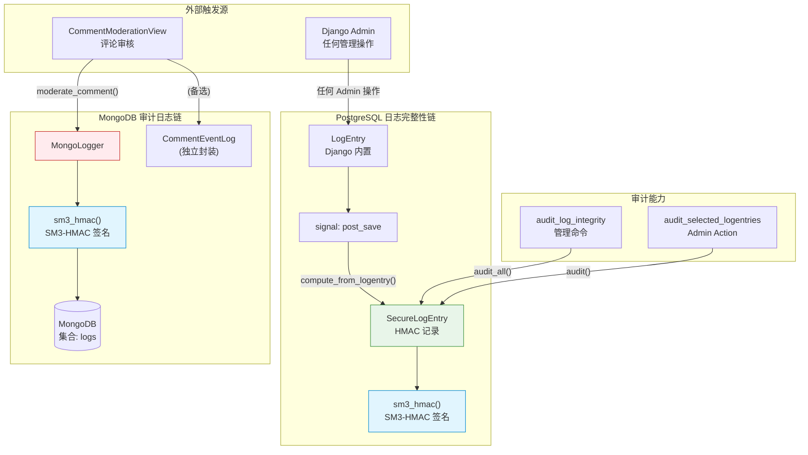
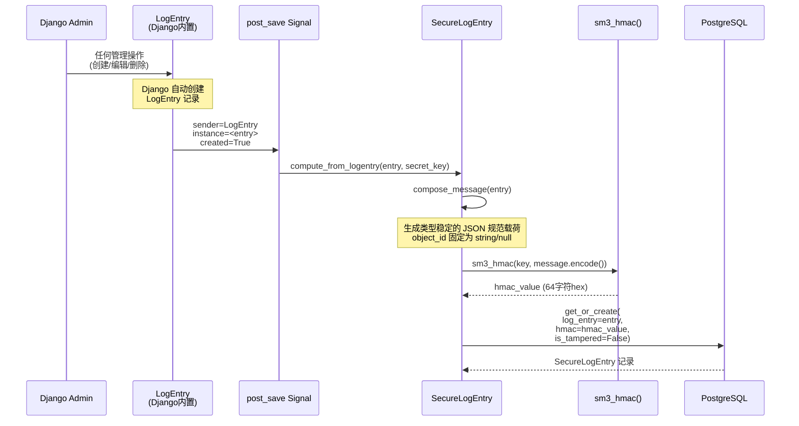
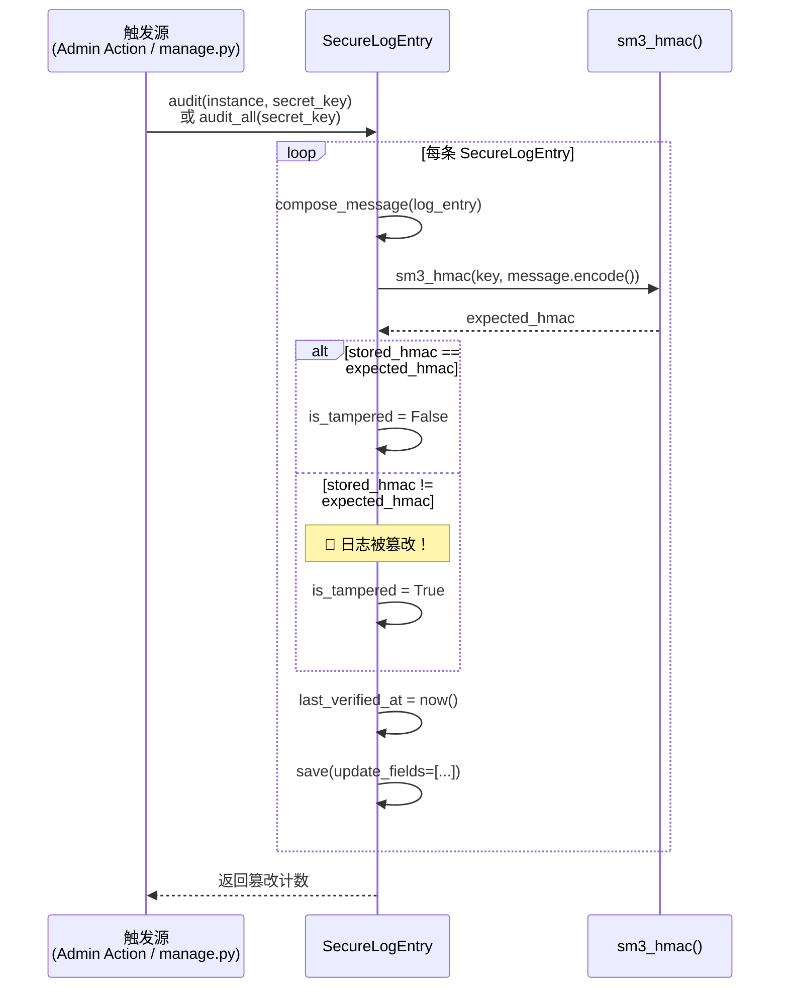
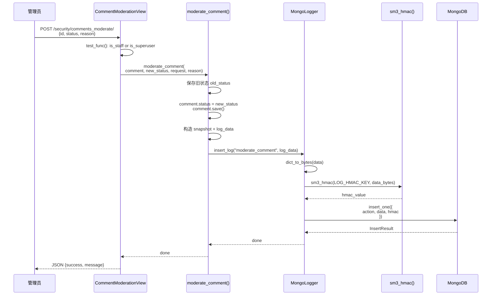
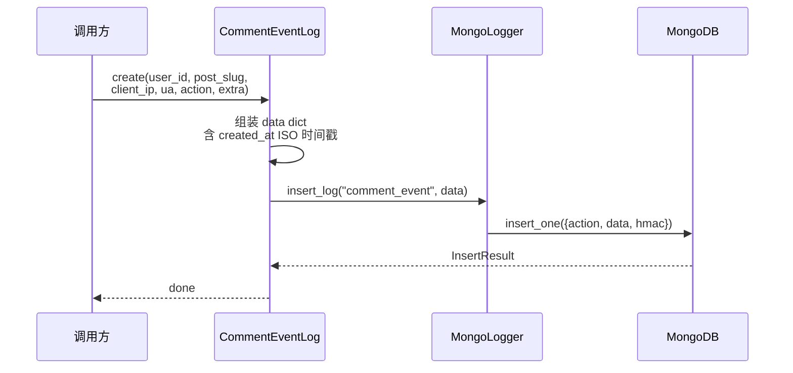
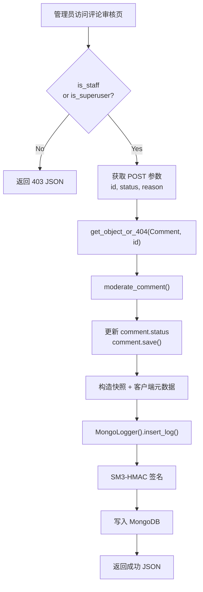
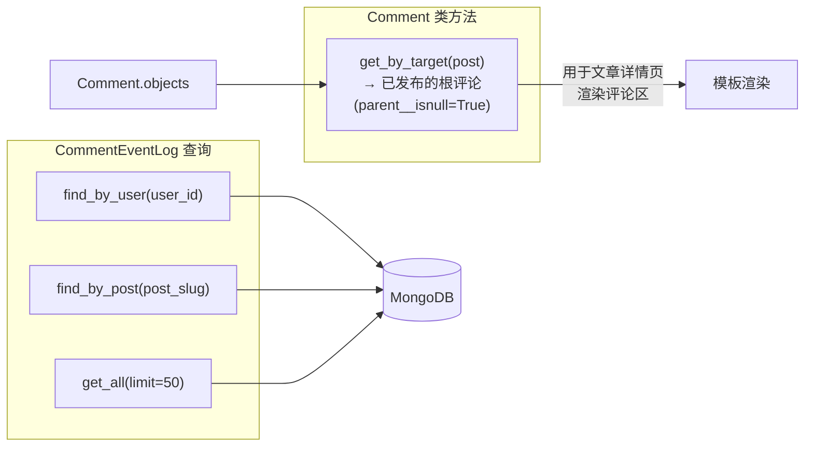
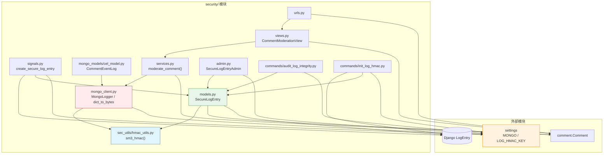
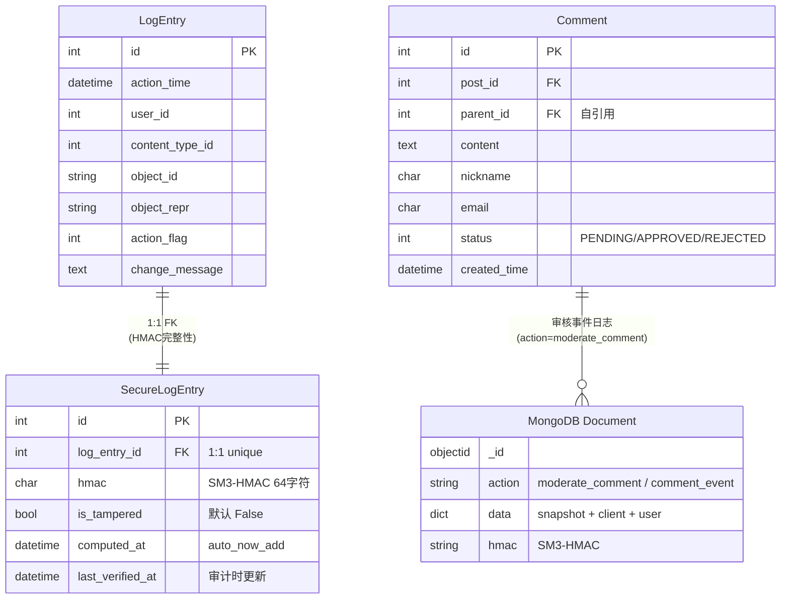

# Security 模块 — 开发文档

> **文档权重**：85（security 当前实现与模块 TODO）
> **模块**: `security/`  
> **职责**: Django Admin 日志 HMAC 完整性保护 + MongoDB 审计日志  
> **依赖**: PyPI `gmssl==3.2.2`（仅 SM3-HMAC）, `pymongo` (MongoDB), Django `LogEntry`
> **创建**: 2026-06-21  
> **最后更新**: 2026-08-15 — `.env` 加载统一下沉至 base settings，MongoDB 环境变量命名收口

---

## 0. 变更日志

| 日期 | 版本 | 变更 |
|------|------|------|
| 2026-08-15 | v2.5 | 所有 settings profile 统一从根 ignored `.env` 读取配置；MongoDB 仅使用 `MONGO_*` 命名，端口显式转为整数 |
| 2026-08-02 | v2.4 | 新增 `/operations/security/` 只读安全运维页；SiteOperators 不再进入 Dashboard，选中核验在事务内锁定且单次最多 100 条，核验动作本身写入 HMAC 审计事件 |
| 2026-07-27 | v2.3 | `SiteOperators` 获得查看与运行完整性审计的精确 Permission；普通 dashboard 用户不再默认看到全站审计 |
| 2026-07-19 | v2.2 | **完整性误报热修**：规范签名载荷；初始化改为只补缺；历史记录仅按可验证旧算法安全升级；8 个回归测试通过 |
| 2026-07-12 | v2.1 | **审计链收口**: 删除已迁往 MongoDB 的 ORM CommentEventLog；CommentAdmin action 统一调用 moderate_comment；补日志防篡改和审核写入测试 |
| 2026-06-21 | v2.0 | **P0 修复完成**: Issue A/B/C/D 全部修复 |
| 2026-06-21 | v1.0 | 初始文档，记录模块架构和已知问题 |

### v2.0 详细变更

| Issue | 状态 | 描述 |
|-------|------|------|
| A 🔴 | ✅ 已修复 | `mongo_client.py:55` `self.db[conf["DB_NAME"]]` → `self.db[conf["COLLECTION"]]`；`purge_old_comment_logs.py:48` 同步修复 |
| B 🔴 | ✅ 已修复 | `MongoLogger` 新增 `verify_log()` 和 `audit_all()` 方法；`audit_log_integrity` 命令新增 `--mongo` 选项 |
| C 🟡 | ✅ 已修复 | `develop.py` 优先从 `LOGINTEGRITY_HMAC_KEY_BASE64` 环境变量读取，硬编码值作为兜底 |
| D 🟢 | ✅ 已修复 | `SecureLogEntry.compose_message()` 改用 `json.dumps()`，消除 `|` 分隔符冲突风险 |

**额外改进**:
- `MongoLogger` 新增连接容错：MongoDB 不可用时降级为 no-op，不阻塞主流程
- `moderate_comment()` 新增 try/except，评论状态更新不受 MongoDB 故障影响
- MongoDB `cel_model.py` 保留为可选封装；旧 Django ORM `CommentEventLog` 已由 `0003` 删除
- `init_log_hmac` 历史上新增 `--force`；v2.2 起默认只补缺，优先使用 `--repair-known` 安全升级
- `requirements.txt` 新增 `pymongo==4.10.1`

### v2.2 热修根因与约束（已完成）

现有 `compose_message()` 虽然使用 JSON，但直接序列化 Model 实例中的字段值。
Django Admin 调用 `LogEntryManager.log_actions(single_object=True)` 时，刚保存实例的
`object_id` 仍可能是整数；数据库字段是 `TextField`，重新查询后则为字符串。首次签名
因此可能包含 JSON 数字，审计重算却包含 JSON 字符串，形成误报。

只读数据核对结果：现有 24 条记录中，16 条匹配上述 JSON-v2 类型漂移，7 条匹配旧版
`|` 拼接算法，1 条无法由已知历史算法解释。界面首次显示的绿色状态只来自
`is_tampered=False` 默认值，不代表已经回验成功。

热修必须遵守：

1. `compose_message()` 输出规范载荷；`object_id` 固定为字符串或 `null`，其他字段也使用确定类型。
2. 创建签名和审计验证调用同一规范化函数，并用测试覆盖保存前后类型变化。
3. `compute_from_logentry()` 不得覆盖已经存在的 HMAC；默认初始化只补建缺失记录。
4. 历史升级只重签能够被已知旧算法验证的记录，无法解释的记录保留并继续报告为篡改。
5. `--force` 会重建信任基线，只能在完成取证并明确授权后使用。
6. Django `bulk_create()` 不触发 `post_save`；批量删除产生的 `LogEntry` 可能缺少
   `SecureLogEntry`，作为独立高优先级缺口处理。

---

## 1. 模块架构总览



**两条独立链路**：
- **PostgreSQL 链**：`SecureLogEntry` 为 Django `LogEntry` 提供 HMAC 完整性保护，有完整的审计能力
- **MongoDB 链**：`MongoLogger` 为评论审核等自定义操作提供 MongoDB 持久化 + HMAC，**但缺少审计验证**

> 🔴 红色 = 有已知缺陷的组件（详见 §4）

---

## 2. 组件清单

| 文件 | 核心类/函数 | 职责 |
|------|------------|------|
| `models.py` | `SecureLogEntry` | PostgreSQL 日志完整性记录，1对1关联 `LogEntry`；旧 ORM `CommentEventLog` 已迁移至 MongoDB 并删除 |
| `mongo_client.py` | `MongoLogger`, `dict_to_bytes()` | MongoDB 日志写入客户端，含 HMAC 签名 |
| `services.py` | `moderate_comment()` | 评论审核业务函数，状态变更 + MongoDB 留痕 |
| `signals.py` | `create_secure_log_entry` | `post_save` 信号处理器，自动为 LogEntry 签名 |
| `admin.py` | `SecureLogEntryAdmin` | Django Admin 注册 + `audit_selected_logentries` action |
| `views.py` | `CommentModerationView` | 评论审核视图（需 `is_staff/superuser`） |
| `urls.py` | — | 单路由：`comments_moderate/` |
| `sec_utils/hmac_utils.py` | `sm3_hmac()`, `generate_key()` | SM3-HMAC 核心算法实现 |
| `mongo_models/cel_model.py` | `CommentEventLog` | 评论事件日志 CRUD（对 `MongoLogger` 的上层封装） |
| `management/commands/audit_log_integrity.py` | `Command` | Django manage.py 命令：全量审计 PSQL 日志 |
| `management/commands/init_log_hmac.py` | `Command` | 默认补建缺失 HMAC；`--repair-known` 安全升级旧格式；`--force` 人工重建基线 |
| `middleware/__init__.py` | — | 空包占位（无实际中间件） |

---

## 3. 详细数据流

### 3.1 PostgreSQL 完整性链：自动签名



**关键时间点**：
- `computed_at = auto_now_add` — 签名创建时间
- `last_verified_at = null` — 初始未审计，审计时更新
- `is_tampered = False` — 初始标记为完整

### 3.2 PostgreSQL 完整性链：审计验证



**两种触发方式**：
- **Admin Action**: `audit_selected_logentries` — 选中若干条 LogEntry → 审计 → 弹窗通知结果
- **管理命令**: `python manage.py audit_log_integrity` — 全量审计 → stdout 输出

### 3.3 MongoDB 审计日志链：评论审核写入



### 3.4 MongoDB 日志链：CommentEventLog 备选路径



> `CommentEventLog` 与 `moderate_comment()` 是**两套独立路径**，都可写入 MongoDB，但目前 `views.py` 走的是 `moderate_comment()` 路径。

---

## 4. 已知问题（P0 — 已全部修复 ✅）

> **状态**: 2026-06-21 全部修复，以下为修复前的问题记录。

### 🔴 Issue A: MongoDB 集合命名错误 → ✅ 已修复

**位置**: `mongo_client.py:55`

```python
# ❌ 修复前：集合名 = 数据库名 "poweradapter_mongo"
self.collection = self.db[conf["DB_NAME"]]

# ✅ 修复后：使用 COLLECTION 配置
self.collection = self.db[self._collection_name]  # defaults to "logs"
```

若部署仍保留修复前误写入的同名集合，先备份并在 `mongosh` 中迁移：

```javascript
use poweradapter_mongo
db.poweradapter_mongo.renameCollection("audit_logs")
```

### 🔴 Issue B: MongoDB 日志无验证能力 → ✅ 已修复

`MongoLogger` 新增 `verify_log(doc)` 和 `audit_all()` 方法，与 `SecureLogEntry` 对等。
`audit_log_integrity` 命令新增 `--mongo` 选项。

### 🟡 Issue C: LOG_HMAC_KEY 硬编码 → ✅ 已修复

`develop.py` 优先从 `LOGINTEGRITY_HMAC_KEY_BASE64` 环境变量读取，硬编码值仅作为兜底。

### 🟢 Issue D: compose_message 分隔符冲突 → ✅ 已修复

`compose_message()` 改用 `json.dumps()`，消除 `|` 分隔符冲突风险。
旧版分隔符冲突已消除；但 JSON-v2 的字段类型仍不稳定，见 v2.2 热修。
历史记录应执行安全升级命令 `python manage.py init_log_hmac --repair-known`，不得直接
用 `--force` 覆盖无法验证的记录。

### 🔴 Issue E: JSON 字段类型漂移导致首次审计误报 → ✅ 已修复

签名创建时的 `object_id` 可能为整数，数据库重读后为字符串。v2.2 使用带版本号的
规范 JSON 载荷，统一 ID、时间和字符串字段类型；已覆盖“创建后立即审计通过”、
“保存前后类型一致”和“真实字段变更仍被检出”的回归测试。

### 🔴 Issue F: `bulk_create()` 绕过 `post_save` → ⏳ 独立待修

Django 批量删除通过 `LogEntry.objects.log_actions()` 批量创建日志，不触发当前签名信号。
该问题影响审计覆盖率，但与 Issue E 的误报根因不同，不通过扩大本次算法修改掩盖。

## 5. 配置参考

### 5.1 MONGO 配置 (`base.py`)

`base.py` 在读取任何设置前调用 `load_dotenv(BASE_DIR / ".env", override=False)`。因此 `develop.py`、`product.py` 与其他 settings profile 使用同一配置来源；操作系统/部署平台注入的环境变量优先于 `.env`。根 `.env` 已被 `.gitignore` 排除，禁止将真实用户名、密码或密钥复制到本文、HANDOFF 或提交记录。

统一键名如下；旧的 `DB_MONGO_*` 不再使用：

```dotenv
MONGO_DB_NAME=poweradapter_mongo
MONGO_DB_USER=
MONGO_DB_PASSWORD=
MONGO_HOST=localhost
MONGO_PORT=27017
MONGO_COLLECTION=logs
```

当前本地开发配置为 `localhost:27017/poweradapter_mongo`、集合 `logs`、无认证。生产环境必须创建最小权限 MongoDB 用户并通过部署环境注入凭据，不能沿用无认证配置。

```python
MONGO = {
    "HOST": os.getenv("MONGO_HOST", "localhost"),
    "PORT": int(os.getenv("MONGO_PORT", "27017")),
    "DB_NAME": os.getenv("MONGO_DB_NAME", "poweradapter_mongo"),
    "DB_USER": os.getenv("MONGO_DB_USER", ""),
    "DB_PASSWORD": os.getenv("MONGO_DB_PASSWORD", ""),
    "COLLECTION": os.getenv("MONGO_COLLECTION", "logs"),  # ← 已修复，代码正确使用
}
```

### 5.2 LOG_HMAC_KEY 配置

| 环境 | 文件 | 来源 | 状态 |
|------|------|------|------|
| develop | `develop.py` | env → 硬编码兜底 | ✅ |
| product | `product.py` | `os.getenv('LOGINTEGRITY_HMAC_KEY_BASE64')` | ✅ |

> `develop.py` 中环境变量名拼写为 `LOGINTEGRITY`，生产用 `LOGINTEGRITY`，一致但拼写不标准。

### 5.3 HMAC 算法约束

```
算法:  SM3-HMAC (国密)
密钥:  必须 32 bytes (256 bits)
输入:  bytes
输出:  64 字符 hex string
库:    gmssl
```

这里的 `gmssl` 指 PyPI 上的纯 Python SM2/SM3/SM4 包，不是 GmSSL/OpenSSL/Tongsuo 的 TLS 实现。它不注册 OpenSSL provider，也不参与 Nginx 的 TLS、mTLS 或 TLCP 握手；OpenSSL 3.2.3/3.2.4 的版本建议不适用于该 pip 包。本模块的使用范围继续限定为日志完整性自我实践，不能据此宣称传输层国密或正式密评合规。

---

## 6. 评论审核流程完整视图



### 评论查询方法



---

## 7. 文件依赖图



---

## 8. 数据模型关系



---

## 9. P0 修复计划摘要

| Issue | 严重 | 修改文件 | 预计 |
|-------|------|---------|------|
| A: Collection 命名 | 🔴 高 | `mongo_client.py:55` | 1行 |
| B: 无验证能力 | 🔴 高 | `mongo_client.py` + new `verify_log()` `audit_all()` | ~60行 |
| C: Key 硬编码 | 🟡 中 | `base.py` 增加 fallback | ~10行 |
| D: 分隔符冲突 | 🟢 低 | `models.py` `compose_message` 改用 JSON | ~15行 + migration |

> 详细修复方案见 `V2GUIDE.md §1`。

---

## 10. 附录

### A. 测试现状

- `test/test_middleware.py` — 测试 `ClientMetaMiddleware`（位于 `comment/middleware.py`，非 security 模块）
- `test/t_urls.py` — 测试专用 echo 视图
- `test/test_log_protection.py` — 非 superuser 修改/删除 `LogEntry` 的拒绝路径
- `test/test_log_integrity.py` — 8 个规范载荷、真实篡改、证据保留和历史安全升级测试
- `test/test_mongo_verify.py` — MongoDB 手工连接/写入/验证脚本，不属于隔离单元测试

### B. 管理命令速查

```bash
# 为历史 LogEntry 补建/重建 HMAC 记录
python manage.py init_log_hmac

# 安全升级能够由旧算法验证的历史 HMAC
python manage.py init_log_hmac --repair-known

# 覆盖全部 HMAC（会重建信任基线，仅限取证完成后）
python manage.py init_log_hmac --force

# 全量审计所有 SecureLogEntry
python manage.py audit_log_integrity

# 同时审计 PostgreSQL + MongoDB 日志
python manage.py audit_log_integrity --mongo
```

### C. 重要配置键名汇总

| 配置键 | 用途 | 当前值(dev) |
|--------|------|------------|
| `MONGO.HOST` | MongoDB 主机 | localhost |
| `MONGO.PORT` | MongoDB 端口 | 27017 |
| `MONGO.DB_NAME` | 数据库名 | poweradapter_mongo |
| `MONGO.COLLECTION` | 集合名（✅ 已使用） | logs |
| `MONGO.DB_USER` | 认证用户名 | (空) |
| `MONGO.DB_PASSWORD` | 认证密码 | (空) |
| `LOG_HMAC_KEY` | HMAC 密钥（✅ env 优先） | 硬编码兜底 32 bytes |
| `LOGINTEGRITY_HMAC_KEY_BASE64` | 生产环境 HMAC 密钥 | (env) |
