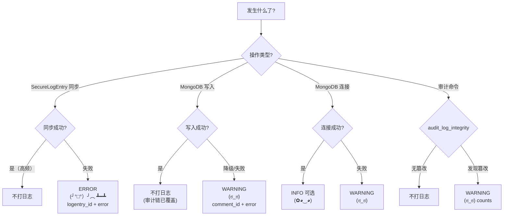

# Security App — 日志指南

> **文档权重**：70（security 日志细节；服从根目录 LOGGUIDE）
> 配套：[根目录 LOGGUIDE.md](../LOGGUIDE.md) | [DEVELOPMENT.md](DEVELOPMENT.md)

---

## 日志级别快速参考

| Python Logger | Kaomoji | 含义 | 使用场景 |
|---------------|---------|------|---------|
| `logger.info()` | `(✿◕‿◕)` | 一切安好 | init_log_hmac 开始/完成、MongoDB 连接成功（可选） |
| `logger.warning()` | `(ಠ_ಠ)` | 不对劲了 | MongoDB 写入失败/降级、审计发现篡改 |
| `logger.error()` | `(╯°□°）╯︵ ┻━┻` | 出大问题了 | SecureLogEntry 同步失败、审计链异常 |

### 日志级别决策树



---

## 职责边界

Security app 负责两套审计日志体系的防篡改保护：

1. **PostgreSQL 链**：`LogEntry → SecureLogEntry`（SM3-HMAC 签名）
2. **MongoDB 链**：`MongoLogger` 评论审核审计日志（SM3-HMAC 签名）

旧 Django ORM `CommentEventLog` 已在迁移 `0003_delete_commenteventlog` 中删除；当前评论 Admin action 和审核服务统一走 `moderate_comment() → MongoLogger`。

**注意**：这里的"应用日志"和"审计日志"是两个不同概念 — 本条指南讲的是应用日志（排查问题用），不是审计日志（防篡改用）。审计日志的完整性由 `verify_log()` / `audit_all()` 保证。

---

## 日志点清单

### A. 信号层 (signals.py)

#### A1. post_save LogEntry → SecureLogEntry 同步

| 时机 | 级别 | 内容 |
|------|------|------|
| 同步成功 | — | 不打日志（高频，每个 Admin 操作都触发） |
| 同步失败 | ERROR | logentry_id, content_type, error |

```python
@receiver(post_save, sender=LogEntry)
def on_log_entry_created(sender, instance, created, **kwargs):
    if not created:
        return
    try:
        SecureLogEntry.compute_from_logentry(instance, settings.LOG_HMAC_KEY)
    except Exception as e:
        logger.exception(f"SecureLogEntry 同步失败: logentry_id={instance.id} "
                         f"content_type_id={instance.content_type_id}")
```

> 正常同步不要打日志 — 每个 Django Admin 操作都触发（编辑/删除/创建），日志洪水。

#### A2. pre_save / pre_delete 不可变性保护

非 superuser 修改或删除 `LogEntry`、删除 `SecureLogEntry` 时直接抛出 `PermissionDenied`。这是安全拒绝，不额外记录敏感内容；对应修改与删除路径已有回归测试。

### B. 服务层 (services.py)

#### B1. moderate_comment() — 评论审核

| 时机 | 级别 | 内容 |
|------|------|------|
| MongoDB 写入失败 | WARNING | comment_id, old_status, new_status, error |
| 评论状态更新异常 | ERROR | comment_id, error |

```python
def moderate_comment(*, comment: Comment, new_status: str, request, ...):
    old_status = comment.status
    # ... 更新 comment.status ...

    # MongoDB 写入（已在 P0 修复中添加 try/except）
    try:
        mongo_logger = MongoLogger()
        mongo_logger.insert_log(action="moderate_comment", data=log_data)
    except Exception as e:
        logger.warning(f"MongoDB 审核日志写入失败（评论状态已更新）: "
                       f"comment_id={comment.id} old={old_status} new={new_status} "
                       f"error={e}")
```

> 审核操作本身不需要 INFO 日志 — MongoDB 审计链已完整记录 HMAC 签名。只在 MongoDB 不可用时打 WARNING。

### C. MongoLogger (mongo_client.py)

| 时机 | 级别 | 内容 |
|------|------|------|
| 连接成功 | INFO | host, port, db_name, collection |
| 连接失败 | WARNING | host, port, error（已实现） |
| 写操作降级 | WARNING | action（已实现） |
| 读操作降级 | WARNING | "MongoDB 不可用"（已实现） |

**当前已实现的日志**：连接失败时 `logger.warning()`、写/读操作降级时 `logger.warning()` — **这些已经够了，不需要额外加**。

可选：连接成功后输出一条确认信息（便于确认启动时 MongoDB 可用）：

```python
# 在 __init__ 中 ping 成功后
if self._connected:
    logger.info(f"MongoDB 已连接: {conf['HOST']}:{conf['PORT']}/{conf['DB_NAME']}"
                f"/{self._collection_name}")
```

### D. 管理命令 (management/commands/)

#### D1. audit_log_integrity

```python
# 命令结果已经在 stdout 中显示，不需要额外 logger
# 但如果审计发现大量篡改，应打 WARNING
if tampered > 0:
    logger.warning(f"日志完整性审计: 发现篡改 {tampered}/{total} 条")
```

#### D2. init_log_hmac

```python
logger.info(f"init_log_hmac 开始: mode={'force' if force else 'init'}")
# ... 处理 ...
logger.info(f"init_log_hmac 完成: created={created_count} updated={updated_count}")
```

---

## 不打日志的位置 (security)

| 位置 | 原因 |
|------|------|
| `SecureLogEntry.compute_from_logentry()` 正常执行 | 高频触发的自动签名 |
| `hmac_utils.py` 内部函数 | 纯计算，无副作用 |
| `mongo_client.py` 每次读/写成功 | 审计日志本身已在 verify 层面覆盖 |

---

## 安全规则（重点）

```
┌─────────────────────────────────────────────────┐
│  ❌ 绝不记录: HMAC key (LOG_HMAC_KEY)             │
│  ❌ 绝不记录: SM3 签名原始内容                     │
│  ❌ 绝不记录: MongoDB 连接字符串（含密码）         │
│  ✅ 应用日志与审计日志分离                         │
│  ✅ 审计日志仅记录 logentry_id + 签名结果          │
│  ✅ 正常同步不打日志（每个 Admin 操作都触发）      │
│  ✅ MongoDB 降级时打 WARNING 而非 ERROR（不影响主流程） │
└─────────────────────────────────────────────────┘
```

---

## 与其他 App 对比

| App | 复杂度 | 日志量 | 主要日志来源 |
|-----|--------|--------|-------------|
| Blogs | 高 | 高 | 文章 CRUD + 修订 + diff |
| comment | 中 | 中 | 评论提交 + 审核 |
| **security** | **中** | **低** | 审计链验证 |
| accounts | 低 | 低 | 登录/注册/密码修改 |
| boards | 低 | 极低 | seed 命令（一次性） |
| config | 低 | 低 | 侧边栏配置变更 |
| music | 空壳 | 无 | 暂无功能 |
