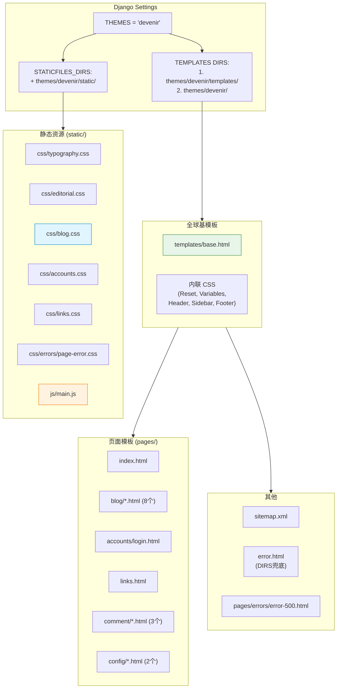

# Devenir Theme — 开发文档

> **主题**: `themes/devenir/`
> **类型**: Django 模板主题 + 自定义 CSS/JS
> **设计风格**: 暗色 CRT 扫描线 + 绿色调 + 社刊 Editorial 排版
> **前身**: `themes/bulma/`（Bulma CSS 框架，已弃用）
> **创建**: 2026-06-22
> **最后更新**: 2026-06-22 — v1.0 全站迁移完成

---

## 0. 变更日志

| 日期 | 版本 | 变更 |
|------|------|------|
| 2026-06-22 | v1.1 | Links 页重构（Bulma 结构复刻 + 3层进度条动画）+ links.css 独立文件 |
| 2026-06-22 | v1.0 | 全站迁移：14 个页面模板 + 4 个 CSS + 1 个 JS + sidebar configs + sitemap |

---

## 1. 主题架构总览



**两条模板解析路径**：
- `templates/` 优先：`base.html` 及所有 `pages/*` 页面模板
- `themes/devenir/` 兜底：`error.html`（Django 默认错误页查找路径）

---

## 2. 设计体系 (Design Tokens)

### 2.1 CSS 变量（base.html 内联）

```css
:root {
    --bg-primary:         rgb(13, 16, 16);      /* 最深背景 */
    --bg-secondary:       rgb(20, 24, 24);      /* 次级背景 */
    --bg-elevated:        rgb(28, 35, 35);      /* 卡片/提升层 */
    --accent-primary:     rgb(216, 255, 225);   /* 主强调色（亮绿） */
    --accent-soft:        rgb(143, 163, 148);   /* 次要强调 */
    --accent-muted:       rgb(111, 129, 119);   /* 淡化强调 */
    --accent-deep:        rgb(62, 88, 72);      /* 深色强调（按钮背景） */
    --text-primary:       rgb(235, 240, 235);   /* 主文本 */
    --text-secondary:     rgb(170, 180, 170);   /* 次要文本 */
    --text-tertiary:      rgb(95, 105, 100);    /* 三级文本 */
    --scanline:           rgba(255,255,255,0.03); /* CRT扫描线 */
    --noise:              rgba(216,255,225,0.04); /* 噪点纹理 */
    --fragment-border:    rgba(216,255,225,0.08); /* 卡片边框 */
    --fragment-highlight: rgba(216,255,225,0.12); /* 卡片hover发光 */
    --error-accent:       rgb(201, 120, 120);    /* 错误红色 */
    --warning-accent:     rgb(207, 181, 126);    /* 警告黄色 */
    --font-mono:          'Cascadia Code', 'Fira Code', ... /* 等宽字体栈 */
}
```

### 2.2 设计原则
- **暗 + 绿**：背景 `rgb(13,16,16)`，所有强调色走绿色系
- **CRT 感**：全站 scanline 纹理层 + fragment-border 卡片边框
- **高对比度**：正文 `rgb(235,240,235)` vs 背景，确保可读性
- **等宽优先**：全局 font-family 为 monospace，正文使用 `SourceHanSerifCN`

---

## 3. 模板清单

| 文件 | 继承 | 用途 | 关键块 |
|------|------|------|--------|
| `base.html` | — | 全站基模板 | CSS变量、Header、Sidebar、Footer、Scanline |
| `pages/index.html` | base.html | 主页 | Hero+3 Editorial Sections+Glitch |
| `pages/blog/list.html` | base.html | 文章列表 | 卡片网格+分页 |
| `pages/blog/detail.html` | base.html | 文章详情 | Markdown+TOC+Timeline+htmx |
| `pages/blog/cate_list.html` | base.html | 分类文章 | 同 list 结构 |
| `pages/blog/search_result.html` | base.html | 搜索结果 | 搜索表单+结果列表 |
| `pages/blog/post_form.html` | base.html | 新建/编辑 | ToastUI Editor+表单 |
| `pages/blog/_revision_body.html` | — | htmx 片段 | 版本内容渲染 |
| `pages/blog/_revision_diff.html` | — | htmx 片段 | Diff 表格 |
| `pages/accounts/login.html` | base.html | 登录 | 暗色卡片表单 |
| `pages/links.html` | base.html | 友链 | Hero+图片+进度条+卡片网格 |
| `pages/comment/form.html` | — | 评论表单 | inclusion_tag 片段 |
| `pages/comment/item.html` | — | 评论条目 | render_to_string 片段 |
| `pages/comment/list.html` | — | 评论列表 | inclusion_tag 片段 |
| `pages/config/sidebar_posts.html` | — | 侧边栏文章 | LinkBlock render |
| `pages/config/sidebar_comments.html` | — | 侧边栏评论 | LinkBlock render |
| `sitemap.xml` | — | SEO 站点地图 | XML |
| `error.html` | — | 全局错误页 | DIRS 兜底 |
| `pages/errors/error-500.html` | standalone | 500 页 | 独立设计 |

---

## 4. 静态资源清单

| 文件 | 行数 | 职责 |
|------|------|------|
| `css/typography.css` | ~40 | @font-face：SourceHanSerifCN + Cascadia Code |
| `css/editorial.css` | ~450 | 首页 Editorial Section + Glitch 文字效果 + Cate Cards |
| `css/blog.css` | ~1050 | 文章列表/详情/Markdown/TOC/Timeline/Diff/评论/表单/搜索 |
| `css/accounts.css` | ~60 | 登录页卡片/输入框/按钮/错误提示 |
| `css/links.css` | ~230 | Links Hero/图片/3层进度条动画/卡片网格 |
| `css/errors/page-error.css` | ~230 | 500 错误页视觉区域 |
| `js/main.js` | ~100 | Sidebar开关/Scroll Reveal/Glitch入场/Waveform条 |

### 4.1 进度条动画详解（links.css）

3 层 CSS 动画叠加仿 Material Design indeterminate：

| 层 | 选择器 | 动画 | 参数 |
|----|--------|------|------|
| 底色渐变流 | `::before` | `progress-flow` | 5色 gradient, background-position 来回, 2.4s cubic-bezier |
| 斜纹滑动 | `::after` | `progress-stripes` | -35° 条纹, 0.8s 线性平移 |
| 呼吸光晕 | `.links-progress-wrapper` | `progress-glow` | box-shadow 脉动, 同频 2.4s |

---

## 5. Django 集成点

### 5.1 Settings (`PowerAdapterBlogs/settings/base.py`)

```python
THEMES = 'devenir'
TEMPLATES[0]['DIRS'] = [
    BASE_DIR / 'themes' / THEMES / 'templates',  # 页面模板优先
    BASE_DIR / 'themes' / THEMES,                  # error.html 兜底
]
STATICFILES_DIRS = [
    BASE_DIR / "static",
    BASE_DIR / "themes" / THEMES / "static",       # devenir CSS/JS/fonts
]
```

### 5.2 视图 template_name 映射

所有视图的 `template_name` 从 `'blog/xxx.html'` 改为 `'pages/blog/xxx.html'`。
修改涉及：
- `Blogs/views.py`：10 个视图
- `config/views.py`：LinkListView → `pages/links.html`
- `config/models.py`：3 个 `render_to_string()` → `pages/config/...`
- `comment/templatetags/comment_block.py`：2 个 `inclusion_tag` → `pages/comment/...`
- `comment/views.py`：1 个 `render_to_string()` → `pages/comment/item.html`

### 5.3 模板中引用静态资源

```django




```

`` 会查找 `STATICFILES_DIRS` 中的所有目录，`themes/devenir/static/` 已加入。

---

## 6. 页面布局规范

### 6.1 base.html 布局结构
```
<html>
  <body>
    <div.scanline-layer>           <!-- 固定 CRT 纹理 -->
    <header.header>                <!-- 固定顶栏 -->
    <aside.sidebar>                <!-- 抽屉侧边栏 -->
                   <!-- 页面 Hero -->
    <main.main-content>            <!-- 主内容区 -->
      
    </main>
    <footer.footer>                <!-- 全局页脚 -->
    <script src="main.js">        <!-- 全局 JS -->
  </body>
</html>
```

### 6.2 页面编写规范
1. 继承 ``
2. 设置 `` 和 `` 和 ``
3. 需要额外 CSS 时用 ``
4. 需要额外 JS 时用 ``
5. 复用 class：`.fragment-card`（卡片）、`.empty-state`（空状态）、`.pagination`（分页）

---

## 7. 迁移检查清单（Bulma → Devenir）

| 检查项 | 状态 |
|--------|------|
| `THEMES = 'devenir'` | ✅ |
| `TEMPLATES DIRS` 双入口 | ✅ |
| `STATICFILES_DIRS` 含 theme 路径 | ✅ |
| 所有 views `template_name` 切换到 `pages/` | ✅ |
| inclusion_tag / render_to_string 路径更新 | ✅ |
| 所有模板 `get_template()` 解析通过 | ✅ |
| 所有 URL `reverse()` 通过 | ✅ |
| `system check` 0 issues | ✅ |
| htmx CDN 存在（base.html） | ✅ |
| MathJax CDN 存在（base.html） | ✅ |
| ToastUI Editor 暗色适配 | ✅ |
| 404/500 错误页 | ✅ |

---

## 8. 响应式断点

| 断点 | 宽度 | 影响 |
|------|------|------|
| Mobile | ≤768px | 导航变汉堡菜单、卡片单列、TOC 内联、评论表单纵向 |
| Tablet | 769-1024px | 链接网格双列 |
| Desktop | >1024px | 链接网格三列、完整排版 |

---

## 9. 已知问题 / TODO

- [ ] 字体文件过大（SourceHanSerifCN），需按需子集化
- [ ] `waveform` 动画在低性能设备上可能卡顿
- [ ] `glitch` 入场动画每次页面加载触发，考虑 sessionStorage 去重
- [ ] ToastUI Editor 暗色主题硬编码，未从 CSS 变量读取
- [ ] 暗色主题无亮色切换（设计意图如此）

---

## 10. 附录

### A. 字体文件
- `static/fonts/` 目录被 `.gitignore` 排除（过大）
- 使用 `@font-face` 在 `typography.css` 中声明
- 降级栈：SourceHanSerifCN → 系统 serif，Cascadia Code → 系统 mono

### B. 快速命令
```bash
# 验证所有模板可解析
python -c "from django.template.loader import get_template; ..."

# 验证 system check
python manage.py check

# 收集静态文件
python manage.py collectstatic --noinput
```

### C. 配色速查
```
背景层次:  #0D1010 → #141818 → #1C2323
文本层次:  #EBF0EB → #AAB4AA → #5F6964
强调层次:  #D8FFE1 → #8FA394 → #6F8177 → #3E5848
语义色:    #C97878 (错误)  #CFB57E (警告)
```
