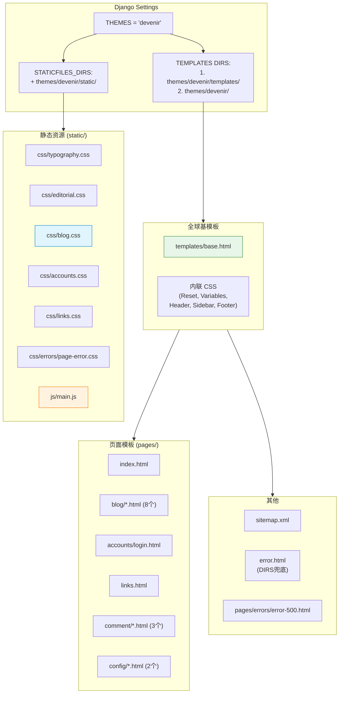

# Devenir Theme — 开发文档

> **文档权重**：78（Devenir 当前主题实现；全局路线服从 V2GUIDE）
> **主题**: `themes/devenir/`
> **类型**: Django 模板主题 + 自定义 CSS/JS
> **设计风格**: 暗色 CRT 扫描线 + 绿色调 + 社刊 Editorial 排版
> **前身**: `themes/bulma/`（Bulma CSS 框架，已弃用）
> **创建**: 2026-06-22
> **最后更新**: 2026-07-29 — 权限感知导航与 Skate Clip 公开展示修正

---

## 0. 变更日志

| 日期 | 版本 | 变更 |
|------|------|------|
| 2026-07-29 | v1.19 | Skate Index 的两条 9:16 Clip 改为共用外框：两侧媒体、中央宽信息区，上层左对齐与下层右对齐形成对角关系 |
| 2026-07-29 | v1.18 | 桌面“功能”升级为全宽 Mega Menu；移动端继续使用二级汉堡；恢复主页板块每次加载时的扫描线入场，文字扰动仍按 Session 去重 |
| 2026-07-29 | v1.17 | 桌面导航收纳为按权限显示的功能分组；移动汉堡增加二级分类；Skate Index 改为 2 竖 3 横完整信息节奏，“查看更多”接入公开时间列表 |
| 2026-07-29 | v1.16 | 稿件流程“可下架”栏新增 Board/Tag/作者/搜索组合筛选及 htmx“加载更多”；无 JavaScript 时保留普通 GET/下一批链接语义 |
| 2026-07-29 | v1.15 | 邮箱验证页改为 purpose 驱动的共享 Devenir 模板；Board 申请页增加未验证门禁、10 分钟 grant 倒计时与一次性申请成功确认层 |
| 2026-07-27 | v1.14 | base 增加 canonical、description、Open Graph 与 Feed 自动发现 block；文章详情输出 Article 元数据；Devenir 错误页接入生产 404/500 |
| 2026-07-27 | v1.13 | 新增年月索引式公开归档页，复用 Post Stream 卡片；Header、移动导航与 Footer 接入 Archive/RSS/Atom |
| 2026-07-26 | v1.12 | 修改密码页升级为 Credential Rotation Console：四阶段状态轨、邮箱授权倒计时、密码熵信号柱、规则/匹配反馈和提交扫描动画；支持 reduced-motion |
| 2026-07-26 | v1.11 | 新增邮箱验证码改密页面、About 与隐私说明；全局导航/Footer 接入；桌面与 390px 检查通过 |
| 2026-07-26 | v1.10 | Profile 前端优化：ID rail 元数据行、头像 CRT 扫描线 + hover glitch、LOC/WEB/GIT 身份坐标轨、signal bars、表单 term-bar、头像预览、is_public 终端开关；390px 零横向溢出实测通过 |
| 2026-07-20 | v1.9 | PostList、Category、Search 统一 Post Stream fragment；分类、搜索和分页使用 htmx 动态刷新并保留完整 URL 回退；补三档视口与移动触控验收 |
| 2026-07-20 | v1.8 | PostList 增强：System Status Rail、Command Filter Rail（搜索内嵌）、分类信号色、封面连接线差异；navbar 搜索取消 |
| 2026-07-20 | v1.7 | PostList 思想流重构：编号节点 + 数据总线 + 非对称排列；glitch 入场动画 sessionStorage 去重；备份原文件为 *.bak.20260720 |
| 2026-07-20 | v1.6 | 字体策略转向 CDN 全字重：取消"按需子集化"TODO，Source Han + JetBrains Mono 补齐 400/700 字重；修正 `--font-mono` 字体栈与文档不一致 |
| 2026-07-19 | v1.5 | Jazzmin 侧栏、登录页与站点图标切换到最新 WebP Logo/Icon |
| 2026-07-19 | v1.4 | 修复 Django FilteredSelectMultiple 的背景、文字、选中态与禁用态配色 |
| 2026-07-19 | v1.3 | 全局 Header/移动 Sidebar 增加工作台入口；superuser 额外显示系统后台入口 |
| 2026-07-19 | v1.2 | Jazzmin 后台接入 Devenir 配色、字体、导航层级与响应式视觉；不改变 Admin 行为 |
| 2026-06-22 | v1.1 | Links 页重构（Bulma 结构复刻 + 3层进度条动画）+ links.css 独立文件 |
| 2026-06-22 | v1.0 | 全站迁移：14 个页面模板 + 4 个 CSS + 1 个 JS + sidebar configs + sitemap |

---

## 1. 主题架构总览



**两条模板解析路径**：
- `templates/` 优先：`base.html` 及所有 `pages/*` 页面模板
- `themes/devenir/` 兜底：`error.html`（Django 默认错误页查找路径）

---

## 2. 设计体系 (Design Tokens)

### 2.1 CSS 变量（base.html 内联）

```css
:root {
    --bg-primary:         rgb(13, 16, 16);      /* 最深背景 */
    --bg-secondary:       rgb(20, 24, 24);      /* 次级背景 */
    --bg-elevated:        rgb(28, 35, 35);      /* 卡片/提升层 */
    --accent-primary:     rgb(216, 255, 225);   /* 主强调色（亮绿） */
    --accent-soft:        rgb(143, 163, 148);   /* 次要强调 */
    --accent-muted:       rgb(111, 129, 119);   /* 淡化强调 */
    --accent-deep:        rgb(62, 88, 72);      /* 深色强调（按钮背景） */
    --text-primary:       rgb(235, 240, 235);   /* 主文本 */
    --text-secondary:     rgb(170, 180, 170);   /* 次要文本 */
    --text-tertiary:      rgb(95, 105, 100);    /* 三级文本 */
    --scanline:           rgba(255,255,255,0.03); /* CRT扫描线 */
    --noise:              rgba(216,255,225,0.04); /* 噪点纹理 */
    --fragment-border:    rgba(216,255,225,0.08); /* 卡片边框 */
    --fragment-highlight: rgba(216,255,225,0.12); /* 卡片hover发光 */
    --error-accent:       rgb(201, 120, 120);    /* 错误红色 */
    --warning-accent:     rgb(207, 181, 126);    /* 警告黄色 */
    --font-mono:          'Cascadia Code', 'Fira Code', ... /* 等宽字体栈 */
}
```

### 2.2 设计原则
- **暗 + 绿**：背景 `rgb(13,16,16)`，所有强调色走绿色系
- **CRT 感**：全站 scanline 纹理层 + fragment-border 卡片边框
- **高对比度**：正文 `rgb(235,240,235)` vs 背景，确保可读性
- **等宽优先**：全局 font-family 为 monospace，正文使用 `SourceHanSerifCN`

---

## 3. 模板清单

| 文件 | 继承 | 用途 | 关键块 |
|------|------|------|--------|
| `base.html` | — | 全站基模板 | CSS变量、Header、Sidebar、Footer、Scanline |
| `pages/index.html` | base.html | 主页 | Hero+3 Editorial Sections+Glitch |
| `pages/blog/list.html` | base.html | 文章浏览 shell | System Rail + 共享 Post Stream fragment |
| `pages/blog/detail.html` | base.html | 文章详情 | Markdown+TOC+Timeline+htmx |
| `pages/blog/cate_list.html` | list.html | 分类文章完整页面回退 | 复用 Post Stream，不再维护 legacy card |
| `pages/blog/search_result.html` | list.html | 搜索结果完整页面回退 | 复用 Post Stream，不再维护 legacy card |
| `pages/blog/_post_browser.html` | — | htmx 交换边界 | Filter/Search/Stream/Pagination + OOB 页面标题 |
| `pages/blog/_post_stream.html` | — | 文章节点 fragment | 编号、封面、摘要、meta 与编辑入口 |
| `pages/blog/_post_pagination.html` | — | 分页 fragment | 保留搜索 query string 与 `hx-push-url` |
| `pages/blog/post_form.html` | base.html | 新建/编辑 | ToastUI Editor+表单 |
| `pages/blog/_revision_body.html` | — | htmx 片段 | 版本内容渲染 |
| `pages/blog/_revision_diff.html` | — | htmx 片段 | Diff 表格 |
| `pages/accounts/login.html` | base.html | 登录 | 暗色卡片表单 |
| `pages/accounts/accept_invitation.html` | base.html | 邀请激活 | 一次性链接设置密码（F1 邀请制） |
| `pages/accounts/profile_detail.html` | base.html | 作者公开 Profile | ID rail + 头像 glitch + 身份坐标轨 + signal bars + Post Stream |
| `pages/accounts/profile_form.html` | base.html | 本人编辑资料 | term-bar + 头像预览 + is_public 终端开关 |
| `pages/accounts/password_change.html` | base.html | 修改密码 | 四阶段 Credential Console + 服务端错误渲染 |
| `pages/accounts/password_email_verification.html` | base.html | purpose 驱动的通用邮箱验证 | 改密/Board 动态文案、掩码邮箱、TTL/RETRY/RESEND 数据轨 + 6 位验证码 |
| `pages/site/about.html` | base.html | About | 站点定位、内容、Board、技术与许可说明 |
| `pages/site/privacy.html` | base.html | 隐私说明 | 数据用途、保留方式与联系渠道 |
| `pages/links.html` | base.html | 友链 | Hero+图片+进度条+卡片网格 |
| `pages/comment/form.html` | — | 评论表单 | inclusion_tag 片段 |
| `pages/comment/item.html` | — | 评论条目 | render_to_string 片段 |
| `pages/comment/list.html` | — | 评论列表 | inclusion_tag 片段 |
| `pages/config/sidebar_posts.html` | — | 侧边栏文章 | LinkBlock render |
| `pages/config/sidebar_comments.html` | — | 侧边栏评论 | LinkBlock render |
| `sitemap.xml` | — | SEO 站点地图 | XML |
| `error.html` | — | 全局错误页 | DIRS 兜底 |
| `pages/errors/error-500.html` | standalone | 500 页 | 独立设计 |

---

## 4. 静态资源清单

| 文件 | 行数 | 职责 |
|------|------|------|
| `css/typography.css` | ~63 | @font-face：CDN 全字重（Source Han Serif/Sans CN、JetBrains Mono 400/700）+ 字体栈变量 |
| `css/editorial.css` | ~450 | 首页 Editorial Section + Glitch 文字效果 + Cate Cards |
| `css/blog.css` | ~1050 | 文章列表/详情/Markdown/TOC/Timeline/Diff/评论/表单/搜索 |
| `css/accounts.css` | ~739 | 登录 + Profile（ID rail/头像 glitch/徽章/signal bars）+ 表单 + Credential Rotation Console |
| `css/site_info.css` | ~120 | About / 隐私说明的 Editorial Hero、粘性目录与移动布局 |
| `js/password_rotation.js` | ~75 | 客户端强度信号、匹配提示、授权倒计时和提交动效；不参与服务端有效性判定 |
| `css/admin_theme.css` | ~440 | Jazzmin 后台 Devenir 视觉覆盖；表格、表单、导航、登录页与移动端适配 |
| `css/links.css` | ~230 | Links Hero/图片/3层进度条动画/卡片网格 |
| `css/errors/page-error.css` | ~230 | 500 错误页视觉区域 |
| `js/main.js` | ~100 | Sidebar开关/Scroll Reveal/Glitch入场/Waveform条 |

### 4.1 进度条动画详解（links.css）

3 层 CSS 动画叠加仿 Material Design indeterminate：

| 层 | 选择器 | 动画 | 参数 |
|----|--------|------|------|
| 底色渐变流 | `::before` | `progress-flow` | 5色 gradient, background-position 来回, 2.4s cubic-bezier |
| 斜纹滑动 | `::after` | `progress-stripes` | -35° 条纹, 0.8s 线性平移 |
| 呼吸光晕 | `.links-progress-wrapper` | `progress-glow` | box-shadow 脉动, 同频 2.4s |

---

## 5. Django 集成点

### 5.1 Settings (`PowerAdapterBlogs/settings/base.py`)

```python
THEMES = 'devenir'
TEMPLATES[0]['DIRS'] = [
    BASE_DIR / 'themes' / THEMES / 'templates',  # 页面模板优先
    BASE_DIR / 'themes' / THEMES,                  # error.html 兜底
]
STATICFILES_DIRS = [
    BASE_DIR / "static",
    BASE_DIR / "themes" / THEMES / "static",       # devenir CSS/JS/fonts
]
```

### 5.2 视图 template_name 映射

所有视图的 `template_name` 从 `'blog/xxx.html'` 改为 `'pages/blog/xxx.html'`。
修改涉及：
- `Blogs/views.py`：10 个视图
- `config/views.py`：LinkListView → `pages/links.html`
- `config/models.py`：3 个 `render_to_string()` → `pages/config/...`
- `comment/templatetags/comment_block.py`：2 个 `inclusion_tag` → `pages/comment/...`
- `comment/views.py`：1 个 `render_to_string()` → `pages/comment/item.html`

### 5.3 Jazzmin 后台视觉

`PowerAdapterBlogs/settings/base.py` 的 `JAZZMIN_SETTINGS` 负责品牌文案、图标、导航顺序和
`custom_css = "css/admin_theme.css"`；`JAZZMIN_UI_TWEAKS` 选择暗色布局及按钮语义色。
`admin_theme.css` 只覆盖视觉层，不修改 Django Admin/Jazzmin 的权限、表单或 action 行为。

后台静态资源继续由现有 `STATICFILES_DIRS` 查找；字体不存在时降级到 Cascadia Code、
Consolas 和系统等宽字体。

### 5.4 模板中引用静态资源

```django




```

`` 会查找 `STATICFILES_DIRS` 中的所有目录，`themes/devenir/static/` 已加入。

### 5.5 后台入口分层

`base.html` 在桌面 Header 和移动 Sidebar 使用同一规则：

- 已启用且 `is_dashboard_user=True`：显示“工作台”，进入 `/dashboard/`。
- `is_superuser=True`：额外显示“系统后台”，进入 `/super_admin/`。
- 普通 Board 角色不会看到系统后台入口；具体对象是否可读写仍由 Board Policy 判定，入口可见不代表授权。
- 激活的 superuser 始终拥有工作台与系统后台两个入口，即使历史账号未设置 `is_dashboard_user`。

入口放在全局基模板而非只放首页，避免用户进入文章页后失去返回后台的路径；移动端保持同等能力。

### 5.6 Profile 视觉组件（v1.10）

`pages/accounts/profile_detail.html` 的 Hero 由四个组件构成，全部纯 CSS 实现、无 JS 依赖：

| 组件 | 选择器 | 说明 |
|------|--------|------|
| ID rail | `.profile-id-rail` | `NODE / STATUS / VISIBILITY / LINK OK` 元数据行，数据来自模板现有变量（`profile_user.is_active`、`profile.is_public`），无后端新增 context |
| 头像框 | `.profile-avatar-frame` + `.avatar-scanline` | CRT 扫描线叠层（`inset: 8px` 对齐 frame padding）；hover 触发 `avatar-glitch` 0.32s steps 动画（仅 `transform`/`filter` 合成属性） |
| 身份坐标轨 | `.profile-coordinates` / `.profile-coordinate` | 以低对比细线和字段标签呈现 LOC/WEB/GIT，避免按钮式方框堆叠；链接保留 `rel="me noopener"` |
| 信号区 | `.profile-signal` + `.signal-bars` | 公开文章数大数字 + 5 格递增信号条 |

表单页（`profile_form.html` / `password_change.html`）共用两个组件：

- `.term-bar`：终端标题栏（三点 + `pa@blog:~/... $` 命令行），纯装饰 `aria-hidden`。
- `.field-checkbox input[type="checkbox"]`：`appearance: none` 终端滑块开关，用于 `is_public`；`:checked` 态亮绿滑块 + 发光，`:focus-visible` 有焦点框。

**契约边界**：

- `is_profile_owner` 控制的编辑入口、`not profile.is_public` 的私人预览提示、头像默认图回退均为模板层已有判断，v1.10 未改动。
- 表单字段 `name`、提交方式、CSRF、错误渲染与 URL 未改动；头像预览读 `form.instance.avatar`，无 instance 时不渲染。
- Django `ClearableFileInput` 的"清除"checkbox 由 widget 内部渲染，模板循环无法定制，仅以 `accent-color` 暗色适配；完全终端化需后端自定义 widget（见 §9 TODO）。

---

## 6. 页面布局规范

### 6.1 base.html 布局结构
```
<html>
  <body>
    <div.scanline-layer>           <!-- 固定 CRT 纹理 -->
    <header.header>                <!-- 固定顶栏 -->
    <aside.sidebar>                <!-- 抽屉侧边栏 -->
                   <!-- 页面 Hero -->
    <main.main-content>            <!-- 主内容区 -->
      
    </main>
    <footer.footer>                <!-- 全局页脚 -->
    <script src="main.js">        <!-- 全局 JS -->
  </body>
</html>
```

### 6.2 页面编写规范
1. 继承 ``
2. 设置 `` 和 `` 和 ``
3. 需要额外 CSS 时用 ``
4. 需要额外 JS 时用 ``
5. 复用 class：`.fragment-card`（卡片）、`.empty-state`（空状态）、`.pagination`（分页）

---

## 7. 迁移检查清单（Bulma → Devenir）

| 检查项 | 状态 |
|--------|------|
| `THEMES = 'devenir'` | ✅ |
| `TEMPLATES DIRS` 双入口 | ✅ |
| `STATICFILES_DIRS` 含 theme 路径 | ✅ |
| 所有 views `template_name` 切换到 `pages/` | ✅ |
| inclusion_tag / render_to_string 路径更新 | ✅ |
| 所有模板 `get_template()` 解析通过 | ✅ |
| 所有 URL `reverse()` 通过 | ✅ |
| `system check` 0 issues | ✅ |
| htmx CDN 存在（base.html） | ✅ |
| MathJax CDN 存在（base.html） | ✅ |
| ToastUI Editor 暗色适配 | ✅ |
| 404/500 错误页 | ✅ |

---

## 8. 响应式断点

| 断点 | 宽度 | 影响 |
|------|------|------|
| Mobile | ≤768px | 导航变汉堡菜单、卡片单列、TOC 内联、评论表单纵向 |
| Tablet | 769-1024px | 链接网格双列 |
| Desktop | >1024px | 链接网格三列、完整排版 |

Post Stream 已实测 `390×844`、`768×1024`、`1440×900`：三档均满足 `scrollWidth === clientWidth`；≤768px 强制单列，并将筛选、搜索、导航、标题和分页触控区提升到至少 44px。

---

## 9. 已知问题 / TODO

- [ ] **黄色 / 中权重（需产品确认）**：是否在未来废弃 `/Blogs/category/<id>/` 与 `/Blogs/search/` 的独立完整页面。当前按 V2 HDA 约束保留 canonical URL、刷新/书签/无 JavaScript 回退，并在支持 htmx 时动态替换 Post Stream；若决定废弃，必须先确认 SEO、旧链接、重定向、浏览器历史和非 JavaScript 回退策略。当前建议继续保留
- [ ] **黄色 / 中权重**：浏览器验收发现 `base.html` 同时加载 MathJax `tex-mml-chtml.js` 与 `startup.js`，产生重复启动异常；与 Post Stream 无关，需另开任务核对公式页面后移除重复入口
- [x] ~~字体文件过大（SourceHanSerifCN），需按需子集化~~ → **已决策不做**（2026-07-20）。视觉完整性优先于加载效率，完整字重走 CDN 托管，本地不再维护字体二进制
- [ ] `waveform` 动画在低性能设备上可能卡顿
- [x] `glitch` 入场动画已使用 sessionStorage 在同一会话去重
- [ ] ToastUI Editor 暗色主题硬编码，未从 CSS 变量读取
- [ ] **绿色 / 低权重**：`ClearableFileInput` 的"清除"checkbox 为 widget 级渲染，模板无法终端化；完全定制需后端自定义 widget（当前仅 `accent-color` 暗色适配）
- [ ] 暗色主题无亮色切换（设计意图如此）

---

## 10. 附录

### A. 字体策略（2026-07-20 起 CDN 化）

**决策**：放弃"按需子集化"的优化路径。绿色视觉权重高于性能开销，完整字重交由 CDN 托管。

**CDN 选型**：jsDelivr（与 `base.html` 现有 MathJax 同源，单一 CDN 信任域）

| 字体 | 用途 | 字重 | npm 包 |
|------|------|------|--------|
| Source Han Serif CN | 正文 / Editorial | 400, 700 | `source-han-serif-cn` |
| Source Han Sans CN | UI 辅助 | 400, 700 | `source-han-sans-cn` |
| JetBrains Mono | 代码 / Logo / 数字 | 400, 700 | `@fontsource/jetbrains-mono` |

**URL 模板**：
```
https://cdn.jsdelivr.net/npm/source-han-serif-cn@latest/SourceHanSerifCN-{Weight}.otf
https://cdn.jsdelivr.net/npm/source-han-sans-cn@latest/SourceHanSansCN-{Weight}.otf
https://cdn.jsdelivr.net/npm/@fontsource/jetbrains-mono@latest/files/jetbrains-mono-latin-{Weight}-normal.woff2
```

**本地回退**：`static/fonts/` 保留但不再被引用；降级栈 SourceHanSerifCN → 系统 serif，JetBrains Mono → 系统 mono。

### B. 快速命令
```bash
# 验证所有模板可解析
python -c "from django.template.loader import get_template; ..."

# 验证 system check
python manage.py check

# 收集静态文件
python manage.py collectstatic --noinput
```

### C. 配色速查
```
背景层次:  #0D1010 → #141818 → #1C2323
文本层次:  #EBF0EB → #AAB4AA → #5F6964
强调层次:  #D8FFE1 → #8FA394 → #6F8177 → #3E5848
语义色:    #C97878 (错误)  #CFB57E (警告)
```
