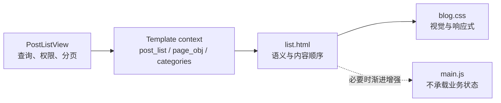

# Devenir PostList — K3 开发交接文档

> **文档权重**：74（PostList 专项规划；不得覆盖 `V2GUIDE.md` 与主题 `DEVELOPMENT.md`）
> **状态**：v1.9 已实施 / 保留产品决策 TODO
> **目标页面**：`/Blogs/post/`（规范入口：``）
> **参考概念图**：[`sample/postlist-concept-image2.png`](sample/postlist-concept-image2.png)
> **最后更新**：2026-07-20 — Category/Search 统一 Post Stream + htmx，当前版本 v1.9

---

## 0. 变更日志

| 日期 | 版本 | 变更 |
|------|------|------|
| 2026-07-20 | v1.9 | `cate_list` / `search_result` 统一 Post Stream；分类、搜索、分页使用 htmx fragment + `hx-push-url`，保留完整页面回退；三档视口与移动触控验收通过 |
| 2026-07-20 | v1.8 | System Status Rail、Command Filter Rail（搜索内嵌）、分类信号色、封面连接线差异；navbar 搜索取消；修复 cate_list 样式丢失和分类链接 404 |
| 2026-07-20 | v1.7 | PostList 思想流重构：编号节点 + 数据总线 + 非对称排列；glitch 入场动画 sessionStorage 去重；备份原文件为 *.bak.20260720 |
| 2026-07-20 | v1.6 | 字体策略转向 CDN 全字重：取消"按需子集化"TODO，Source Han + JetBrains Mono 补齐 400/700 字重 |

---

## 1. 当前实现状态

### 1.1 已完成（v1.9）

- **System Status Rail**：`OS: DEVENIR 1.0 / KERNEL: PA-CORE 0.3.7 / UPTIME: 42D 17:36 / USER: xxx / MODE: BLOG.RHIZOME` + ONLINE 脉冲状态点
- **Command Filter Rail**：`pa@blog:~$` 提示符 + `[ ALL ] / SKATEBOARD / MUSIC / CODING` 分类筛选（真实 URL）+ 内嵌搜索框（focus 展开 140px→200px）
- **Post Stream 节点**：`stream-node` 结构（`node-rail` 编号+分类 / `node-artifact` 封面 / `node-content` 标题+摘要+meta / `node-glitch-markers` 装饰）
- **交替布局**：偶数节点镜像翻转（`stream-node--reverse`），文字右对齐贴紧封面
- **分类信号色**：skateboard=`#4ed7af` / music=`#b794f4` / coding=`#f6ad55`，应用于编号、分类标签、连接线
- **封面连接线**：封面与内容之间 1.5rem 水平线，按分类着色
- **数据总线**：`post-stream::before` 左侧纵向渐变轨道
- **glitch 去重**：sessionStorage 同一会话只播放一次
- **navbar 搜索取消**：搜索框迁移到 Command Rail
- **统一 Post Stream**：PostList、Category、Search 共用 `_post_browser.html`、`_post_stream.html` 与 `_post_pagination.html`，旧模板只保留完整页面 wrapper
- **htmx 渐进增强**：分类、搜索和分页动态替换 `#post-browser`，OOB 更新页面标题，`hx-push-url` 支持刷新、书签、后退和前进
- **缓存隔离**：匿名整页缓存按 `Vary: HX-Request` 区分 fragment 与完整 HTML，登录用户继续绕过整页缓存
- **响应式实测**：`390×844`、`768×1024`、`1440×900` 无横向溢出；移动端主要交互触控区不小于 44px

### 1.2 已知问题 / 待办

- [x] `cate_list.html` 和 `search_result.html` 已统一到 Post Stream，legacy `.post-card` 列表样式已移除
- [ ] 概念图中的封面差异化图形（CODE=电路板、MUSIC=波形、SKATE=弧线）未实现，当前统一用默认 Cover.png
- [ ] 节点内连接线视觉仍可加强（当前只有封面-内容之间一条线）
- [x] 响应式三档已在真实浏览器实测；分类、搜索和历史恢复同时通过
- [ ] 搜索框动画只有 focus 展开，可增加打字机效果或扫描线动画
- [ ] System Status Rail 数据为硬编码，未从后端读取真实 uptime/kernel 版本

### 1.3 备份文件

| 文件 | 备份 |
|------|------|
| `themes/devenir/static/js/main.js` | `main.js.bak.20260720` |
| `themes/devenir/templates/pages/blog/list.html` | `list.html.bak.20260720` |
| `themes/devenir/static/css/blog.css` | `blog.css.bak.20260720` |

---

## 2. 任务目标（原始）

将当前重复的横向文章卡片重构为 Devenir 风格的"思想流 / Post Stream"：

- 用编号节点、数据总线和非对称排列替代相同卡片的机械重复。
- 通过布局表达差异、重复、生成、多重性、块茎与逃逸线，但不堆砌哲学名词。
- 保留"愿代码之美，与精神秩序并行"的品牌表达。
- 保持页面真实可用、语义化、响应式、可访问，不把概念图当作背景图片。
- 只改变模板、CSS 和必要的轻量 JavaScript，不改变后端业务与权限。

---

## 3. 后端数据契约：不得破坏

`PostListView` 的固定行为：

| 项目 | 当前值 |
|---|---|
| Template | `pages/blog/list.html` |
| Context list | `post_list` |
| Pagination | 每页 10 条 |
| Query | 已发布且对当前用户可见 |
| Related objects | `owner`、`category` 已 `select_related` |
| Permission annotation | 每条文章运行时附加 `post.can_edit` |

模板当前可使用：

| 变量 | 用途 |
|---|---|
| `post.get_absolute_url` | 文章详情链接 |
| `post.cover` / `post.cover.url` | 自定义封面 |
| `post.title` | 标题 |
| `post.owner.username` | 作者 |
| `post.category.name` | 分类 |
| `post.pv` | 浏览量 |
| `post.desc` | 摘要 |
| `post.can_edit` | 是否显示编辑入口 |
| `post.slug` | 编辑 URL 参数 |
| `tag` / `category` | 页面标题上下文 |
| `is_paginated` / `page_obj` / `paginator` | Django 分页 |
| `categories` | 正常状态、且至少含一篇当前用户可见文章的分类；按 `name`、`pk` 稳定排序（v1.8 新增，用于 Command Filter Rail） |

不得修改 URL 名称：

- `Blogs:post_list`
- `Blogs:post_edit`
- `Blogs:category_list`（v1.8 修正，原误写为 `Blogs:category`）
- `post.get_absolute_url`

不得绕过或重新实现可见性、编辑权限、缓存和分页逻辑。

### 3.1 HDA 与渲染边界

遵循 `V2GUIDE.md` 的 Hypermedia-Driven Architecture：Django 服务端继续生成完整 HTML，列表在无 JavaScript 时也必须可浏览和分页。当前 htmx 只交换服务端渲染的 `_post_browser.html`；分类与搜索 canonical URL、普通 HTTP 完整页面、权限与分页均保留，不依赖 JSON API。



---

## 4. 概念图结构拆解

概念图不是像素级强制稿，核心关系如下：

```text
Global Header
└── Manifest / System Status Rail
    ├── "愿代码之美，与精神秩序并行"
    └── stream / node / cursor metadata

Command Filter Rail
└── ALL / CODE / MUSIC / SKATE / SEARCH

Post Stream
├── 01 + category + artifact + title/excerpt/meta
├── 02 + category + artifact + title/excerpt/meta
├── 03 + category + artifact + title/excerpt/meta
└── ... connected by a restrained rhizome/data line

Stream Footer
└── previous / cursor / next
```

`Command Filter Rail` 是视觉概念，不代表现有后端已经提供 CODE / MUSIC / SKATE 三类筛选。只有存在真实 Django URL 与上下文时才能输出可交互筛选；否则保留当前已实现的搜索、Tag、Category 与分页入口，不得伪造前端过滤状态。

### 4.1 每个文章节点必须保留

- 可辨识的序号，建议由 `forloop.counter` 与分页偏移组合；无法可靠获得全局偏移时可以只用本页序号。
- 标题、摘要、作者、分类、浏览量。
- 封面；没有封面时继续使用现有 `img/Cover.png`。
- 整个主要内容区可进入详情页，键盘焦点清晰。
- `post.can_edit` 为真时保留编辑入口，但降低视觉权重。

### 4.2 差异化规则

- 可通过 `forloop.counter|divisibleby` 切换左右布局，不修改后端。
- 节点可以交替排列，但阅读顺序和 DOM 顺序必须保持从上到下。
- 分类仅改变小范围信号色/图形，不创建三套互不兼容的组件。
- 装饰连接线不得遮挡链接、文字或移动端触控区域。

---

## 5. 视觉规范

优先使用现有变量：

```css
--bg-primary: rgb(13, 16, 16);
--bg-secondary: rgb(20, 24, 24);
--bg-elevated: rgb(28, 35, 35);
--accent-primary: rgb(216, 255, 225);
--accent-soft: rgb(143, 163, 148);
--accent-muted: rgb(111, 129, 119);
--text-primary: rgb(235, 240, 235);
--text-secondary: rgb(170, 180, 170);
--fragment-border: rgba(216, 255, 225, 0.08);
```

要求：

- 使用 CSS Grid/Flex、边框、伪元素或内联 SVG 构造界面。
- 保持暗色、等宽字体、CRT 扫描线和克制 glitch。
- 避免玻璃拟态、渐变堆叠、圆角卡片、强霓虹、3D 和通用 SaaS 风格。
- 避免超大页面标题；内容流应在首屏尽早出现。
- 中文标题与摘要必须保持可读，不使用故意乱码模拟 glitch。

---

## 6. 交互与渐进增强

- 首选 CSS；JavaScript 只用于无法由 CSS/Django 模板可靠实现的增强。
- Hover glitch 不能改变布局尺寸。
- 触摸设备没有稳定 `:hover`；如需 glitch，应使用进入视口后的一次性 class，不能无限循环。
- 动画只作用于 `transform`、`opacity` 等合成属性，避免滚动时频繁触发布局。
- 无 JavaScript时必须仍可阅读、筛选（若筛选为真实 URL）和分页。
- 前端不得复制可见性或 `post.can_edit` 判断；只消费服务端已经提供的结果。

---

## 7. 响应式验收

### Desktop > 1024px

- 允许左右交替与连接线。
- 主内容最大宽度与现有 `.container` 对齐。
- 标题、摘要与元数据不得因装饰图形缩成狭窄列。

### Tablet 769–1024px

- 可收敛为统一方向的两列节点结构。
- 装饰图缩小，正文仍是主要视觉层。

### Mobile ≤ 768px

- 强制单列，DOM 阅读顺序不变。
- 页面 `scrollWidth` 必须等于 `clientWidth`。
- 封面、标题、摘要、元数据、编辑入口均不得被裁切。
- 点击区域最小高度建议 44px。
- 连接线可以简化为左侧纵向轨道，禁止保留桌面交错造成横向溢出。

建议验证视口：`390×844`、`768×1024`、`1440×900`。

---

## 8. 修改范围

优先修改：

- `themes/devenir/templates/pages/blog/list.html`
- `themes/devenir/static/css/blog.css`

仅在确有必要时修改：

- `themes/devenir/static/js/main.js`
- `themes/devenir/templates/base.html`

禁止为本任务修改：

- `Blogs/models.py`
- `Blogs/views.py`（除 §8.2 已记录的改动外）
- `Blogs/urls.py`
- 权限、缓存、数据库迁移及 API

`cate_list.html` 与 `search_result.html` 已成为继承 `list.html` 的完整页面 wrapper；真实节点结构只在共享 fragment 中维护。后续不得重新复制一套分类/搜索卡片。

### 8.1 K3 后端风险与人工 Review 门禁

K3 在前端生成方面可以作为主要执行模型，但本任务中不得让它自主修改 Django 后端。尤其需要警惕：

- `views.py` 中 `render()`、`HttpResponse`、CBV 生命周期或 context 处理使用过时/不匹配的 API。
- `django-htmx` 的 `request.htmx`、partial 响应和普通请求回退分支遗漏。
- ORM 链式调用改变查询语义、丢失 `select_related`、可见性过滤或分页稳定性。
- 事务边界、异常回滚、缓存失效和并发行为考虑不完整。
- 复杂角色、Board Policy、文章可见性与 `post.can_edit` 权限边界被简化或绕过。
- 为了匹配概念图而新增字段、迁移、API 或修改 URL，造成不必要的后端扩张。

本任务的模型权限边界：

```text
允许直接修改：Django templates / CSS / 必要的轻量前端 JS
禁止直接修改：Python / Views / Models / ORM / Permissions / Transactions / URLs / Migrations
如果认为后端必须调整：停止实施，只输出"建议修改点 + 原因 + 影响范围"，等待人工 Review
```

如果交付 diff 中出现任何 `.py` 文件，本次前端交付默认视为未通过。人工 Review 至少应检查：

1. 是否使用项目当前 Django 版本支持的 API。
2. 匿名用户、作者、Reviewer、Board Manager、superuser 的权限边界。
3. 普通 HTTP 与 htmx 请求是否都有正确回退。
4. QuerySet 是否保留可见性过滤、关联预取和稳定排序。
5. 是否引入额外查询、事务范围变化、缓存不一致或安全回归。
6. 后端相关测试是否覆盖成功、拒绝与边界路径。

### 8.2 已实施并经人工复审的后端改动（2026-07-20）

| 文件 | 改动 | 原因 | 影响范围 |
|------|------|------|---------|
| `Blogs/views.py` | `PostListView` 提供可见 `categories` 并按 `HX-Request` 选择 fragment；`CategoryView` 继承统一可见 QuerySet/context；匿名缓存响应增加 `Vary: HX-Request` | Command Rail 与 Category/Search 需要共享同一数据契约，同时避免 fragment/完整 HTML 缓存串用 | 保留 `select_related`、分页、Policy 与 `post.can_edit`；正常分类限制新增 404 边界；未命中缓存时分类导航增加 1 次查询 |
| `Blogs/management/commands/generate_posts.py` | 命令仅允许在 `DEBUG=True` 执行；要求存在 active superuser；只使用“正常分类 + 唯一 active Board”组合；生成 slug 使用保留前缀和 UUID；`--clear` 仅清理由本命令生成的数据；清理与生成处于同一事务 | 避免误删真实文章、生成无法通过 Board 约束的数据，或在生产环境误运行 | 仅影响开发测试数据命令；前置条件在删除前验证，失败会回滚 |
| `Blogs/tests.py` | 增加分类上下文、生成命令及 Post Stream 完整页/fragment/搜索/分页/缓存隔离测试 | 为成功、拒绝和边界路径提供回归保护 | 12 个相关定向测试，其中 `PostStreamHtmxTest` 5 个 |

**人工 Review 结论**：

- [x] 使用 Django 5.1/5.2 均支持的 CBV、ORM 与事务 API。
- [x] 分类导航与文章列表使用同一可见性策略；匿名用户只看到公开文章对应分类，具备策略权限的用户可看到相应内部分类。
- [x] 普通 HTTP 返回完整页面；HX 请求只返回服务端 HTML fragment；前端未复制权限判断。
- [x] 文章主 QuerySet 的可见性、`select_related`、分页和稳定排序未改变。
- [x] 明确新增 1 次分类查询。匿名页面仍使用既有 15 分钟整页缓存，分类导航可能与页面内容一起最多陈旧 15 分钟；登录用户绕过该页面缓存，不发生跨用户复用。
- [x] `--clear` 仅按保留 slug 前缀清理命令生成的数据；前置校验发生在删除前，清理和生成使用 `transaction.atomic()`。
- [x] 12 个相关定向测试通过；扩展回归范围 `Blogs.tests` + `boards.tests.test_policies` 共 30 个测试通过；Django system check 为 0 issues；Ruff 检查通过。
- [x] Django 已固定为 5.2.16 LTS；完整 87 项测试已分别在 5.2.16 与过渡期 5.1.5 环境运行，分页 URL 为 5.2 原生实现并保留 5.1 降级路径。

定向测试范围：

```text
Blogs.tests.PostListCategoryContextTest
Blogs.tests.PostStreamHtmxTest
Blogs.tests.GeneratePostsCommandTest
```

---

## 9. 验收清单

- [ ] `post_list` 正常渲染 0、1、10 条文章。
- [ ] 自定义封面与默认封面均正确。
- [ ] 标题、摘要、作者、分类、PV 均显示。
- [ ] `post.can_edit` 为真/假时行为正确。
- [ ] Tag、Category、全部文章标题分支不回归。
- [ ] 首页、详情页、搜索页样式未被 `blog.css` 误伤。
- [ ] 分页首页、中间页、末页链接正确。
- [ ] 键盘可访问，焦点样式可见。
- [x] 390px 无横向溢出；768px 与 1440px 同样通过。
- [x] `python manage.py check` 通过。
- [x] 相关 Django 测试通过（30 tests）。

---

## 10. 给 K3 的执行提示

```text
请阅读 themes/devenir/POSTLIST_HANDOFF.md，并参考
themes/devenir/sample/postlist-concept-image2.png，继续迭代 Devenir 主题 PostList。

当前版本 v1.9 已实现：System Status Rail、Command Filter Rail（搜索内嵌）、
分类信号色、封面连接线差异、交替布局、glitch 去重，以及 Category/Search/Pagination
共享 Post Stream 的 htmx 渐进增强。独立 URL 仍作为完整页面回退保留。

待办优先级：
1. 等待产品确认是否长期保留 Category/Search canonical 完整页面；当前建议保留
2. 概念图封面差异化图形（CODE=电路板、MUSIC=波形、SKATE=弧线）
3. 节点内连接线视觉加强
4. 搜索框动画增强（打字机效果或扫描线）

严格保留 Django 模板数据契约、URL、分页、权限和默认封面逻辑。只修改交接文档允许的模板、CSS 和必要的轻量 JavaScript。概念图只作为布局与视觉关系参考，禁止把图片直接作为页面背景。

不要修改任何 Python/Django 后端文件（除 §8.2 已记录的改动外），包括 Views、Models、ORM、权限、事务、URL 和迁移。如果你判断前端无法在现有数据契约下完成，请停止修改并仅输出后端建议，等待人工 Review。

开始前检查 git status 和目标文件 diff，保护已有未提交修改。完成后在 390×844、768×1024、1440×900 三个视口验证，并运行 python manage.py check。最终报告修改文件、视觉实现、响应式结果和仍存在的限制。
```
